## 3.1. 了解Scala

### 3.1.1 Scala来源

​	Scala名字由来：Scalable Language两个单词相结合；意大利语中 scala意为“梯子”或“楼梯”，蕴含“更佳的编程语言”。 

​	Martin Odersky（马丁·奥德斯基）于2001年基于Funnel的工作开始设计Scala。Funnel是把函数式编程思想和Petri网相结合的一种编程语言。Martin Odersky先前的工作是Generic Java和javac（Sun Java编译器）。

​	Java平台的Scala于2003年底/2004年初发布。.NET平台的Scala发布于2004年6月。该语言第二个版本，v2.0，发布于2006年3月。

​	截至2009年9月，最新版本是版本2.7.6。Scala 2.8预计的特性包括重写的Scala类库（Scala collections library）、方法的命名参数和默认参数、包对象（package object），以及Continuation.

​	2009年4月，Twitter宣布他们已经把大部分后端程序从Ruby迁移到Scala，其余部分也打算要迁移。此外，Wattzon已经公开宣称，其整个平台都已经是基于Scala基础设施编写的。

​	 Scala 的预期目标是将面向对象、函数式编程和强大的类型系统结合起来，同时让人要能写出优雅、简洁的代码。

​	Scala博采众长，Scala采用了Java和C#语法的大部分，而他们大部分借自于C，C++语法。表达式、语句、和代码块和Java一样，还有类、包和引用的语法。除语法之外，Scala还采用了Java的其他元素，如它的基本类型、类库和它的执行模式。函数式编程借鉴了SML，OCaml，和F#为代表的ML家族语言很接近，Scala的隐式参数灵感来自Haskell，基于actor的并发库来自EeLang的思想。

### 3.1.2 Scala语言特点

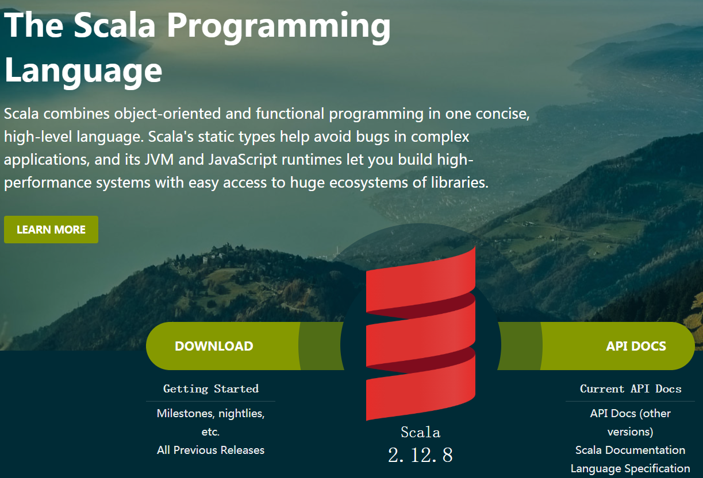

**面向对象**

Scala是一种面向对象的语言，Scala中的每个值都是一个对象，包括基本数据类型（即布尔值、数字等）在内，连函数也是对象。 

类可以被子类化，而且Scala还提供了基于mixin的组合（mixin-based composition）。 

类抽象机制的扩展有两种途径：一种途径是子类继承，另一种途径是灵活的混入机制。这两种途径能避免多重继承的种种问题。

**函数式编程**

Scala也是一种函数式语言，其函数也能当成值来使用。Scala提供了轻量级的语法用以定义匿名函数，支持高阶函数，允许嵌套多层函数，并支持柯里化。Scala的case class及其内置的模式匹配相当于函数式编程语言中常用的代数类型。

更进一步，程序员可以利用Scala的模式匹配，编写类似正则表达式的代码处理XML数据。

**静态类型**

Scala具备类型系统，通过编译时检查，保证代码的安全性和一致性。类型系统具体支持以下特性：

- 泛型类
- 协变和逆变
- 标注
- 类型参数的上下限约束
- 把类别和抽象类型作为对象成员
- 复合类型
- 引用自己时显式指定类型
- 视图
- 多态方法

**扩展性**

Scala的设计秉承一项事实，即在实践中，某个领域特定的应用程序开发往往需要特定于该领域的语言扩展。Scala提供了许多独特的语言机制，可以以库的形式轻易无缝添加新的语言结构：

- 任何方法可用作前缀或后缀操作符
- 可以根据预期类型自动构造闭包。

**并发性**

Scala使用Actor作为其并发模型，Actor是类似线程的实体，通过邮箱发收消息。Actor可以复用线程，因此可以在程序中可以使用数百万个Actor,而线程只能创建数千个。在2.10之后的版本中，使用Akka作为其默认Actor实现。

### 3.1.3  函数式编程

函数式编程是一种"编程范式"（programming paradigm），也就是如何编写程序的方法论。

纯粹的函数式编程语言编写的函数没有变量，因此，任意一个函数，只要输入是确定的，输出就是确定的，这种纯函数我们称之为没有副作用。而允许使用变量的程序设计语言，由于函数内部的变量状态不确定，同样的输入，可能得到不同的输出，因此，这种函数是有副作用的。

**函数式编程的特点：**

- 函数是一等公民  

- 以表达式为中心  

- 无副作用  

  只用纯函数来构造程序，或者说函数没有副作用。
      什么是副作用？
      一个带有副作用的函数不仅有一个返回值，还可能做了
      修改一个变量
      直接修改数据结构
      设置一个对象的成员
      打印到终端或者读取用户输入
      读取或写入一个文件
      在屏幕上绘画
  	抛出一个异常或以一个错误终止
  一个函数在程序执行过程中除了根据输入参数给出运算结果外，没有其他的影响，就称为没有副作用的。

- 不修改状态  

- 引用透明

**函数式编程优势：**

- 代码简洁，开发速度快
- 接近自然语言，易理解
- 易于代码管理
- 适合并发编程
- 适用于热升级

函数式编程的一个特点就是，函数也是值，同允许把函数本身作为参数传入另一个函数，还允许返回一个函数！

### 3.1.4 静态语言和动态语言

静态编译语言：实现声明变量类型，类型不能改变，编译时检查；
动态编译语言：不用事先声明类型，随时可以赋值为其他类型，编程时不知道什么类型，很难推断；
静态语言和动态语言关键区别是何时获得类型信息，是在编译时间还是运行时间。

### 3.1.5 强类型和弱类型

强类型语言：不同类型之间操作，必须强制类型转换为同一类型，print('a'+1):
弱类型语言：不同类型间可以操作，自动隐式转换。
强类型和弱类型语言的区别关键是类型之间的区别是否严格，例如语言是否会做字符串类型到数字类型的隐式转换。


~~~scala
//弱类型语言vbs:
 a=1
 b=a+"1"+"a" //结果是11a,这里 a 成了字符串
 c=a+1 //结果是2 ,这里a则是数字型

//强类型语言:c#
int a=2
string b=a.ToString()+"1"+"a"
int c=a+1
~~~


### 3.1.6 为什么要学Scala

1.优雅：这是框架设计师第一个要考虑的问题，框架的用户是应用开发程序员，API是否优雅直接影响用户体验。

2.速度快：Scala语言表达能力强，一行代码抵得上Java多行，开发速度快；Scala是静态编译的，所以和JRuby，Groovy比起来速度会快很多。

3.能融合到Hadoop生态圈：Hadoop现在是大数据事实标准，Spark并不是要取代Hadoop，而是要完善Hadoop生态。JVM语言大部分可能会想到Java，但Java做出来的API太丑，或者想实现一个优雅的API太费劲。

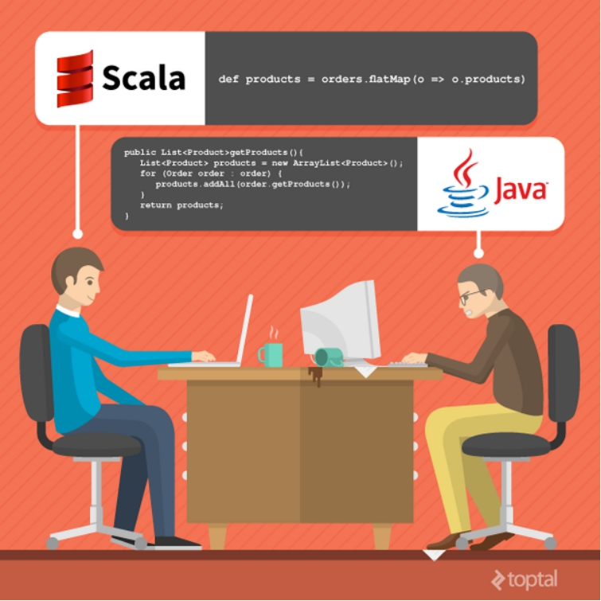 


### 3.1.7 学习资料介绍

  官网+源码

《快学scala》

《Programming in Scala》


## 3.2 环境准备

### 3.2.1 Windows下的环境配置

1，**JDK安装**

因为Scala是运行在JVM平台上的，所以安装Scala之前要安装JDK,

2，**Scala编译环境安装**

下载Scala地址https://downloads.lightbend.com/scala/2.11.8/scala-2.11.8.zip然后解压Scala到指定目录

比如D盘。

3，配置环境变量，将scala加入到PATH中

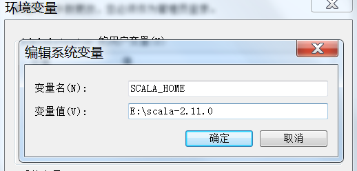

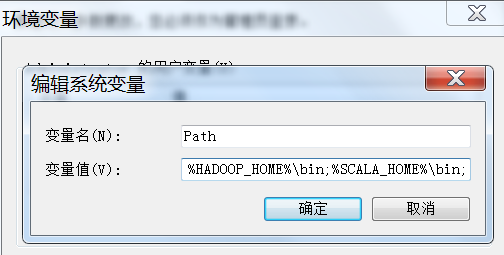

### 3.2.2 Linux下的环境配置(选讲)

1，**JDK安装**

因为Scala是运行在JVM平台上的，所以安装Scala之前要安装JDK,

2，**Scala编译环境安装**

下载Scala地址https://downloads.lightbend.com/scala/2.11.8/scala-2.11.8.tgz然后解压Scala到指定目录

tar -xvf scala-2.11.8.tar -C /usr/java

3，配置环境变量，将scala加入到PATH中

```shell
vi /etc/profile
export JAVA_HOME=/usr/java/jdk1.7.0_45
export PATH=$PATH:$JAVA_HOME/bin:/usr/local/scala-2.11.8/bin
```

### 3.2.3 Scala解释器

1. REPL：Read（取值）-> Evaluation（求值）-> Print（打印）-> Loop（循环）。

scala解释器也被称为REPL，会快速编译scala代码为字节码，然后交给JVM来执行。

2. 计算表达式：在scala>命令行内，键入scala代码，解释器会直接返回结果给你。如果你没有指定变量来存放这个值，那么值默认的名称为res，而且会显示结果的数据类型，比如Int、Double、String等等。

 例如，输入1 + 1，会看到res0: Int = 2

3. 内置变量：在后面可以继续使用res这个变量，以及它存放的值。

 例如，2.0 * res0，返回res1: Double = 4.0

 例如，"Hi, " + res0，返回res2: String = Hi, 2

4. 自动补全：在scala>命令行内，可以使用Tab键进行自动补全。

​    ·例如，输入res2.to，敲击Tab键，解释器会显示出以下选项，toCharArray，toLowerCase，toString，toUpperCase。因为此时无法判定你需要补全的是哪一个，因此会提供给你所有的选项。

例如，输入res2.toU，敲击Tab键，直接会给你补全为res2.toUpperCase。

5. 使用REPL，打印helloworld 

### 3.2.4 Scala集成环境配置

目前Scala的开发工具主要有两种：Eclipse和IDEA，这两个开发工具都有相应的Scala插件，如果使用Eclipse，直接到Scala官网下载即可http://scala-ide.org/download/sdk.html。

 

由于IDEA的Scala插件更优秀，大多数Scala程序员都选择IDEA，可以到https://www.jetbrains.com/idea/download/ 下载社区免费版，点击下一步安装即可，安装时如果有网络可以选择在线安装Scala插件。

这里我们使用离线安装Scala插件：

 

1.安装IDEA，点击下一步即可。由于我们离线安装插件，所以点击Skip All and Set Defaul

2.下载IEDA的scala插件，地址http://plugins.jetbrains.com/plugin/1347-scala

3.安装Scala插件：File -> settings -> Plugins -> Install plugin from disk -> 选择Scala插件 -> OK -> 重启IDEA

安装方式：

在线：网速好的情况下使用。

离线：注意版本兼容问题。

 


## Scala基础

### 3.3 编码规范

#### 3.3.1 文件名和编码

源文件名必须和它包含的顶层类名保持一致，包括大小写，并以`.scala`作为后缀名。

所有源文件编码必须是 **UTF-8**

#### 3.3.2 特殊字符

**空格**

除了换行符之外，ASCII空格（0x20）是唯一合法的空格字符。这意味着

- 所有在源代码中（包括字符、字符串以及注释中）出现的其他空格字符需要转义,例如 `Tab` 用`\t`表示。

- 缩进必须使用 **4个空格** 而不是 `Tab`

  > 新增 **4个** 空格

**特殊转义字符**

对于有特殊转义表示的字符 `\b, \t, \n, \f, \r, \", \', \\`，禁止使用其它等价转义方式。例如`\012`或者`\u00a`表示。

**非ASCII字符**

对于非ASCII字符，可以使用实际字符（如 `∞`）或者它的Unicode转义（如`\u221e`），取决于哪种写法的可读性更好。
使用注释有助于增强可读性
示例：

| 示例                                                | 说明                                                         |
| --------------------------------------------------- | ------------------------------------------------------------ |
| val unitAbbrev = “\u03bcs”; // “μs”                 | 虽然合法但是很没有必要的写法                                 |
| val unitAbbrev = “\u03bcs”; // Greek letter mu, “s” | 虽然合法但是很难理解的写法                                   |
| val unitAbbrev = “\u03bcs”;                         | 让人完全读不懂的写法                                         |
| return ‘\ufeff’ + content; // byte order mark       | 很好的写法，用Unicode转义来表示非打印字符，并且有合适的注释帮助阅读者理解 |
| val unitAbbrev = “μs”;                              | 最佳写法，无需注释就可以理解                                 |

#### 3.3.3 代码书写规范

**列宽**

每行不超过**150个字符**

**缩进**

4个**空格**，严禁使用Tab

**括号的使用**

基本原则：K&R风格。

- 左花括号（{）前不能换行，在其后换行。
- 在右花括号（}）前要有换行。
- 如果右花括号是一句语句、一个方法、构造函数或非匿名类的结尾，其后需要换行。

```scala
new MyClass() { // 左花括号前不能换行，在其后换行
    @Override
    def method():Unit= {
        if (condition()) {
            try {
                do {
                    something()
                } while (!stop()) // do-while中间的右花括号后
            } catch  { // try-catch中间的右花括号后无需换行
                case e:Exception =>recover()
            } // try-catch结束，右花括号后需要换行
        } else { // if-else中间的右花括号后无需换行
            doSomethingElese()
        } // if-else结束，右花括号后需要换行
    }
```

其他：scala中的简单**表达式**可以省略括号

```scala
// 推荐
def square(x: Int) = x * x
val y = if (x < 0) -x else x 
if(cond1){
  // one line statement
}else{
  // one line statement
}

// 避免
if (x < 0) 
	-x
else
	x
```

**空行的使用**

在以下情况下增加空行：

在类的不同的成员间增加空行，包括：成员变量、构造函数、方法、内部类、静态初始化块、实例初始化块等两个成员变量声明之间可以不加空行。空行通常用于对成员变量进行逻辑分组。

方法体内，按需增加空行，以便从逻辑上对语句进行分组

禁止使用连续的空行。

#### 3.3.4 **注释风格**

使用java风格的注释，不用使用scala风格

```
/** 单行注释 */
// 单行注释

/**
 * java风格的多行注释
 * 推荐使用
 */

/** scala风格的注释
  * 不推荐使用
  */
```

#### **3.3.5 命名规范**

基本原则：**驼峰命名**，命名有业务含义。

~~~scala
val orderName = "name"
~~~

### 3.4 变量

#### 3.4.1 变量声明（重要）

基本语法：

~~~scala
var|val 变量名 [：变量类型] = 变量值
~~~

使用var或者val定义一个变量。

使用var(variable)声明变量-可以被重新赋值。

~~~scala
// 定义变量a2，手动指定类型为Int，此时需要保证所赋值类型匹配
var i2: Int = 2
// 变量间可以互相赋值，并可以使用var重新定义
i1 = i2
~~~

使用val(value)声明常量-引用不可变

val修饰的变量，相当于Java中final修饰的变量;

~~~scala
// 定义常量s1，使用字符串"1"赋值，自动推断为String类型，值不可变
val s1 = "1"
// 定义常量s2，手动指定类型为String，此时需要保证所赋值类型匹配
val s2: String = "2"
// 使用val定义基本数据类型时，值不可变，可以使用val重新定义
~~~

**变量声明一定要初始化**

#### 3.4.2 变量推断（重要）

含义：声明变量时，可以不指定变量类型，编译器会根据赋值内容自动推断当前变量的类型。

~~~scala
// 定义变量a1，使用1赋值，自动推断为Int类型
var i1 = 1
print(i1.isInstanceOf[Int])
//类型确定后，就不能再赋值的类型
i1 = 1.1
~~~

#### 3.4.3 多变量定义（重要）

~~~scala
//Java中支持一行同时定义多个同类变量：
    String a = "Hello", c = "hello";  
    int x = 5, y = 5;  
//scala中的多个变量的初始化：
     val (a, b, c) = (1, 2, "a")
// 定义变量a3，a4，同时赋值为10
	 var i3,i4 = 10;
~~~

#### 3.4.4 var和val的区别（重要）

**val和var的区别**

1，内容是否不变

2,  val修饰的变量在编译后，等同于加上final

3，是否可以有lazy修饰.val修饰的变量还可以用lazy修饰

只有val修饰的变量才能被lazy修饰；使用lazy定义变量后，只有在调用该变量时才会实例化这个变量的值。而且惰性变量只能是不可变变量；

类似方法,先声明,后调用

```scala
scala> val a = 10
a: Int = 10
scala> lazy val b = 100
b: Int = <lazy>
scala> b
res2: Int = 100
scala> var c = 10
c: Int = 10
scala> lazy var d = 100
<console>:1: error: lazy not allowed here. Only vals can be lazy
       lazy var d = 100
            ^
scala> def e = 1000
e: Int
scala> e
res3: Int = 1000
```


使用var 声明一个变量。

- var修饰的变量，内容和引用都可变

使用val声明一个常量或值

- val修饰的变量是不可变的，注意不可变的不是内容，而是引用；

  （扩展一下什么是值类型，什么是引用类型，可以使用数组举例，引用不可变，变的是内容。）

  ```scala
  /**可变和不可变？
  可变和不可变，指的是变量本身存的内容，值类型变量存的是数据本身，而引用类型变量存的是数据的引用，
  
  值类型和引用类型？
  值类型与引用类型区别：
  存储方式：直接存储数据本身 vs 存储的是数据的引用，数据存储在数据堆中
  内存分配：分配在栈中 vs 分配在堆中
  效率：效率高，不需要地址转换 vs 效率较低，需要进行地址转换
  内存回收: 使用完后立即回收 vs 使用完后不立即回收，而是交给GC处理回收
  */
  scala> val arr = Array(1,2,3,4,5)
  arr: Array[Int] = Array(1, 2, 3, 4, 5)
  scala> arr = Array(1,2,3)
  <console>:8: error: reassignment to val
         arr = Array(1,2,3)
  scala> arr(0)=10
  scala> arr
  res1: Array[Int] = Array(10, 2, 3, 4, 5)
  ```

**使用val 还是var **

官方推荐val
使用val的好处：
1，更安全
2，代码可读性更高
3，资源回收更快，方法执行完，val所定义的变量即回收

### 3.5 数据类型（了解）

#### 3.5.1 scala类型层级关系

scala中所有的值都有类型,包括数值和函数.

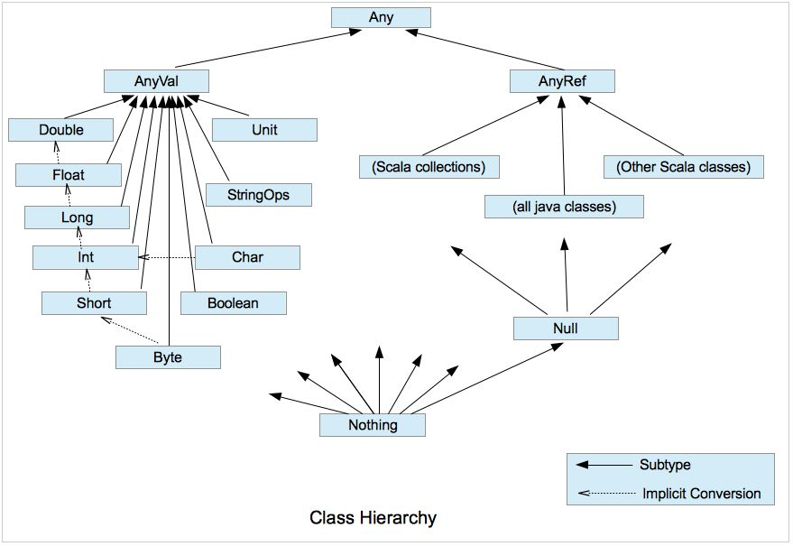

Unit是值类型，他只有一个实例对象（）。

Nothing是所有类型的子类，他没有一个具体的实例对象，一个常见的应用如：抛出异常、程序exit，无限循环等。

Nothing是所有类型的子类，也是Null的子类。Nothing没有对象，但是可以用来定义类型。例如，如果一个方法抛出异常，则异常的返回值类型就是Nothing(虽然不会返回) 。

```scala
def get(index:Int):Int = {
    if(x < 0) throw new Exception(...)
    else ....
}

```

if语句是表达式，有返回值，必然有返回值类型，如果x < 0，抛出异常，返回值的类型为Nothing，Nothing也是Int的子类，所以，if表达式的返回类型为Int，get方法的返回值类型也为Int。

Null是所有引用类型的子类，它只有一个实例对象null，主要用来和其他的JVM语言进行互操作。

| 数据类型 | 描述                                                         |
| :------- | ------------------------------------------------------------ |
| Byte     | 8位有符号补码整数。数值区间为 -128 到 127                    |
| Short    | 16位有符号补码整数。数值区间为 -32768 到 32767               |
| Int      | 32位有符号补码整数。数值区间为 -2147483648 到 2147483647     |
| Long     | 64位有符号补码整数。数值区间为 -9223372036854775808 到 9223372036854775807 |
| Float    | 32 位, IEEE 754标准的单精度浮点数                            |
| Double   | 64 位 IEEE 754标准的双精度浮点数                             |
| Char     | 16位无符号Unicode字符, 区间值为 U+0000 到 U+FFFF             |
| String   | 字符序列                                                     |
| Boolean  | true或false                                                  |
| Unit     | 表示无值，和其他语言中void等同。用作不返回任何结果的方法的结果类型。Unit只有一个实例值，写成()。 |
| Null     | null                                                         |
| Nothing  | Nothing类型在Scala的类层级的最低端；它是任何其他类型的子类型。 |
| Any      | Any是所有其他类的超类                                        |
| AnyRef   | AnyRef类是Scala里所有引用类(reference class)的基类           |

**Scala数据类型的位数，不受具体OS的影响，以保证Scala程序的可移植性。**

#### 3.5.2 数值类型

Scala和Java一样，有8种数值类型Byte、Char、Short、Int、Long、Float、Double和一个Boolean类型，

和Java不同的是 ，Scala没有基本类型与包装类型之分，这些类型都是类，有自己的属性和方法。

**相当于Java的包装类；**

1.toString()

1.to (10)

##### 3.5.2.1 整型

Byte

```scala
// 直接使用整数赋值时，会被判断为Int类型，需要定义时指定类型
var b: Byte = 2
```

Short

```scala
// 直接使用整数赋值时，会被判断为Int类型，需要定义时指定类型
var s: Short = -3
// 低精度可直接隐式转换为高精度
s = b // Byte->Short
```

Int

```scala
// 可以直接使用数字赋值
var i = 5
// 低精度可直接隐式转换为高精度
i = b // Byte->Int
i = s // Short->Int
i = c // Char->Int

```

Long

```scala
// 直接使用小数赋值时，会被判断为Int，需要在小数后添加字母L
var l = 200L
var l1: Long = 200L
// 低精度可直接隐式转换为高精度
l = b // Byte->Long
l = s // Short->Long
l = i // Int->Long
scala> val prog = 0XCAFEBABEL
prog: Long = 3405691582
scala> val tower = 35L
tower: Long = 35
scala> val of = 31l
of: Long = 31
```


数值的不同进制

如果数始于0x或者0X，那就是16进制，并且可能包含从0到9，以及大小写的从A到F的字母。

如果数始于0，那就是8进制，并且可能包含从0到7的数字。

如果数始于非0的数字，那就是10进制，并且可能包含从0到7的数字。

~~~scala
//16进制
scala> val hex = 0x5
hex: Int = 5
scala> val hex2 = 0x00FF
hex2: Int = 255
scala> val magic = 0xcafebabe
magic: Int = -889275714
//八进制（2.11.x版本已）
scala> val oct = 035 // (35 octal is 29 decimal)
oct: Int = 29
scala> val nov = 0777
nov: Int = 511
scala> val dec = 0321
dec: Int = 209
//十进制
scala> val dec1 = 321
dec: Int = 321
~~~

如果数值以L和l结束，就是long类型，否则就是int类型数值。

~~~scala
val prog = 0XCAFEBABEL
prog:Long = 3405691582
~~~

##### 3.5.2.2 浮点类型

浮点类型包括float类型和double类型。

浮点值是由十进制、可选的小数点、可选的e或E以及指数部分组成。

浮点类型的数值以F或者f结束，否则就是Double类型，Double类型的数值也可以以D或者d结尾，是可选的。

浮点型常量有两种表示形式：

- 十进制数形式：如：5.12       512.0f        .512   (必须有小数点）；
- 科学计数法形式:如：5.12e2  = 5.12乘以10的2次方     5.12E-2  = 5.12除以10的2次方。

Float

```scala
// 直接使用小数赋值时，会被判断为Double，需要在小数后添加字母F
var f = 3.14F
var f1: Float = 3.14F
scala> val bigger = 1.2345e1
bigger: Double = 12.345
scala> val biggerStill = 123E45
biggerStill: Double = 1.23E47
// 低精度可直接隐式转换为高精度
f = b // Byte->Float
f = s // Short->Float
f= i //

```

Double

```scala
// 可以直接使用小数赋值
var d1 = 3.1415
var f1 = 3.1415f
var d2 = 3.1415D
var d3 = 3.1415e5
// 低精度可直接隐式转换为高精度
d = b // Byte->Double
d = s // Short->Double
d = i // Int->Double
d = f // Float->Double
d = l // Long->Double
```

##### **3.5.2.3 字符类型**

```scala
// 可以直接使用单引号字符赋值，也可以指定类型后，使用范围内的数字赋
值
var c = 'A'
var c1: Char = 65
```

字符类型的常量可以是单引号之间的任何Unicode字符；

具体有三种形式

字符类型

~~~scala 
val a = 'A'
~~~

反斜杠+八进制或者十六进制的表示字符编码的数字

~~~scala
val c = '\101'
~~~

以前缀\u开始的四位16进制数字的通用Unicode字符表示

~~~scala
val d = '\u0041'
~~~

转义字符

| 字符值 | 含义             |
| ------ | ---------------- |
| \n     | 换行（\u000A）   |
| \b     | 回退（\u0008）   |
| \t     | 制表符（\u0009） |
| \f     | 换页（\u000C）   |
| \r     | 回车（\u000D）   |
| \"     | 双引号（\u0022） |
| \'     | 单引号（\u0027） |
| \\     | 反斜杠（\u005C） |

##### 3.5.2.4 字符串类型

String类型是有双引号包含的一个或者多个字符组成，语法和字符类型基本一致。

~~~scala
val hello = "hello"
val escapes = "\\\"\'"
~~~

Scala中引入的三引号作为字符串的开始和结束符，内部的原始字符串可以包含换行、引号和特殊字符。

~~~scala
println("""welcome to 
           "1000phone".""")
//为了解决每行的空格，引入了stripMargin方法。使用方式是把管道符号（|）放在每行前面，然后对整个字符串调用该方法。
println("""|welcome to 
           |"1000phone".""".stripMargin)
~~~

##### 3.5.2.5 Unit和布尔类型

Unit

~~~scala
// Unit为空类型，相当于void，使用()进行初始化
var u = ()
~~~

Boolean

~~~scala
// 定义Boolean类型，只能为true或者false
var b1 = false
var b2: Boolean = true
~~~

#### 3.5.3 其他类型

Any

```scala
// Any可以接收任意的基本类型和引用类型
var any: Any = null
any = anyR
any = anyV
```

AnyRef

```scala
// 可以使用AnyRef接收任意的引用类型
var anyR: AnyRef = null
```

**在 Scala 中，字符串的类型实际上是 Java String，它本身没有 String 类。**
**在 Scala 中，String 是一个不可变的对象，所以该对象不可被修改。这就意味着你如果修改字符串就会产生一个新的字符串对象。**

AnyVal

```scala
// 可以使用AnyVal接收任意的基本类型
var anyV: AnyVal = u // Unit
anyV = b1 // Boolean
anyV = b // Byte
anyV = s // Short
anyV = c // Char
anyV = i // Int
anyV = f // Float
anyV = l // Int
anyV = d // Double
anyV = str // String
```

Null

```scala
// null值只能被推断为Null类型，null代表空值，可以被赋值给任何
AnyRef类型的常量或变量
var n = null
```

Nothing

```scala
Nothing类型在Scala的类层级的最低端；它是任何其他类型的子类型。
当一个函数，我们确定没有正常的返回值，可以用Nothing 来指定返回类型，这样有一个好处，就是我们可以把返回的值（异常）赋给其它的函数或者变量（兼容性）
```

Option

Scala Option(选项)类型用来表示一个值是可选的（有值或无值)。

~~~scala
val myMap: Map[String, String] = Map("key1" -> "value")
val value1: Option[String] = myMap.get("key1")
val value2: Option[String] = myMap.get("key2")
 
println(value1) // Some("value1")
println(value2) // None
~~~


#### 3.5.4 scala 类型转换

**自动类型转换**


```scala
    val x: Long = 987654321
    val y: Float = x  // 9.8765434E8 (note that some precision is lost in this case)

    val face: Char = '☺'
    val number: Int = face  // 9786
```

**强制类型转换**

java中的强制类型转换：

```java
int a = (int) 100.00;
```

scala中处理：

```scala
//toByte     toChar     toDouble   toFloat    toInt      toLong
//toShort    toString
scala> val a = 19.9
a: Double = 19.9
scala> val b = a.toInt
b: Int = 1
```

**数值类型和字符串类型的转换**

数值类型转字符串类型

~~~scala
val s1 = true+""
val s2 = 3.1415+""
val s3 = 100 +""
~~~

字符串类型转数值类型

~~~scala
val s4 = "3.14"
s4.toDouble()
~~~

### 3.6. 操作符（了解）

#### 3.6.1 算术操作符

+、-、* 、/、%

~~~scala

scala> val res1 = 1.2+1.3
res1: Double = 2.5

scala> val res2 = 1.2 - 1.3
res2: Double = -0.10000000000000009

scala> val res3 = 1.3*1.3
res3: Double = 1.6900000000000002

scala> val res4 = 18/8
res4: Int = 2

scala> val res5 = 18.0/8
res5: Double = 2.25

scala> val res6 = 18%8
res6: Int = 2

scala> val res7 = 18.0%8
res7: Double = 2.0

scala> val res7 = 18.0%7.5
res7: Double = 3.0

scala> -res7
res4: Double = -3.0

scala> +res7
res5: Double = 3.0

scala> val res8 = "1000"+"phone"
res8: String = 1000phone
~~~

| 运算符 | 运算       | 范例       | 结果    |
| ------ | ---------- | ---------- | ------- |
| +      | 正号       | +3         | 3       |
| -      | 负号       | b=4; -b    | -4      |
| +      | 加         | 5+5        | 10      |
| -      | 减         | 6-4        | 2       |
| *      | 乘         | 3*4        | 12      |
| /      | 除         | 5/5        | 1       |
| %      | 取模(取余) | 7%5        | 2       |
| +      | 字符串相加 | “He”+”llo” | “Hello” |

#### 3.6.2 关系操作符

< > <= >=  != ==

~~~scala
scala> val res1 = 1 < 2
res1: Boolean = true

scala> val res2 = 1 > 2
res2: Boolean = false

scala> val res2 = 1.0 > 2.0
res2: Boolean = false

scala> val res2 = 1.0 > 2
res2: Boolean = false

scala> val res3 = 1.0 >= 2
res3: Boolean = false

scala> val res3 = 1.0 <= 2
res3: Boolean = true

scala> val res4 = "1000">"phone"
res4: Boolean = false

scala> val res5 = 'a'>'A'
res5: Boolean = true

scala> val res5 = 'a'>"qianfeng"
<console>:11: error: overloaded method value > with alternatives:
  (x: Double)Boolean <and>
  (x: Float)Boolean <and>
  (x: Long)Boolean <and>
  (x: Int)Boolean <and>
  (x: Char)Boolean <and>
  (x: Short)Boolean <and>
  (x: Byte)Boolean
 cannot be applied to (String)
       val res5 = 'a'>"qianfeng"
                     ^

scala> val res6 = 1 != 1
res6: Boolean = false

scala> val res6 = 1 == 1
res6: Boolean = true

scala> val res6 = 1 == 1.0
res6: Boolean = true

scala> val res7 = 1.==(1)
res7: Boolean = true
~~~

| 运算符 | 运算                                 范例                                         结果 |
| ------ | ------------------------------------------------------------ |
| ==     | 相等于                               4==3                                                false |
| !=     | 不等于                               4!=3                                                 true |
| <      | 小于                                   4<3                                                   false |
| >      | 大于                                   4>3                                                   true |
| <=     | 小于等于                           4<=3                                                false |
| >=     | 大于等于                           4>=3                                                true |

#### 3.6.3 逻辑操作符

&& || ！

| 运算符 | 描述   | 实例                       |
| ------ | ------ | -------------------------- |
| &&     | 逻辑与 | (A && B) 运算结果为 false  |
| \|\|   | 逻辑或 | (A \|\| B) 运算结果为 true |
| !      | 逻辑非 | !(A && B) 运算结果为 true  |

~~~scala
scala> val toBe = true
toBe: Boolean = true

scala> val notToBe = false
notToBe: Boolean = false

scala> val res1 = toBe && notToBe
res1: Boolean = false

scala> val res1 = toBe || notToBe
res1: Boolean = true

scala> val res2 = !toBe
res2: Boolean = false

scala> val res3 = 1>2 && 2>3
res3: Boolean = false

scala> val res4 = toBe.&&(notToBe)
res4: Boolean = false
~~~

#### 3.6.4 位操作符

| & ^ ~ << >> >>>

| &    | 按位与运算符   | (a & b) 输出结果 12 ，二进制解释： 0000 1100                 |
| ---- | -------------- | ------------------------------------------------------------ |
| \|   | 按位或运算符   | (a \| b) 输出结果 61 ，二进制解释： 0011 1101                |
| ^    | 按位异或运算符 | (a ^ b) 输出结果 49 ，二进制解释： 0011 0001                 |
| ~    | 按位取反运算符 | (~a ) 输出结果 -61 ，二进制解释： 1100 0011， 在一个有符号二进制数的补码形式。 |
| <<   | 左移动运算符   | a << 2 输出结果 240 ，二进制解释： 1111 0000                 |
| >>   | 右移动运算符   | a >> 2 输出结果 15 ，二进制解释： 0000 1111                  |
| >>>  | 无符号右移     | A >>>2 输出结果 15, 二进制解释: 0000 1111                    |

补运算符~，是一元的，具有‘翻转’位的效应。

带符号右移>>。正数右移高位补0，负数右移高位补1。

无符号右移>>>。无论是正数还是负数，高位通通补0。

~~~scala
scala> val res1 = 1 & 1
res1: Int = 1

scala> val res1 = 1 & 2
res1: Int = 0

scala> val res1 = 1 | 2
res1: Int = 3

scala> val res2 = ~ 1
res2: Int = -2

scala> val res3 = 1 >> 2
res3: Int = 0

scala> val res3 = 1 << 2
res3: Int = 4


~~~

#### 3.6.5 赋值运算符

= += -= *= /= %= <<= >>= &= ^= |=

| 运算符 | 描述           | 实例                       |
| ------ | -------------- | -------------------------- |
| <<=    | 左移后赋值     | C <<= 2  等于 C = C << 2   |
| >>=    | 右移后赋值     | C >>= 2  等于 C = C >> 2   |
| &=     | 按位与后赋值   | C &= 2   等于 C = C & 2    |
| ^=     | 按位异或后赋值 | C ^= 2    等于 C = C ^ 2   |
| \|=    | 按位或后赋值   | C \|= 2    等于 C = C \| 2 |

~~~scala
scala> var a = 10
a: Int = 10

scala> a += 10

scala> a
res7: Int = 20

scala>  a = a+10
a: Int = 30

scala> a <<= 2

scala> a
res9: Int = 120

scala> a = a<<2
a: Int = 480

scala> a |=2

scala> a
res11: Int = 482
~~~


#### 3.6.6 运算符优先级

| 分类   | 运算符                            | 关联性 |
| ------ | --------------------------------- | ------ |
| 后缀   | () []                             | 左到右 |
| 一元   | ! ~                               | 右到左 |
| 乘法   | * / %                             | 左到右 |
| 加法   | + -                               | 左到右 |
| 位移   | << >> >>>                         | 左到右 |
| 关系   | < <= > >=                         | 左到右 |
| 等于   | == !=                             | 左到右 |
| 按位与 | &                                 | 左到右 |
| 位异或 | ^                                 | 左到右 |
| 按位或 | \|                                | 左到右 |
| 逻辑与 | &&                                | 左到右 |
| 逻辑或 | \|\|                              | 左到右 |
| 赋值   | = += -= *= /= %=>>= <<= &= ^= \|= | 右到左 |

#### 3.6.7 操作符注意点

1. a + b 等价于 a.+(b)
2. Scala没有++，--  可以用+=，-=代替
3. 操作符都是方法的重载，是方法的调用

### 3.7 表达式（重要）

**什么是表达式:**

**表达式：一个具有执行结果的代码块。结果是具体的值或者（）**

*表达式的思考方式：以表达式为中心的编程思想*

**表达式和语句有什么区别:**

*1.表达式和语句的区别：表达式有返回值，语句被执行。表达式一般是一个语句块，执行后，返回一个值*

~~~scala
scala> if(true) "true string" else "false string"
res4: String = true string
scala> if(false) 5 else "hello"
res5: Any = hello
~~~

*2.不使用return语句，最后一个表达式即返回值*

如果用return会发生什么？？

```scala
scala> if (i>10) 100 else  -100
scala> if (i>10) return 100 else return -100
<console>:9: error: return outside method definition
              if (i>10) return 100 else return -100
```

#### 3.7.1 条件表达式

if/else表达式有值，这个值就是跟在if或者else之后的表达式的值

**单分支**

基本语法

if (条件表达式) {执行代码块}

说明：当条件表达式为ture 时，就会执行 { } 的代码。

~~~scala
	val x = 1
    //如果缺失else，相当于if(x>2) 1 else （）
    //返回类型是AnyVal
    //如果进行类型判断和转换，可以使用：
    //var b = if(m.isInstanceOf[Int]) m.asInstanceOf[Int] else 0
    val m = if(x>2) 1
    println(m)

    //在scala中，每个表达式都有值，scala中有个unit类，写作（），相当于Java中的 void
    val n = if(x>2) 1 else ()
    println(n)
~~~

**双分支**

基本语法    

 if (条件表达式) {执行代码块1 } else {	执行代码块2 }

说明：当条件表达式成立，即执行代码块1，否则执行代码块2.

~~~scala
   	var x = 1
    //将if/else表达式值赋给变量y
    val y = if (x > 0 ) 1 else -1
    println(y)
~~~

**多分支**

基本语法      

if (条件表达式1) {	执行代码块1}      

else if (条件表达式2) {	执行代码块2      }    

   ……      

 else {执行代码块n }

~~~scala
	//if 嵌套
    val  k= if(x<0) 0 else if (x>=1) 1 else -1
    println(k)
~~~

混合类型表达式

~~~scala
	//支持混合型表达式
    //返回类型是Any
    val z = if(x>0) "success"  else  -1
    println(z)
~~~

Scala的的条件表达式比较简洁，例如：

 **注意**：1，每个表达式都有一个类型

​            2，条件表达式有值

​            3，混合型表达式，结果是Any或者AnyVal

​            4，scala没有switch语句

#### 3.7.2 块表达式

```scala
object BlockExpressionDemo {
  def main(args: Array[String]){

    var x = 0

    //在scala中，{}中可以包含一系列表达式，块中最后一个表达式的值就是块的值
    val res = {
      if (x < 0) {
        -1
      } else if (x >= 1) {
        1
      } else {
        "error"
      }
    }
      println(res)

      val x0 = 1
      val y0 = 1
      val x1 = 2
      val y1 = 2
      val distance = {
        val dx = x1 - x0
        val dy = y1 - y0
        Math.sqrt(dx*dx+dy*dy)
      }
      println(distance)

    //块语句，最后一句是赋值语句，值是unit类型的

     var res2 = {
       val dx = x1 - x0
       val dy = y1 - y0
      val res =  Math.sqrt(dx*dx+dy*dy)
     }
    println(res2)
    
  }

}
```

执行结果：

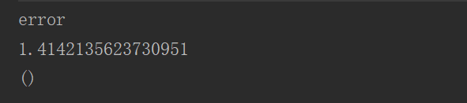

注意：

1，块表达式的值是最后一个表达式的值

2，赋值语句的值是unit类型的，

 **Java中有switch，Scala中有吗**

没有

### 3.8 循环（重要）

在scala中有for循环和while循环，用for循环比较多

#### 3.8.1 for循环

for循环语法结构：**for **(i <- 表达式/数组/集合(Range))

**to和until** 

i to j (包含i和j)

i until j (包含i,但不包含j) 

~~~scala
i to j
i.to(j)
i until j
i.until(j)
~~~


```scala
object ForDemo 
  def main(args: Array[String]){
    //每次循环将区间的一个值赋给i
    for( i <- 1 to 10)
      println(i)
    for( i <- 1 until 10)
      println(i)

    //for i <-数组
    val arr = Array("a", "b", "c")
    for( i <- arr)
      println(i)

    val s = "hello"
    for(i <- 0 until s.length){
      println(s(i))
    }
    //  或者
    //   for(c <- s)println(c)
    //  或者
    //  for(i <- 0 until s.length){
    //  println(s.charAt(i))
    //使用了隐式转换，把字符串变成一个ArrayCharSequence 
    // }
      
    //高级for循环(嵌套循环加过滤功能)
    for(i <- 1 to 3 ; j<- 1 to 3 if i != j)
      print((10*i + j) + "")
      println()

    //for推导式，如果for循环的循环体以yeild开始，则该循环会构建出一个集合或者数组，每次迭代生成其中的一个值。
    val v= for ( i <- 1 to 10 )yield i*10
            println (v)
      
    //延申，更简洁的使用   
    //也可以借助函数由初始数组生成一个新的数组
    //val arr1 = Array(1,2,3,4,5,6,7,8,9)
    //val arr2 = arr.map(_*10)
    //val arr3 = arr.filter(_%2==0)
    
  }
}
```

#### 3.8.2 while循环和do...while循环

while (条件语句){表达式}

do{ 表达式}while（条件语句）

~~~scala
//求和
//while实现
val i=1
var sum = 0
while（i<=10）{
    sum += i
    i += 1
}
println（sum）
//do ... while实现
do {
    sum += i
    i += 1
}while (i>=10)
~~~

#### 3.8.3 终止循环

1)用if实现continue功能，使用布尔变量实现break功能。

例子：搜索参数列表查找以“.scala”结尾但不以连号”-“开头的字符串。

~~~scala
var i = 0
var foundIt = false
while(i<args.length && !foundIt){
    if(!args(i).startsWith("-")){
        if(args(i).endsWith(".scala"))
        foundIt = true
    }
    i = i + 1
}
~~~

通过递归方式实现版本

~~~scala
def searchFrom(i:Int):Int = 
if (i > args.length) -1
else if (args(i).startsWith("-")) searchFrom(i+1)
else if (args(i).endsWith(".scala")) i
else searchFrom(i+1)
var i = searchFrom(0)
~~~

2)Scala里面竟然没有break和continue关键字，其实不是这样的，Scala里面推荐使用函数式的风格解决break和continue的功能，而不是一个关键字。

```scala
//需要导入包
import util.control.Breaks._
//break例子
object scalaTest {
  def main(args: Array[String]): Unit = {
    //break例子
    breakable(
      for(i<-0 until 10) {
        if(i==5){
          break()
        }
        println(i)
      }
    )
  }
}
//continue例子
import util.control.Breaks._
object scalaTest {
  def main(args: Array[String]): Unit = {
    //break例子
      for(i<-0 until 10) {
        breakable{
          if(i==5){
            break()
          }
          println(i)
       }
      }
  }
}
```

### 3.9 定义方法和函数（重要）

#### 3.9.1 定义方法

定义方法的基本格式是：

```
def 方法名称（参数列表）：返回值类型 = 方法体 
```

```scala
def add(x: Int, y: Int): Int = x + y
println(add(1, 2)) // 3
//也可以定义成
//def add(x: Int, y: Int) = x + y
//或者
//def add(x: Int, y: Int){x + y}，没有返回值，一定要用大括号把方法体括起来
```

带有多参数列表的方法:

```scala
def addThenMultiply(x: Int, y: Int)(multiplier: Int): Int = (x + y) * multiplier
println(addThenMultiply(1, 2)(3)) // 9
```

无参方法:

```scala
scala> def name:String = System.getProperty("user.name")
name: String

scala> name
res0: String = liyunxia

scala> name()
<console>:9: error: not enough arguments for method apply: (index: Int)Char in class StringOps.
Unspecified value parameter index.
              name()
                  ^

scala> def name():String = System.getProperty("user.name")
name: ()String

scala> name
res2: String = liyunxia

scala> name()
res3: String = liyunxia

```

方法体是多行语句的表达式：

```scala
def getSquareString(input: Double): String = {  
	val square = input * input  
	square.toString
}
```

带有默认值的方法:

**q1：Java支不支持带有默认值的方法？**

Java不支持，想实现类似的效果，怎么实现？

**注意：Java不支持定义带有默认值的方法，通过重载可以实现类似的效果**

scala支不支持重载？

支持

```scala
    def funcadd(str:String="hello scala!"){
      println(str);
    }
```

默认参数，可以有多个，对位置也不做要求

```scala
def method1(a:Int=1,b:Int,c:Int=3) = println("a="+a+"b="+b+"c="+c)
//调用
method1(b=2) //不能method1(2)
//或者
method1(1,2) //method1(a=1,b=2)
//或者
method1(1,2,3) //method1(c=1,b=2,a=3)
```

可变参数或不定长参数

**注意1：（可变参数一定是参数列表的最后一个参数）**

**注意2：函数内部，重复参数的类型是声明参数类型的数组**，但是如果你给一个可变参数的方法传一个数组，是会报编译错误：type mismatch，可以使用数组名:_*的方式传参。

```scala
  def add(a:Int*) {
      for(i<-a) {
        println(i);
      }
  }

调用：
add(1,2,3,4,5)
或者：
var arr = Array(1,2,3,4,5,8)
add(arr:_*)
```

注意：

1. 方法的返回值类型可以不写，编译器可以自动推断出来，但是对于递归函数，必须指定返回类型
2. 方法的返回值默认是方法体中最后一行表达式 的值，当然也可以用return来执行返回值，但不推荐这么做。
3. 若使用`return`来制定函数的返回值，scala的类型推断将会失效，要显式指定返回值类型。
4. 方法也可以没有返回值（返回值是Unit）

#### 3.9.2 定义函数

给方法传递一个函数类型的参数:

```
def foo(f: Int => String) = ...

def bar(f: (Boolean, Double) => List[String]) = ...
```

函数可以看做是带有参数的表达式。

函数定义的方式：

1，函数的定义方式：

```scala
val f1 = ((a: Int, b: Int) => a + b)
val f2 = (a: Int, b: Int) => a + b
val f3 = (_: Int) + (_: Int)
val f4: (Int, Int) => Int = (_ + _)
```

2，函数的定义方式：

```scala
val f1:((Int,Int)=>Int)={(x,y)=>x+y}
val f2:(Int,Int)=>Int =(x,y)=>x+y
```

3，函数的定义方式：

```scala
val f1 = new Function2[Int, Int, Int] { 
    def apply(x: Int, y: Int): Int = if (x < y) y else x 
} 
```

匿名函数：

```scala
(x: Int) => x + 1
var inc = (x:Int) => x+100
//变量inc现在是一种可以像函数那样使用的函数
var x = inc(7)-1

//还可以如下定义具有多个参数的函数：
var mul = (x: Int, y: Int) => x*y

//变量mul现在是可以像函数那样使用的函数 
println(mul(3, 4))

//也可以定义不带参数的函数
var userDir = () => { System.getProperty("user.dir") }

//变量userDir现在是可以像函数那样使用的函数 
println( userDir )
```

递归函数：

~~~scala
object FuncDemo3 {

  //实现阶乘功能3！=3*2*1 4！=3！*4
  //通过定义一个递归实现
  val factorial:Int=>Int=(n)=>{
    if(n<=1)
      1
    else
      n*factorial(n-1)
  }

  def main(args: Array[String]): Unit = {
    println(factorial(10))
  }

}
~~~

无参函数：

```scala
val getTheAnswer = () => 42
println(getTheAnswer()) // 42

```

#### 3.9.3  方法和函数的区别

- 方法和函数的定义语法不同

  def  方法名（参数列表）：返回类型=方法体

  val  变量 = （函数参数列表）=> 函数体

- 方法一般定义在某个类、特质、或者object中

- 方法可以共享使用所在类内的属性

- Methods of an object can be passed as functions

- Methods and functions **are not** the same thing

在函数式编程语言中，函数是“头等公民”，可以调用它，也可以传递它，存放在变量中，或者作为参数传递给另一个函数。

案例：首先定义一个方法，再定义一个函数，然后将函数传递到方法里面

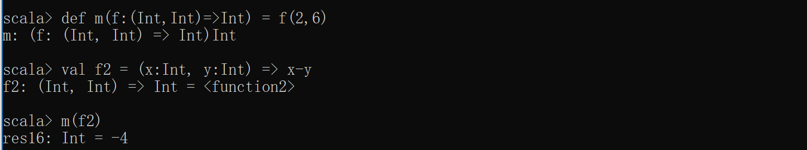

#### 3.9.4 将方法转换成函数

把方法作为参数传给另一个方法或者函数的时候，方法被转化成函数

使用神奇的下划线_

 


##  集合

集合是一种用来存储各种对象和数据的容器。

Scala 集合分为可变的和不可变的集合，不可变集合可以安全的并发访问。

可变集合可以在适当的地方被更新或扩展。这意味着你可以修改，添加，移除一个集合的元素。

不可变集合，相比之下，永远不会改变。不过，你仍然可以模拟添加，移除或更新操作。但是这些操作将在每一种情况下都返回一个新的集合，同时使原来的集合不发生改变。

scala集合两个主要的包：

不可变集合：scala.collection.immutable

可变集合：  scala.collection.mutable ，Scala默认采用不可变集合。

Scala的集合有三大类：序列Seq、集Set、映射Map，所有的集合都扩展自Iterable特质。 

| 1    | [Scala List(列表)](http://www.runoob.com/scala/scala-lists.html) List的特征是其元素以线性方式存储，集合中可以存放重复对象。 |
| ---- | ------------------------------------------------------------ |
| 2    | [Scala Set(集合) ](http://www.runoob.com/scala/scala-sets.html) Set是最简单的一种集合。集合中的对象不按特定的方式排序，并且没有重复对象。 参考 [API文档](http://www.scala-lang.org/api/current/scala/collection/immutable/Set.html) |
| 3    | [Scala Map(映射)](http://www.runoob.com/scala/scala-maps.html) Map 是一种把键对象和值对象映射的集合，它的每一个元素都包含一对键对象和值对象。  参考 [API文档](http://www.scala-lang.org/api/current/scala/collection/immutable/Map.html) |
| 4    | [Scala 元组](http://www.runoob.com/scala/scala-tuples.html) 元组是不同类型的值的集合 |
| 5    | [Scala Option](http://www.runoob.com/scala/scala-options.html) Option[T] 表示有可能包含值的容器，也可能不包含值。 |
| 6    | [Scala Iterator（迭代器）](http://www.runoob.com/scala/scala-iterators.html) 迭代器不是一个容器，更确切的说是逐一访问容器内元素的方法。 |

https://docs.scala-lang.org/overviews/collections/overview.html

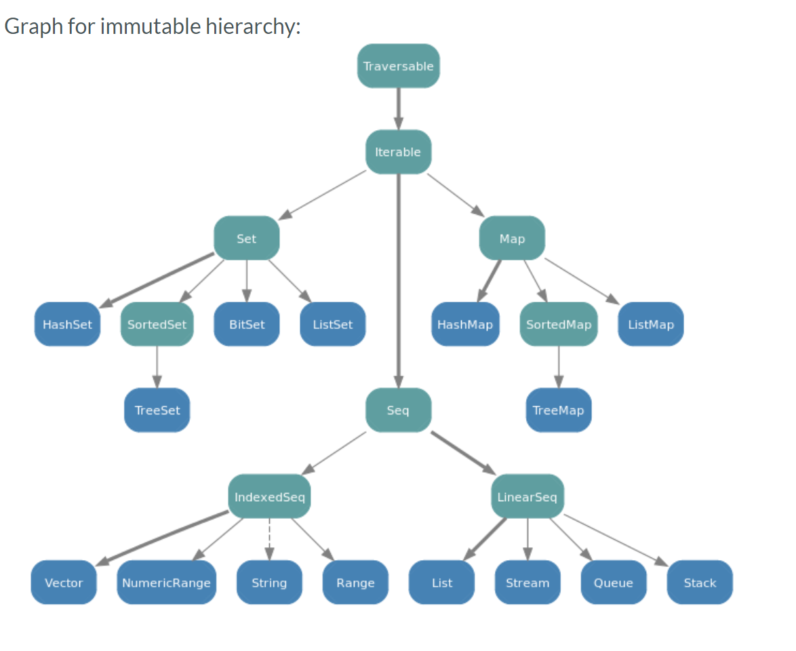

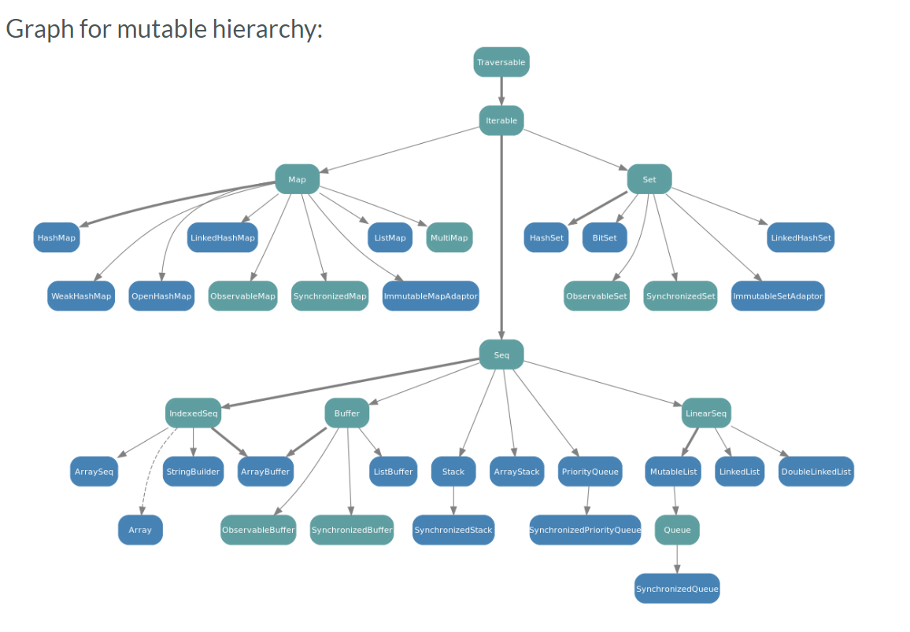

### 3.10 数组(Array)（重要）

数组元素内容要求类型一致。

定长数组，数组不可扩容；

变长数组，数组可扩容。

#### 3.10.1 定长数组

**数组创建：**

创建一个定长数组的方式：

- 使用new关键字创建一个定长数组
- 直接使用Array创建并初始化一个数组

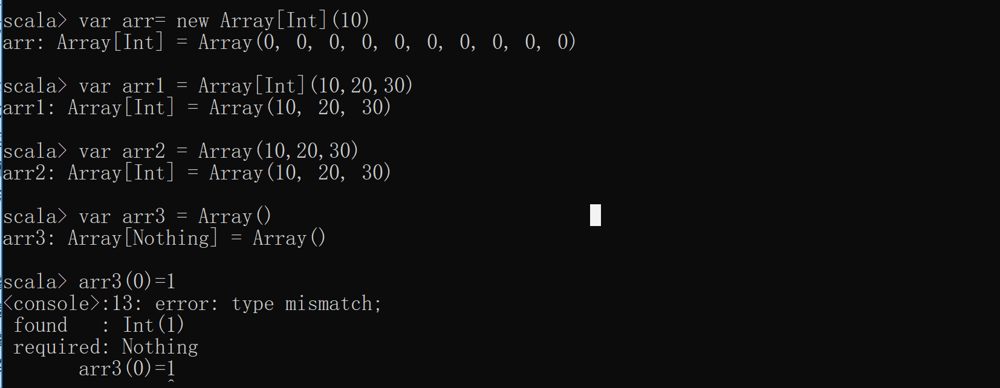

使用Array定义一个长度不变的数组

```scala
object ArrayDemo {
  def main(args: Array[String]){
    //初始化一个长度为8的定长数组
    val arr1 = new Array[Int](8)
    //会有初始化零值：Array[Int] = Array(0,0,0,0,0,0,...)
    //直接打印定长数组，内容为数组的hashcode值
    println(arr1)
    //将数组转换成数组缓冲，就可以看到原数组中的内容了
    //toBuffer会将数组转换长数组缓冲
    println(arr1.toBuffer)

    //注意：如果不使用new获取数组，相当于调用了数组的apply方法，直接为数组赋值
    //通过一组初始化值定义定长数组
    val arr2 = Array[Int](10,20,30)
    //输出数组元素值
    println(arr2.toBuffer)

    //定义一个长度为3的定长数组
    val arr3 = Array("hadoop", "storm", "spark")
    //使用()来访问元素
    println(arr3(2))

    //包含10个整数的数组，初始化值为0 
    val nums = new Array[Int](10)
    //遍历数组
    for(i <- 0 until nums.length)
      print(s"$i:${nums(i)} ")
      println()

    //包含10个字符串的数组，初始化值为null
    val strs0 = new Array[String](10)
    for(i <- 0 until strs0.length)
      print(s"$i:${strs0(i)} ")
      println()

    //赋初值的字符串数组
    val strs1 = Array("hello" ,"world")
    for(i <- 0 until strs1.length)
      print(s"$i:${strs1(i)} ")
      println()

    //访问并修改元素值
    strs1(0) = "byebye"
    for(i <- 0 until strs1.length)
      print(s"$i:${strs1(i)} ")
      println()

  }
}


```

result

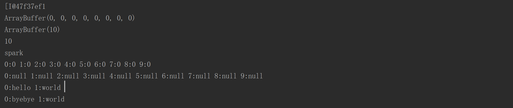

**定长数组是不可变集吗？**

定长数组是可变集合的一种，内容可变，但是其长度不可变。

#### 3.10.2. 变长数组

定义变长数组的方式:

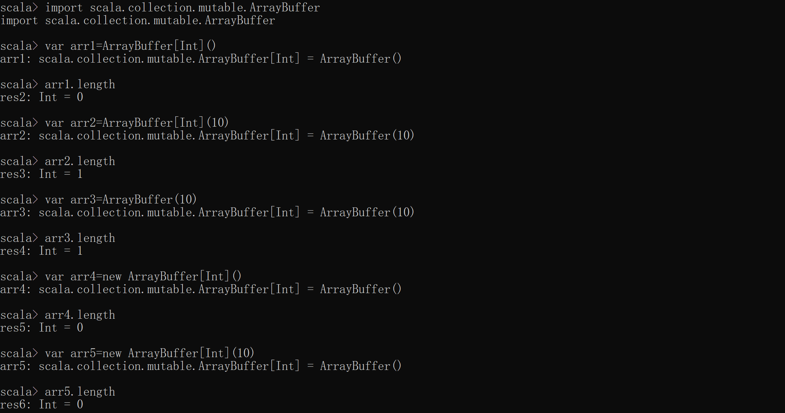

使用 ArrayBuffer定义长度按需变化的数组。

```scala
import scala.collection.mutable.ArrayBuffer

object VarArrayDemo {
  def main(args: Array[String]){
    //定义一个空的可变长Int型数组
    val nums =  ArrayBuffer[Int]()

    //在尾端添加元素
    nums += 1

    //在尾端添加多个元素
    nums += (2,3,4,5)

    //使用++=在尾端添加任何集合
    nums ++= Array(6,7,8)

   //这些操作符，有相应的 -= ，--=可以做数组的删减，用法同+=，++=
      
   //使用append追加一个或者多个元素
    nums.append(1)
    nums.append(2,3)
      
   //在下标2之前插入元素
    nums.insert(2,20)
    nums.insert(2,30,30)    

    //移除最后2元素
    nums.trimEnd(2)
    //移除最开始的一个或者多个元素
    nums.trimStart(1)
   
    //从下标2出移除一个或者多个元素
    nums.remove(2)
    nums.remove(2,2)     
      
   //使用增强for循环进行数组遍历   
    for(elem <- nums)
      println(elem)
      
    //基于下标访问使用增强for循环进行数组遍历
    for(i <- 0 until nums.length)
      println(nums(i))
  }
}
```

执行结果：

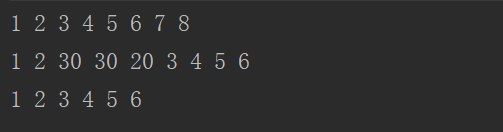

#### 3.10.3 **定长数组与变长数组的转换**

```
arr1.toBuffer
arr2.toArray

```

#### 3.10.3. 遍历数组

1.增强for循环,参见变长数组的代码

2.好用的until会生成脚标，0 until 10 包含0不包含10 参见定长数组部分代码4.1.3. 数组转换

#### 3.10.4. 数组元素处理

yield关键字将原始的数组进行转换会产生一个新的数组，原始的数组不变

```scala
bject ArrayTransfer {

  def main(args: Array[String]): Unit = {

    //使用for推导式生成一个新的数组
    val a = Array(1, 2, 3, 4, 5, 6, 7, 8, 9)
    val res1 = for(elem <- a) yield 2*elem
    for(elem <- res1)
      print(elem+" ")
    println()

    //对原数组元素过滤后生成一个新的数组
    //将偶数取出乘以10后再生成一个新的数组
    val res2 = for(elem <- a if elem%2 == 0)yield 2*elem
    for(elem <- res2)
      print(elem+" ")
    println()

    //使用filter和map转换出新的数组
    val res3 = a.filter(_ % 2 == 0).map(2 * _)
    for(elem <- res3)
      print(elem+" ")
    println()
  }
```

执行结果：

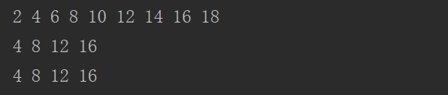

#### 3.10.5. 数组常用方法

在Scala中，数组上的某些方法对数组进行相应的操作非常方便！

```scala
object ArrayAlgorithm {
  def main(args: Array[String]): Unit = {
      
    val arr = Array(9,1,3,4,2,7,5,6,8)
      println(arr.sum) // 数组求和:45
      println(arr.max) // 数组求最大值:9
      println(arr.min) // 数组求最小值:1
      println(arr.sorted.toBuffer)// 数组排序:默认升序，返回一个新的数组
      println(arr.sortWith(_<_).toBuffer）// 可以自定义排序规则，返回一个新的数组
  }
}
```

#### 3.10.6. 数组进阶

~~~scala
//创建二位数组
def main(args: Array[String]) {
      var myMatrix = ofDim[Int](3,3)
      
      // 创建矩阵
      for (i <- 0 to 2) {
         for ( j <- 0 to 2) {
            myMatrix(i)(j) = j;
         }
      }
      
      // 打印二维阵列
      for (i <- 0 to 2) {
         for ( j <- 0 to 2) {
            print(" " + myMatrix(i)(j));
         }
         println();
      }
    //不规则多维数组
    val multiDimArr = new Array[Array[Int]](3)
    multiDimArr2(0) = new Array[Int] (2)
    multiDimArr2(1) = new Array[Int] (3)
    multiDimArr2(2) = new Array[Int] (4)
    multiDimArr2(1)(2)(3) = 1
   
   }
~~~


### 3.11 映射（map）（重要）

在Scala中，把哈希表这种数据结构叫做映射。

Scala中的Map存储的内容是键值对(key-value)，Scala中不可变的Map是有序的，可变的Map是无序的。

Scala中，有可变Map (scala.collection.mutable.Map) 和 不可变Map(scala.collection.immutable.Map) 。

#### 3.11.1 构建映射

在Scala中，有两种Map，一个是immutable包下的Map，该Map中的内容不可变；另一个是mutable包下的Map，该Map中的内容可变。

```scala
//构建一个不可变的map
//其中的元素其实是tuple
scala> val scores = Map("zhangsan"->90,"lisi"->80,"wangwu"->70)
scores: scala.collection.immutable.Map[String,Int] = Map(zhangsan -> 90, lisi -> 80, wangwu -> 70)
//使用元组方式构建
scala> val scores = Map(("zhangsan",90),("lisi",80),("wangwu",70))
scores: scala.collection.immutable.Map[String,Int] = Map(zhangsan -> 90, lisi -> 80, wangwu -> 70)
//构建一个可变的map
scala> val scores = scala.collection.mutable.Map(("zhangsan",90),("lisi",80),("wangwu",70))
scores: scala.collection.mutable.Map[String,Int] = Map(lisi -> 80, zhangsan -> 90, wangwu -> 70)
```

#### 3.12.2 访问映射中的值

根据键获取map中对应的值，可以有以下三种方法，尤其推荐使用getOrElse方法。

```scala
//如果key存在，则返回对应的值
//如果key不存在，则抛出异常[java.util.NoSuchElementException]
//在Java中,如果key不存在则返回null
scala> val score1 = scores("lisi")
score1: Int = 80

//使用contains方法检查是否存在key对应的值 
//使用containts先判断在取值，可以防止异常，并加入相应的处理逻辑
// 返回Boolean，true或者false
// 如果key存在，则返回true
// 如果key不存在，则返回false
map4.contains("B")

scala> val score2 = if(scores.contains("lisi")) scores("lisi") else 0
score2: Int = 80

//使用get方法取值，返回Option对象，Some或者None
//如果返回some,可以进一步通过get方法取回相应的值
//如果返回None,通过get方法取值，抛出异常 java.util.NoSuchElementException: None.get
var map4 = mutable.Map( ("A", 1), ("B", "北京"), ("C", 3) )
println(map4.get("A")) //Some
println(map4.get("A").get) //得到Some在取出

//使用getOrElse()取值
//def getOrElse[V1 >: V](key: K, default: => V1)
//如果key存在，返回key对应的值。
//如果key不存在，返回默认值。
scala> val score3 = scores.getOrElse("lisi",0)
score3: Int = 80
```

#### 3.12.3 修改可变map信息

遍历访问map

```scala
//修改键对应的值
//可变的map才能修改
//key存在，则修改对应的值，key不存在，则添加键值对
scala> scores("lisi") = 100

scala> scores
res23: scala.collection.mutable.Map[String,Int] = Map(lisi -> 100, zhangsan -> 90, wangwu -> 70)

scala> scores.update("lisi",50)

scala> scores
res25: scala.collection.mutable.Map[String,Int] = Map(lisi -> 50, zhangsan -> 90, wangwu -> 70)

//添加单个元素-方式1，如果key存在，则修改相应key的值。
scala> scores("zhaoliu") = 88

scala> scores
res27: scala.collection.mutable.Map[String,Int] = Map(lisi -> 50, zhangsan -> 90, zhaoliu -> 88, wangwu -> 70)
//添加单个元素-方式2
scala> scores +=("tom"->77)
res28: scores.type = Map(lisi -> 50, zhangsan -> 90, tom -> 77, zhaoliu -> 88, wangwu -> 70)

//添加多个元素-方式1
scala> scores = scores + ("tom"->77,"jerry"->88)
scala> scores +=("tom"->77,"jerry"->88)
res28: scores.type = Map(lisi -> 50, zhangsan -> 90, tom -> 77, zhaoliu -> 88, wangwu -> 7,jerry -> 88)
scala> val scores2 = Map(("za",90),("lq",80),("wg",70))                      
scores2: scala.collection.immutable.Map[String,Int] = Map(za -> 90, lq -> 80, wg -> 70)
//添加多个元素-方式2
scala> scores ++= scores2
res30: scores.type = Map(lisi -> 50, zhangsan -> 90, lq -> 80, tom -> 77, zhaoliu -> 88, za -> 90, wg -> 70, wangwu -> 70)
//移除键值对
scala> scores-"lisi"
res31: scala.collection.mutable.Map[String,Int] = Map(zhangsan -> 90, tom -> 77, lq -> 80, zhaoliu -> 88, za -> 90, wg -> 70, wangwu -> 70)

scala> scores--List("zhangsan","tom")
res33: scala.collection.mutable.Map[String,Int] = Map(lisi -> 50, lq -> 80, zhaoliu -> 88, za -> 90, wg -> 70, wangwu -> 70)

scala> scores-("lisi","lq")
res34: scala.collection.mutable.Map[String,Int] = Map(zhangsan -> 90, tom -> 77, zhaoliu -> 88, za -> 90, wg -> 70, wangwu -> 70)


```

#### 3.12.4 遍历map

```scala
//遍历
//返回一个set集合
scala>    val res = scores.keySet
res: scala.collection.Set[String] = Set(lisi, zhangsan, lq, tom, zhaoliu, za, wg, wangwu)

scala>     for(elem <- res)
     |       print(elem + "  ")
lisi  zhangsan  lq  tom  zhaoliu  za  wg  wangwu
//返回一个迭代器
scala> val ite = scores.keys
ite: Iterable[String] = Set(lisi, zhangsan, lq, tom, zhaoliu, za, wg, wangwu)

scala> for (item <- ite)
     | print(item + " ")
lisi zhangsan lq tom zhaoliu za wg wangwu
//返回值的迭代器
scala> val values = scores.values
values: Iterable[Int] = HashMap(50, 90, 80, 77, 88, 90, 70, 70)
//返回键值对
scala> for (item <- scores)
     | print(item+" ")
(lisi,50) (zhangsan,90) (lq,80) (tom,77) (zhaoliu,88) (za,90) (wg,70) (wangwu,70)

scala>    for ((k,v) <- scores)
     |       print(k+":"+v+"  ")
lisi:50  zhangsan:90  lq:80  tom:77  zhaoliu:88  za:90  wg:70  wangwu:70
```


#### 3.12.5 HashMap

可变map

```scala
import scala.collection.mutable

object MutMapDemo extends App{
  val map1 = new mutable.HashMap[String, Int]()
  //向map中添加数据
  map1("spark") = 1
  map1 += (("hadoop", 2))
  map1.put("storm", 3)
  println(map1)

  //从map中移除元素
  map1 -= "spark"
  map1.remove("hadoop")
  println(map1)
}
```

**map 在底层实现上和HashMap有关系吗？**

the scala.collection.mutable.Map() factory re- turns a scala.collection.mutable.HashMap.

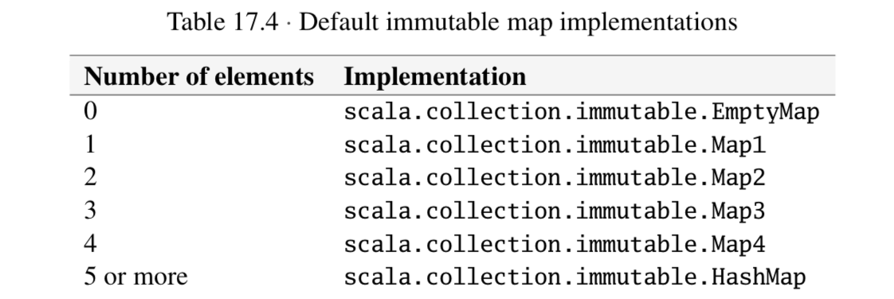

#### 4.12.6 TreeMap

返回按特定顺序排列的元素集合。

```scala
scala> import scala.collection.immutable.TreeMap
  import scala.collection.immutable.TreeMap
  scala> var tm = TreeMap(3 -> 'x', 1 -> 'x', 4 -> 'x')
  tm: scala.collection.immutable.SortedMap[Int,Char] =
    Map(1 -> x, 3 -> x, 4 -> x)
  scala> tm += (2 -> 'x')
scala> tm
  res38: scala.collection.immutable.SortedMap[Int,Char] =
    Map(1 -> x, 2 -> x, 3 -> x, 4 -> x)

```

### 3.12 元组(Tuple)（重要）

映射是K/V对偶的集合，对偶是元组的最简单形式，元组可以装着多个不同类型的值，是不同类型的值的聚集。

#### 3.12.1 创建访问元组

创建元组：使用小括号将多个元素括起来，元素之间用逗号分隔，元素的类型和个数任意，

访问组元：使用_1， _2， _3等访问组元。

第二种方式定义的元组也可以通过a,b,c去访问组元。

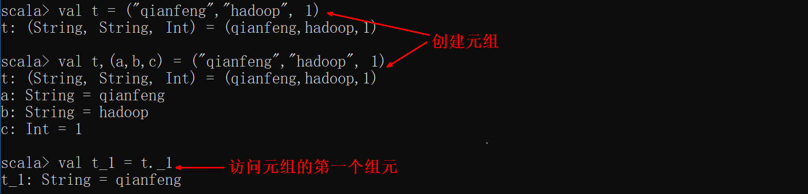

另一种定义方式:

```scala
val tuple3 = new Tuple3(1, 3.14, "Fred")
```

元组的实际类型取决于它的元素的类型，比如 (99, "runoob") 是 Tuple2[Int, String]。 ('u', 'r', "the", 1, 4, "me") 为 Tuple6[Char, Char, String, Int, Int, String]。

目前 Scala 支持的元组最大长度为 22。对于更大长度你可以使用集合，或者扩展元组。

#### 3.12.2 元组访问

```scala
//注意元组元素的访问有下划线，并且访问下标从1开始
val value1 = tuple3._3
println(value1)
// 按照索引访问元组的第一个元素，从0开始
val value2 = tuple3.productElement(0) 
println(value2)
```

#### 3.12.3 元组遍历

**方式1：**

```scala
for (elem <- tuple1.productIterator) {
  print(elem)
}
println()
```

**方式2：**

```scala
tuple1.productIterator.foreach(i => println(i))
tuple1.productIterator.foreach(print(_))
```

#### 3.12.4 拉链操作

 使用zip方法把元组的多个值绑在一起，以便后续处理

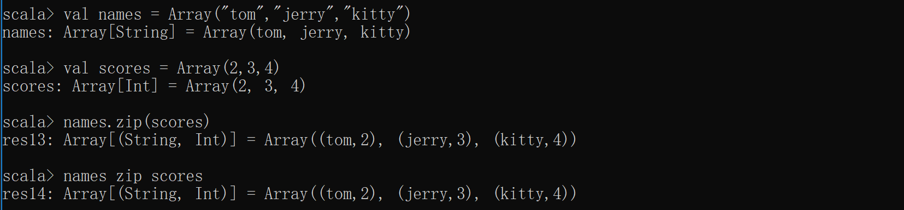 

注意：如果两个数组的元素个数不一致，拉链操作后生成的数组的长度为较小的那个数组的元素个数

#### 3.12.5 拉链扩展

**1、zip函数将传进来的两个参数中相应位置上的元素组成一个pair数组。如果其中一个参数元素比较长，那么多余的参数会被删掉。**

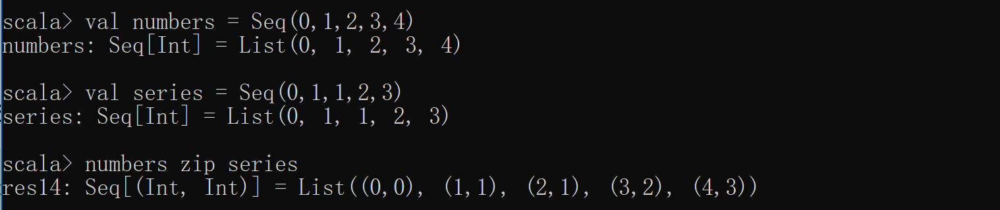

**2、zipAll 函数和上面的zip函数类似，但是如果其中一个元素个数比较少，那么将用默认的元素填充。**

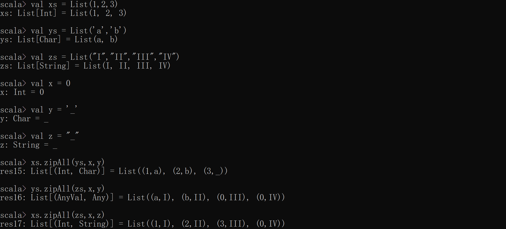

**3、zipWithIndex函数将元素和其所在的位置索引组成一个pair。**

该方法把集合中的每个元素和该元素的索引进行一个拉链操作

```scala
scala> series.zipWithIndex
res11: Seq[(Int, Int)] = List((0,0), (1,1), (2,2), (3,3), (4,4), (5,5), (8,6), (15,7))

//如果索引值想从指定的位置开始，使用zip 
scala> series.zip(Stream from 1)
res14: Seq[(Int, Int)] = List((0,1), (1,2), (2,3), (3,4), (4,5), (5,6), (8,7), (15,8))

scala> for ((value,index) <- series.zip(Stream from 1)) println(index+" "+value)
1 0
2 1
3 2
4 3
5 4
6 5
7 8
8 15

```

4**、unzip函数可以将一个元组的列表转变成一个列表的元组**

```scala
scala> val numbers = Seq(0,1,2,3,4)
numbers: Seq[Int] = List(0, 1, 2, 3, 4)

scala> val series = Seq(0,1,1,2,3)
series: Seq[Int] = List(0, 1, 1, 2, 3)

scala> numbers zip series
res16: Seq[(Int, Int)] = List((0,0), (1,1), (2,1), (3,2), (4,3))

scala> res16 unzip
warning: there were 1 feature warning(s); re-run with -feature for details
res17: (Seq[Int], Seq[Int]) = (List(0, 1, 2, 3, 4),List(0, 1, 1, 2, 3))
```

### 3.13 列表(List)（重要）

列表中的元素类型不可以不同。

列表是有序的。

#### 3.13.1 不可变列表

##### 3.13.1.1不可变列表的构造

不可变的序列 import scala.collection.immutable._ 

```scala
//空列表
//可以使用Nil构建一个空列表
val empty = Nil
//也可以使用空元素构建一个空列表
val empty : List[Nothing] = List()

scala> val fruit = List("apples", "oranges", "pears")
fruit: List[String] = List(apples, oranges, pears)
scala>   val diag3 =
     |     List(
     |       List(1, 0, 0),
     |       List(0, 1, 0),
     |       List(0, 0, 1)
     |     )
diag3: List[List[Int]] = List(List(1, 0, 0), List(0, 1, 0), List(0, 0, 1))
scala>   val empty = List()
empty: List[Nothing] = List()

//所有的列表可以看做是由两个基础构造快Nil和中缀操作符::构成，::表示从列表前段扩展。
//在Scala中列表要么为空（Nil表示空列表）要么是一个head元素加上一个tail列表。
//9 :: List(5, 2)  :: 操作符是将给定的头和尾创建一个新的列表
//注意：:: 操作符是右结合的，如9 :: 5 :: 2 :: Nil相当于 9 :: (5 :: (2 :: Nil))

scala> val fruit = "apples" :: ("oranges" :: ("pears" :: Nil))
fruit: List[String] = List(apples, oranges, pears)
scala> val diag3 = (1 :: (0 :: (0 :: Nil))) ::(0 :: (1 :: (0 :: Nil))) ::(0 :: (0 :: (1 :: Nil))) :: Nil
diag3: List[List[Int]] = List(List(1, 0, 0), List(0, 1, 0), List(0, 0, 1))
scala> val empty = Nil
empty: scala.collection.immutable.Nil.type = List()
//注意：:: 操作符是右结合的，如9 :: 5 :: 2 :: Nil相当于 9 :: (5 :: (2 :: Nil))
scala> val nums =1::(2::(3::(4::Nil)))
nums: List[Int] = List(1, 2, 3, 4)
scala> val nums = 1 :: 2 :: 3 :: 4 :: Nil
nums: List[Int] = List(1, 2, 3, 4)
//注意是否加Nil的区别
scala> val nums = 1 :: 2 :: 3 :: 4
<console>:7: error: value :: is not a member of Int
       val nums = 1 :: 2 :: 3 :: 4
                              ^

scala> val nums = 1 :: 2 :: 3 :: 4 :: list0
nums: List[Int] = List(1, 2, 3, 4, 5, 6)
//列表中的元素可以是不同类型
scala> val nums = 1 :: 2 :: 3 :: 4 :: list0 :: Nil
nums: List[Any] = List(1, 2, 3, 4, List(5, 6))
```

##### 3.13.1.2 列表的访问

```scala
scala> val nums = 1 :: 2 :: 3 :: 4 :: list0 :: Nil
nums: List[Any] = List(1, 2, 3, 4, List(5, 6))

scala> nums(1)
res22: Any = 2

scala> nums(3)
res23: Any = 4
```

##### 3.13.1.3 列表的遍历

~~~scala
/**
   * 单个集合的各种遍历方式
   */
   val lst = List(1,2,3,4,5);
   print("foreach遍历：")
   lst.foreach { x => print(x+",")}  //foreach遍历,这个是传统遍历，新手不熟无奈之下可以用它
   println("")
   
   var temp = lst.map { x => x+1 }   //遍历，与foreach的区别是返回值为List【B】
   println("map遍历："+temp.mkString(","));
   
 
   var temp1 = lst.reduceLeft((sum,i)=>sum +i) //遍历，返回值类型是一个与集合相同的Int
    println("reduce遍历返回Int："+temp1);
   
   var temp2 = lst.foldLeft(List[Int]())((x,y)=>y::x); //遍历,返回值是自定义类型
   //ps fold类函数还可以改成 ：\ ，/:的形式，代码精简了不少，但是可读性却减低了例如
    println("foldLeft遍历返回自定义类型："+temp2.mkString(","));
    
    var temp3=(   List[Int]() /: lst){(m,c)=>c::m} //遍历，实现反转
     println("foldLeft遍历实现反转："+temp2.mkString(","));

~~~


##### 3.13.1.4 列表的追加

```scala
object ImmutListDemo {

    def main(args: Array[String]) {
      //创建一个不可变的集合
      val lst1 = List(1,2,3)
      //将0插入到lst1的前面生成一个新的List ::和+：右结合
      // ::为右结合操作符
	 // 将元素追加到集合开头
      val lst2 = 0 :: lst1
      val lst3 = lst1.::(0)
      val lst4 = 0 +: lst1
      val lst5 = lst1.+:(0)
      //将一个元素添加到lst1的后面产生一个新的集合，:+左结合
      val lst6 = lst1 :+ 3
      val lst0 = List(4,5,6)
      //将2个list合并成一个新的List
      val lst7 = lst1 ++ lst0
      //将lst1插入到lst0前面生成一个新的集合
      val lst8 = lst1 ++: lst0
      //将lst0插入到lst1前面生成一个新的集合
      val lst9 = lst1.:::(lst0)
      println(lst9)
    }

}

```

##### 3.13.1.5 列表的基本操作

对列表的所有操作可以表达为一下三种

head 返回列表的第一个元素。
tail 返回除第一个元素之外所有元素组成的列表。

isEmpty 返回列表是否为空。

注意：其中tail head作用在空列表上，会报异常。

```scala
val list0 = List(1,2,3)
val list1 = List(4,5,6)
// head:返回列表第一个元素
list0.head // Int = 1
// tail:返回除了第一个元素之外的其他元素，以列表返回
list0.tail // List[Int] = List(2, 3)
// isEmpty:判断列表是否为空，为空时返回true
list0.isEmpty // Boolean = false
// concat:连接列表，返回一个新的集合
List.concat(list0,list1) // List[Int] = List(1, 2, 3, 4,
5, 6)
// fill:使用数个相同的元素创建一个列表
List.fill(10)(2) // 重复次数:10，重复元素:2
// reverse:将列表顺序反转，返回一个新的集合
list0.reverse

//求列表长度
scala> List(1,2,3).length
res11: Int = 3
```

练习：插入排序：

```scala
object insertSort {
  def isort(xs: List[Int]): List[Int] =
    if (xs.isEmpty) Nil
    else insert(xs.head, isort(xs.tail))
  def insert(x: Int, xs: List[Int]): List[Int] =
    if (xs.isEmpty || x <= xs.head) x :: xs
    else xs.head :: insert(x, xs.tail)
  def main(args: Array[String]): Unit = {
    val list1 = List(3,8,2,5,6,4,10)
    val list2 = isort(list1)
    for (i<-list2)
      println(i)
  }
}
```


##### 3.13.1.6 列表的常用方法

```scala


//与head，tail对应的last init
scala> val abcde = List('a', 'b', 'c', 'd', 'e')
abcde: List[Char] = List(a, b, c, d, e)
scala> abcde.last
res12: Char = e
scala> abcde.init
res13: List[Char] = List(a, b, c, d)

//反转列表
scala> abcde.reverse
res14: List[Char] = List(e, d, c, b, a)

//tail,init的泛化
//提取列表的前n个元素
scala>  abcde take 2
res15: List[Char] = List(a, b)
//丢弃列表的前n个元素
scala>  abcde drop 2
res16: List[Char] = List(c, d, e)
scala> abcde splitAt 2
res17: (List[Char], List[Char]) = (List(a, b),List(c, d, e))
scala> List(abcde take 2, abcde drop 2)
res18: List[List[Char]] = List(List(a, b), List(c, d, e))

//拉链操作
scala> abcde zip List(1,2,3,4,5)
res22: List[(Char, Int)] = List((a,1), (b,2), (c,3), (d,4), (e,5))
```

##### 3.13.1.7 列表的模式拆分

列表可以使用模式匹配进行拆分。

```scala
scala> val fruit = List("apples", "oranges", "pears")
fruit: List[String] = List(apples, oranges, pears)
//给出的元素个数与列表的元素个数一致，否则会报错。
scala> val List(a, b, c) = fruit
a: String = apples
b: String = oranges
c: String = pears
//在元素个数不可知的情况下,最好使用::匹配。
scala> val a :: b :: rest = fruit
a: String = apples
b: String = oranges
rest: List[String] = List(pears)

//合并操作
scala> List(1, 2) ::: List(3, 4, 5)
res8: List[Int] = List(1, 2, 3, 4, 5)
scala> List(1, 2) ::: List(3, 4, 5) ::: List(6,7,8)
res9: List[Int] = List(1, 2, 3, 4, 5, 6, 7, 8)
scala> List(1, 2) ::: (List(3, 4, 5) ::: List(6,7,8))
res10: List[Int] = List(1, 2, 3, 4, 5, 6, 7, 8)
```

##### 3.13.1.8 列表的高阶方法

可以带看源码

```scala
//映射：map, flatMap， foreach
scala> List(1,2,3).map(_+1)
res23: List[Int] = List(2, 3, 4)

scala> val words = List("the", "quick", "brown", "fox")
words: List[String] = List(the, quick, brown, fox)
scala> words.map(_.length)
res24: List[Int] = List(3, 5, 5, 3)
scala> words map (_.toList.reverse.toString)
res25: List[String] = List(List(e, h, t), List(k, c, i, u, q), List(n, w, o, r, b), List(x, o, f))
scala> words map (_.toList.reverse.mkString)
res26: List[String] = List(eht, kciuq, nworb, xof)
scala> words map (_.toList)
res27: List[List[Char]] = List(List(t, h, e), List(q, u, i, c, k), List(b, r, o, w, n), List(f, o, x))
scala> words flatMap (_.toList)
res28: List[Char] = List(t, h, e, q, u, i, c, k, b, r, o, w, n, f, o, x)
scala> var sum = 0
sum: Int = 0
scala> List(1, 2, 3, 4, 5) foreach (sum += _)

//过滤 filter, partition, find, takeWhile, dropWhile, span
scala> List(1, 2, 3, 4, 5) filter (_ % 2 == 0) 
res37: List[Int] = List(2, 4)
scala> words filter (_.length == 3)
res38: List[java.lang.String] = List(the, fox)
scala> List(1, 2, 3, 4, 5) partition (_ % 2 == 0)
res30: (List[Int], List[Int]) = (List(2, 4),List(1, 3, 5))

scala> List(1,2,3,4,5)find(_%2==0)
res31: Option[Int] = Some(2)
scala> List(1, 2, 3, 4, 5) find (_ <= 0)
res32: Option[Int] = None

scala> List(1, 2, 3, -4, 5) takeWhile (_ > 0)
res33: List[Int] = List(1, 2, 3)
scala> words dropWhile (_ startsWith "t")
res34: List[String] = List(quick, brown, fox)
scala> List(1, 2, 3, -4, 5) span (_ > 0)
res35: (List[Int], List[Int]) = (List(1, 2, 3),List(-4, 5))
//排序sortWith
scala> words.sortWith(_.length > _.length)
res40: List[String] = List(quick, brown, the, fox)
```

#### 3.13.2 可变列表

```scala
import scala.collection.mutable.ListBuffer

object MutListDemo extends App{
  //构建一个可变列表，初始有3个元素1,2,3
  val lst0 = ListBuffer[Int](1,2,3)
  //创建一个空的可变列表
  val lst1 = new ListBuffer[Int]
  //向lst1中追加元素，注意：没有生成新的集合
  lst1 += 4
  lst1.append(5)

  //将lst1中的元素最近到lst0中， 注意：没有生成新的集合
  lst0 ++= lst1

  //将lst0和lst1合并成一个新的ListBuffer 注意：生成了一个集合
  val lst2= lst0 ++ lst1

  //将元素追加到lst0的后面生成一个新的集合
  val lst3 = lst0 :+ 5
}
```

### 3.14 Set（重要）

无序，不可重复。

#### **3.14.1 创建集合**

不可变集合

```scala
import scala.collection.immutable.HashSet
val set = new HashSet[Int]()
// 可以使用加号追加元素，会产生一个新的集合，原有set不变
val set1 = set + 1
// Set集合中不会出现重复的元素
val set2 = set1 ++ Set(1,2,3)
val set3 = Set(1,2,3,4,5,6)
// Set集合中的元素是无序的
print(set3)
println(set0.getClass)
```

可变

```scala
import scala.collection.mutable

object MutSetDemo extends App{
    This object provides a set of operations needed to create Set values. The current default implementation of a Set is one of EmptySet, Set1, Set2, Set3, Set4 in class immutable.Set for sets of sizes up to 4, and a immutable.HashSet for sets of larger sizes. 
    
    val mutableSet = Set(1,2,3)
   println(mutableSet.getClass.getName) // scala.collection.mutable.HashSet
 
  //创建一个可变的HashSet
  val set1 = new mutable.HashSet[Int]()
  //向HashSet中添加元素
  set1 += 2
  //add等价于+=
  set1.add(4)
  //删除一个元素,如果删除的对象不存在，则不生效，也不会报错

  set1 -= 5
  set1.remove(2)
  println(set1)
}
```

#### **3.14.2 集合基本操作**

Scala集合有三个基本操作：

- `head` 返回集合第一个元素
- `tail` 返回一个集合，包含除了第一元素之外的其他元素
- `isEmpty` 在集合为空时返回true

对于Scala集合的任何操作都可以使用这三个基本操作来表达。实例如下:

```scala
object Test {
   def main(args: Array[String]) {
      val site = Set("1000phone", "Google", "Baidu")
      val nums: Set[Int] = Set()

      println( "第一网站是 : " + site.head )
      println( "最后一个网站是 : " + site.tail )
      println( "查看列表 site 是否为空 : " + site.isEmpty )
      println( "查看 nums 是否为空 : " + nums.isEmpty )
   }
}
```

查找集合中最大与最小元素  你可以使用 **Set.min** 方法来查找集合中的最小元素，使用 **Set.max** 方法查找集合中的最大元素。实例如下：

```scala
object Test {
   def main(args: Array[String]) {
      val num = Set(5,6,9,20,30,45)
       //set集合遍历
       for(x <- num) {
        println(x)
        }
      // 查找集合中最大与最小元素
      println( "Set(5,6,9,20,30,45) 集合中的最小元素是 : " + num.min )
      println( "Set(5,6,9,20,30,45) 集合中的最大元素是 : " + num.max )
   }
}
```

#### **3.14.3 两个set之间的常用操作**

你可以使用 **++** 运算符或 **Set.++()** 方法来连接两个集合。如果元素有重复的就会移除重复的元素。实例如下：

```scala
object Test {
   def main(args: Array[String]) {
      val site1 = Set("1000phone", "Google", "Baidu")
      val site2 = Set("Faceboook", "Taobao")

      // ++ 作为运算符使用
      var site = site1 ++ site2
      println( "site1 ++ site2 : " + site )

      //  ++ 作为方法使用
      site = site1.++(site2)
      println( "site1.++(site2) : " + site )
   }
}
```

 执行以上代码，输出结果为： 

```
$ vim Test.scala 
$ scala Test.scala 
site1 ++ site2 : Set(Faceboook, Taobao, Google, Baidu, 1000phone)
site1.++(site2) : Set(Faceboook, Taobao, Google, Baidu, 1000phon)

```

#### **3.14.4 交集**

你可以使用 **Set.&** 方法或  **Set.intersect** 方法来查看两个集合的交集元素。实例如下：

```scala
object Test {
   def main(args: Array[String]) {
      val num1 = Set(5,6,9,20,30,45)
      val num2 = Set(50,60,9,20,35,55)

      // 交集
      println( "num1.&(num2) : " + num1.&(num2) )
      println( "num1.intersect(num2) : " + num1.intersect(num2) )
   }
}
```

 执行以上代码，输出结果为： 

```scala
$ vim Test.scala 
$ scala Test.scala 
num1.&(num2) : Set(20, 9)
num1.intersect(num2) : Set(20, 9)
```

~~~
import scala.collection.immutable.HashSet
val set1 = Set(5,6,9,20,30,45)
val set2 = Set(50,60,9,20,35,55)
// contains:是否包含某一元素，包含返回true，不包含返回false
set1.contains(10)// Boolean = false
// &:交集运算
set1 & set2
set1.intersect(set2) // Set(20,9)
// &~:差集运算
set1 &~ set2
set1.diff(set2) // Set(5, 6, 45, 30)
// union:并集运算
set1.union(set2)
// scala.collection.immutable.Set[Int] = Set(5, 20, 6,
60, 9, 45, 35, 50, 55, 30)
// count:计算满足指定条件的集合元素个数
val fun = (x:Int) => x > 10
set1.count(fun) // Int = 3
// iterator:获得一个迭代器，可用于集合遍历
val it = set1.iterator
while(it.hasNext){
println(it.next())
}
// size:返回集合元素的数量
// splitAt:将集合拆分为两个容器，第一个由前n个元素组成，第二个由
剩下的元素组成
set1.splitAt(5)// 返回一个元组
// take:返回前n个元素
// takeRight:返回后n个元
// 可以使用to{type}快速转换为其他集合类型
~~~

#### 4.6 队列

队列是一个有序列表，在底层可以用数组或是链表来实现
其输入和输出要遵循先入先出的原则。即：先存入队列的数据，要先取出。后存入的要后取出。
在Scala中，由设计者直接给我们提供队列类型使用。
在Scala中，有 scala.collection.mutable.Queue 和 scala.collection.immutable.Queue ,一般来说我们在开发中通常使用可变集合中的队列
在队列中严格遵守，如队列的数据，放在队位，出队列的数据从队列的头部取出。

```scala
import scala.collection.mutable

object QueueDemo {

  def main(args: Array[String]): Unit = {

// 创建队列
val q1 = new mutable.Queue[Any]
println(q1)
 
// 增加元素 (一个元素)
q1 += 20
println(q1)
 
// 增加元素 (List内所有元素)
q1 ++= List(2,4,6)
println(q1)
 
// 增加元素 (List)
q1 += List(9,2)
println(q1)
 
// dequeue 从队列头部取出元素
val queueException = q1.dequeue()
println("queueException=" + queueException + "\tq1=" + q1)
 
// enqueue 入队列，默认是从队列的尾部加入
q1.enqueue(5,88,6,4,5,77)
println(q1)
 
// 取出队列的第一个元素
println(q1.head)
 
// 取出队列的最后一个元素
println(q1.last)
 
// 取出除了tail剩余元素(tail代表最开头的元素,可以递归)
println(q1.tail.tail.tail)
}
}
```
### 4.7 Streams（了解）

Stream类似于list，它的元素是以懒惰的方式计算的，因此，一个stream可以用于存放无穷多个元素，但是其中的元素不是一次性生产出来的，而是动态生产的，末尾元素遵循lazy规则（使用的时候计算）

Stream构建

```scala
scala> val str = 1 #:: 2 #:: 3 #:: Stream.empty
str: scala.collection.immutable.Stream[Int] = Stream(1, ?)
```

使用

```scala
scala> def fibFrom(a: Int, b: Int): Stream[Int] = a #:: fibFrom(b, 
a + b)
fibFrom: (a: Int,b: Int)Stream[Int]
scala> val fibs = fibFrom(1, 1).take(7)
fibs: scala.collection.immutable.Stream[Int] = Stream(1, ?)
scala> fibs.toList
res9: List[Int] = List(1, 1, 2, 3, 5, 8, 11)
```

### 4.8 Vectors（了解）

Vector 是一种新的集合类型，在Scala2.8提出以克服list随机存取的低效。

Vector is a new collection type in Scala 2.8 that addresses the inefficiency for random access on lists. Vectors allow accessing any element of the list in "effectively" constant time. It's a larger constant than for access to the head of a list or for reading an element of an array, but it's a constant nonetheless. As a result, algorithms using vectors do not have to be careful about accessing just the head of the sequence. They can access and modify elements at arbitrary locations, and thus they can be much more convenient to write.

构建

~~~scala
scala> val vec = scala.collection.immutable.Vector.empty
vec: scala.collection.immutable.Vector[Nothing] = Vector()
scala> val vec2 = vec :+ 1 :+ 2
vec2: scala.collection.immutable.Vector[Int] = Vector(1, 2)
scala> val vec3 = 100 +: vec2
vec3: scala.collection.immutable.Vector[Int] = Vector(100, 1, 2)
scala> vec3(0)
res1: Int = 100
~~~

vector不可变

~~~scala
scala> val vec = Vector(1, 2, 3)
vec: scala.collection.immutable.Vector[Int] = Vector(1, 2, 3)
scala> vec updated (2, 4)
res0: scala.collection.immutable.Vector[Int] = Vector(1, 2, 4)
scala> vec
res1: scala.collection.immutable.Vector[Int] = Vector(1, 2, 3)
~~~

### 4.9 stack（了解）

后进先出

~~~~scala
scala> val stack = scala.collection.immutable.Stack.empty
stack: scala.collection.immutable.Stack[Nothing] = Stack()
scala> val hasOne = stack.push(1)
hasOne: scala.collection.immutable.Stack[Int] = Stack(1)
scala> stack
stack: scala.collection.immutable.Stack[Nothing] = Stack()
scala> hasOne.top
res20: Int = 1
scala> hasOne.pop
res19: scala.collection.immutable.Stack[Int] = Stack()
~~~~

不可变栈很少使用，因为可以使用list模拟栈的功能。

### 3.15 集合的重要函数（重要）

#### 3.15.1 sum/max/min/count

 在序列中查找最大或最小值是一个极常见的需求，较常用于面试问题和算法。还记得 Java 中的代码行吗？如下：

```java
int[] arr = {11, 2, 5, 1, 6, 3, 9};   
int to = arr.length - 1;   
int max = arr[0];   
for (int i = 0; i < to; i++)   
{ if (max < arr[i+1]) max = arr[i+1]; }   
 System.out.println(max);  
```

 问题：怎么在 List 中找到最大/最小值呢？

 Scala 推荐了一个很赞的解决方案：

```scala
val numbers = Seq(11, 2, 5, 1, 6, 3, 9)   
numbers.max //11   
numbers.min //1  

```

更高级的例子，其中包含一个书的序列

```scala
case class Book(title: String, pages: Int)   
val books = Seq( Book("Future of Scala developers", 85),   
                  Book("Parallel algorithms", 240),   
                  Book("Object Oriented Programming", 130),   
                  Book("Mobile Development", 495) )   
//Book(Mobile Development,495)   
 books.maxBy(book => book.pages)   
//Book(Future of Scala developers,85)   
 books.minBy(book => book.pages)  
```

 如上所示，minBy & maxBy 方法解决了复杂数据的问题。你只需选择决定数据最大或最小的属性。

#### 3.15.2 Filter

 过滤一个数字序列，只获取奇数的元素。

```
val numbers = Seq(1,2,3,4,5,6,7,8,9,10) numbers.filter(n => n % 2 == 0)  

```

```scala
val books = Seq( Book("Future of Scala developers", 85),   
                Book("Parallel algorithms", 240),   
                 Book("Object Oriented Programming", 130),   
                 Book("Mobile Development", 495) )   
books.filter(book => book.pages >= 120)  

```

 还有一个与 filter 类似的方法是 filterNot。它的名字就体现了它的作用。如果你还是不了解它的实际用途，你可以在一个示例中，用 filterNot 替换 filter 方法。

#### 3.15.3 Flatten

 我想大多数朋友都没听说过这个功能。其实它很好理解，我们来举例说明：

```scala
val abcd = Seq('a', 'b', 'c', 'd')   
val efgj = Seq('e', 'f', 'g', 'h')   
val ijkl = Seq('i', 'j', 'k', 'l')   
val mnop = Seq('m', 'n', 'o', 'p')   
val qrst = Seq('q', 'r', 's', 't')   
val uvwx = Seq('u', 'v', 'w', 'x')   
val yz = Seq('y', 'z')   
val alphabet = Seq(abcd, efgj, ijkl, mnop, qrst, uvwx, yz)   
 //   
 // List(a, b, c, d, e, f, g, h, i, j, k, l, m, n, o, p, q, r, s, t,  
 //      u, v, w, x, y, z)   
 alphabet.flatten  

```

 当有一个集合的集合，然后你想对这些集合的所有元素进行操作时，就会用到 flatten。

#### 3.15.4 集合之间的操作

差集、交集和并集

```scala
val num1 = Seq(1, 2, 3, 4, 5, 6)   
val num2 = Seq(4, 5, 6, 7, 8, 9)   
//List(1, 2, 3)   
num1.diff(num2)   
//List(4, 5, 6)   
num1.intersect(num2)   
//List(1, 2, 3, 4, 5, 6, 4, 5, 6, 7, 8, 9)   
num1.union(num2)  
```

 上述示例中的 union 保留了重复的元素。如果我们不需要重复怎么办？这时可以使用 distinct 函数

```
//List(1, 2, 3, 4, 5, 6, 7, 8, 9)   
num1.union(num2).distinct  
```

#### 3.15.5 map

 map 是 Scala 集合最常用的一个函数。它的功能十分强大：

```scala
val numbers = Seq(1,2,3,4,5,6)   
//List(2, 4, 6, 8, 10, 12)   
numbers.map(n => n * 2)   
val chars = Seq('a', 'b', 'c', 'd')   
//List(A, B, C, D)   
chars.map(ch => ch.toUpper)  
```

 map 函数的逻辑是遍历集合中的元素并对每个元素调用函数。你也可以不调用任何函数，保持返回元素本身，但这样 map 无法发挥作用，因为你在映射过后得到的是同样的集合。

#### 3.15.6 flatMap

flatMap 是由下列这两个函数组成的：

 map & flatten

 现在，假设我们想知道字母表中的大写字母和小写字母的排列情况：

```scala
val abcd = Seq('a', 'b', 'c', 'd')   
//List(A, a, B, b, C, c, D, d)   
abcd.flatMap(ch => List(ch.toUpper, ch))
```

#### 3.15.7 forall

对整个集合进行条件检查

 有一个场景大家都知道，即确保集合中所有元素都要符合某些要求，如果有哪怕一个元素不符合条件，就需要进行一些处理：

```scala
1. val numbers = Seq(3, 7, 2, 9, 6, 5, 1, 4, 2)   
2. //ture numbers.forall(n => n < 10)   
3. //false numbers.forall(n => n > 5) 
```

 而 forall 函数就是为处理这类需求而创建的。

foreach /take

```scala
scala> val list = List(1,9,5,6,7).foreach(println)
1
9
5
6
7
list: Unit = ()

scala> val list = List(1,9,5,6,7)
list: List[Int] = List(1, 9, 5, 6, 7)

scala> for (i<-list) println(i)
1
9
5
6
7
```

#### 3.15.8 partition

对集合进行分组

根据函数将集合进行分组，函数返回值为布尔，分组后返回一个元组。

 你是否尝试过将一个集合按一定的规则拆分成两个新的集合？比如，我们把某个集合拆分成偶数集和奇数集，partition 函数可以帮我们做到这一点：

```scala
 val numbers = Seq(3, 7, 2, 9, 6, 5, 1, 4, 2)   
 //(List(2, 6, 4, 2), List(3, 7, 9, 5, 1))   
 numbers.partition(n => n % 2 == 0)  

```

#### 3.15.9 Fold

 另一个流行的操作是 fold。 在 Scala 的上下文中，通常可以考虑 foldLeft 和 foldRight。他们是从不同的方面做同样的工作： 

```scala
 val numbers = Seq(1, 2, 3, 4, 5)   
//15 numbers.foldLeft(0)((res, n) => res + n)  
```

 在第一对括号中，我们放一个起始值。 在第二对括号中，我们定义需要对数字序列的每个元素执行的操作。 第一步，n = 0，然后它根据序列元素变化。
 另一个关于 foldLeft 的例子，计算字符数：

```scala
val words = Seq("apple", "dog", "table")   
//13 words.foldLeft(0)((resultLength, word) => resultLength + word.length)  
```

Problem

​    你想要遍历有序集合的所有元素，并且随着你对集合元素的遍历，对比两个相邻的元素

**Solution**

使用reduceLeft, foldLeft,  reduceRight,  foldRight来遍历集合的元素，你的方法作用在相邻的两个元素上，从第一次要遍历的两个相邻元素开始，把你的方法作用在这两个元素上得到返回值，然后把你的方法继续作用在返回值和集合中第三要遍历的元素得到的返回值，再继续和第四个要遍历的元素作用。。。直到遍历完最后一个元素为止：

```scala
scala> val a = Array(12, 6, 15, 2, 20, 9)
a: Array[Int] = Array(12, 6, 15, 2, 20, 9)

scala> a.reduceLeft(_ + _)
res32: Int = 64
```

​    这个例子是这样的：12+6=18, 18+15=33, 33+2=35, 35+20=55, 55+9=64，就是对集合的所有元素求和

​    接下来你会看到如何使用reduceLeft来计算集合元素的乘积和求最大最小值：

```scala
scala> a.reduceLeft(_ * _)
res33: Int = 388800

scala> a.reduceLeft(_ min _)
res34: Int = 2

scala> a.reduceLeft(_ max _)
res35: Int = 20
```

**foldLeft, reduceRight, and foldRight**

​    方法foldLeft与reduceLeft工作方法很想，但是它让你指定一个值作为第一个元素。下面这个例子真是了求和算法，第一个是reduceLeft方法，后面是foldLeft方法，我们来看看它们的区别：

```scala
scala> val a = Array(1, 2, 3)
a: Array[Int] = Array(1, 2, 3)

scala> a.reduceLeft(_+_)
res6: Int = 6

scala> a.foldLeft(100)(_+_)
res7: Int = 106

scala> a.foldLeft(200)(_+_)
res8: Int = 206
```

#### 3.15.10 线程安全的集合(选讲)

所有线程安全的集合都是以Synchronized开头的集合，例如：

```
SynchronizedBuffer
SynchronizedMap
SynchronizedPriorityQueue
SynchronizedQueue
SynchronizedSet
SynchronizedStack

```

#### 3.15.11  并行集合

Scala为了充分使用多核CPU，提供了并行集合（有别于前面的串行集合），用于多核环境的并行计算。

主要用到的算法有： 

Divide and conquer : 分治算法，Scala通过splitters，combiners等抽象层来实现，主要原理是将计算工作分解很多任务，分发给一些处理器去完成，并将它们处理结果合并返回

Work stealin：算法，主要用于任务调度负载均衡（load-balancing），通俗点完成自己的所有任务之后，发现其他人还有活没干完，主动（或被安排）帮他人一起干，这样达到尽早干完的目的。

**1)  打印1~5**

```scala
(1 to 5).foreach(println(_))
println()
(1 to 5).par.foreach(println(_))
```

**2)**  **查看并行集合中元素访问的线程**

```scala
val result1 = (0 to 10000).map{case _ => Thread.currentThread.getName}.distinct
val result2 = (0 to 10000).par.map{case _ => Thread.currentThread.getName}.distinct
println(result1)
println(result2)
```

#### 3.15.12 集合的练习

```scala
object FunctionTest1 {
  def main(args: Array[String]): Unit = {
    //创建一个List
    val list1 = List(3,2,4,6,7,5,1,0,9,8)

    //将list1中每个元素乘以2后生成一个新的集合
//    val list2 = list1.map((a: Int) => a * 2)
//    val list2 = list1.map(a => a * 2)
    val list2 = list1.map(_ * 2)

    //将list1中的偶数取出来生成一个新的集合
//    val list3 = list1.map(x => {if (x % 2 == 0) x})
    val list3 = list1.filter(_ % 2 == 0)

    //将list1排序后生成一个新的集合
//  val list4 = list1.sorted.reverse
//    val list4 = list1.sortWith((x, y) => x > y)
//    val list4 = list1.sortWith(_>_)

    //反转排序顺序
    val list4 = list1.sorted.reverse

    //将list1中的元素4个一组,类型为Iterator[List[Int]]
    val it = list1.grouped(4)

    //将Iterator转换成List
    val list5 = it.toList

    //将多个list压扁成一个List
    val list6 = list5.flatten

    val lines = List("hello tom hello jerry", "hello suke hello", " hello tom")
    //先按空格切分，再压平
//    val words = lines.map(_.split(" "))
//    val flatWords = words.flatten
    val flatWords = lines.flatMap(_.split(" "))

    println(flatWords)
      
        //并行计算求和
    val arr = Array(1, 2, 3, 4, 5, 6, 7, 8, 9, 10)

    // 单线程聚合
    //    val res = arr.sum
    //    val res = arr.reduce((x,y) => x + y)
    //    val res = arr.reduce(_+_)

    // 并行聚合
    //    val res = arr.par.reduce(_+_) // ((1+2)+3)+4 ...  ((6+7)+8)+9 ...
    //    val res = arr.par.reduce(_-_)

    //按照特定的顺序
    // 按照特定的顺序进行累加，此时par方法是无效，也就是单线程执行的
    //    val res = arr.par.reduceLeft(_-_) // ((1-2)-3)-4 ...
    //    val res = arr.reduceRight(_-_) // 1-(2-(3-(4-5)))


    //折叠：有初始值（无特定顺序）
    //    val res = arr.fold(10)(_+_)
    //    val res = arr.par.fold(10)(_+_)

    //折叠：有初始值（有特定顺序）
    // foldLeft和reduceLeft方法一样，都属于单线程执行
    //    val res = arr.foldLeft(10)(_+_)
    //    val res = arr.par.foldLeft(10)(_+_)
    //    val res = arr.par.foldRight(10)(_+_)

    //聚合
    val arr1 = List(List(1, 2, 3), List(3, 4, 5), List(2), List(0))
    //    val res = arr1.flatten.reduce(_+_)
    //    val res = arr1.aggregate(10)((x,y) => x + y.sum, (a,b) => a + b)
    //    val res = arr1.aggregate(10)(_+_.reduce(_+_), _+_)
//    val res = arr1.par.aggregate(0)(_ + _.reduce(_ + _), _ + _)


    // 需求：统计一个聚合结果，结果为一个元组，元组里有两个结果值
    // 第一个值是arr数组里所有元素的总和，第二个值是在聚合过程中有多少个数参与计算
    // 结果是： (55, 10)
//    val res = arr.aggregate((0, 0))(
//      (acc, num) => (acc._1 + num, acc._2 + 1),
//      (par1, par2) => (par1._1 + par2._1, par1._2 + par2._2))


    val l1 = List(5, 6, 4, 7)
    val l2 = List(1, 2, 3, 4)

    //求并集
//    val res = l1 union l2
//    val res = l1 ++ l2

    //求交集
//    val res = l1 intersect l2

    //求差集
    val res = l2 diff l1

    println(res)

  }
}

   
```

### 3.15.12 wordcount（重要）

```scala
package com.qf.gp1705.day02

object ScalaWordCount {
  def main(args: Array[String]): Unit = {
    val lines = List("hello tom hello jerry", "hello suke hello", " hello tom")

    // 把数据进行切分，生成一个个单词，并把多个Array压平到一起
    val words: List[String] = lines.flatMap(_.split(" "))

    // 把数据中的多余的空格过滤掉
    val filterdWords: List[String] = words.filter(_ != "")

    // 把一个个单词生成元组：(word, 1)
    val tuples: List[(String, Int)] = filterdWords.map((_, 1))

    // 以key进行分组
    val grouped: Map[String, List[(String, Int)]] = tuples.groupBy(_._1)

    // 聚合相同key的value,只需要统计单词对应的List的长度就可以得到单词出现的个数
//    val sumed: Map[String, Int] = grouped.map(x => (x._1, x._2.size))
    val sumed: Map[String, Int] = grouped.mapValues(_.size)

    // 降序排序
//    val sorted: List[(String, Int)] = sumed.toList.sortBy(_._2).reverse
//    val sorted = sumed.toList.sortWith((x, y) => x._2 > y._2)
    val sorted = sumed.toList.sortWith(_._2 > _._2)

    println(sorted)
  }
}
```

### Java和Scala集合的互操作(待添加)

## 类、对象、继承、特质

### 3.16 类

#### 3.16.1 面向对象的概念

如何理解抽象

定义一个类，实际上就是把一类事物的共有的属性和行为提取出来，形成一个物理模型(模板)。这种研究问题的方法称为抽象。

面向对象编程有三大特征：封装、继承和多态。

封装(encapsulation)就是把抽象出的数据和对数据的操作封装在一起,数据被保护在内部,程序的其它部分只有通过被授权的操作(成员方法),才能对数据进行操作。

封装的理解和好处

- 隐藏实现细节
	 可以对数据进行验证，保证安全合理	

如何体现封装

- 对类中的属性进行封装
- 通过成员方法，包实现封装

封装的实现步骤 将属性进行私有化提供一个公共的set方法，用于对属性判断并赋值

def  setXxx(参数名 : 类型) : Unit = {	//加入数据验证的业务逻辑	属性 = 参数名   }

提供一个公共的get方法，用于获取属性的值def getXxx() [: 返回类型] = {	return 属性        }

#### 3.16.2 Java类的定义

类和对象的区别和联系：

类是抽象的，概念的，代表一类事物,比如人类,猫类，

对象是具体的，实际的，代表一个具体事物类是对象的模板，

对象是类的一个个体，对应一个实例。

类的定义：

（1）回顾一下Java中类和对象的概念

（2）回顾一下Java中类如何定义，定义类，属性，get，set方法，构造器，其他行为等。

（3）定义Java类需要考虑的问题：修饰符public protected default private

修饰类使用 public 或者default

为什么类只需要public或者default修饰？

因为外部类的上一单元是包，所以外部类只有两个作用域：同包，任何位置。因此，只需要两种控制权限：包控制权限和公开访问权限，也就对应两种控制修饰符：public和默认(default)。

什么时候会使用private 或者protected修饰类？

| 修饰符      | 当前类 | 同一个包内 | 子孙类 | 其他包 |
| ----------- | ------ | ---------- | ------ | ------ |
| `public`    | Y      | Y          | Y      | Y      |
| `protected` | Y      | Y          | Y      | N      |
| （default） | Y      | Y          | N      | N      |
| `private`   | Y      | N          | N      | N      |

（4）Java中定义类：

定义类

定义类的属性

定义属性的get和set方法

定义构造方法

定义其他方法

考虑属性、方法和类的修饰符

定义完scala，需要思考的问题：

#### 3.16.3 定义类的属性

```scala
/*
//在Scala中，类并不用声明为public。
//Scala源文件中可以包含多个类，所有这些类都具有公有可见性。
在scala中，类并不用声明为public
如果没有定义构造器，类会有一个默认的无参构造器
var修饰的变量，对外提供getter setter方法
val修饰的变脸，提供getter方法，没有setter方法
 */
class Student {
  //用var修饰的变量，默认同时有公开的getter方法和setter方法
  //Scala中声明一个属性,必须显示的初始化，然后根据初始化数据的类型自动推断，属性类型可以省略
  //_表示一个占位符，编译器会根据你变量的具体类型赋予相应的初始值
  //使用占位符，变量类型必须指定
  //类型	_ 对应的值
  //Byte Short Int Long默认值	0
  //Float Double	默认值	0.0
  //String 和 引用类型	默认值	null
  //Boolean 	默认值	false
  var name = "tom"
  var nickName:String = _
   //如果赋值为null,则一定要加类型，因为不加类型, 那么该属性的类型就是Null类型.
  var address = null
   //改为：
  var address：String = null

   //用val修饰的变量是只读属性的，只带getter方法但没有setter方法
  //（相当与Java中用final修饰的变量）
  //val修饰的变量不能使用占位符
  val age = 10

  //类私有字段,有私有的getter方法和setter方法，只能在类的内部使用
   //其伴生对象也可以访问
  private var hobby: String = "旅游"

  //对象私有字段,访问权限更加严格的，Person类的方法只能访问到当前对象的字段
  private[this] val cardInfo = "123456"

}
}

```

不同对象的属性是独立，互不影响，一个对象对属性的更改，不影响另外一个。

#### 3.16.4 自定义属性的get和set方法

```scala
//重要提示：自己手动创建变量的getter和setter方法需要遵循以下原则：
//0) 将成员变量定义为私有
//1) 字段属性名以“_”作为前缀，如定义：_x
//2)  getter方法定义为：def x = _x
//3) setter方法定义时，方法名为属性名去掉前缀，并加上后缀，后缀是：“x_=”，如例子所示
class Point {
  private var _x = 0
  private var _y = 0
  private val bound = 100

  def x = _x
  def x_= (newValue: Int): Unit = {
    if (newValue < bound) _x = newValue else printWarning
  }

  def y = _y
  def y_= (newValue: Int): Unit = {
    if (newValue < bound) _y = newValue else printWarning
  }
  private def printWarning = println("WARNING: Out of bounds")
}


object Point{
  def main(args: Array[String]): Unit = {
    val point1 = new Point
    point1.x = 99
    point1.y = 101 // prints the warning
  }
}

```

#### 3.16.5 Bean属性

JavaBean规范把Java属性定义为一堆getFoo和setFoo方法。类似于Java，当你将Scala字段标注为 @BeanProperty时，getter和setter方法会自动生成。

```scala
import scala.beans.BeanProperty
object exam1 {
  def main(args: Array[String]): Unit = {
    val per: Person = new Person
    per.name = "zhagnsan"
    per.setName("lisi")    //BeanProperty生成的setName方法
    println(per.getName)   //BeanProperty生成的getName方法
  }
}

class Person {
  @BeanProperty var name:String = _
}

```

上述类Person中由@BeanProperty生成了四个方法：

```xml
1. name: String
2. name_= (newValue: String): Unit
3. getName(): String
4. setName (newValue: String): Unit
```

#### 3.16.6 定义类的构造方法

Scala构造器作用是完成对新对象的初始化，构造器没有返回值。

scala中构造分为主构造器和辅助构造器

Scala类的构造器包括： 主构造器 和 辅助构造器Scala构造器的基本语法

```scala
class 类名(形参列表) {  // 主构造器   

// 类体   

def  this(形参列表) {  // 辅助构造器   }   

def  this(形参列表) {  //辅助构造器可以有多个...   }} 

//辅助构造器 函数的名称this, 可以有多个，编译器通过不同参数来区分.

```

**1)  主构造的参数直接放置于类名之后**

```scala
定义类：
//private var name: String
//私有字段，私有的getter和setter方法
//var name: String
//私有字段，公有的getter和setter方法
//private val name: String
//私有字段，私有的getter方法
//val name: String
//私有字段，公有的getter方法

class ClassConstructor (var name: String, private var price: Double){
  def myPrintln = println(name + "," + price)
}
执行：
val classConstructor = new ClassConstructor("《傲慢与偏见》", 20.5)
classConstructor.myPrintln
```

**2)**  **主构造器会执行类定义中的所有语句**

```scala
定义类：
class ClassConstructor2(val name: String = "", val price: Double = 0) {
  println(name + "," + price)
}
执行：
val classConstructor2 = new ClassConstructor2("aa", 20)
val classConstructor2_2 = new ClassConstructor2()
```

**3)**  **如果不带val和var的参数至少被一个方法使用，该参数将自动升级为字段，这时，name和price就变成了类的不可变字段，而且这两个字段是对象私有的，这类似于** **private[this] val** **字段的效果。*

**否则，该参数将不被保存为字段，即实例化该对象时传入的参数值，不会被保留在实例化后的对象之中。**

```scala
class ClassConstructor (name: String,  price: Double){
  def myPrintln = println(name + "," + price)
}
object test {
  def main(args: Array[String]): Unit = {
    val classConstructor = new ClassConstructor("《傲慢与偏见》", 20.5)
   // classConstructor.myPrintln
  }
}
```

| 主构造器参数                       | 生成的字段/方法                                     |
| ---------------------------------- | --------------------------------------------------- |
| name: String                       | 对象私有字段。如果没有方法使用name, 则没有该字段    |
| private val/var name: String       | 私有字段，私有的getter和setter方法                  |
| var name: String                   | 私有字段，公有的getter和setter方法                  |
| @BeanProperty val/var name: String | 私有字段，公有的Scala版和Java版的getter和setter方法 |

**4)**  **可以通过private设置私有的主构造器**

```scala
//私有主构造器无法调用，需要定义辅助构造器创建相应的对象
class ClassConstructor private (var name: String, private var price: Double){
  def myPrintln = println(name + "," + price)
}

object TestClassConstructor{
  def main(args: Array[String]): Unit = {
    val classConstructor = new ClassConstructor("《傲慢与偏见》", 20.5)
    classConstructor.myPrintln
  }
}
```

**5)**  **辅助构造器名称为this，通过不同参数进行区分，每一个辅助构造器都必须以主构造器或者已经定义的辅助构造器的调用开始，即需要放在辅助构造器的第一行**

```scala
class Person {
  private var name = ""
  private var age = 0
  //辅助构造器的声明不能和主构造器的声明一致,会发生错误(即构造器名重复)
  def this(name: String) {
    this()
    this.name = name
  }
  def this(name: String, age: Int) {
    this(name)
    this.age = age
  }

  def description = name + " is " + age + " years old"
}
```

#### 3.16.7 创建对象和访问属性

创建对象的语法：

val | var 对象名 [：类型]  = new 类型()

如果我们不希望改变对象的引用(即：内存地址), 应该声明为val 性质的，否则声明为var, scala设计者推荐使用val ,因为一般来说，在程序中，我们只是改变对象属性的值，而不是改变对象的引用。

访问属性的语法：

对象名.属性名; 

```scala
object Test1{
  val name:String = "zhangsan"
  def main(args: Array[String]): Unit = {
    //调用空参构造器，可以加（）也可以不加
    val student = new Student()
    student.name = "lisi"
    //变量中使用val修饰的变量不能更改
    //student.age = 50
    println(student.name)
    println(student.age)
    println(Test1.name)
  }
```

### 3.17 特质

特质 (Traits) 用于在类 (Class)之间共享程序接口 (Interface)和字段 (Fields)。 它们类似于Java 8的接口。 类和对象 (Objects)可以扩展特质，但是特质不能被实例化，因此特质没有参数。

特质的定义除了使用关键字trait之外，与类定义无异。

在triat中可以定义抽象方法，就与抽象类中的抽象方法一样，只要不给出方法的具体实现即可。

类可以使用extends关键字继承trait，注意，这里不是implement，而是extends，在scala中没有implement的概念，无论继承类还是trait，统一都是extends。

```scala
没有父类
class 类名 extends 特质1 with 特质2 with 特质3

有父类
class 类名 extends 父类 with 特质1 with 特质2 with 特质3
```


类继承trait后，必须实现其中的抽象方法，实现时不需要使用override关键字。

scala不支持对类进行多继承，但是支持多重继承trait，使用with关键字即可。

```scala
trait Flyable{
  // 声明一个有值的字段
  /*
  Scala中的Triat可以定义具体变量，此时继承trait的类就自动获得了trait中定义的变量
 但是这种获取变量的方式与继承class是不同的：如果是继承class获取的变量，实际是定义在父类中的，相当于我们得子类获得到的是父类的引用地址；而继承trait获取的变量，就直接被添加到了类中
  */
  val distance: Int = 1000
  // 声明一个没有值的字段
  //定义抽象字段的时候，那么如果我们继承了这个接口，那么必须要重写实现这个字段，并且给予赋值；
  val hight: Int
  // 声明一个有方法体的方法
  def fly: String = {
    "I can fly"
  }
  // 声明一个没有方法体的方法
  def fight: String
}
```


特质用来在类之间进行接口或者属性的共享。类和对象都可以继承特质，特质不能被实例化，因此也没有参数。

一旦特质被定义了，**就可以使用extends或者with在类中混入特质**。


#### 3.17.1 作为接口使用的特质

特质的定义：

```scala
trait Logger{
    //这是一个抽象方法，特质中未被实现的方法默认是抽象的，不需要abstract关键字修饰
     def log(msg:String)
}
```

子类对特质的实现：

```scala
class ConsoleLogger extends Logger{
    //重写抽象方法，不需要override
    def log(msg:String){println(msg)}
}
```

#### 3.17.2 带有具体实现的特质

```scala
trait ConsoleLogger {
  def log(msg: String) {
    println(msg)
  }
}
```

特质的使用

```scala
class Account {
  protected var balance = 0.0
}

class SavingsAccount extends Account with ConsoleLogger {
  def withdraw(amount: Double) {
    if (amount > balance) log("余额不足")
    else balance -= amount
  }
}

object Test{
  def main(args: Array[String]): Unit = {
    val obj = new SavingsAccount()
    obj.withdraw(100)
  }
}
```

#### 3.17.3 多个叠加的特质(可忽略)

可以为类或者对象添加多个互相调用的特质，特质的执行顺序，取决于特质被添加的顺序

```scala
trait Logged{
  def log(msg:String)
}
trait ConsoleLogger extends Logged{
  //重写抽象方法，不需要override
  def log(msg: String) ={println(msg)}
}
//给log加上时间戳
trait TimestampLogger extends ConsoleLogger {
  override def log(msg: String) {
    super.log(s"${java.time.Instant.now()} $msg")
  }
}
//截断过于冗长的日志信息
trait ShortLogger extends ConsoleLogger{
    val maxLength = 15
    override def log(msg: String) {
      super.log(
        if(msg.length <=maxLength)msg
        else
          s"${msg.substring(0,maxLength-3)}...")
    }
  }
//定义超类
class Account {
  protected var balance:Double = 0
}
class SavingAccount extends Account with ConsoleLogger{
  def withdraw(amount:Double){
    if(amount >balance) log("Insufficent funds")
    else balance = balance - amount
  }
}

object test{
  def main(args: Array[String]): Unit = {
    val acct1 = new SavingAccount with ConsoleLogger with TimestampLogger with ShortLogger
    val acct2 = new SavingAccount with ConsoleLogger with ShortLogger with TimestampLogger
    acct1.withdraw(100.0)
    acct2.withdraw(100.0)

  }
}

//res:
//ShortLogger的log方法先被执行，然后它的super.log调用的是TimestampLogger 的log方法，最后调用ConsoleLogger 的方法将信息打印出来
2018-06-15T16:50:28.448Z Insufficent ...
//先是TimestampLogger 的log方法被执行，然后它的super.log调用的是ShortLogger的log方法，最后调用ConsoleLogger 的方法将信息打印出来
2018-06-15T1...
```

特质构造顺序

1. 调用超类的构造器
2. 特质构造器在超类之后，类构造器之前执行
3. 如果混入多个特质，按先后顺序构造
4. 每个特质中，父特质中先被构造
5. 如果多个特质共有一个父特质，父特质不会被重复构造
6. 所有特质构造完毕后，该类被构造

#### 3.17.4 Trait继承class

```scala
//在Scala中，trait也可以继承自class，此时这个class就会成为所有继承该trait的类的父类
class MyUitl{
  def printMsg(msg:String) =println(msg)
}
trait MyTrait extends MyUitl{
  def log(msg:String) = printMsg("log : "+msg)
}
class Demos(val name:String) extends MyTrait{
  def sayHello: Unit ={
    log(name+" 000")
    printMsg(name+" 111")
  }
}
object testz{
  def main(args: Array[String]): Unit = {
    val a = new Demos("A")
    a.sayHello
  }
}
```

### 3.18 抽象类

抽象类抽象类基本语法

```scala
//在Scala中，通过abstract关键字标记不能被实例化的类。方法不用标记abstract，只要省掉方法体即可。抽象类可以拥有抽象字段，抽象字段/属性就是没有初始值的字段
abstract class Person() { // 抽象类 
  var name: String // 抽象字段, 没有初始化
  def printName // 抽象方法, 没有方法体
}
//抽象类的价值更多是在于设计，是设计者设计好后，让子类继承并实现抽象类(即：实现抽象类的抽象方法)
```

#### 3.18.1抽象类的定义和使用

定义一个抽象类：

```scala
/**
  * 抽象类
  */
abstract class Animal{
  // 声明一个有值的字段
  val age  = 3
  // 声明一个没有值的字段
  val name: String
  // 声明一个有方法体的方法
  def climb: String = {
    "I can climb"
  }
  // 声明一个没有方法体的方法
  def run: String
}
```

如果某个类至少存在一个抽象方法或一个抽象字段，则该类必须声明为abstract。

```scala
abstract class Person{
//没有初始值，抽象字段
var name:String
//没有方法体，是抽象方法
def id: Int

}

class Employ extends Person{
var name:String="Fred"
//实现，不需要overide关键字
def id = name.hashCode
}
```

**注意**

- 抽象类不能被实例
- 抽象类不一定要包含abstract方法。也就是说,抽象类可以没有abstract方法
- 一旦类包含了抽象方法或者抽象属性,则这个类必须声明为abstract抽象方法不能有主体，不允许使用abstract修饰。
- 如果一个类继承了抽象类，则它必须实现抽象类的所有抽象方法和抽象属性，除非它自己也声明为abstract类。抽象方法和抽象属性不能使用private、final 来修饰，因为这些关键字都是和重写/实现相违背的。
- 抽象类中可以有实现的方法.
- 子类重写抽象方法不需要override，写上也不会错.

### 内部类(选讲)

内部类的使用规则与Java稍有不同，不允许外部类访问内部类的私有成员

~~~scala
class Outer {
// outer相当于外部类Outer的别称
outer => class Inner{
// 私有的方法不能被外部类访问
private def innerFun1(): Unit ={
// 使用别称.成员的方式访问外部类的成员
outer.outerFun()
println("Inner - private - fun1")
}
def innerFun2(): Unit ={
// 使用this关键字访问当前类的成员
this.innerFun1()
println("Inner - public - fun2")
}
class InnerIn{
def fun(): Unit ={
// 使用类名.this.成员的方式访问外部类的成员
Inner.this.innerFun1()
println("InnerIn - public - fun")
}
}
}
def outerFun(): Unit ={
// 可以直接访问同级的内部类
val inner = new Inner
inner.innerFun2()
// 使用内部类实例来访问该内部类下的成员
val innerIn = new inner.InnerIn
innerIn.fun()
}
}
~~~

### 匿名子类(选讲)

可以通过包含带有定义或重写的代码块的方式创建一个匿名的子类

```scala
abstract class Monster{
  var name : String
  def skill()
  }
var monster = new Monster {
      override var name: String = "迪迦"
      override def skill(): Unit = {
        println("哉佩利敖光线")
      }
    }

```

### 3.19 对象

#### 3.19.1 单例对象

在Scala中没有静态方法和静态字段，但是可以使用object这个语法结构来达到同样的目的

1.scala类似于Java中的工具类，可以用来存放工具函数和常量

2.高效共享单个不可变的实例

3.单例模式

单例对象虽然类似于Java中的工具类，但它不是，还是一个对象，可以把单例对象名看做一个贴在对象上的标签。

单例对象的使用

```scala
object Logger {
  def info(message: String): Unit = println(s"INFO: $message")
}
class Test {

  //调用单例对象中定义的方法
  Logger.info("Created projects")  // Prints "INFO: Created projects"
  val logObject = Logger
  logObject.info("Created projects")
}
```

```scala
import scala.collection.mutable.ArrayBuffer

object SingletonDemo {
  def main(args: Array[String]): Unit = {

    val s = SessionFactory
    println(s.getSession)
    println(s.getSession.size)
    println(s.removeSession)
    println(s.getSession.size)

  }
}

object SessionFactory {
  println("SessionFactory被执行")

  var i = 5 // 计数器

  // 存放Session对象的数组
  val sessions = new ArrayBuffer[Session]()

  // 向sessions里添加Session对象，最多添加5个Session对象
  while (i > 0){
    println("while被执行")
    sessions.append(new Session)
    i -= 1
  }

  // 获取Session对象
  def getSession = sessions

  // 删除Session对象
  def removeSession {
    val session = sessions(0)
    sessions.remove(0)
    println("session对象被移除" + session)
  }

}

class Session{}

```

类和单例对象的区别是，单例对象不能带参数，单例对象不能用new关键字实例化，所以没有机会传递给它实例化的参数。

单例对象在第一次访问的时候才会初始化。

当单例对象与某个类同名时，它被称为类的伴生对象，类和伴生对象必须定义在一个源文件里，类称为该单例对象的伴生类，类和他的伴生对象可以互相访问其私有成员。

不与伴生类共享名称的单例对象被称为独立对象，可以作为相关功能的工具类，或者scala应用程序的入口点。

#### 3.19.2 伴生对象

在Scala的类中，与类名相同并且用object修饰的对象叫做伴生对象，类和伴生对象之间可以相互访问私有的方法和属性，他们必须存在同一个源文件中

```scala
class AccountInfo {
//类的伴生对象的功能特性并不在类的作用域
//所以不能直接用newUniqueNumber()调用伴生对象的方法
var id = AccountInfo.newUniqueNumber()
}

object  AccountInfo {
  private var lastNumber = 0
  private def newUniqueNumber() = {
    lastNumber += 1; lastNumber
  }

  def main(args: Array[String]) {
  //相当于Java中的静态方法调用
    println(AccountInfo.newUniqueNumber())
  }

}
```

```scala
class CompanionObject {
  var id = 0 // 字段

  private val name = "xiaofang" // 私有字段

  private [this] var age  = 18 // 对象私有字段

  def getAge = age

  def getAdress = CompanionObject.adress
}
object CompanionObject {
  private val adress = "beiqijia"

  def main(args: Array[String]): Unit = {

    val co = new CompanionObject

    co.id = 1
    println(co.id)
    println(co.name)
    println(co.getAge)
    println(co.getAdress)

  }
}

```

#### 3.19.3 应用程序对象

可以看源码，原理是什么？为什么可以不用写main方法？

Scala程序都必须从一个对象的main方法开始，可以通过扩展App特质，不写main方法。

```scala
object Hello extends  App{
  println("Hello World")
}

```

同

```scala
object Hello {
  def main(args: Array[String]): Unit = {
    println("Hello World")
  }

}
```


#### 3.19.4 apply方法

通常我们会在类的伴生对象中定义apply方法，当遇到类名(参数1,...参数n)时apply方法会被调用

```scala
class AccountInfo {

}

object  AccountInfo {
  private var lastNumber = 0
  private def apply(arg :Int) = {
    lastNumber = arg*2 + 1; lastNumber
  }

  def main(args: Array[String]) {
    println(AccountInfo(1))
  }

}
```

#### 3.19.5 apply方法用来做工厂

apply方法的最佳实践方式之一就是用来做工厂。比如在Scala的标准库中，许多集合类给我们提供了apply方法来创建集合：

通过apply和通过new关键字创建对象，区别在哪？优势在哪？

```scala
object Client {

    def main(args: Array[String]): Unit = {
        val arr = new Array[Int](3)
        arr(0) = 0
        arr(1) = 1
        arr(2) = 2
        arr.foreach(x => print(x + " "))
        println()

        val array = Array(1,2,3)
        array.foreach(x => print(x + " "))
    }
}1234567891011121314
```

上面两种方式我们都可以用来创建Array。第一种方式是使用new关键字，这是传统的面向对象的方式。那么第二种方式是什么情况呢？如果我们在IDE里点进去，可以发现IDE会提示我们有一个apply方法。点进去看apply方法的源码：

```scala
  /** Creates an array of `Int` objects */
  // Subject to a compiler optimization in Cleanup, see above.
  def apply(x: Int, xs: Int*): Array[Int] = {
    val array = new Array[Int](xs.length + 1)
    array(0) = x
    var i = 1
    for (x <- xs.iterator) { array(i) = x; i += 1 }
    array
  }
```

#### 3.19.6 提取器

除了用unapply方法，还有没有方法可以实现提取功能？

带有unapply方法的对象，经常用在模式匹配或者偏函数中。

```scala
import scala.util.Random

object CustomerID {

  def apply(name: String) = s"$name--${Random.nextLong}"

  def unapply(customerID: String): Option[String] = {
    val name = customerID.split("--").head
    if (name.nonEmpty) Some(name) else None
  }
}
//调用apply方法创建一个对象，等价于CustomerID.apply("Sukyoung")
val customer1ID = CustomerID("Sukyoung")  // Sukyoung--23098234908
customer1ID match {
    //调用unapply方法，提取name信息
  case CustomerID(name) => println(name)  // prints Sukyoung
  case _ => println("Could not extract a CustomerID")
}
```

```scala
/**
  * apply方法通常被称为注入方法，在类的伴生对象中做一些初始化的操作
  * apply方法的参数列表不需要和主类的构造器参数类别统一
  * unapply方法通常被称为提取方法，使用unapply方法可以提取固定数量的对象或值
  * unapply方法会返回一个Option类型，如果Option有值，内部会有一个Some对象来封装这些值，如果没有值，会返回None
  * apply方法和unapply方法都是被隐式的调用的
  */
class ApplyAndUnApplyDemo(val name: String, val age: Int, var faceValue: Int = 80) {
}
object ApplyAndUnApplyDemo {

  // 注入方法
  def apply(name: String, age: Int): ApplyAndUnApplyDemo = {
    new ApplyAndUnApplyDemo(name, age)
  }

  // 提取方法
  def unapply(applyAndUnApplyDemo: ApplyAndUnApplyDemo): Option[(String, Int, Int)] = {
    if (applyAndUnApplyDemo == null){
      None
    } else {
      Some(applyAndUnApplyDemo.name, applyAndUnApplyDemo.age, applyAndUnApplyDemo.faceValue)
    }
  }

}

object ApplyAndUnapplyTest {
  def main(args: Array[String]): Unit = {

    val applyAndUnApplyDemo = ApplyAndUnApplyDemo("xiaofang", 18)

    println(applyAndUnApplyDemo.name)

    applyAndUnApplyDemo match {
      case ApplyAndUnApplyDemo("xiaofang", age, faceValue) =>
        println(s"name: xiaofang, age: $age, faceValue: $faceValue")
      case _ => println("No match nothing ...")
    }

  }
}

```

### 3.20 继承

#### 3.20.1 继承概念

Scala中，让子类继承父类，与Java一样，也是使用extends关键字

Scala继承给编程带来的便利

- 提高了代码的复用性
- 提高了代码的扩展性和维护性

继承就代表，子类可以从父类继承父类的属性和方法（子类继承了所有的属性，只是私有的属性不能直接访问，需要通过公共的方法去访问）；然后子类可以在自己内部放入父类所没有，子类特有的属性和方法；使用继承可以有效复用代码

子类可以覆盖父类的属性和方法；但是如果父类用final修饰，则该类是无法被继承的，属性和方法用final修饰，属性和方法是无法被覆盖的

**只有主构造器可以调用父类的构造器。辅助构造器不能直接调用父类的构造器。**

```scala
class person {
  private var name = "leo"
  def getName =name
}

class Students extends person{
  private var score ="100"
  def getScore =score
}

object testg{
  def main(args: Array[String]): Unit = {
    val s = new Students
    println(s.getName)
    println(s.getScore)
    //如果上面不加private修饰可以直接访问
    //println(s.name)
    //println(s.score)
  }

}

```

#### 3.20.2 Override和super

Scala中，如果子类要重写覆盖一个父类中的非抽象方法，则必须使用override关键字

override关键字可以帮助我们尽早地发现代码里的错误，比如：override修饰的父类方法的方法名我们拼写错了；比如要覆盖的父类方法的参数我们写错了；等等

此外，在子类覆盖父类方法之后，如果我们在子类中就是要调用父类的被覆盖的方法呢？那就可以使用super关键字，显式地指定要调用父类的方法

```scala
class person {
  private var name = "zhangsan"
  def getName = name
}

class Stu extends person{
  private var score =100
  //利用override重写父类的方法，通过super来调用父类的getName方法
  override def getName: String = score + " " + super.getName
}

object testi{
  def main(args: Array[String]): Unit = {
    val s = new Stu
    println(s.getName)
  }
}
```

#### 3.20.3 覆盖变量 override

```scala
class person {
  val name = "Person"
  def age = 0
}

class Stus extends person{
  override val name: String = "leo"
  override def age: Int = 30
}

object test{
  def main(args: Array[String]): Unit = {
    val per = new person
    println(per.name)
    println(per.age)
    val s = new Stus
    println(s.name)
    println(s.age)
  }
}

```


#### 3.20.4 类型检查和转换

isInstanceOf和asInstanceOf

- 使用isInstanceOf判断对象是否是指定类的对象，如果是的话，则可以使用asInstanceOf将对象转换为指定类型，
- 用asInstanceOf方法也可以将引用转换为子类的引用。

注意，如果对象是null，则isInstanceOf一定返回false，asInstanceOf一定返回null

注意，如果没有用isInstanceOf先判断对象是否为指定类的实例，就直接用asInstanceOf转换，则可能会抛出异常

classOf获取对象的类名

```scala
class person {
  val name = "Person"
  def age = 0
}

class Stus extends person{
  override val name: String = "leo"
  override def age: Int = 30
}

object testf{
  def main(args: Array[String]): Unit = {
    //子类返回父类的类型
    val per: person = new Stus
    //先创建一个IOS的空类
    var stus :Stus = null    //接下来进行转换，首先转换前要进行类型的判断
    if(per.isInstanceOf[Stus])
      stus = per.asInstanceOf[Stus]
    println(stus)
    println(classOf(per))
  }
}class Point(xPosition:Int, yPosition:Int) {
var x: Int = xPosition
var y: Int = yPosition
println("Point init")
def move(x:Int, y:Int): Unit ={
this.x += x
this.y += y
println("x轴坐标为：" + this.x)
println("y轴坐标为：" + this.y)
}
}
类型检查和转换
// 子类参数名称需要与父类参数名称对应
class Location(xPosition: Int,yPosition: Int,var
zLocation: Int) extends Point(xPosition,yPosition) {
var z:Int = zLocation
// 当方法名和参数列表相同时需要使用override关键字
override def move(x: Int, y: Int): Unit = {
// 可以使用super关键字调用父类方法
super.move(x,y)
println("z轴坐标为：" + z)
}
}
object Location{
def main(args: Array[String]): Unit = {
// 与Java中的规则相同，父类会被实例化
val location = new Location(0,0,5)
location.move(3,4)
}
}
// 判断某个对象是否是某个类的实例
obj.isInstanceOf[C]
// 强制转换类型
obj.asInstanceOf[C]
// 获得对象的类信息
obj.getClass
// 子父类转换案例
object Location{
def main(args: Array[String]): Unit = {
val location = new Location(0,0,5)
println(location.getClass) // class
com.sand.test.Location
println(location.isInstanceOf[Location]) // true
println(location.isInstanceOf[Point]) // true
val point = location.asInstanceOf[Point]
println(point.getClass) // class
com.sand.test.Location
println(point.isInstanceOf[Point]) // true
println(point.isInstanceOf[Location]) // true
val point1 = new Point(3,4)
println(point1.getClass) // class
com.sand.test.Point
println(point1.isInstanceOf[Point]) // true
println(point1.isInstanceOf[Location]) // false
val location2 = point1.asInstanceOf[Location]
}
}

```

### 3.20 样例类

在Scala中样例类是一中特殊的类，样例类是不可变的，

可以通过值进行比较，可用于模式匹配。

**关于样例类**

- 样例类仍然是类
- 样例类用case关键字进行声明。
- 样例类是为模式匹配而优化的类构造器中的每一个参数都成为val——除非它被显式地声明为var（不建议这样做）在样例类对应的伴生对象中提供apply方法，让你不用new关键字就能构造出相应的对象
- 提供unapply方法让模式匹配可以工作
- 将自动生成toString、equals、hashCode和copy方法(有点类似模板类，直接给生成，供程序员使用)
- 除上述外，样例类和其他类完全一样。你可以添加方法和字段，扩展它们

定义一个样例类：

1. 构造器中每一个参数都是val,除非显示地声明为var  

2. 伴生对象提供apply ，让你不使用new关键字就能构造出相应的对象


```scala
case class Point(x: Int, y: Int)
```

创建样例类对象：

```scala
val point = Point(1, 2)
val anotherPoint = Point(1, 2)
val yetAnotherPoint = Point(2, 2)
//访问对象值
point.x
point.x =1 //不可以
```

通过值对样例类对象进行比较：

```scala
if (point == anotherPoint) {
  println(point + " and " + anotherPoint + " are the same.")
} else {
  println(point + " and " + anotherPoint + " are different.")
}
// Point(1,2) 和 Point(1,2)一样的.

if (point == yetAnotherPoint) {
  println(point + " and " + yetAnotherPoint + " are the same.")
} else {
  println(point + " and " + yetAnotherPoint + " are different.")
}
// Point(1,2)和Point(2,2)是不同的.
```

样例类的拷贝

You can create a (shallow) copy of an instance of a case class simply by using the `copy` method. You can optionally change the constructor arguments. 

```scala
case class Message(sender: String, recipient: String, body: String)
val message4 = Message("julien@bretagne.fr", "travis@washington.us", "Me zo o komz gant ma amezeg")
val message5 = message4.copy(sender = message4.recipient, recipient = "claire@bourgogne.fr")
message5.sender  // travis@washington.us
message5.recipient // claire@bourgogne.fr
message5.body  // "Me zo o komz gant ma amezeg"
```

在模式匹配中使用样例类：

```scala
abstract class Amount
// 继承了普通类的两个样例类
case class Dollar(value: Double) extends Amount
case class Currency(value: Double, unit: String) extends Amount
case object Nothing extends Amount
object CaseClassDemo {

  def main(args: Array[String]): Unit = {
    val amt = new Dollar(10);
    patternMatch(amt)
  }
  def patternMatch(amt: Amount) {
    amt match {
      case Dollar(v) => println("$" + v)
      case Currency(_, u) => println("Oh noes, I got " + u)
      case Nothing => println("nothing") //样例对象没有()
    }
  }
}

```

声明样例类 ，以下几件事会自动发生：

1. 提供unapply方法，让模式匹配可以工作  
2. 生成toString equals hashCode copy 方法，除非显示给出这些方法的定义。

