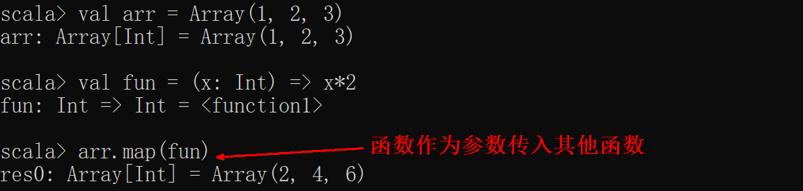
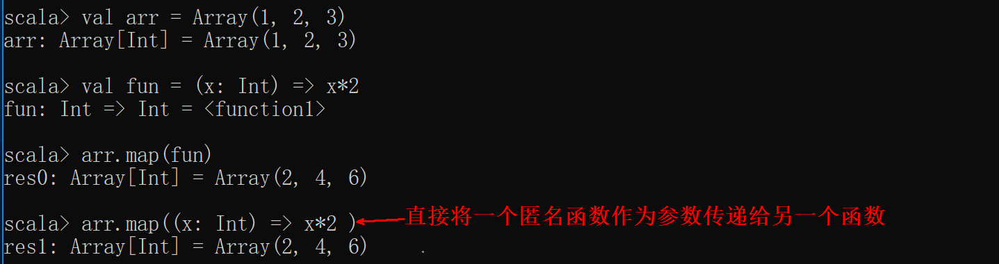
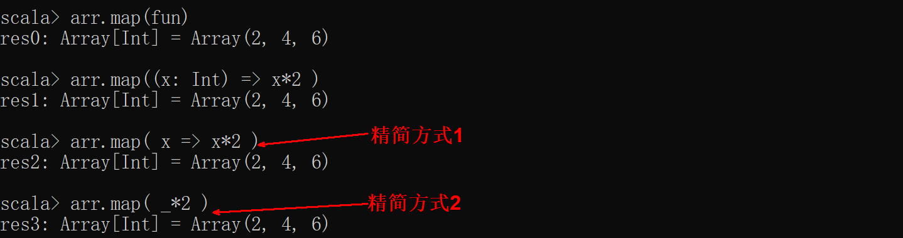
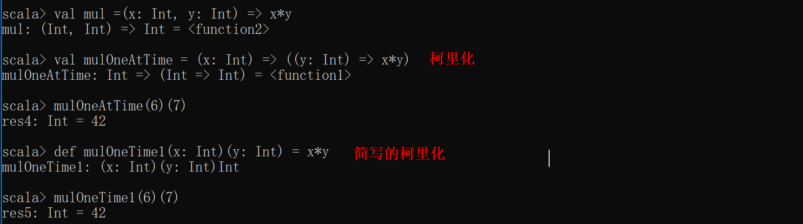
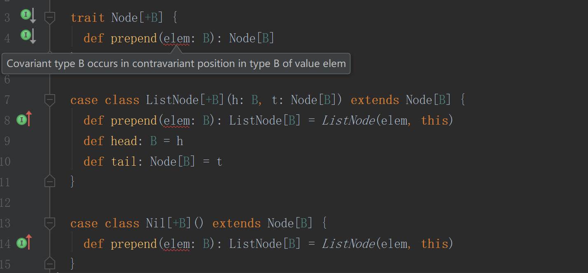

## 模式匹配和样例类（重要）

### 3.21模式匹配

Scala是没有Java中的switch case语法的，相对应的，Scala提供了更加强大的match case语法，即模式匹配，类替代switch case，match case也被称为模式匹配

Scala的match case与Java的switch case最大的不同点在于，Java的switch case仅能匹配变量的值，比1、2、3等；而Scala的match case可以匹配各种情况，比如变量的类型、集合的元素、有值或无值

match case的语法如下：变量 match { case 值 => 代码 }。如果值为下划线，则代表了不满足以上所有情况下的默认情况如何处理。此外，match case中，只要一个case分支满足并处理了，就不会继续判断下一个case分支了。（与Java不同，java的switch case需要用break阻止）

#### 3.21.1.更好的switch

Scala中类似Java的switch代码：

注意：

Scala的模式匹配只会匹配到一个分支，不需要使用break语句，因为它不会掉入到下一个分支。
 match是表达式，与if表达式一样，是有值的：

```scala
object PatternDemo {

  def main(args: Array[String]): Unit = {
    var sign = 0
    val ch: Char  = 'p'
    val valchar = 'p'
    var digit = 0

   //match 是表达式
    ch match {
      case '+' => sign = 1
      case '-' => sign = -1
      //使用|分割多个选项
      case '*' | 'x' => sign = 2
      //可以使用变量
      case valchar => sign = 3
      //case _ 类似Java中的default
      // 如果没有模式能匹配，会抛出MacthError
      //可以给模式添加守卫
      case _ if Character.isDigit(ch) => digit = Character.digit(ch, 10)
    }
    println("sign = "+ sign)
  }

}

```

#### 3.21.2.类型匹配

Scala的模式匹配一个强大之处就在于，可以直接匹配类型，而不是值！！！这点是java的switch case绝对做不到的。

可以对表达式类型进行匹配：

```scala
    val arr = Array("hs", 1, 2.0, 'a')
    val obj = arr(Random.nextInt(4))
    println(obj)
    obj match {
      case x: Int => println(x)
      case s: String => println(s.toUpperCase)
      case _: Double => println(Int.MaxValue)
      case _ => 0
    }
```

注意：  当你在匹配类型的时候，必须给出一个变量名，否则你将会拿对象本身来进行匹配：

```scala
obj match {
  case _: BigInt => Int.MaxValue  // 匹配任何类型为BigInt的对象
  case BigInt => -1              // 匹配类型为Class的BigInt对象
}
```

 匹配发生在运行期，Java虚拟机中泛型的类型信息是被擦掉的。因此，你不能用类型来匹配特定的Map类型。

```scala
case m: Map[String, Int] => ...   // error
// 可以匹配一个通用的映射
case m: Map[_, _] => ...   // OK

// 但是数组作为特殊情况，它的类型信息是完好的，可以匹配到Array[Int]
case m: Array[Int] => ...   // OK
```


#### 3.21.3 匹配字符串、数组、列表、元组

字符串匹配

```scala
/**
  * 模式匹配-字符串
  */
object MatchString {
  def main(args: Array[String]): Unit = {

    val arr = Array("zhoudongyu", "yangzi", "guanxiaotong", "zhengshuang")

    val name = arr(Random.nextInt(arr.length))

    println(name)

    name match {
      case "zhoudongyu" => println("周冬雨")
      case "yangzi" => println("杨紫")
      case "guanxiaotong" => println("关晓彤")
      case "zhengshuang" => println("郑爽")
      case _ => println("Nothing ...")
    }

  }
}

```


数组匹配

对Array进行模式匹配，分别可以匹配带有指定元素的数组、带有指定个数元素的数组、以某元素打头的数组.

```scala
  val arr1 = Array(1,1)
  val res = arr1 match {
  case Array(0) => "0"
  //匹配包含0的数组
  case Array(x, y) => s"$x $y"
  // 匹配任何带有两个元素的数组，并将元素绑定到x和y
  case Array(0, _*) => "0..."
  //匹配任何以0开始的数组
  case _ => "something else"
}
```

列表匹配

```scala
val lst = List(1,2)
val res2 =  list match {
   case 0 :: Nil => "0"
   case x :: y :: Nil => x + " " + y
   case 0 :: tail => "0 ..."
   case _ => "something else"
 }
```

元组匹配

```scala
var pair = (1,2)
val res3 =  pair match {
  case (0, _)  => "0 ..."
  case (y, 0) => s"$y 0"
  case _ => "neither is 0"
}
```

#### 3.21.4 样例类

在Scala中样例类是一中特殊的类，样例类是不可变的，

可以通过值进行比较，可用于模式匹配。

定义一个样例类：

1. 构造器中每一个参数都是val,除非显示地声明为var  
2. 伴生对象提供apply ，让你不使用new关键字就能构造出相应的对象

```scala
case class Point(x: Int, y: Int)
```

创建样例类对象：

```scala
val point = Point(1, 2)
val anotherPoint = Point(1, 2)
val yetAnotherPoint = Point(2, 2)
//访问对象值
point.x
point.x =1 //不可以
```

通过值对样例类对象进行比较：

```scala
if (point == anotherPoint) {
  println(point + " and " + anotherPoint + " are the same.")
} else {
  println(point + " and " + anotherPoint + " are different.")
}
// Point(1,2) 和 Point(1,2)一样的.

if (point == yetAnotherPoint) {
  println(point + " and " + yetAnotherPoint + " are the same.")
} else {
  println(point + " and " + yetAnotherPoint + " are different.")
}
// Point(1,2)和Point(2,2)是不同的.
```

在模式匹配中使用样例类：

样例类是一种特殊的类，可用于模式匹配，case class是多例的，后面要跟构造参数，case object是单例的。

```scala
object CaseClassMatch {
  //定义样例类
  abstract class Notification
  case class Email(sender: String, title: String, body: String) extends Notification
  case class SMS(caller: String, message: String) extends Notification
  case class VoiceRecording(contactName: String, link: String) extends Notification

  //基于样例类的模式匹配
  def showNotification(notification: Notification): String = {
    notification match {
      case Email(email, title, _) =>
        s"You got an email from $email with title: $title"
      case SMS(number, message) =>
        s"You got an SMS from $number! Message: $message"
      case VoiceRecording(name, link) =>
        s"you received a Voice Recording from $name! Click the link to hear it: $link"
    }
  }
 def main(args: Array[String]): Unit = {
  val someSms = SMS("12345", "Are you there?")
  val someVoiceRecording = VoiceRecording("Tom", "voicerecording.org/id/123")
  println(showNotification(someSms)) //结果：You got an SMS from 12345! Message: Are you there?
  println(showNotification(someVoiceRecording)) //结果：you received a Voice Recording from Tom! Click the link to hear it: voicerecording.org/id/123
}

}

```

声明样例类 ，以下几件事会自动发生：

1. 提供unapply方法，让模式匹配可以工作  
2. 生成toString equals hashCode copy 方法，除非显示给出这些方法的定义。

#### 3.21.5 Option类型

在Scala中Option类型样例类用来表示可能存在或也可能不存在的值(Option的子类有Some和None)。Some包装了某个值，None表示没有值。

```scala
object OptionDemo {
  def main(args: Array[String]) {
    val map = Map("a" -> 1, "b" -> 2)
    val v = map.get("b") match {
      case Some(i) => i
      case None => 0
    }
    println(v)
    //更好的方式
    val v1 = map.getOrElse("c", 0)
    println(v1)
  }
}

```

#### 3.21.6 偏函数

被包在花括号内没有match的一组case语句是一个偏函数，它是PartialFunction[A, B]的一个实例，A代表参数类型，B代表返回类型，常用作输入模式匹配

一个是apply()方法，直接调用可以通过函数体内的case进行匹配，返回结果; 
另一个是isDefinedAt()方法，可以返回一个输入，是否跟任何一个case语句匹配

```scala
object PartialFunctionDemo {
  def f1: PartialFunction[String, Int] = {
    case "one" => 1
    case "two" => 2
    case _ => -1
  }


  def main(args: Array[String]) {
    //调用f.apply("one")
    println(f1.apply("one"))
    println(f1("one"))
    println(f1.isDefinedAt("three"))
    //抛出MatchError
    println(f1("three"))
  }
}

```

### 6.5.String INTERPOLATION(字符串插值)(备选)

用途：处理字符串 
类型：

- s：字符串插值 
- f：插值并格式化输出
- raw：对字符串不作任何变换的输出

Scala 2.10.0之后,引入一种新的创建字符串的机制,即 String Interpolation. 它允许用户直接在字符串中嵌入变量的引用。

1,s 字符串插值器

在任何字符串前加上s，就可以直接在串中使用变量了。

```scala
val name="James"
println(s"Hello,$name") // Hello, James
```

字符串插值的位置也可以放表达式,如下:

```scala
println(s"1 + 1 = ${1 + 1}")// 1 + 1 = 2
```

2)f 插值器

插值f 可以对字符串进行格式化,类似printf:

在任何字符串字面前加上 f，就可以生成简单的格式化串，功能相似于其他语言中的 printf 函数。

```scala
val height = 1.9d
val name = "James"
println(f"$name%s is $height%4.2f meters tall")  // James is 1.90 meters tall
```

3)raw 插值器

除了对字面值中的字符不做编码外，raw 插值器与 s 插值器在功能上是相同的。

raw类似于s，但是raw对字符串内容不作任何的转换:

```scala
scala> s"a\nb"
res0: String =
a
b
```

```scala
scala> raw"a\nb"
res1: String = a\nb
```

## 7.文件以及正则表达式(备选)

### 7.1 读取行

导入scala.io.Source后，即可引用Source中的方法读取文件信息。

```scala
import scala.io.Source
object FileDemo extends App{
  val source = Source.fromFile("C:/software/access.txt")
    //返回一个迭代器
  val lines = source.getLines()
  for(i <- lines)
    println(i)
     //内容也可以放到数组中 
//  val arr = source.getLines().toArray
//  for(elem <- arr)
//    println(elem)
     //文件内容直接转换成一个字符串 
//  val contents = source.mkString
//  println(contents)
}
```

### 7.2 读取字符

按字符读取文件中的内容

```scala
import scala.io.Source
object FileDemo extends App{
  val source = Source.fromFile("C:/software/access.txt")
  for(c <- source)
    println(c)
}
```

### 7.3 读取单词

把文件中的内容,转换成一个单词的数组

```scala
import scala.io.Source
object FileDemo extends App{
  val source = Source.fromFile("C:/software/access.txt)
  val contents = source.mkString.split(" ")
  for(word <- contents)
  println(word)
}
```

### 7.4 读取网络文件

Source可以直接读取来自URL等非文件源的内容

```scala
import scala.io.Source
object FileDemo extends App{
  val source = Source.fromURL("http://www.baidu.com")
  val lines = source.getLines()
  for(i <- lines)
    println(i)
}
```

### 7.5 写文件

scala 没有内建的对写入文件的支持，要写入文件，使用Java.io.PrintWriter

```scala
val out = new PrintWriter("numbers.txt")
for(i <- 1 to 100) out.println(i)
out.close
```


## 高阶函数（重要）

#### 3.22.1 概念

如果一个函数的传入参数为函数或者返回值是函数，则该函数即为高阶函数。

#### 3.22.2. 传入参数为函数（重要）

Scala中，函数是头等公民，和数字一样。不仅可以调用，还可以在变量中存放函数，也可以作为参数传入函数，或者作为函数的返回值。

 

#### 3.22.3. 传入参数为匿名函数（重要）

在Scala中，你不需要给每一个函数命名，就像不必给每个数字命名一样，将函数赋给变量的函数叫做匿名函数

 

还可以



#### 3.22.4. 传入参数为方法（隐式转换方法到函数）

在Scala中，方法和函数是不一样的，最本质的区别是函数可以做为参数传递到方法中

```scala
case class WeeklyWeatherForecast(temperatures: Seq[Double]) {

  private def convertCtoF(temp: Double) = temp * 1.8 + 32
  //方法convertCtoF作为参数传入
  def forecastInFahrenheit: Seq[Double] = temperatures.map(convertCtoF)
}
```

#### 3.22.5.返回值为函数

```scala
//返回值为函数类型：(String, String) => String
def urlBuilder(ssl: Boolean, domainName: String): (String, String) => String = {
  val schema = if (ssl) "https://" else "http://"
  (endpoint: String, query: String) => s"$schema$domainName/$endpoint?$query"
}

val domainName = "www.example.com"
def getURL = urlBuilder(ssl=true, domainName)
val endpoint = "users"
val query = "id=1"
val url = getURL(endpoint, query) // "https://www.example.com/users?id=1": String
```

#### 方法的嵌套（备选）

方法里嵌套定义其他方法

```scala
def factorial(x: Int): Int = {
def fact(x: Int, accumulator: Int): Int = {
      if (x <= 1) accumulator
      else fact(x - 1, x * accumulator)
    }  
    fact(x, 1)
 }

 println("Factorial of 2: " + factorial(2))
 println("Factorial of 3: " + factorial(3))
```

#### 方法的多态（备选）

Scala里方法可以通过类型实现参数化，类似泛型。

```scala
def listOfDuplicates[A](x: A, length: Int): List[A] = {
  if (length < 1)
    Nil
  else
    x :: listOfDuplicates(x, length - 1)
}
println(listOfDuplicates[Int](3, 4))  // List(3, 3, 3, 3)
println(listOfDuplicates("La", 8))  // List(La, La, La, La, La, La, La, La)
```

#### 3.22.6闭包（难点，了解）

 闭包是一个函数，返回值依赖于声明在函数外部的一个或多个变量。

函数体内可以方法相应作用域内的任何变量。

闭包通常来讲可以简单的认为是可以访问一个函数里面局部变量的另外一个函数。

普通函数：

```scala
val multiplier = (i:Int) => i * 10  
```

函数体内有一个变量 i，它作为函数的一个参数。

```scala
val multiplier = (i:Int) => i * factor
```

 在 multiplier 中有两个变量：i 和 factor。其中的一个 i 是函数的形式参数，在 multiplier 函数被调用时，i 被赋予一个新的值。然而，factor不是形式参数，而是自由变量，考虑下面代码：  

```scala
var factor = 3  
val multiplier = (i:Int) => i * factor  
```

这里我们引入一个自由变量 factor，这个变量定义在函数外面。

这样定义的函数变量 multiplier 成为一个"闭包"，因为它引用到函数外面定义的变量，定义这个函数的过程是将这个自由变量捕获而构成一个封闭的函数。

```scala
object Test {  
   def main(args: Array[String]) {  
      println( "muliplier(1) value = " +  multiplier(1) )  
      println( "muliplier(2) value = " +  multiplier(2) )  
   }  
   var factor = 3  
   val multiplier = (i:Int) => i * factor  
}  
```

#### 3.22.7 柯里化（难点，了解）

Curring函数，指的是，将原来接收两个参数的一个函数，转换为两个函数，第一个函数接收原先的第一个参数，然后返回接收原先第二个参数的第二个函数。

在函数调用的过程中，就变为了两个函数连续调用的形式

下面先给出一个普通的非柯里化的函数定义，实现一个加法函数：

```scala
scala> def plainOldSum(x:Int,y:Int) = x + y
plainOldSum: (x: Int, y: Int)Int
scala> plainOldSum(1,2)
res0: Int = 3
```

使用“柯里化”技术，把函数定义为多个参数列表：

```scala
scala> def curriedSum(x:Int)(y:Int) = x + y
curriedSum: (x: Int)(y: Int)Int
scala> curriedSum (1)(2)
res0: Int = 3
```

当你调用 curriedSum (1)(2)时，实际上是依次调用两个普通函数（非柯里化函数），第一次调用使用一个参数 x，返回一个函数类型的值，第二次使用参数y调用这个函数类型的值，我们使用下面两个分开的定义在模拟 curriedSum 柯里化函数：

首先定义第一个函数：

```scala
scala> def first(x:Int) = (y:Int) => x + y
first: (x: Int)Int => Int
```

然后我们使用参数1调用这个函数来生成第二个函数。

```scala
scala> val second=first(1)
second: Int => Int = <function1>
scala> second(2)
res1: Int = 3
```

first，second的定义演示了柯里化函数的调用过程，它们本身和 curriedSum 没有任何关系，但是我们可以使用 curriedSum 来定义 second，如下：

```scala
scala> val onePlus = curriedSum(1)_
onePlus: Int => Int = <function1>
```

下划线“_” 作为第二参数列表的占位符， 这个定义的返回值为一个函数，当调用时会给调用的参数加一。

```scala
scala> onePlus(2)
res2: Int = 3
```

通过柯里化，你还可以定义多个类似 onePlus 的函数，比如 twoPlus

```scala
scala> val twoPlus = curriedSum(2) _
twoPlus: Int => Int = <function1>
scala> twoPlus(2)
res3: Int = 4
```



## 3.22 隐式转换和隐式参数（难点，了解）

#### 3.22.1 概念

隐式转换和隐式参数是Scala中两个非常强大的功能，利用隐式转换和隐式参数，你可以提供优雅的类库，对类库的使用者隐匿掉那些枯燥乏味的细节。

#### 3.22.2 作用

隐式的对类的方法进行增强，丰富现有类库的功能

~~~scala
object ImplicitDemo extends App{
  //定义隐式类，可以把File转换成定义的隐式类RichFile
  implicit class RichFile(from:File){
    def read:String = Source.fromFile(from.getPath).mkString
  }
  //使用隐式类做已有类的动能的扩展
  val contents = new File("src/test1.txt").read
  println(contents)

}
~~~

#### 3.22.3 隐式引用

Scala会自己主动为每一个程序加上几个隐式引用，就像Java程序会自己主动加上java.lang包一样。

Scala中。下面三个包的内容会隐式引用到每一个程序上。所不同的是。Scala还会隐式加进对Predef的引用。

```scala
import java.lang._ // in JVM projects, or system namespace in .NET
import scala._     // everything in the scala package
import Predef._    // everything in the Predef object
```

上面三个包，包括了经常使用的类型和方法。java.lang包包括了经常使用的java语言类型，假设在.NET环境中，则会引用system命名空间。相似的，scala还会隐式引用scala包，也就是引入经常使用的scala类型。

> **请注意** 
>    上述三个语句的**顺序**藏着一点玄机。
>
> 我们知道，通常，假设import进来两个包都有某个类型的定义的话，比方说，同一段程序。即引用了’scala.collection.mutable.Set’又引用了’import  scala.collection.immutable.Set’则编译器会提示无法确定用哪一个Set。
>
> 这里的隐式引用则不同，假设有同样的类型。后面的包的类型会将前一个隐藏掉。
>
> 比方。java.lang和scala两个包里都有StringBuilder。这样的情况下，会使用scala包里定义的那个。java.lang里的定义就被隐藏掉了，除非显示的使用java.lang.StringBuilder。

#### 3.22.4 隐式转换例子

```scala
import java.io.File
import scala.io.Source


//隐式的增强File类的方法
class RichFile(val from: File) {
  def read = Source.fromFile(from.getPath).mkString
}

object RichFile {
  //隐式转换方法
  implicit def file2RichFile(from: File) = new RichFile(from)

}

object ImplicitTransferDemo{
  def main(args: Array[String]): Unit = {
    //导入隐式转换
    import RichFile._
    //import RichFile.file2RichFile
    println(new File("c://words.txt").read)

  }
}

```

#### 3.22.5 隐式类

创建隐式类时，只需要在对应的类前加上implicit关键字。比如：

```scala
object Helpers {
  implicit class IntWithTimes(x: Int) {
    def times[A](f: => A): Unit = {
      def loop(current: Int): Unit =
        if(current > 0) {
          f
          loop(current - 1)
        }
      loop(x)
    }
  }
}
```

这个例子创建了一个名为IntWithTimes的隐式类。这个类包含一个int值和一个名为times的方法。要使用这个类，只需将其导入作用域内并调用times方法。比如：

```scala
scala> import Helpers._
import Helpers._
scala> 5 times println("HI")
HI
HI
HI
HI
HI
```

  

使用隐式类时，类名必须在当前作用域内可见且无歧义，这一要求与隐式值等其他隐式类型转换方式类似。

1. 只能在别的trait/类/对象内部定义。

```scala
    object Helpers {
       implicit class RichInt(x: Int) // 正确！
    }
    implicit class RichDouble(x: Double) // 错误！

```

2. 构造函数只能携带一个非隐式参数。

```scala
 implicit class RichDate(date: java.util.Date) // 正确！
 implicit class Indexer[T](collecton: Seq[T], index: Int) // 错误！
 implicit class Indexer[T](collecton: Seq[T])(implicit index: Index) // 正确！

```

虽然我们可以创建带有多个非隐式参数的隐式类，但这些类无法用于隐式转换。

3. 在同一作用域内，不能有任何方法、成员或对象与隐式类同名。

```scala
object Bar
implicit class Bar(x: Int) // 错误！

val x = 5
implicit class x(y: Int) // 错误！

implicit case class Baz(x: Int) // 错误！
```
#### 3.22.6 隐式转换函数

是指那种以implicit关键字声明的带有单个参数的函数，这种函数将被自动引用，将值从一种类型转换成另一种类型。

使用隐含转换将变量转换成预期的类型是编译器最先使用 implicit 的地方。这个规则非常简单，当编译器看到类型X而却需要类型Y，它就在当前作用域查找是否定义了从类型X到类型Y的隐式定义。

 

比如，通常情况下，双精度实数不能直接当整数使用，因为会损失精度：

```scala
scala> val i:Int = 3.5
<console>:7: error: type mismatch;
 found   : Double(3.5)
 required: Int
       val i:Int = 3.5
                   ^
```

当然你可以直接调用 3.5.toInt。

这里我们定义一个从 Double 到 Int 的隐含类型转换的定义，然后再把 3.5 赋值给整数，就不会报错。

```
scala> implicit def doubleToInt(x:Double) = x toInt
doubleToInt: (x: Double)Int
scala> val i:Int = 3.5
i: Int = 3
```

此时编译器看到一个浮点数 3.5，而当前赋值语句需要一个整数，此时按照一般情况，编译器会报错，但在报错之前，编译器会搜寻是否定义了从 Double 到 Int 的隐含类型转换，本例，它找到了一个 doubleToInt。 因此编译器将把

```
val i:Int = 3.5
```

转换成

```
val i:Int = doubleToInt(3.5)
```

这就是一个隐含转换的例子，但是从浮点数自动转换成整数并不是一个好的例子，因为会损失精度。 Scala 在需要时会自动把整数转换成双精度实数，这是因为在 Scala.Predef 对象中定义了一个

```
implicit def int2double(x:Int) :Double = x.toDouble
```

而 Scala.Predef 是自动引入到当前作用域的，因此编译器在需要时会自动把整数转换成 Double 类型。

#### 3.22.7 隐式参数

看最开始的例子：

```scala
def compare[T](x:T,y:T)(implicit ordered: Ordering[T]):Int = {
  ordered.compare(x,y)
}
```

在函数定义的时候，支持在最后一组参数使用  `implicit`，表明这是一组隐式参数。在调用该函数的时候，可以不用传递隐式参数，而编译器会自动寻找一个`implict`标记过的合适的值作为该参数。

例如上面的函数，调用`compare`时不需要显式提供`ordered`，而只需要直接`compare(1,2)`这样使用即可。

再举一个例子：

```scala
object Test{
    trait Adder[T] {
      def add(x:T,y:T):T
    }

    implicit val a = new Adder[Int] {
      override def add(x: Int, y: Int): Int = x+y
    }

    def addTest(x:Int,y:Int)(implicit adder: Adder[Int]) = {
      adder.add(x,y)
    }

   addTest(1,2)      // 正确, = 3
   addTest(1,2)(a)   // 正确, = 3
   addTest(1,2)(new Adder[Int] {
      override def add(x: Int, y: Int): Int = x-y
    })   // 同样正确, = -1
}
```

`Adder`是一个trait，它定义了`add`抽象方法要求子类必须实现。

`addTest`函数拥有一个`Adder[Int]`类型的隐式参数。

在当前作用域里存在一个`Adder[Int]`类型的隐式值`implicit val a`。

在调用`addTest`时，编译器可以找到`implicit`标记过的`a`，所以我们不必传递隐式参数而是直接调用`addTest(1,2)`。而如果你想要传递隐式参数的话，你也可以自定义一个传给它，像后两个调用所做的一样。

## 泛型（难点，了解）

#### 3.23.1泛型概念

为什么要用泛型？

提高某些类或者方法的灵活性。

什么是泛型？

带有一个或多个类型参数的类是泛型的。

	[B <: A] upper bounds 上限或上界：B类型的上界是A类型，也就是B类型的父类是A类型
	[B >: A] lower bounds 下限或下界：B类型的下界是A类型，也就是B类型的子类是A类型
	[B <% A] view bounds 视界：表示B类型要转换为A类型，需要一个隐式转换函数
	[B : A] context bounds 上下文界定（用到了隐式参数的语法糖）：需要一个隐式转换的值
	[-A]：逆变，作为参数类型。是指实现的参数类型是接口定义的参数类型的父类
	[+B]：协变，作为返回类型。是指返回类型是接口定义返回类型的子类
	
泛型类的定义：

```scala
 //带有类型参数A的类定义
 class Stack[A] {
  private var elements: List[A] = Nil
     //泛型方法
  def push(x: A) { elements = x :: elements }
  def peek: A = elements.head
  def pop(): A = {
    val currentTop = peek
    elements = elements.tail
    currentTop
  }
}
```

使用上述的泛型类，使用具体的类型代替类型参数A。

```scala
val stack = new Stack[Int]
stack.push(1)
stack.push(2)
println(stack.pop)  // prints 2
println(stack.pop)  // prints 1
```

#### 3.23.2 协变

定义一个类型List[+A]，如果A是协变的，意思是：对类型A和B，A是B的子类型，那么List[A]是List[B]的子类型。

```scala
abstract class Animal {
  def name: String
}
case class Cat(name: String) extends Animal
case class Dog(name: String) extends Animal

```

Scala标准库有一个泛型类sealed abstract class List[+A]，因为其中的类型参数是协变的，那么下面的程序调用时成功的。

```scala
object CovarianceTest extends App {
    //定义参数类型List[Animal]
  def printAnimalNames(animals: List[Animal]): Unit = {
    animals.foreach { animal =>
      println(animal.name)
    }
  }

  val cats: List[Cat] = List(Cat("Whiskers"), Cat("Tom"))
  val dogs: List[Dog] = List(Dog("Fido"), Dog("Rex"))
  //传入参数类型为List[Cat] 
  printAnimalNames(cats)
  // Whiskers
  // Tom
  //传入参数类型为List[Dog] 
  printAnimalNames(dogs)
  // Fido
  // Rex
}
```

### 3.23.3 逆变

定义一个类型Writer[-A]，如果A是逆变的，意思是：对类型A和B，A是B的子类型，那么Writer[B]是Writer[A]的子类型。

```scala
abstract class Animal {
  def name: String
}
case class Cat(name: String) extends Animal
case class Dog(name: String) extends Animal
```

定义对应上述类进行操作的打印信息类

```scala
abstract class Printer[-A] {
  def print(value: A): Unit
}
class AnimalPrinter extends Printer[Animal] {
  def print(animal: Animal): Unit =
    println("The animal's name is: " + animal.name)
}

class CatPrinter extends Printer[Cat] {
  def print(cat: Cat): Unit =
    println("The cat's name is: " + cat.name)
}
```

逆变的测试

```scala
object ContravarianceTest extends App {
  val myCat: Cat = Cat("Boots")

//定义参数类型为Printer[Cat]
  def printMyCat(printer: Printer[Cat]): Unit = {
    printer.print(myCat)
  }

  val catPrinter: Printer[Cat] = new CatPrinter
  val animalPrinter: Printer[Animal] = new AnimalPrinter

  printMyCat(catPrinter)
    //可以传入参数类型为Printer[Animal] 
  printMyCat(animalPrinter)
}
```

#### 3.23.4 上界

上界定义： `T <: A` ，表示类型变量`T` 必须是 类型`A` 子类

```scala
abstract class Animal {
 def name: String
}

abstract class Pet extends Animal {}

class Cat extends Pet {
  override def name: String = "Cat"
}

class Dog extends Pet {
  override def name: String = "Dog"
}

class Lion extends Animal {
  override def name: String = "Lion"
}
//参数类型须是Pet类型的子类
class PetContainer[P <: Pet](p: P) {
  def pet: P = p
}
//Dog是Pet类型的子类
val dogContainer = new PetContainer[Dog](new Dog)
//Cat是Pet类型的子类
val catContainer = new PetContainer[Cat](new Cat)
//Lion不是Pet类型的子类，编译通不过
//  val lionContainer = new PetContainer[Lion](new Lion)
```

#### 3.23.5 下界

语法 `B >: A` 表示参数类型或抽象类型 `B` 须是类型A的父类。通常，A是类的类型参数，B是方法的类型参数。



上面这段代码，因为作为协变类型的B，出现在需要逆变类型的函数参数中，导致编译不通过。解决这个问题，就需要用到下界的概念。

```
trait Node[+B] {
  def prepend[U >: B](elem: U): Node[U]
}

case class ListNode[+B](h: B, t: Node[B]) extends Node[B] {
  def prepend[U >: B](elem: U): ListNode[U] = ListNode(elem, this)
  def head: B = h
  def tail: Node[B] = t
}

case class Nil[+B]() extends Node[B] {
  def prepend[U >: B](elem: U): ListNode[U] = ListNode(elem, this)
}

```

测试

```
trait Bird
case class AfricanSwallow() extends Bird
case class EuropeanSwallow() extends Bird


val africanSwallowList= ListNode[AfricanSwallow](AfricanSwallow(), Nil())
val birdList: Node[Bird] = africanSwallowList
birdList.prepend(new EuropeanSwallow)
```

#### 3.23.6 视界(view bounds)

**注意**:已过时,了解即可

视界定义： `A <% B` ，表示类型变量`A 必须是 类型`B`的子类,或者A能够隐式转换到B

```scala
class Pair_Int[T <% Comparable[T]] (val first: T, val second: T){
  def bigger = if(first.compareTo(second) > 0) first else second
}


class Pair_Better[T <% Ordered[T]](val first: T, val second: T){
  def smaller = if(first < second) first else second
}
object View_Bound {

  def main(args: Array[String]) {
  // 因为Pair[String] 是Comparable[T]的子类型, 所以String有compareTo方法
    val pair = new Pair_Int("Spark", "Hadoop");
    println(pair.bigger)

    /**
      * Scala语言里 Int类型没有实现Comparable;
      * 那么该如何解决这个问题那;
      * 在scala里 RichInt实现了Comparable, 如果我们把int转换为RichInt类型就可以这样实例化了.
      * 在scala里 <% 就起这个作用, 需要修改Pair里的 <: 为<% 把T类型隐身转换为Comparable[Int]
      * String可以被转换为RichString. 而RichString是Ordered[String] 的子类.
      */
    val pair_int = new Pair_Int(3 ,45)
    println(pair_int.bigger)

    val pair_better = new Pair_Better(39 ,5)
    println(pair_better.smaller)

  }

}
```

#### 3.23.7 上下文界定(context bounds)

上下文界定的形式为 T : M, 其中M 必须为泛型类, 必须存在一个M[T]的隐式值.

```scala
class Pair_Context[T : Ordering](val first: T, val second: T){
  def smaller(implicit ord: Ordering[T]) =
    if(ord.compare(first, second) < 0) first else second
}
object Context_Bound {
  def main(args: Array[String]) {
    val pair = new Pair_Context("Spark", "Hadoop")
    println(pair.smaller)
    val int = new Pair_Context(3, 5)
    println(int.smaller)
  }
}
```

 