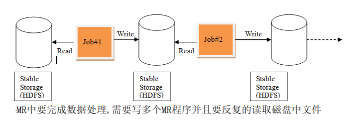

### 3.25.1大数据框架结构

之前学习了Hadoop的生态圈HDFS MapReduce Yarn 除了这三个总要的的三大框架之外我们还学了Hive Hbase Flume Sqoop等附属在Hadoop这个生态圈中所使用的工具

#### 3.25.2Spark的框架体系


先通过flume采集数据,然后可以用过MapReduce的可以对数据进行清洗和分析,之后我们可以存储到HBase,其实去存到HBase中也就是相当于存到了HDFS中,HDFS是一个非常强大的分布式文件系统

HDFS的优缺点

优点：

高可靠性：Hadoop按位存储和处理数据的能力值得人们信赖

高扩展性：Hadoop是在可用的计算机集簇间分配数据并完成计算任务的，这些集簇可以方便地扩展到数以千计的节点中。

高效性：Hadoop能够在节点之间动态地移动数据，并保证各个节点的动态平衡，因此处理速度非常快。

高容错性：Hadoop能够自动保存数据的多个副本，并且能够自动将失败的任务重新分配。

缺点：

不适合低延迟数据访问。

无法高效存储大量小文件。

不支持多用户写入及任意修改文件除了

这些Hadoop2.x中我们还提供了Yarn资源调度系统,专门用来进行资源的调度使用

#### 3.25.3Spark和MR对比

MR中的迭代:



Spark中的迭代:


1、spark把运算的中间数据存放在内存，迭代计算效率更高；mapreduce的中间结果需要落地，需要保存到磁盘，这样必然会有磁盘io操做，影响性能。

2、spark容错性高，它通过弹性分布式数据集RDD来实现高效容错，RDD是一组分布式的存储在节点内存中的只读性质的数据集，这些集合是弹性的，某一部分丢失或者出错，可以通过整个数据集的计算流程的血缘关系来实现重建；mapreduce的话容错可能只能重新计算了，成本较高。

3、spark更加通用，spark提供了transformation和action这两大类的多个功能api，另外还有流式处理sparkstreaming模块、图计算GraphX等等；mapreduce只提供了map和reduce两种操作，流计算以及其他模块的支持比较缺乏。

4、spark框架和生态更为复杂，首先有RDD、血缘lineage、执行时的有向无环图DAG、stage划分等等，很多时候spark作业都需要根据不同业务场景的需要进行调优已达到性能要求；mapreduce框架及其生态相对较为简单，对性能的要求也相对较弱，但是运行较为稳定，适合长期后台运行。

### 3.25.4Spark简介

官网http://spark.apache.org/


Spark是一种快速、通用、可扩展的大数据分析引擎，2009年诞生于加州大学伯克利分校AMPLab，2010年开源，2013年6月成为Apache孵化项目，2014年2月成为Apache顶级项目。项目是用Scala进行编写。

目前，Spark生态系统已经发展成为一个包含多个子项目的集合，其中包含SparkSQL、Spark Streaming、GraphX、MLib、SparkR等子项目，Spark是基于内存计算的大数据并行计算框架。除了扩展了广泛使用的 MapReduce 计算模型，而且高效地支持更多计算模式，包括交互式查询和流处理。Spark 适用于各种各样原先需要多种不同的分布式平台的场景，包括批处理、迭代算法、交互式查询、流处理。通过在一个统一的框架下支持这些不同的计算，Spark 使我们可以简单而低耗地把各种处理流程整合在一起。而这样的组合，在实际的数据分析 过程中是很有意义的。不仅如此，Spark 的这种特性还大大减轻了原先需要对各种平台分 别管理的负担。 

#### 为什么要学Spark

大一统的软件栈，各个组件关系密切并且可以相互调用，这种设计有几个好处：1、软件栈中所有的程序库和高级组件 都可以从下层的改进中获益。2、运行整个软件栈的代价变小了。不需要运 行 5 到 10 套独立的软件系统了，一个机构只需要运行一套软件系统即可。系统的部署、维护、测试、支持等大大缩减。3、能够构建出无缝整合不同处理模型的应用。

Spark的内置项目如下：

**Spark Core：**实现了 Spark 的基本功能，包含任务调度、内存管理、错误恢复、与存储系统 交互等模块。Spark Core 中还包含了对弹性分布式数据集(resilient distributed dataset，简称RDD)的 API 定义。 

**Spark SQL：**是 Spark 用来操作结构化数据的程序包。通过 Spark SQL，我们可以使用 SQL 或者 Apache Hive 版本的 SQL 方言(HQL)来查询数据。Spark SQL 支持多种数据源，比 如 Hive 表、Parquet 以及 JSON 等。 

**Spark Streaming：**是 Spark 提供的对实时数据进行流式计算的组件。提供了用来操作数据流的 API，并且与 Spark Core 中的 RDD API 高度对应。 

**Spark MLlib：**提供常见的机器学习(ML)功能的程序库。包括分类、回归、聚类、协同过滤等，还提供了模型评估、数据 导入等额外的支持功能。 

**集群管理器：**Spark 设计为可以高效地在一个计算节点到数千个计算节点之间伸缩计 算。为了实现这样的要求，同时获得最大灵活性，Spark 支持在各种集群管理器(cluster manager)上运行，包括 Hadoop YARN、Apache Mesos，以及 Spark 自带的一个简易调度 器，叫作独立调度器。 

  Spark得到了众多大数据公司的支持，这些公司包括Hortonworks、IBM、Intel、Cloudera、MapR、Pivotal、百度、阿里、腾讯、京东、携程、优酷土豆。当前百度的Spark已应用于凤巢、大搜索、直达号、百度大数据等业务；阿里利用GraphX构建了大规模的图计算和图挖掘系统，实现了很多生产系统的推荐算法；腾讯Spark集群达到8000台的规模，是当前已知的世界上最大的Spark集群。

#### Spark特点

快

与Hadoop的MapReduce相比，Spark基于内存的运算要快100倍以上，基于硬盘的运算也要快10倍以上。Spark实现了高效的DAG执行引擎，可以通过基于内存来高效处理数据流。


易用

Spark支持Java、Python和Scala的API，还支持超过80种高级算法，使用户可以快速构建不同的应用。而且Spark支持交互式的Python和Scala的shell，可以非常方便地在这些shell中使用Spark集群来验证解决问题的方法。


通用

Spark提供了统一的解决方案。Spark可以用于批处理、交互式查询（Spark SQL）、实时流处理（Spark Streaming）、机器学习（Spark MLlib）和图计算（GraphX）。这些不同类型的处理都可以在同一个应用中无缝使用。Spark统一的解决方案非常具有吸引力，毕竟任何公司都想用统一的平台去处理遇到的问题，减少开发和维护的人力成本和部署平台的物力成本。


兼容性

Spark可以非常方便地与其他的开源产品进行融合。比如，Spark可以使用Hadoop的YARN和Apache Mesos作为它的资源管理和调度器，器，并且可以处理所有Hadoop支持的数据，包括HDFS、HBase和Cassandra等。这对于已经部署Hadoop集群的用户特别重要，因为不需要做任何数据迁移就可以使用Spark的强大处理能力。Spark也可以不依赖于第三方的资源管理和调度器，它实现了Standalone作为其内置的资源管理和调度框架，这样进一步降低了Spark的使用门槛，使得所有人都可以非常容易地部署和使用Spark。此外，Spark还提供了在EC2上部署Standalone的Spark集群的工具。


### 3.25.5Saprk安装包下载


现在使用的版本是spark2.2.0需要的hadoop环境最好是2.7(含)版本以上,可以在课程中讲解知识点的时候所以下spark1.6.3中的一些概念穿插讲解

另外的两种下载方式:

<http://archive.apache.org/dist>

https://github.com/apache/spark

### 3.25.6Spark运行模式

**Local** 多用于本地测试，如在eclipse，idea中写程序测试等。

**Standalone**是Spark自带的一个资源调度框架，它支持完全分布式。

**On Yarn**生态圈里面的一个资源调度框架，Spark也是可以基于Yarn来计算的。

**Mesos**资源调度框架。

### 3.25.7Spark集群安装（重要）

集群组成使用了4台节点,在教学中可以根据自己的节点适当减少worker即可

```xml
基本条件:同步时间、免密登录、关闭防火墙、安装JDK1.8
1.上传安装包到hadoop01
2.将文件解压到指定的目录
tar -zxvf spark-2.2.0-bin-hadoop2.7.tgz -C /opt/software/

3.跳转到安装路径进入到conf进行配置
cd /opt/software/spark-2.2.0-bin-hadoop2.7/
cd conf/

3.1修改conf目录下的env文件
mv spark-env.sh.template spark-env.sh
vi spark-env.sh
在文件的末尾添加
export JAVA_HOME=/opt/software/jdk1.8.0_191 JDK安装路径
export SPARK_MASTER_IP=hadoop01 主节点IP(写节点名地址必须是节点 写IP地址必须是IP)
(这个的配置决定spark-shell时 --master中spark://地址的配置(hadoop01或IP地址))
export SPARK_MASTER_PORT=7077 主节点端口号(内部通信)

3.2修改slaves.template文件添加从节点
mv slaves.template slaves
vi slaves
内容(根据自己的节点适当删减):
hadoop02
hadoop03
hadoop04

4.分发配置好的内容到其他节点:
scp -r ./spark-2.2.0-bin-hadoop2.7/ root@hadoop04:$PWD
ps:0后面进行修改 2,3,4

配全局环境变量(选配好处在在意可以不用进图bin目录下启动spark-shell和sparkSubmit):
vi /etc/profile
export SPARK_HOME=/opt/software/spark-2.2.0-bin-hadoop2.7
需要在引用路径的最后添加 $SPARK_HOME/bin:
保存退出
source /etc/profile

spark启动集群:
进入到安装目录找sbin目录进入 /opt/software/spark-2.2.0-bin-hadoop2.7
启动 ./start-all.sh
sparkt提供webUI界面端和tomcat的端口是一样8080 内部通信7077
http://hadoop01:8080
```

### 配置Job History Server

在运行Spark应用程序的时候，driver会提供一个webUI给出应用程序的运行信息，但是该webUI随着应用程序的完成而关闭端口，也就是 说，Spark应用程序运行完后，将无法查看应用程序的历史记录。Spark history server就是为了应对这种情况而产生的，通过配置，Spark应用程序在运行完应用程序之后，将应用程序的运行信息写入指定目录，而Spark history server可以将这些运行信息装载并以web的方式供用户浏览。 

```
1.启动HDFS
start-dfs.sh
创建directory目录
hdfs dfs -mkdir /directory

2.进入到spark安装目录conf目录下
cd /opt/software/spark-2.2.0-bin-hadoop2.7/conf

3.将spark-default.conf.template复制为spark-default.conf
mv spark-defaults.conf.template spark-defaults.conf
vi  spark-defaults.conf在文件的末尾添加
spark.eventLog.enabled           true  开启日志
spark.eventLog.dir               hdfs://hadoop01:8020/directory 存储路径
spark.eventLog.compress          true 是否压缩
参数描述：
spark.eventLog.dir：Application在运行过程中所有的信息均记录在该属性指定的路径下
spark.eventLog.compress 这个参数设置history-server产生的日志文件是否使用压缩，true为使用，false为不使用。这个参数务可以成压缩哦，不然日志文件岁时间积累会过

4.修改spark-env.sh文件，添加如下配置
export SPARK_HISTORY_OPTS="-Dspark.history.ui.port=4000 -Dspark.history.retainedApplications=10 -Dspark.history.fs.logDirectory=hdfs://hadoop01:8020/directory"

spark.history.ui.port=4000  调整WEBUI访问的端口号为4000
spark.history.fs.logDirectory=hdfs://hadoop01:8020/directory  配置了该属性后，在start-history-server.sh时就无需再显式的指定路径，Spark History Server页面只展示该指定路径下的信息
spark.history.retainedApplications=10   指定保存Application历史记录的个数，如果超过这个值，旧的应用程序信息将被删除，这个是内存中的应用数，而不是页面上显示的应用数。

5.配置完成后分发文件到相应节点
scp -r ./spark-env.sh root@hadoop02:$PWD
scp -r ./spark-defaults.conf root@hadoop02:$PWD

ps:最好不要是用IE内核的浏览器不然效果是显示不出来的
   启动的时候是
   start-all.sh       start-history-server.sh 
```

### 3.25.8 Spark高可用问题(测试环境下选做):

```
那就是Master节点存在单点故障，要解决此问题，就要借助zookeeper，并且启动至少两个Master节点来实现高可靠，配置方式比较简单：
Spark集群规划：hadoop01，hadoop04是Master；hadoop02，hadoop03，hadoop04是Worker
安装配置zk集群，并启动zk集群
停止spark所有服务，修改配置文件spark-env.sh，在该配置文件中删掉SPARK_MASTER_IP并添加如下配置
export SPARK_DAEMON_JAVA_OPTS="-Dspark.deploy.recoveryMode=ZOOKEEPER -Dspark.deploy.zookeeper.url=hadoop02,hadoop03,hadoop04 -Dspark.deploy.zookeeper.dir=/spark"
分发到hadoop02,hadoop03,hadoop04节点下
1.在hadoop01节点上修改slaves配置文件内容指定worker节点
ps:若是修改了slaves节点那么配置文件也发分发
2.先启动zookeeper集群
3.在hadoop01上执行sbin/start-all.sh脚本，然后在hadoop04上执行sbin/start-master.sh启动第二个Master

ps:若使用spark-shell启动集群需要添加配置
spark-shell --master spark://master01:port1,master02:port2
```

### 3.25.9 Spark程序执行（重要）

提交Spark提供的利用蒙特·卡罗算法求π的例子，其中100这个参数是计算因子

在spark安装目录下执行这个例子

```
bin/spark-submit --class org.apache.spark.examples.SparkPi --master spark://hadoop01:7077 examples/jars/spark-examples_2.11-2.2.0.jar 10
```

 		

Standalone模式下，集群启动时包括Master与Worker，其中Master负责接收客户端提交的作业，管理Worker

#### 名词解释：

1.Standalone模式下存在的角色。

**Master**：Standalone模式中主控节点，负责接收Client提交的作业，管理Worker，并命令Worker启动Driver和Executor。

**Worker**：Standalone模式中slave节点上的守护进程，负责管理本节点的资源，定期向Master汇报心跳，接收Master的命令，启动Driver和Executor。

**Driver**： 一个Spark作业运行时包括一个Driver进程，也是作业的主进程，负责作业的解析、生成Stage并调度Task到Executor上。包括DAGScheduler，TaskScheduler。负责提交任务描述到Master。负责将生成的task提交到Executor端进行分析。

**Executor**：即真正执行作业的地方，一个集群一般包含多个Executor，每个Executor接收Driver的命令Launch Task，一个Executor可以执行一到多个Task。

2.作业相关的名词解释

**Stage**：一个Spark作业一般包含一到多个Stage。

**Task**：一个Stage包含一到多个Task，通过多个Task实现并行运行的功能。

**DAGScheduler**： 实现将Spark作业分解成一到多个Stage，每个Stage根据RDD的Partition个数决定Task的个数，然后生成相应的Task set放到TaskScheduler中。

**TaskScheduler**：实现Task分配到Executor上执行

#### 作业执行流程描述：

1.客户端启动后直接运行用户程序，启动Driver相关的工作：DAGScheduler和BlockManagerMaster等。

2.客户端的Driver向Master注册。

3.Master还会让Worker启动Exeuctor。Worker创建一个ExecutorRunner线程，ExecutorRunner会启动ExecutorBackend进程。

4.ExecutorBackend启动后会向Driver的SchedulerBackend注册。Driver的DAGScheduler解析作业并生成相应的Stage，每个Stage包含的Task通过TaskScheduler分配给Executor执行。

5.所有stage都完成后作业结束。

在web UI界面

在启动任务的时候并没有指定分配资源,而是有多少资源就使用了多少资源我们在跑任务的时候是可以指定资源的,可以在指定使用核心和资源

```
./spark-submit \
> --class org.apache.spark.examples.SparkPi \
> --master spark://hadoop01:7077 \
> --executor-memory 512m \
> --total-executor-cores 2 \
> /opt/software/spark-2.2.0-bin-hadoop2.7/examples/jars/spark-examples_2.11-2.2.0.jar 100

--executor-memory 设置内存 --total-executor-cores 核心数
```

### 3.25.10 SparkShell（重要） 

spark-shell是Spark自带的交互式Shell程序，方便用户进行交互式编程，用户可以在该命令行下用Scala编写Spark程序。spark-shell程序一般用作Spark程序测试练习来用。spark-shell属于Spark的特殊应用程序，我们可以在这个特殊的应用程序中提交应用程序

spark-shell启动有两种模式，local模式和cluster模式，分别为

#### local模式:

```
spark-shell 
```

local模式仅在本机启动一个SparkSubmit进程，没有与集群建立联系,虽然进程中有SparkSubmit但是不会被提交到集群红


#### Cluster模式(集群模式):

```
spark-shell \
--master spark://hadoop01:7077 \
--executor-memory 512m \
--total-executor-cores 1

后两个命令不是必须的 --master这条命令是必须的(除非在jar包中已经指可以不指定,不然就必须指定)
```

#### 退出shell

千万不要ctrl+c spark-shell 正确退出 :quit 千万不要ctrl+c退出 这样是错误的 若使用了ctrl+c退出 使用命令查看监听端口 netstat - apn | grep 4040 在使用kill -9 端口号 杀死即可    

#### 3.25.11 spark2.2shell和spark1.6shell对比 


ps:启动spark-shell若是集群模式,在webUI会有一个一直执行的任务

### 3.25.12 通过IDEA创建Spark工程（重要）

ps:工程创建之前步骤省略,在scala中已经讲解,直接默认是创建好工程的

#### 对工程中的pom.xml文件配置

```xml
 <!-- 声明公有的属性 -->
<properties>
        <maven.compiler.source>1.8</maven.compiler.source>
        <maven.compiler.target>1.8</maven.compiler.target>
        <encoding>UTF-8</encoding>
        <scala.version>2.11.8</scala.version>
        <spark.version>2.2.0</spark.version>
        <hadoop.version>2.7.1</hadoop.version>
        <scala.compat.version>2.11</scala.compat.version>
    </properties>
<!-- 声明并引入公有的依赖 -->
    <dependencies>
        <dependency>
            <groupId>org.scala-lang</groupId>
            <artifactId>scala-library</artifactId>
            <version>${scala.version}</version>
        </dependency>
        <dependency>
        <groupId>org.apache.spark</groupId>
        <artifactId>spark-core_2.11</artifactId>
        <version>${spark.version}</version>
    </dependency>
        <dependency>
            <groupId>org.apache.hadoop</groupId>
            <artifactId>hadoop-client</artifactId>
            <version>${hadoop.version}</version>
        </dependency>
    </dependencies>

<!-- 配置构建信息 -->
    <build>
        <!-- 资源文件夹 -->
        <sourceDirectory>src/main/scala</sourceDirectory>
        <!-- 声明并引入构建的插件 -->
        <plugins>
             <!-- 用于编译Scala代码到class -->
            <plugin>
                <groupId>net.alchim31.maven</groupId>
                <artifactId>scala-maven-plugin</artifactId>
                <version>3.2.2</version>
                <executions>
                    <execution>
                        <goals>
                            <goal>compile</goal>
                            <goal>testCompile</goal>
                        </goals>
                        <configuration>
                            <args>
                                <arg>-dependencyfile</arg>
                                <arg>${project.build.directory}/.scala_dependencies</arg>
                            </args>
                        </configuration>
                    </execution>
                </executions>
            </plugin>
            <plugin>
                <!-- 程序打包 -->
                <groupId>org.apache.maven.plugins</groupId>
                <artifactId>maven-shade-plugin</artifactId>
                <version>2.4.3</version>
                <executions>
                    <execution>
                        <phase>package</phase>
                        <goals>
                            <goal>shade</goal>
                        </goals>
                        <configuration>
                             <!-- 过滤掉以下文件，不打包 ：解决包重复引用导致的打包错误-->
                            <filters>
                                <filter><artifact>*:*</artifact>
                                    <excludes>
                                        <exclude>META-INF/*.SF</exclude>
                                        <exclude>META-INF/*.DSA</exclude>
                                        <exclude>META-INF/*.RSA</exclude>
                                    </excludes>
                                </filter>
                            </filters>
                            <transformers>
                                <!-- 打成可执行的jar包 的主方法入口-->
                                <transformer  implementation="org.apache.maven.plugins.shade.resource.ManifestResourceTransformer">
                                    <mainClass></mainClass>
                                </transformer>
                            </transformers>
                        </configuration>
                    </execution>
                </executions>
            </plugin>
        </plugins>
    </build>


```

#### 3.25.13 scala实现WordCount

```scala
package Day01

import org.apache.spark.rdd.RDD
import org.apache.spark.{SparkConf, SparkContext}

//spark版本的wordcount
object SparkWordCount {
  def main(args: Array[String]): Unit = {
       //ps:模板封装成一个方法以后调用方法即可
       //模板代码
       /*
        需要创建SparkConf()对象 相当于MR中配置
        必传参数
        setAppName() 设置任务的名称 不传默认是一个UUID产生名字
        设置运行模式
        不写这个参数可以打包提交集群
        写这个参数设置本地模式
        setMaster() 传入的参数有如下写法
        "local"   --> 本地一个线程来进行任务处理
        "local[数值]" --> 开始相应数值的线程来模拟spark集群运行任务
        "local[*]" --> 开始相应线程数来模拟spark集群运行任务
        两者区别:
        数值类型--> 使用当前数值个数来进行处理
        * -->当前程序有多少空闲线程就用多少空闲线程处理
        */
       val conf = new SparkConf().setAppName("SparkWordCount")
       //创建sparkContext对象
       val sc =  new SparkContext(conf)
    //通过sparkcontext对象就可以处理数据

    //读取文件 参数是一个String类型的字符串 传入的是路径
    val lines: RDD[String] = sc.textFile(args(0))

    //切分数据
     val words: RDD[String] = lines.flatMap(_.split(" "))

    //将每一个单词生成元组 (单词,1)
      val tuples: RDD[(String, Int)] = words.map((_,1))

    //spark中提供一个算子 reduceByKey 相同key 为一组进行求和 计算value
    val sumed: RDD[(String, Int)] = tuples.reduceByKey(_+_)

    //对当前这个结果进行排序 sortBy 和scala中sotrBy是不一样的 多了一个参数
    //默认是升序  false就是降序
     val sorted: RDD[(String, Int)] = sumed.sortBy(_._2,false)

    //将数据提交到集群存储 无法返回值
       sorted.saveAsTextFile(args(1))

     //本地模式
    //一定要设置setMaster()
    //可以直接打印
    //println(sorted.collect.toBuffer)
    //这种打印也可以
    //sorted.foreach(println)

    //回收资源停止sc,结束任务
    sc.stop()
  }
}

```

#### 将程序打包成jar包


然后将jar包上传到对应的节点上,在spark安装目录下的bin目录下执行

```
./spark-submit \
> --class Day01.SparkWordCount \
> --master spark://hadoop01:7077 \
> --executor-memory 512m \
> --total-executor-cores 2 \
> /root/BigData1815Spark-1.0-SNAPSHOT.jar hdfs://hadoop01:8020/word.txt
hdfs://hadoop01:8020/out2
```

#### 3.25.14 Java实现WordCount

```scala
import org.apache.spark.SparkConf;
import org.apache.spark.api.java.JavaPairRDD;
import org.apache.spark.api.java.JavaRDD;
import org.apache.spark.api.java.JavaSparkContext;
import org.apache.spark.api.java.function.FlatMapFunction;
import org.apache.spark.api.java.function.Function2;
import org.apache.spark.api.java.function.PairFunction;
import scala.Tuple2;
import java.util.Arrays;
import java.util.Iterator;
import java.util.List;
/**
 * java版本wordCount
 */
public class JavaWordCount {
    public static void main(String[] args) {
//1.先创建conf对象进行配置主要是设置名称,为了设置运行模式
        SparkConf conf = new SparkConf().setAppName("JavaWordCount").setMaster("local");
//2.创建context对象
        JavaSparkContext jsc = new JavaSparkContext(conf);
        JavaRDD<String> lines = jsc.textFile("dir/file");
//进行切分数据 flatMapFunction是具体实现类
        JavaRDD<String> words = lines.flatMap(new FlatMapFunction<String, String>() {
            @Override
            public Iterator<String> call(String s) throws Exception {
               t List<String> splited = Arrays.asList(s.split(" "));
                return splited.iterator();
            }

        });
//将数据生成元组
//第一个泛型是输入的数据类型 后两个参数是输出参数元组的数据
        JavaPairRDD<String, Integer> tuples = words.mapToPair(new PairFunction<String, String,
                Integer>() {
            @Override
            public Tuple2<String, Integer> call(String s) throws Exception {
                return new Tuple2<String, Integer>(s, 1);
            }
        });
//聚合
        JavaPairRDD<String, Integer> sumed = tuples.reduceByKey(new Function2<Integer, Integer,
                Integer>() {
            @Override
//第一个Integer是相同key对应的value
//第二个Integer是相同key 对应的value
            public Integer call(Integer v1, Integer v2) throws Exception {
                return v1 + v2;
            }
        });
//因为Java api没有提供sortBy算子,此时需要将元组中的数据进行位置调换,然后在排序,排完序在换回
//第一次交换是为了排序
        JavaPairRDD<Integer, String> swaped = sumed.mapToPair(new PairFunction<Tuple2<String,
                Integer>, Integer, String>() {
            @Override
            public Tuple2<Integer, String> call(Tuple2<String, Integer> tup) throws Exception {
                return tup.swap();
            }
        });
//排序
        JavaPairRDD<Integer, String> sorted = swaped.sortByKey(false);
//第二次交换是为了最终结果 <单词,数量>
        JavaPairRDD<String, Integer> res = sorted.mapToPair(new PairFunction<Tuple2<Integer,
                String>, String, Integer>() {
            @Override
            public Tuple2<String, Integer> call(Tuple2<Integer, String> tuple2) throws Exception
            {
                return tuple2.swap();
            }
        });
        System.out.println(res.collect());
        res.saveAsTextFile("out1");
        jsc.stop();
    }
}

//修改为Lambda表达式
import org.apache.spark.SparkConf;
import org.apache.spark.api.java.JavaPairRDD;
import org.apache.spark.api.java.JavaRDD;
import org.apache.spark.api.java.JavaSparkContext;
import scala.Tuple2;

import java.util.Arrays;

public class JavaLamdaWC {
    public static void main(String[] args) {
        SparkConf conf = new SparkConf().setAppName("JavaLamdaWC").setMaster("local[2]");
        JavaSparkContext jsc = new JavaSparkContext(conf);

        JavaRDD<String> lines = jsc.textFile("dir/file");
		//进行切分数据 flatMapFunction是具体实现类
        JavaRDD<String> words = lines.flatMap(line -> Arrays.asList(line.split(" ")).iterator());
        //将数据生成元组 
        JavaPairRDD<String, Integer> tup = words.mapToPair(word -> new Tuple2<>(word, 1));
        //聚合
        JavaPairRDD<String, Integer> aggred = tup.reduceByKey((v1, v2) -> v1 + v2);
     //因为Java api没有提供sortBy算子,此时需要将元组中的数据进行位置调换,然后在排序,排完序在换回
        JavaPairRDD<Integer, String> swaped = aggred.mapToPair(tuple -> tuple.swap());
      //排序
        JavaPairRDD<Integer, String> sorted = swaped.sortByKey(false);
//第二次交换是为了最终结果 <单词,数量>
        JavaPairRDD<String, Integer> res = sorted.mapToPair(tuple -> tuple.swap());

        System.out.println(res.collect());
        res.saveAsTextFile("out1");
        jsc.stop();
    }
}
```

