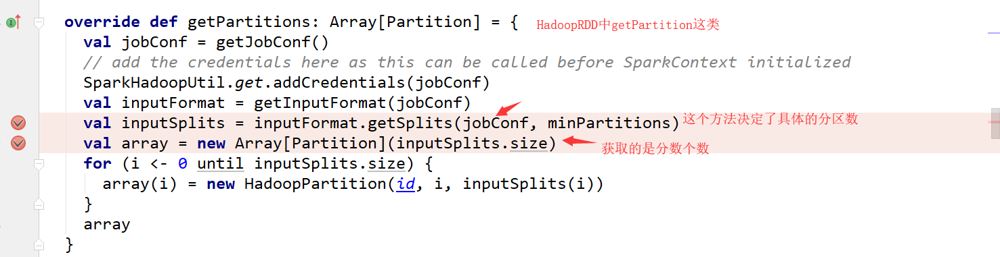

#### 3.25.15 RDD概念（重要）

RDD（Resilient Distributed Dataset）叫做弹性分布式数据集，是Spark中最基本的数据抽象，它代表一个**不可变、可分区**、里面的元素可**并行计算**的集合。RDD具有数据流模型的特点：自动容错、位置感知性调度和可伸缩性。RDD允许用户在执行多个查询时显式地将工作集缓存在内存中，后续的查询能够重用工作集，这极大地提升了查询速度。

在之前学习MR的过程中对数据是没有进行抽象的,而在Spark中对数据进行了抽象,提供一些列处理方法也就是说RDD(弹性分布式数据集)，Spark计算的基石，为用户屏蔽了底层对数据的复杂抽象和处理，为用户提供了一组方便的数据转换与求值方法。

现在开发的过程中都是面向对象的思想,那么我们创建类的时候会对类封装一些属性和方法,那么创建出来的对象就具备着这些属性和方法,类也属于对数据的抽象,而Spark中的RDD就是对操作数据的一个抽象

查看原码可以得知,而且在类中提供了很多方法可以使用


总结:

在 Spark 中，对数据的所有操作不外乎创建 RDD、转化已有RDD 以及调用 RDD 操作进行求值。每个 RDD 都被分为多个分区，这些分区运行在集群中的不同节点上。RDD 可以包含 Python、Java、Scala 中任意类型的对象， 甚至可以包含用户自定义的对象。RDD具有数据流模型的特点：自动容错、位置感知性调度和可伸缩性。RDD允许用户在执行多个查询时显式地将工作集缓存在内存中，后续的查询能够重用工作集，这极大地提升了查询速度。

##### RDD做了什么

```scala
sc.textFile(“xx").flatMap(_.split("")).map((_,1)).reduceByKey(_+_).saveAsTextFile(“xx")
```


总结:

RDD的创建->RDD的转换(转换过程中为了减少数据计算有添加缓存)->RDD的行动(输出数据)

RDD的属性 

RDD原码中提供了说明


1）一组分片（Partition），即数据集的基本组成单位。对于RDD来说，每个分片都会被一个计算任务处理，并决定并行计算的粒度。用户可以在创建RDD时指定RDD的分片个数，如果没有指定，那么就会采用默认值。默认值就是程序所分配到的CPU Core的数目。

2）一个计算每个分区的函数。Spark中RDD的计算是以分片为单位的，每个RDD都会实现compute函数以达到这个目的。compute函数会对迭代器进行复合，不需要保存每次计算的结果。

3）RDD之间的依赖关系。RDD的每次转换都会生成一个新的RDD，所以RDD之间就会形成类似于流水线一样的前后依赖关系。在部分分区数据丢失时，Spark可以通过这个依赖关系重新计算丢失的分区数据，而不是对RDD的所有分区进行重新计算。

4）一个Partitioner，即RDD的分片函数。当前Spark中实现了两种类型的分片函数，一个是基于哈希的HashPartitioner，另外一个是基于范围的RangePartitioner。只有对于key-value的RDD，才会有Partitioner，非key-value的RDD的Parititioner的值是None。Partitioner函数不但决定了RDD本身的分片数量，也决定了parent RDD Shuffle输出时的分片数量。

5）一个列表，存储存取每个Partition的优先位置（preferred location）。对于一个HDFS文件来说，这个列表保存的就是每个Partition所在的块的位置。按照“移动数据不如移动计算”的理念，Spark在进行任务调度的时候，会尽可能地将计算任务分配到其所要处理数据块的存储位置。

总结(RDD的五大特征):

1.RDD可以看做是一些列partition所组成的

2.RDD之间的依赖关系

3.算子是作用在partition之上的

4.分区器是作用在kv形式的RDD上

5.partition提供的最佳计算位置,利于数据处理的本地化即计算向数据移动而不是移动数据

ps:RDD本身是不存储数据,可以看做RDD本身是一个引用数据

##### RDD弹性

1) 自动进行内存和磁盘数据存储的切换

​    Spark优先把数据放到内存中，如果内存放不下，就会放到磁盘里面，程序进行自动的存储切换

2) 基于血统的高效容错机制

​    在RDD进行转换和动作的时候，会形成RDD的Lineage依赖链，当某一个RDD失效的时候，可以通过重新计算上游的RDD来重新生成丢失的RDD数据。

3) Task如果失败会自动进行特定次数的重试

​    RDD的计算任务如果运行失败，会自动进行任务的重新计算，默认次数是4次。

4) Stage如果失败会自动进行特定次数的重试

​    如果Job的某个Stage阶段计算失败，框架也会自动进行任务的重新计算，默认次数也是4次。

5) Checkpoint和Persist可主动或被动触发

​    RDD可以通过Persist持久化将RDD缓存到内存或者磁盘，当再次用到该RDD时直接读取就行。也可以将RDD进行检查点，检查点会将数据存储在HDFS中，该RDD的所有父RDD依赖都会被移除。

6) 数据调度弹性

​    Spark把这个JOB执行模型抽象为通用的有向无环图DAG，可以将多Stage的任务串联或并行执行，调度引擎自动处理Stage的失败以及Task的失败。

7) 数据分片的高度弹性

​    可以根据业务的特征，动态调整数据分片的个数，提升整体的应用执行效率。

​    RDD全称叫做弹性分布式数据集(Resilient Distributed Datasets)，它是一种分布式的内存抽象，表示一个只读的记录分区的集合，它只能通过其他RDD转换而创建，为此，RDD支持丰富的转换操作(如map, join, filter, groupBy等)，通过这种转换操作，新的RDD则包含了如何从其他RDDs衍生所必需的信息，所以说RDDs之间是有依赖关系的。基于RDDs之间的依赖，RDDs会形成一个有向无环图DAG，该DAG描述了整个流式计算的流程，实际执行的时候，RDD是通过血缘关系(Lineage)一气呵成的，即使出现数据分区丢失，也可以通过血缘关系重建分区，总结起来，基于RDD的流式计算任务可描述为：从稳定的物理存储(如分布式文件系统)中加载记录，记录被传入由一组确定性操作构成的DAG，然后写回稳定存储。另外RDD还可以将数据集缓存到内存中，使得在多个操作之间可以重用数据集，基于这个特点可以很方便地构建迭代型应用(图计算、机器学习等)或者交互式数据分析应用。可以说Spark最初也就是实现RDD的一个分布式系统，后面通过不断发展壮大成为现在较为完善的大数据生态系统，简单来讲，Spark-RDD的关系类似于Hadoop-MapReduce关系。

总结:

存储的弹性：内存与磁盘的

自动切换容错的弹性：数据丢失可以

自动恢复计算的弹性：计算出错重试机制

分片的弹性：根据需要重新分片

#### 3.25.16 创建RDD的二种方式（重要）

1.从集合中创建RDD

```scala
    val conf = new SparkConf().setAppName("Test").setMaster("local")
      val sc = new SparkContext(conf)
      //这两个方法都有第二参数是一个默认值2  分片数量(partition的数量)
      //scala集合通过makeRDD创建RDD,底层实现也是parallelize
      val rdd1 = sc.makeRDD(Array(1,2,3,4,5,6))
     //scala集合通过parallelize创建RDD
      val rdd2 = sc.parallelize(Array(1,2,3,4,5,6))
```

2.从外部存储创建RDD

```scala
     //从外部存储创建RDD
      val rdd3 = sc.textFile("hdfs://hadoop01:8020/word.txt")
```

## RDD编程API

RDD支持两种操作:转化操作和行动操作。RDD 的转化操作是返回一个新的 RDD的操作，比如 map()和 filter()，而行动操作则是向驱动器程序返回结果或把结果写入外部系统的操作。比如 count() 和 first()。 

Spark采用惰性计算模式，RDD只有第一次在一个行动操作中用到时，才会真正计算。Spark可以优化整个计算过程。默认情况下，Spark 的 RDD 会在你每次对它们进行行动操作时重新计算。如果想在多个行动操作中重用同一个 RDD，可以使用 RDD.persist() 让 Spark 把这个 RDD 缓存下来。

#### 3.25.17 Transformation算子（重要）

RDD中的所有转换都是延迟加载的，也就是说，它们并不会直接计算结果。相反的，它们只是记住这些应用到基础数据集（例如一个文件）上的转换动作。只有当发生一个要求返回结果给Driver的动作时，这些转换才会真正运行。这种设计让Spark更加有效率地运行。

| **转换**                                                 | **含义**                                                     |
| -------------------------------------------------------- | ------------------------------------------------------------ |
| **map**(func)                                            | 返回一个新的RDD，该RDD由每一个输入元素经过func函数转换后组成 |
| **filter**(func)                                         | 返回一个新的RDD，该RDD由经过func函数计算后返回值为true的输入元素组成 |
| **flatMap**(func)                                        | 类似于map，但是每一个输入元素可以被映射为0或多个输出元素（所以func应该返回一个序列，而不是单一元素） |
| **mapPartitions**(func)                                  | 类似于map，但独立地在RDD的每一个分片上运行，因此在类型为T的RDD上运行时，func的函数类型必须是Iterator[T] => Iterator[U] |
| **mapPartitionsWithIndex**(func)                         | 类似于mapPartitions，但func带有一个整数参数表示分片的索引值，因此在类型为T的RDD上运行时，func的函数类型必须是(Int, Iterator[T]) => Iterator[U] |
| **sample**(withReplacement, fraction, seed)              | 根据fraction指定的比例对数据进行采样，可以选择是否使用随机数进行替换，seed用于指定随机数生成器种子 |
| **union**(otherDataset)                                  | 对源RDD和参数RDD求并集后返回一个新的RDD                      |
| **intersection**(otherDataset)                           | 对源RDD和参数RDD求交集后返回一个新的RDD                      |
| **distinct**([numTasks]))                                | 对源RDD进行去重后返回一个新的RDD                             |
| **groupByKey**([numTasks])                               | 在一个(K,V)的RDD上调用，返回一个(K, Iterator[V])的RDD        |
| **reduceByKey**(func, [numTasks])                        | 在一个(K,V)的RDD上调用，返回一个(K,V)的RDD，使用指定的reduce函数，将相同key的值聚合到一起，与groupByKey类似，reduce任务的个数可以通过第二个可选的参数来设置 |
| **aggregateByKey**(zeroValue)(seqOp, combOp, [numTasks]) | 相同的Key值进行聚合操作，在聚合过程中同样使用了一个中立的初始值zeroValue:中立值,定义返回value的类型，并参与运算seqOp:用来在同一个partition中合并值combOp:用来在不同partiton中合并值 |
| **sortByKey**([ascending], [numTasks])                   | 在一个(K,V)的RDD上调用，K必须实现Ordered接口，返回一个按照key进行排序的(K,V)的RDD |
| **sortBy**(func,[ascending], [numTasks])                 | 与sortByKey类似，但是更灵活                                  |
| **join**(otherDataset, [numTasks])                       | 在类型为(K,V)和(K,W)的RDD上调用，返回一个相同key对应的所有元素对在一起的(K,(V,W))的RDD |
| **cogroup**(otherDataset, [numTasks])                    | 在类型为(K,V)和(K,W)的RDD上调用，返回一个(K,(Iterable<V>,Iterable<W>))类型的RDD |
| **cartesian**(otherDataset)                              | 笛卡尔积                                                     |
| **pipe**(command, [envVars])                             | 将一些shell命令用于Spark中生成新的RDD                        |
| **coalesce**(numPartitions**)**                          | 重新分区                                                     |
| **repartition**(numPartitions)                           | 重新分区                                                     |
| **repartitionAndSortWithinPartitions**(partitioner)      | 重新分区和排序                                               |

#### 3.25.18 Action算子（重要）

在RDD上运行计算,并返回结果给Driver或写入文件系统    

| **动作**                                          | **含义**                                                     |
| ------------------------------------------------- | ------------------------------------------------------------ |
| **reduce**(*func*)                                | 通过func函数聚集RDD中的所有元素，这个功能必须是可交换且可并联的 |
| **collect**()                                     | 在驱动程序中，以数组的形式返回数据集的所有元素               |
| **count**()                                       | 返回RDD的元素个数                                            |
| **first**()                                       | 返回RDD的第一个元素（类似于take(1)）                         |
| **take**(*n*)                                     | 返回一个由数据集的前n个元素组成的数组                        |
| **takeSample**(*withReplacement*,*num*, [*seed*]) | 返回一个数组，该数组由从数据集中随机采样的num个元素组成，可以选择是否用随机数替换不足的部分，seed用于指定随机数生成器种子 |
| **takeOrdered**(*n*, *[ordering]*)                | takeOrdered和top类似，只不过以和top相反的顺序返回元素        |
| **saveAsTextFile**(*path*)                        | 将数据集的元素以textfile的形式保存到HDFS文件系统或者其他支持的文件系统，对于每个元素，Spark将会调用toString方法，将它装换为文件中的文本 |
| **saveAsSequenceFile**(*path*)                    | 将数据集中的元素以Hadoop sequencefile的格式保存到指定的目录下，可以使HDFS或者其他Hadoop支持的文件系统。 |
| **saveAsObjectFile**(*path*)                      |                                                              |
| **countByKey**()                                  | 针对(K,V)类型的RDD，返回一个(K,Int)的map，表示每一个key对应的元素个数。 |
| **foreach**(*func*)                               | 在数据集的每一个元素上，运行函数func进行更新。               |

#### 3.25.19 简单算子演示（重要）

```scala
 val conf = new SparkConf().setAppName("Test").setMaster("local")
      val sc = new SparkContext(conf)

    //通过并行化生成rdd
    val rdd = sc.parallelize(List(5,6,4,7,3,8,2,9,10))

    //map:对rdd里面每一个元乘以2然后排序
    val rdd2: RDD[Int] = rdd.map(_ * 2)
    //collect以数组的形式返回数据集的所有元素(是Action算子)
    println(rdd2.collect().toBuffer)

    //filter:该RDD由经过func函数计算后返回值为true的输入元素组成
    val rdd3: RDD[Int] = rdd2.filter(_ > 10)
    println(rdd3.collect().toBuffer)

    val rdd4 = sc.parallelize(Array("a b c","b c d"))
    //flatMap:将rdd4中的元素进行切分后压平
    val rdd5: RDD[String] = rdd4.flatMap(_.split(" "))
    println(rdd5.collect().toBuffer)
    //假如: List(List("a b", "b c"),List("e c", " i o"))
    //压平 flatMap(_.flatMap(_.split(" ")))
    
    //sample随机抽样
    //withReplacement表示是抽出的数据是否放回，true为有放回的抽样，false为无放回的抽样
    //fraction抽样比例例如30% 即0.3 但是这个值是一个浮动的值不准确
    //seed用于指定随机数生成器种子 默认参数不传
    val rdd = sc.parallelize(1 to 10)
    val sample = rdd.sample(false,0.5)
    println(sample.collect().toBuffer)

    //union:求并集
    val rdd6 = sc.parallelize(List(5,6,7,8))
    val rdd7 = sc.parallelize(List(1,2,5,6))
    val rdd8 = rdd6 union rdd7
    println(rdd8.collect.toBuffer)

    //intersection:求交集
    val rdd9 = rdd6 intersection rdd7
    println(rdd9.collect.toBuffer)

    //distinct:去重出重复
    println(rdd8.distinct.collect.toBuffer)

    //join相同的key会被合并
    val rdd10_1 = sc.parallelize(List(("tom",1),("jerry" ,3),("kitty",2)))
    val rdd10_2 = sc.parallelize(List(("jerry" ,2),("tom",2),("dog",10)))
    val rdd10_3 = rdd10_1 join rdd10_2
    println(rdd10_3.collect().toBuffer)
    
    //左连接和右连接
    //除基准值外是Option类型,因为可能存在空值所以使用Option
    val rdd10_4 = rdd10_1 leftOuterJoin rdd10_2 //以左边为基准没有是null
    val rdd10_5 = rdd10_1 rightOuterJoin rdd10_2 //以右边为基准没有是null
    println(rdd10_4.collect().toList)
    println(rdd10_5.collect().toBuffer)

    val rdd11_1 = sc.parallelize(List(("tom",1),("jerry" ,3),("kitty",2)))
    val rdd11_2 = sc.parallelize(List(("jerry" ,2),("tom",2),("dog",10)))
    //笛卡尔积
    val rdd11_3 = rdd11_1 cartesian rdd11_2
    println(rdd11_3.collect.toBuffer)
  
   //根据传入的参数进行分组
    val rdd11_5_1 = rdd11_4.groupBy(_._1)
    println(rdd11_5_1.collect().toList)

    //按照相同key进行分组,并且可以制定分区
    val rdd11_5_2 = rdd11_4.groupByKey
    println(rdd11_5_2.collect().toList)

    //根据相同key进行分组[分组的话需要二元组]
    //cogroup 和 groupBykey的区别
    //cogroup不需要对数据先进行合并就以进行分组 得到的结果是 同一个key 和不同数据集中的数据集合
    //groupByKey是需要先进行合并然后在根据相同key进行分组
    val rdd11_6: RDD[(String, (Iterable[Int], Iterable[Int]))] = rdd11_1 cogroup rdd11_2
    println(rdd11_6)
    
```

#### 3.25.20进阶算子演示（重要）

```scala
  val it = (index:Int,iter:Iterator[(Int)]) =>{
    iter.map(x => "[partID:"+index + ", value:"+x+"]")
  }
  def func[T](index:Int,iter:Iterator[(T)]): Iterator[String] ={
    iter.map(x => "[partID:"+index+" value:"+x+"]")
  }
  def main(args: Array[String]): Unit = {
    //遍历出集合中每一个元素
    val conf = new SparkConf().setAppName("OOP").setMaster("local")
    val sc = new SparkContext(conf)

    //遍历出集合中每一个元素
    /*
    mapPartitions是对每个分区中的数据进行迭代
    第一个参数是迭代器送对象, 第二个参数表示是否保留父RDD的partition分区信息
    第二个参数的值默认是false一般是不修改(父RDD就需要使用到宽窄依赖的问题)
    (f: Iterator[T] => Iterator[U],preservesPartitioning: Boolean = false)
    ps:第一个_是迭代器对象 第二个_是分区(集合)中数据
    如果RDD数据量不大,建议采用mapPartition算子代替map算子,可以加快数据量的处理数据
    但是如果RDD中数据量过大比如10亿条,不建议使用mapPartitions开进行数据遍历,可能出现oom内存溢出错误
    */
    val rdd1 = sc.parallelize(List(1,2,3,4,5,6),3)
    val rdd2: RDD[Int] = rdd1.mapPartitions(_.map(_*10))
    println(rdd2.collect().toList)

    /*
    mapPartitionsWithIndex 是对rdd中每个分区的遍历出操作
    (f: (Int, Iterator[T]) => Iterator[U],preservesPartitioning: Boolean = false)
    参数是一个柯里化 第二个参数是一个隐式转换
    函数的作用和mapPartitions是类似,不过要提供两个采纳数,第一个参数是分区号
    第二个参数是分区中元素存储到Iterator中(就可以操作这个Iterator)
    第三个参数是否保留符RDD的partitoin
    */
    val rdd3: RDD[String] = rdd1.mapPartitionsWithIndex(Iter)
    println(rdd3.collect().toList)

    //排序
    /*
    sortBykey
    根据key进行排序,但是key必须实现Ordered接口
    可根据传入的true 或 false 决定是升序 还是 降序
    参数默认是true
     */
    val rdd4 = sc.parallelize(Array((3,"aa"),(6,"cc"),(2,"bb"),(1,"dd")))
    val sorted: RDD[(Int, String)] = rdd4.sortByKey()
    println(sorted.collect().toList)
    /*
    sortBy与sortByKey类似,但是更灵活,可以用func先对数据进行处理,
    然后按处理后的数据比较结果排序
    第一个参数:是处理数据的方式
    第二个参数:是排序方式 默认是true 升序
     */
    val rdd5 = sc.parallelize(List(5,6,4,7,3,8,2,9,10))
    val rdd5_1: RDD[Int] = rdd5.sortBy(x => x, true)
    println(rdd5_1.collect().toBuffer)

    //重新分区
    val rdd6 = sc.parallelize(List(1,2,3,4,5,6),3)
    println("初始化分区:"+rdd6.partitions.length)
    /*
    更改分区repartition可以从少量分区改变为多分区因为会发生shuffle
    根据分区数，从新通过网络随机洗牌所有数据。
     */
    val reps1 = rdd6.repartition(5)
    println("通过repartiton调整分区后的分区:"+ reps1.partitions.length)
    /*
    更改分区 不可以少量分区更改为多分区,因为不会发生shuffle
    缩减分区数，用于大数据集过滤后，提高小数据集的执行效率。
     */
    val reps2 = rdd6.coalesce(5)
    println("通过coalesce调整分区后的分区:"+ reps2.partitions.length)

    val rdd6_1 = sc.parallelize(List(("e",5),("c",3),("d",4),("c",2),("a",1)),2)
    //可以传入自定分区器, 也可以传入默认分区器 HashPartitioner
    val reps3: RDD[(String, Int)] = rdd6_1.partitionBy(new HashPartitioner(4))
    println(reps3.partitions.length)
      
    /*
    repartitionAndSortWithinPartitions算子是repartition算子的变种，与repartition算子不同的是，
    repartitionAndSortWithinPartitions在给定的partition内部进行排序，性能比repartition要高。
    ps: 必须是可排序的二元组 会根据key值排序
        参数可以是系统分区 也可以是自定义分区
   官方建议，如果需要在repartition重分区之后，还要进行排序，建议直接使用repartitionAndSortWithinPartitions算子。
   因为该算子可以一边进行重分区的shuffle操作，一边进行排序。shuffle与sort两个操作同时进行，
   比先shuffle再sort来说，性能可能是要高的
     */
   rdd4.repartitionAndSortWithinPartitions(new HashPartitioner(1)).foreach(println)

   //求和
   /*
   使用指定的reduce函数，将相同key的值聚合到一起
    */
    val rdd7 = sc.parallelize(Array(("tom",1),("jerry" ,3),("kitty",2),("jerry" ,2),("tom",2),("dog",10)))
    val rdd7_1: RDD[(String, Int)] = rdd7.reduceByKey(_ + _)
    println(rdd7_1.collect().toList)
    /*
    aggregateByKey[U: ClassTag](zeroValue: U)(seqOp: (U, V) => U,combOp: (U, U) => U)
    在kv对的RDD中，，按key将value进行分组合并，合并时，将每个value和初始值作为seq函数的参数，
    进行计算，返回的结果作为一个新的kv对，然后再将结果按照key进行合并，
    最后将每个分组的value传递给comb函数进行计算（先将前两个value进行计算，将返回结果和下一个value传给comb函数，以此类推），
    将key与计算结果作为一个新的kv对输出。 seqOp函数用于在每一个分区中用初始值逐步迭代value，combOp函数用于合并每个分区中的结果
    zeroValue是初始值(默认值) seqOP局部聚合(分区)  combOp 全局聚合
     */
    val rdd8 = sc.parallelize(List(("cat",2),("cat",5),("pig",10),("dog",3),("dog",4),("cat",4)),2)
    println("-------------------------------------华丽的分割线------------------------------------------")
    println(rdd8.mapPartitionsWithIndex(func).collect.toList)
    /*
    因为第一次给的数值每个分区中是没有相同key所有都是最大值,所有就相当于值都值相加了
    第二次将同一个分区中的key有相同
    首先会根据相同key来进行计算,以cat为例先会和初始值-进行计算比较留下最大值
    然后会的等待第二分区完成计算,然后在进行一个全局的聚合
    */
    val value: RDD[(String, Int)] = rdd8.aggregateByKey(0)(math.max(_,_),_+_)
    println(value.collect.toBuffer)
    /*
    combineByKey[C](createCombiner: V => C,mergeValue: (C, V) => C,mergeCombiners: (C, C) => C)
    对相同Key，把Value合并成一个集合.
    createCombiner: combineByKey() 会遍历分区中的所有元素，因此每个元素的键要么还没有遇到过，
                   要么就和之前的某个元素的键相同。如果这是一个新的元素,combineByKey() 
                   会使用一个叫作 createCombiner() 的函数来创建那个键对应的累加器的初始值
    mergeValue: 如果这是一个在处理当前分区之前已经遇到的键， 它会使用 mergeValue() 
                 方法将该键的累加器对应的当前值与这个新的值进行合并
    mergeCombiners: 由于每个分区都是独立处理的， 因此对于同一个键可以有多个累加器。
                    如果有两个或者更多的分区都有对应同一个键的累加器， 
                    就需要使用用户提供的 mergeCombiners() 方法将各个分区的结果进行合并。
     */
    val rdd9 = sc.parallelize(List(("cat",2),("cat",5),("pig",10),("dog",3),("dog",4),("cat",4)),2)
    val rdd9_1: RDD[(String, Int)] = rdd9.combineByKey(x => x, (a:Int, b:Int)=>a+b, (m:Int, n:Int)=> m + n)
    println(rdd9_1.collect().toList)
```

#### 3.25.21 Action算子和其他算子（重要）

```scala
 val conf = new SparkConf().setAppName("Test").setMaster("local[*]")
    val sc = new SparkContext(conf)
    /* Action 算子*/
    //集合函数
    val rdd1 = sc.parallelize(List(2,1,3,6,5),2)
    val rdd1_1 = rdd1.reduce(_+_)
    println(rdd1_1)
    //以数组的形式返回数据集的所有元素
    println(rdd1.collect().toBuffer)
    //返回RDD的元素个数
    println(rdd1.count())
    //取出对应数量的值 默认降序, 若输入0 会返回一个空数组
    println(rdd1.top(3).toBuffer)
    //顺序取出对应数量的值
    println(rdd1.take(3).toBuffer)
    //顺序取出对应数量的值 默认生序
    println(rdd1.takeOrdered(3).toBuffer)
    //获取第一个值 等价于 take(1)
    println(rdd1.first())
    //将处理过后的数据写成文件(存储在HDFS或本地文件系统)
    //rdd1.saveAsTextFile("dir/file1")
    //统计key的个数并生成map k是key名 v是key的个数
    val rdd2 = sc.parallelize(List(("key1",2),("key2",1),("key3",3),("key4",6),("key5",5)),2)
    val rdd2_1: collection.Map[String, Long] = rdd2.countByKey()
    println(rdd2_1)
    //遍历数据
    rdd1.foreach(x => println(x))

    /*其他算子*/
    //统计value的个数 但是会将集合中的一个元素看做是一个vluae
    val value: collection.Map[(String, Int), Long] = rdd2.countByValue
    println(value)
    //filterByRange:对RDD中的元素进行过滤,返回指定范围内的数据
    val rdd3 = sc.parallelize(List(("e",5),("c",3),("d",4),("c",2),("a",1)))
    val rdd3_1: RDD[(String, Int)] = rdd3.filterByRange("c","e")//包括开始和结束的
    println(rdd3_1.collect.toList)
    //flatMapValues对参数进行扁平化操作,是value的值
    val rdd3_2 = sc.parallelize(List(("a","1 2"),("b","3 4")))
    println( rdd3_2.flatMapValues(_.split(" ")).collect.toList)
    //foreachPartition 循环的是分区数据
    // foreachPartiton一般应用于数据的持久化,存入数据库,可以进行分区的数据存储
    val rdd4 = sc.parallelize(List(1,2,3,4,5,6,7,8,9),3)
    rdd4.foreachPartition(x => println(x.reduce(_+_)))
    //keyBy 以传入的函数返回值作为key ,RDD中的元素为value 新的元组
    val rdd5 = sc.parallelize(List("dog","cat","pig","wolf","bee"),3)
    val rdd5_1: RDD[(Int, String)] = rdd5.keyBy(_.length)
    println(rdd5_1.collect.toList)
    //keys获取所有的key  values 获取所有的values
    println(rdd5_1.keys.collect.toList)
    println(rdd5_1.values.collect.toList)
    //collectAsMap  将需要的二元组转换成Map
    val map: collection.Map[String, Int] = rdd2.collectAsMap()
    println(map)
```

## 3.25.22 TextFile分区问题（重要）

```scala
val rdd1 = sc.parallelize(List(2,3,4,1,7,5,6,9,8))
获取分区的个数:rdd1.partitions.length,在spark-shell中没有指定分区的个数获取的是默认分区数,除了这个外parallelize方法可以使用,指定几个分区就会有几个分区出现

val rdd1 = sc.textFile("hdfs://hadoop02:8020/word.txt",3).flatMap _.split('')).map((_,1)).reduceByKey(_+_)
textFile这个方法是有默认值就是2 除非改变loacl中的即默认值这个只要这个默认值小于2的话会使用小于默认的值
```


这个默认属性是有值的defaultMinPartitions


如果在textfile中传入了分区数,那么这个分区数可能相同也可能不同需要看底层计算!





下面就是分片了,这个就是为什么textfile传入的参数和实际输出的分区可能不符合的原因

总结:

在textFile中没有指定分区的情况下都是默认大小2,除非指定小于2的值

若在textFile中指定了分区,name切分文件工作，实际上是计算出多少切分大小即多少切分一下，然后将文件按照这个大小切分成多份，最后partition数就是切分文件的个数


