#### 3.25.23案例练习:统计广告ID（重要）

```scala
数据格式: timestamp   province   city	userid	adid
		 时间点 	  省份	   城市	用户     广告
用户ID范围:0-99
省份,城市,ID相同:0-9
adid:0-19
需求:统计每一个省份点击TOP3的广告ID 
object OOP {
  def main(args: Array[String]): Unit = {
    //创建sparkConf对象
    val conf = new SparkConf().setAppName("OOP").setMaster("local[*]")
    //创建sparkcontext对象
    val sc = new SparkContext(conf)
    //需求：统计每一个省份点击TOP3的广告ID
    //读取数据 RDD[String]
    val logs = sc.textFile("dir/file2/Advert.log")
    //将RDD中的String转换为数组 RDD[Array[String]]
    val logsArray = logs.map(x => x.split("\t"))
    //提取相应的数据，转换粒度 RDD[( pro_adid, 1 )]
    val proAndAd2Count = logsArray.map(x => (x(1) + "_" + x(4), 1))
    //将每一个省份每一个广告的所有点击量聚合 RDD[( pro_adid, sum )]
    val proAndAd2Sum = proAndAd2Count.reduceByKey((x, y) => x + y)
    //将粒度扩大， 拆分key， RDD[ ( pro, (sum, adid) ) ]
    val pro2AdSum = proAndAd2Sum.map { x =>
        val param = x._1.split("_");
        (param(0), (param(1), x._2)) 
    }
    //将每一个省份所有的广告合并成一个数组 RDD[ (pro, Array[ (adid, sum) ]) ]
    val pro2AdArray = pro2AdSum.groupByKey()
    //排序取前3                                     sortWith(lt: (A, A) => Boolean)
    val result = pro2AdArray.mapValues(values => values.toList.sortWith((x, y) => x._2 > y._2).take(3))
    //行动操作
    val map: collection.Map[String, List[(String, Int)]] = result.collectAsMap()
    println(map)
    //关闭SparkContext
    sc.stop()
  }
}

因为需要将日期转换为具体的时间，所以需要使用到一个日期转换工具类
在pom文件中添加配置：
<dependency>
    <groupId>joda-time</groupId>
    <artifactId>joda-time</artifactId>
    <version>2.0</version>
</dependency>

import org.apache.spark.{HashPartitioner, SparkConf, SparkContext}
import org.apache.spark.rdd.RDD
import org.joda.time.DateTime
需求：统计每一个省份每一个小时的TOP3广告ID 
object OOP {
  def getHour(timelong: String): String = {
    val datetime = new DateTime(timelong.toLong)
    datetime.getHourOfDay.toString
  }
  def main(args: Array[String]): Unit = {
    //创建sparkConf对象
    val conf = new SparkConf().setAppName("OOP").setMaster("local[*]")
    //创建sparkcontext对象
    val sc = new SparkContext(conf)
    //需求：统计每一个省份点击TOP3的广告ID
    //读取数据 RDD[String]
    val logs = sc.textFile("dir/file2/Advert.log")
    //将RDD中的String转换为数组 RDD[Array[String]]
    val logsArray = logs.map(x => x.split("\t"))
    //产生最小粒度  RDD[ ( pro_hour_ad , 1 ) ]
    val pro_hour_ad2Count = logsArray.map { x =>
      (x(1) + "_" + getHour(x(0)) + "_" + x(4), 1)
    }
    //计算每一个省份每一个小时每一个广告的点击总量  RDD[ ( pro_hour_ad , sum ) ]
    val pro_hour_ad2Sum = pro_hour_ad2Count.reduceByKey(_ + _)
    //拆分key，扩大粒度  RDD[ ( pro_hour , (ad, sum) ) ]
    val pro_hour2AdArray = pro_hour_ad2Sum.map{x =>
      val param = x._1.split("_")
      (param(0) + "_" + param(1), (param(2), x._2))
    }
    //将一个省份一个小时内的数据聚合 RDD[ ( pro_hour , Array[ (ad, sum) ] ) ]
    val pro_hour2AdGroup = pro_hour2AdArray.groupByKey()
    //直接对一个小时内的广告排序，取前三
    val  pro_hour2Top3AdArray = pro_hour2AdGroup.mapValues(x => x.toList.sortWith((x,y) => x._2 > y._2).take(3))
    //扩大粒度， RDD[ ( pro , (hour, Array[(ad, sum)])  ) ]
    val pro2hourAdArray = pro_hour2Top3AdArray.map{x =>
      val param = x._1.split("_")
      (param(0), (param(1), x._2))
    }
    val result2 = pro2hourAdArray.groupByKey()
    val map: collection.Map[String, Iterable[(String, List[(String, Int)])]] = result2.collectAsMap()
    println(map)
    //关闭SparkContext
    sc.stop()
  }
}
```

#### 3.25.24 基站停留时间TopN（重要）

```scala
根据用户产生日志的信息,在那个基站停留时间最长
19735E1C66.log  这个文件中存储着日志信息
文件组成:手机号,时间戳,基站ID 连接状态(1连接 0断开)
lac_info.txt 这个文件中存储基站信息
文件组成  基站ID, 经,纬度
在一定时间范围内,求所用户经过的所有基站所停留时间最长的Top2
思路:
1.获取用户产生的日志信息并切分
2.用户在基站停留的总时长
3.获取基站的基础信息
4.把经纬度的信息join到用户数据中
5.求出用户在某些基站停留的时间top2


import org.apache.spark.rdd.RDD
import org.apache.spark.{SparkConf, SparkContext}
object BaseStationDemo {
  def main(args: Array[String]): Unit = {
    //1.创建SparkConf对象进行配置,然后在创建SparkContext进行操作
     val conf = new SparkConf().setAppName("BaseStationDemo").setMaster("local[2]")
     val sc = new SparkContext(conf)

    //2.获取用户访问基站的log日志
    //ps:因为使用是绝对路径所以,你在使用时候需要修改这个路径
    val files: RDD[String] = sc.textFile("C:\\Users\\Administrator\\Desktop\\lacduration\\log")

    //3.切分用户log日志
    val userInfo: RDD[((String, String), Long)] = files.map(line => {
      val fields: Array[String] = line.split(",") //切分
      val phone = fields(0) //用户手机号
      val time = fields(1).toLong //时间戳(数字)
      val lac = fields(2) //基站ID
      val eventType = fields(3)
      //时间类型(连接后断开)
      //连接时长需要进行一个区分,因为进入基站范围内有两种状态,这个状态决定时间的开始于结束
      val time_long = if (eventType.equals("1")) -time else time
      //元组 手机号和基站作为key  时间作为value
      ((phone, lac), time_long)
    })
    //用户在相同基站所停留总时长
    val sumed: RDD[((String, String), Long)] = userInfo.reduceByKey(_+_)

    //为了便于和基站信息进行join此时需要将数据进行一次调整
    //基站ID作为key  手机号和时长作为value
    val lacAndPT: RDD[(String, (String, Long))] = sumed.map(tup => {
      val phone = tup._1._1
      //用户手机号
      val lac = tup._1._2 //基站ID
      val time = tup._2 //用户在某个基站所停留的总时长
      (lac, (phone, time))
    })

    //获取基站的基础数据
    val lacInfo = sc.textFile("C:\\Users\\Administrator\\Desktop\\lacduration\\lac_info.txt")

    //切分基站的书数据
    val lacAndXY: RDD[(String, (String, String))] = lacInfo.map(line => {
      val fields: Array[String] = line.split(",")
      val lac = fields(0) //基站ID
      val x = fields(1) // 经度
      val y = fields(2) //纬度
      (lac, (x, y))
    })

    //把经纬度的信息join到用户信息中
     val joined: RDD[(String, ((String, Long), (String, String)))] = lacAndPT join lacAndXY

    //为了方便以后的分组排序,需要进行数据整合
    val phoneAndTXY: RDD[(String, Long, (String, String))] = joined.map(tup => {
      val phone = tup._2._1._1 //手机号
      val time = tup._2._1._2 //时长
      val xy: (String, String) = tup._2._2 //经纬度
      (phone, time, xy)
    })

    //按照用户的手机号进行分组
    val grouped: RDD[(String, Iterable[(String, Long, (String, String))])] = phoneAndTXY.groupBy(_._1)
    //按照时长进行组内排序
     val sorted: RDD[(String, List[(String, Long, (String, String))])] = grouped.mapValues(_.toList.sortBy(_._2).reverse)

    //数据进行整合
   val res: RDD[(String, List[(Long, (String, String))])] = sorted.map(tup => {
     val phone = tup._1
     //手机号
     val list = tup._2 //存储数据的集合
     val filterList = list.map(tup1 => { //这个集合中的手机号顾虑掉
       val time = tup1._2 //时长
     val xy = tup1._3
       (time, xy)
     })
     (phone, filterList)
   })
    //取值
    val ress = res.mapValues(_.take(2))
    println(ress.collect.toList)
    sc.stop()
  }
}
```

#### 3.25.25 RDD的对象传递

```scala
主要是序列化的问题,对象在JVM中表示的方式是字节
序列化的产生是为了分布式的程序,现在需要将这个对象从Driver传递给Executor,那么传递的过程中需要的是010101这样的字节,那么对面接收的字节如何获取,那么就需要使用序列化
那么说一个场景:
	spark是一个分布式的计算框架,当从Driver端将对象传递到Executor的时候就需要进行序列化
//定义了一个类这里有一个query的参数并进行了序列化
class SearchFunctions(val query: String) extends Serializable{
    //第一个方法是判断输入的字符串是否存在query 存在返回true,不存在返回false
	def isMatch(s: String): Boolean = {
    	s.contains(query)
	}
	def getMatchesFunctionReference(rdd: org.apache.spark.rdd.RDD[String]): 
		org.apache.spark.rdd.RDD[String] = {
    	// 问题:"isMatch"表示"this.isMatch"，因此我们要传递整个"this" 
    	rdd.filter(isMatch)
	}
	def getMatchesFieldReference(rdd: org.apache.spark.rdd.RDD[String]): 					org.apache.spark.rdd.RDD[String] = { 
			// 问题:"query"表示"this.query"，因此我们要传递整个"this" 	
			rdd.filter(x => x.contains(query)) 
	}
	def getMatchesNoReference(rdd: org.apache.spark.rdd.RDD[String]):
		org.apache.spark.rdd.RDD[String] = { 
		// 安全:只把我们需要的字段拿出来放入局部变量中
    		val query_ = this.query    
			rdd.filter(x => x.contains(query_))
    } 
} 
object SearchFunctions {
  def main(args: Array[String]): Unit = {
    val conf: SparkConf = new SparkConf()
    conf.setAppName("SearchFunctions")
    conf.setMaster("local[2]")
    val sc: SparkContext = new SparkContext(conf)

    val rdd = sc.parallelize(List("hello java", "hello scala hello", "hello hello"))

    val sf = new SearchFunctions("hello")
    //    sf.getMatchesFunctionReference(rdd)
    //    sf.getMatchesFieldReference(rdd)
        sf.getMatchesNoReference(rdd)
  }
}
/**
上面这三个方法中可以发现,前两个方法都在隐式的而是用this关键字,也就是当前类需要进行传递到
到对应的rdd中,对应的rdd会在对应的节点上进行计算此时需要使用序列化这个类,而最后一个方法中
可以发现使用的是一个局部变量,而这个变量数据基础变量,此时不是当前类那么就不需要使用序列化
*/
总结:
1.如果DRR的转换操作中使用到了class的方法或者变量,那么该class需要支持序列化
2.如果通过局部变量的方式将class中的变量赋值为局部变量,那么不需要传递传递对象,比如最后一个方法
3.使用过程中尽量使用局部变量传递的方式，可以减少网络io
```

### RDD的运行

```scala
我们在以前书写代码的时候会发现,将每一个算子单独拿出来使用的,而spark使用的是scala的语言,那么必然可以使用链式编程,那么这个rdd为什么可以这样写如何执行的呢?
sc.textFile("xx").flatMap(_.split("")).map((_,1)).reduceByKey(_+_).saveAsTextFile("xx")

```

### 3.25.26 RDD的依赖关系（重要）

RDD和它依赖的父RDD（s）的关系有两种不同的类型，即窄依赖（narrow dependency）和宽依赖（wide dependency）。

##### 窄依赖

窄依赖指的是每一个父RDD的Partition最多被子RDD的一个Partition使用

总结：窄依赖我们形象的比喻为**独生子女**

##### 宽依赖

宽依赖指的是多个子RDD的Partition会依赖同一个父RDD的Partition

总结：宽依赖我们形象的比喻为**超生**

ps:宽依赖就会发生shuffle过程

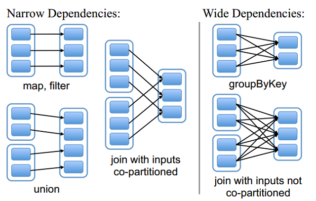

下图是原码中的一张图:可以发现一个问题Dependency(依赖)的意思

可以发现ShuffleDependency是其子类(即款依赖) 

​              NarrowDependency是其子类(即窄依赖) 

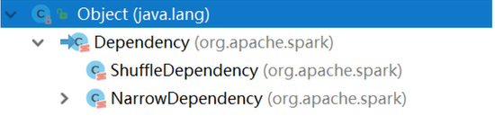

#### 3.25.27 DAG（Directed Acyclic Graph）有向无环图

如果一个有向图无法从某个顶点出发经过若干条边回到该点，则这个图是一个**有向无环图** 

有向图中一个点经过两种路线到达另一个点未必形成环，因此有向无环图未必能转化成树，但任何有向树均为有向无环图。 

ps:通俗的来说就是有方向,没有回流的图可以称为有向无环图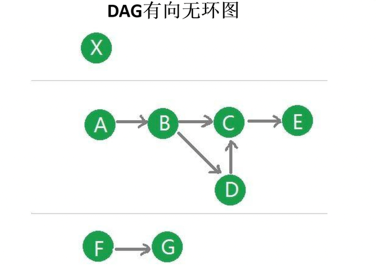

相对复杂的DAG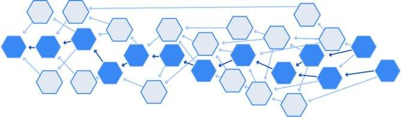

#### 3.25.28 RDD任务的切分

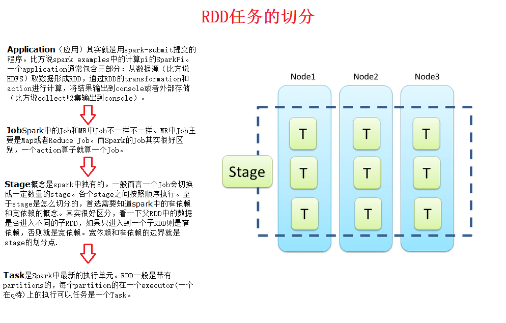

原始的RDD通过一系列的转换就就形成了DAG，根据RDD之间的依赖关系的不同将DAG划分成不同的Stage

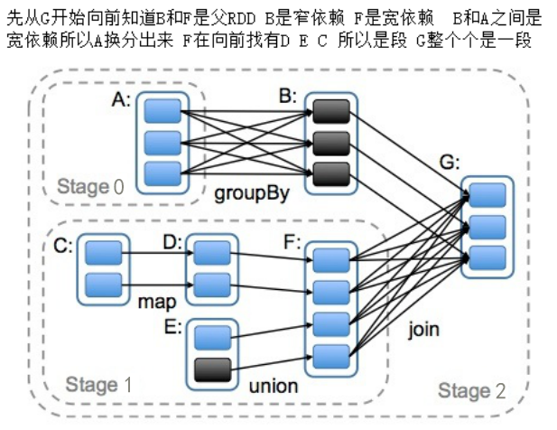

对于窄依赖，partition的转换处理在Stage中完成计算。对于宽依赖，由于有Shuffle的存在，只能在parent RDD处理完成后，才能开始接下来的计算，因此宽依赖是划分Stage的依据。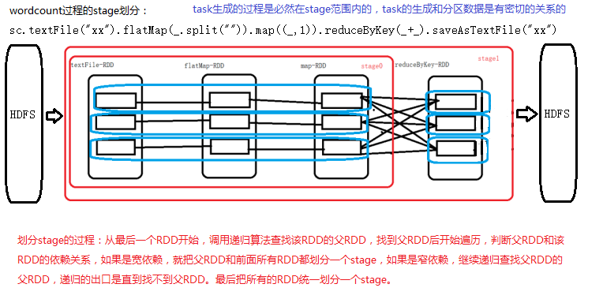

#### 3.25.29 webUI中查看Stage和Task

在spark-shell中执行wordcount

```scala
sc.textFile("hdfs://node01:9000/wc").flatMap(_.split(" ")).map((_,1)).reduceByKey(_+_).collect
```

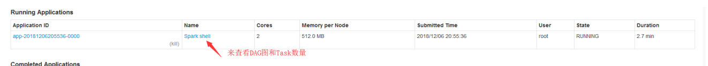

因为在计算的时候textFile默认是2个partition,整个计算流程是3个stage,实际得到的task应该会是6个,实际的个数是4个

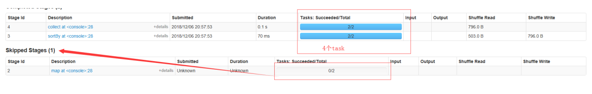

要是出现skipped那么就会减少对应的task,但是这是没有问题的并且是对    

任务出现skipped是正常的，之所以出现skipped是因为要计算的数据已经缓存到了内存，没有必要再重复计算。出现skipped对结果没有影响,并且也是一种计算优化    

在发生shuffle的过程中，会发生shuffle write和shuffle read。

shuffle write：发生在shuffle之前，把要shuffle的数据写到磁盘

为什么：为了保证数据的安全性、避免占用大量的内存

shuffle read：发生在shuffle之后，下游RDD读取上游RDD的数据的过程

#### 3.25.30 Lineage(血统)

RDD只支持粗粒度转换，即在大量记录上执行的单个操作。将创建RDD的一系列Lineage（即血统）记录下来，以便恢复丢失的分区。RDD的Lineage会记录RDD的元数据信息和转换行为，当该RDD的部分分区数据丢失时，它可以根据这些信息来重新运算和恢复丢失的数据分区。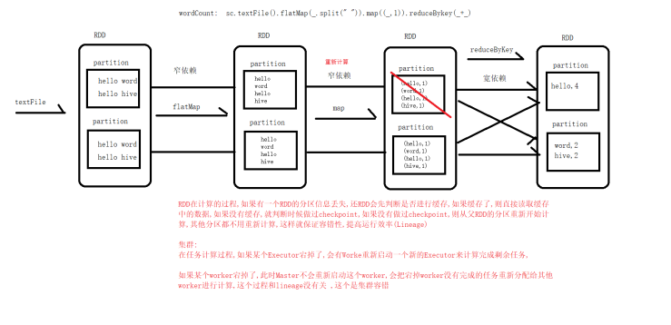

### 3.25.31案例练习:学科案例（重要）

```scala
import java.net.URL
import org.apache.spark.rdd.RDD
import org.apache.spark.{SparkConf, SparkContext}
/*
用户点击产生日志信息,有时间戳和对应URL
URL中会有不用学科,统计学科的访问量
需求:根据用访问数据进行统计用户对各个学科的各个模块的访问量Top3
思路:1.统计每个模块的访问量
2. 按照学科进行分组
3. 学科进行排序
4. 取top3
*/
object SubjectDemo {
def main(args: Array[String]): Unit = {
val conf = new SparkConf().setAppName("SubjectDemo").setMaster("local")
val sc = new SparkContext(conf)
// 1.对数据进行切分
val tuples: RDD[(String, Int)] =
sc.textFile("C:\\Users\\Administrator\\Desktop\\subjectaccess\\access.txt").map(line => {
val fields: Array[String] = line.split("\t")
//取出url
val url = fields(1)
(url, 1)
})
//将相同url进行聚合,得到了各个学科的访问量
val sumed: RDD[(String, Int)] = tuples.reduceByKey(_+_)
//从url中获取学科的字段 数据组成式 学科, url 统计数量
val subjectAndUC: RDD[(String, String, Int)] = sumed.map(tup => {
val url = tup._1 //用户url
val count = tup._2 // 统计的访问数量
val subject = new URL(url).getHost //学科
(subject, url, count)
})
//按照学科信息进行分组
val grouped: RDD[(String, Iterable[(String, String, Int)])] = subjectAndUC.groupBy(_._1)
//对分组数据进行组内排序
val sorted: RDD[(String, List[(String, String, Int)])] =
grouped.mapValues(_.toList.sortBy(_._3).reverse)
//取top3
val res: RDD[(String, List[(String, String, Int)])] = sorted.mapValues(_.take(3))
println(res.collect.toList)
sc.stop()
} 
}
```


#### 3.25.32 RDD的缓存(持久化)

Spark速度非常快的原因之一，就是在不同操作中可以在内存中持久化或缓存多个数据集。当持久化某个RDD后，每一个节点都将把计算的分片结果保存在内存中，并在对此RDD或衍生出的RDD进行的其他动作中重用。这使得后续的动作变得更加迅速。RDD相关的持久化和缓存，是Spark最重要的特征之一。可以说，缓存是Spark构建迭代式算法和快速交互式查询的关键。如果一个有持久化数据的节点发生故障，Spark 会在需要用到缓存的数据时重算丢失的数据分区。如果 希望节点故障的情况不会拖累我们的执行速度，也可以把数据备份到多个节点上。 

```scala
/**
RDD通过persist方法或cache方法可以将前面的计算结果缓存，但是并不是这两个方法被调用时立即缓存，而是触发后面的action时，该RDD将会被缓存在计算节点的内存中，并供后面重用
*/
/** Persist this RDD with the default storage level (`MEMORY_ONLY`). */
def persist(): this.type = persist(StorageLevel.MEMORY_ONLY)
/** Persist this RDD with the default storage level (`MEMORY_ONLY`). */
def cache(): this.type = persist()
存储时是有默认级别的 StorageLevel.MEMORY_ONLY (默认就是存到内存中)
```

```scala
useDisk: Boolean,useMemory: Boolean,useOffHeap: Boolean, deserialized:Boolean,replication: Int =1 决定了下面参数的传入方式
是否是用磁盘 是否使用内存 是否使用堆外内存 是否反序列化 副本的个数
object StorageLevel {
val NONE = new StorageLevel(false, false, false, false)
val DISK_ONLY = new StorageLevel(true, false, false, false)
val DISK_ONLY_2 = new StorageLevel(true, false, false, false, 2)
val MEMORY_ONLY = new StorageLevel(false, true, false, true)
val MEMORY_ONLY_2 = new StorageLevel(false, true, false, true, 2)
val MEMORY_ONLY_SER = new StorageLevel(false, true, false, false)
val MEMORY_ONLY_SER_2 = new StorageLevel(false, true, false, false, 2)
val MEMORY_AND_DISK = new StorageLevel(true, true, false, true)
val MEMORY_AND_DISK_2 = new StorageLevel(true, true, false, true, 2)
val MEMORY_AND_DISK_SER = new StorageLevel(true, true, false, false)
val MEMORY_AND_DISK_SER_2 = new StorageLevel(true, true, false, false, 2)
val OFF_HEAP = new StorageLevel(false, false, true, false)
}
ps:MEMORY_AND_DISK 先存储到内存中内存存储满了在存到磁盘
MEMORY_ONLY 内存只能存储内存大小的数据,超出的部分将不会再存储
因为内存中只存了一部分,少了一部分数据,这部分数据被加载时它会重新计算
堆外内存: 堆外内存是相对于对内内存而言,堆内内存是由JVM管理的,在平时java中创建对象都处于堆内内存,并且它是遵守JVM的内存管理规则(GC垃圾回收机制),那么堆外内存就是存在于JVM管控之外的一块内存,它不受JVM的管控约束缓存容易丢失,或者存储在内存的数据由于内存存储不足可能会被删掉.RDD的缓存容错机制保证了即缓存丢失也能保证正确的的计算出内容,通过RDD的一些列转换,丢失的数据会被重算,由于RDD的各个Partition是独立存在,因此只需要计算丢失部分的数据即可,并不需要计算全部的Partition
```

#### 3.25.33 案例练习: 学科案例cache缓存（重要）

```scala
/*缓存*/
import java.net.URL
import org.apache.spark.{HashPartitioner, SparkConf, SparkContext}
import org.apache.spark.rdd.RDD
object SubjectDemo2 {
  def main(args: Array[String]): Unit = {
    val conf = new SparkConf().setAppName("SubjectDemo").setMaster("local")
    val sc = new SparkContext(conf)
    //0.添加学科信息
    val subjects =  Array("http://java.learn.com","http://ui.learn.com",
           "http://bigdata.learn.com","http://h5.learn.com","http://android.learn.com")
    // 1.对数据进行切分
    val tuples: RDD[(String, Int)] = sc.textFile("C:\\Users\\Administrator\\Desktop\\subjectaccess\\access.txt").map(line => {
      val fields: Array[String] = line.split("\t")
      //取出url
      val url = fields(1)
      (url, 1)
    })
    //将相同url进行聚合,得到了各个学科的访问量
    /*
      缓存使用的场景:通常会将后期常用的数据进行缓存
      特别是发生shuffle后的数据,因为shuffle过程的代价太大,所以经常在shuffle后进行缓存
      cache默认是缓存到内存中,cache是transformation函数,所以需要一个action算子触发
     */
    val sumed: RDD[(String, Int)] = tuples.reduceByKey(_+_).cache()
    //因为学科信息已经存储到Array中
    for(subject <- subjects){
      //对学科信息进行过滤
      val filtered: RDD[(String, Int)] = sumed.filter(_._1.startsWith(subject))
      val res: Array[(String, Int)] = filtered.sortBy(_._2,false).take(3)
      println(res.toList)
    }
    sc.stop()
  }
}

```

#### 3.25.34 checkpoint检查点机制（重要）

Spark中对于数据的保存除了持久化操作之外，还提供了一种检查点的机制，检查点（本质是通过将RDD写入Disk做检查点）是为了通过lineage做容错的辅助，lineage过长会造成容错成本过高，这样就不如在中间阶段做检查点容错，如果之后有节点出现问题而丢失分区，从做检查点的RDD开始重做Lineage，就会减少开销。检查点通过将数据写入到HDFS文件系统实现了RDD的检查点功能。

##### 案例:

```scala
 /*
    检查点,类似于快照,chekpoint的作用就是将DAG中比较重要的数据做一个检查点,将结果存储到一个高可用的地方
     */
def main(args: Array[String]): Unit = {
	val conf = new SparkConf().setAppName("SparkDemo").setMaster("local")
	val sc = new SparkContext(conf)
	sc.setCheckpointDir("hdfs://hadoop01:8020/ck")
 	val rdd =  sc.textFile("hdfs://hadoop01:8020/word.txt").flatMap(_.split("   ")).map((_,1)).reduceByKey(_+_)
 	//检查点的触发一定要使用个action算子
  	rdd.checkpoint()
  	rdd.saveAsTextFile("hdfs://hadoop01:8020/out10")
  	println(rdd.getCheckpointFile) //查看存储的位置
    /**
    查看是否可以设置检查点  rdd.isCheckpointed  这个方法在shell中可以使用 但是代码中不好用
	*/
}
```

#### 3.25.35 RDD的检查点机制

##### cache 和 checkpoint 的区别

缓存把 RDD 计算出来然后放在内存中，但是RDD 的依赖链（相当于数据库中的redo 日志）， 也不能丢掉， 当某个点某个 executor 宕了，上面cache 的RDD就会丢掉， 需要通过 依赖链重放计算出来， 不同的是， checkpoint 是把 RDD 保存在 HDFS中， 是多副本可靠存储，所以依赖链就可以丢掉了，就斩断了依赖链， 是通过复制实现的高容错。

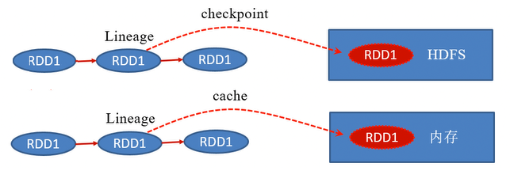

ps:当使用了checkpoint后，数据被保存到HDFS，**此RDD的依赖关系也会丢掉**，因为数据已经持久化到HDFS,所以不需要重新计算,无论是cache或checkpoint缓存了数据,若数据丢失是自动恢复的,checkpoint的数据需要手动清除而cache的数据是自动清除的(任务结束) 

##### cache和persist的区别

cache源码中调用的是persist,persist更加底层的持久化,cache默认持久化等级是内存且不能修改,而persist是可以修改持久化等级,cache和persist的使用是有规则的必须在transformation或者textfile等创建一个rdd之后，直接连续调用cache()或者persist()才可以，如果先创建一个rdd,再单独另起一行执行cache()或者persist()，是没有用的，而且会报错，大量的文件会丢失

##### 什么时候使用cache或checkpoint

1.某步骤计算特别耗时

2.计算链条特别长

3.发生shuffle之后

建议使用cache或是persist模式因为,不需要创建存储位置,并且默认存储到内存中计算速度快,而checkpoint需要手动创建存储位置和手动删除数据.若数据量非常庞大建议改用chechpoint.

#### 3.25.26 Spark集群启动流程和任务提交流程（重要）

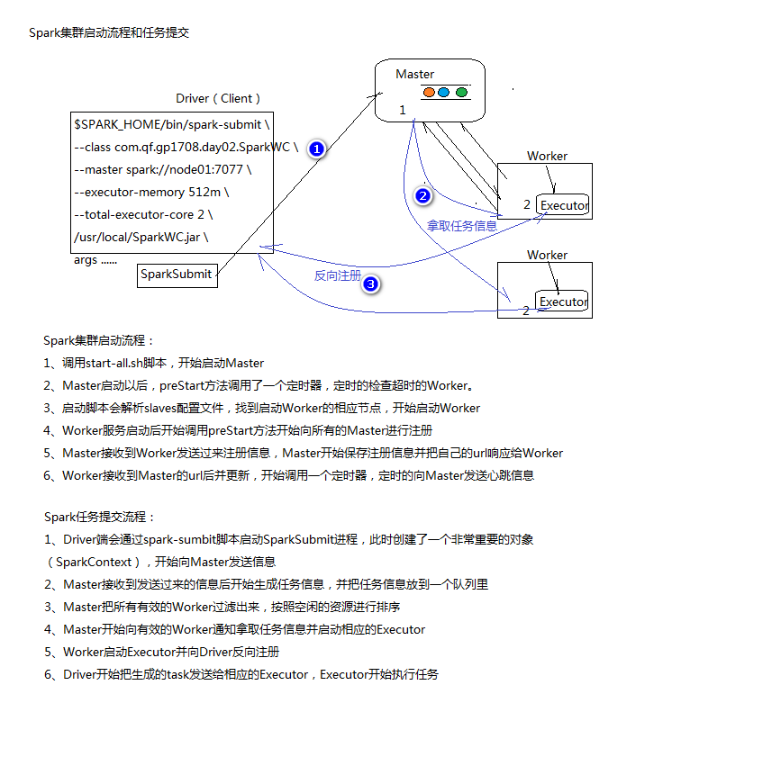


