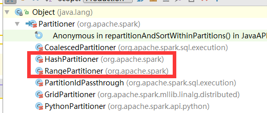
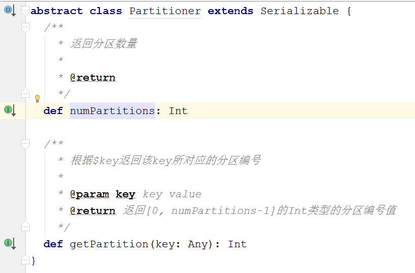
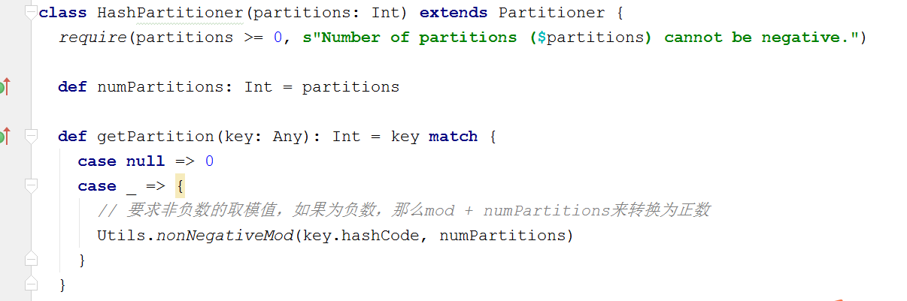
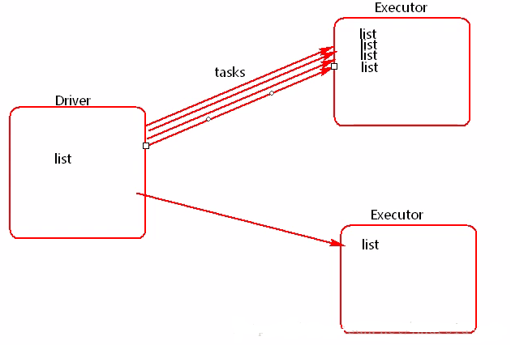
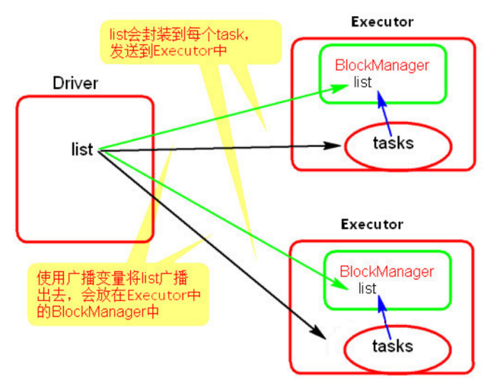
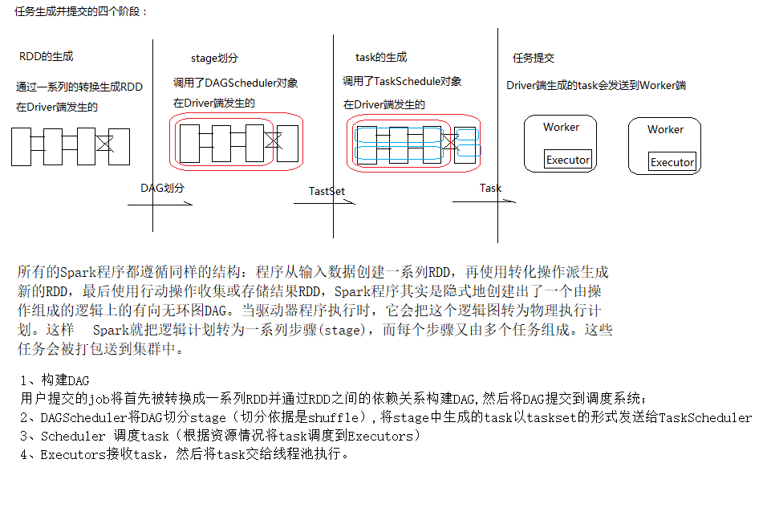

## 3.25.37 自定义排序（重要）

spark中对简单的数据类型可以直接排序,但是对于一些复杂的条件以利用自定义排序来实现

```scala
import org.apache.spark.rdd.RDD
import org.apache.spark.{SparkConf, SparkContext}
//自定义排序
object CustomSortTest {
def main(args: Array[String]): Unit = {
	val conf = new SparkConf().setAppName("JDBCRDDTest").setMaster("local")
	val sc = new SparkContext(conf)
	val girlInfo = sc.parallelize(List(("xiaoming",90,32),("xiaohong",70,32),("xiaobai",80,34),("bobo",90,35)))
	//根据颜值排序(简单)
	val sorted: RDD[(String, Int, Int)] = girlInfo.sortBy(_._2,false)
		println(sorted.collect.toList)
	//第一种自定义排序
	import MyOrdering.girlOrdering
	val sorted1: RDD[(String, Int, Int)] = girlInfo.sortBy(g => Girl(g._2,g._3))
		println(sorted1.collect.toList)
	//第二种排序方式自定义排序
	val sorted2: RDD[(String, Int, Int)] = girlInfo.sortBy(g => Girls(g._2,g._3))
		println(sorted2.collect.toList)
} 
   //样例类来存储数据
case class Girl(faceValue:Int,age:Int)
//第二个种排序
case class Girls(faceValue:Int,age:Int) extends Ordered[Girls]{
		override def compare(that: Girls): Int = {
			if(this.faceValue == that.faceValue){
				that.age - this.age
			}else{
				this.faceValue - that.faceValue
			}
		}	
	}
}
//隐式转换类型
//若使用隐式转换函数必须使用单例类
object MyOrdering {
	//进行隐式转换 自定义比较(隐式转换函数)
	implicit val girlOrdering = new Ordering[Girl]{
		override def compare(x: Girl, y: Girl): Int = {
			if(x.faceValue != y.faceValue){
				x.faceValue - y.faceValue
			}else{		
				y.age - x.age
			}
		}
	}
}
```


## 3.25.38 键值对RDD数据分区

Spark目前支持Hash分区和Range分区，用户也可以自定义分区，Hash分区为当前的默认分区，Spark中分区器直接决定了RDD中分区的个数、RDD中每条数据经过Shuffle过程属于哪个分区和Reduce的个数

### Partitioner 



Spark中数据分区的主要工具类(数据分区类)，主要用于Spark底层RDD的数据重分布的情况中，主要方法两个，如下： 

### HashPartitioner 

Spark中非常重要的一个分区器，也是默认分区器，默认用于90%以上的RDD相关API上

功能：依据RDD中key值的hashCode的值将数据取模后得到该key值对应的下一个RDD的分区id值，支持key值为null的情况，当key为null的时候，返回0；该分区器基本上适合所有RDD数据类型的数据进行分区操作；但是需要注意的是，由于JAVA中数组的hashCode是基于数组对象本身的，不是基于数组内容的，所以如果RDD的key是数组类型，那么可能导致数据内容一致的数据key没法分配到同一个RDD分区中，这个时候最好自定义数据分区器，采用数组内容进行分区或者将数组的内容转换为集合。HashPartitioner代码说明如下： 



ps:对于给定的key，计算其hashCode，并除于分区的个数取余，如果余数小于0，则用余数+分区的个数，最后返回的值就是这个key所属的分区ID。

### RangePartitioner 

SparkCore中除了HashPartitioner分区器外，另外一个比较重要的已经实现的分区器，主要用于RDD的数据排序相关API中

比如sortByKey底层使用的数据分区器就是RangePartitioner分区器；该分区器的实现方式主要是通过两个步骤来实现的，第一步：先从整个RDD中抽取出样本数据，将样本数据排序，计算出每个分区的最大key值，形成一个Array[KEY]类型的数组变量rangeBounds；第二步：判断key在rangeBounds中所处的范围，给出该key值在下一个RDD中的分区id下标；该分区器要求RDD中的KEY类型必须是可以排序的，原代码说明如下： 

```scala
class RangePartitioner[K: Ordering : ClassTag, V](
                                                   partitions: Int,
                                                   rdd: RDD[_ <: Product2[K, V]],
                                                   private var ascending: Boolean = true)
  extends Partitioner {

  // We allow partitions = 0, which happens when sorting an empty RDD under the default settings.
  require(partitions >= 0, s"Number of partitions cannot be negative but found $partitions.")

  // 获取RDD中key类型数据的排序器
  private var ordering = implicitly[Ordering[K]]

  // An array of upper bounds for the first (partitions - 1) partitions
  private var rangeBounds: Array[K] = {
    if (partitions <= 1) {
      // 如果给定的分区数是一个的情况下，直接返回一个空的集合，表示数据不进行分区
      Array.empty
    } else {
      // This is the sample size we need to have roughly balanced output partitions, capped at 1M.
      // 给定总的数据抽样大小，最多1M的数据量(10^6)，最少20倍的RDD分区数量，也就是每个RDD分区至少抽取20条数据
      val sampleSize = math.min(20.0 * partitions, 1e6)
      // Assume the input partitions are roughly balanced and over-sample a little bit.
      // 计算每个分区抽取的数据量大小， 假设输入数据每个分区分布的比较均匀
      // 对于超大数据集(分区数超过5万的)乘以3会让数据稍微增大一点，对于分区数低于5万的数据集，每个分区抽取数据量为60条也不算多
      val sampleSizePerPartition = math.ceil(3.0 * sampleSize / rdd.partitions.size).toInt
      // 从rdd中抽取数据，返回值:(总rdd数据量， Array[分区id，当前分区的数据量，当前分区抽取的数据])
      val (numItems, sketched) = RangePartitioner.sketch(rdd.map(_._1), sampleSizePerPartition)
      if (numItems == 0L) {
        // 如果总的数据量为0(RDD为空)，那么直接返回一个空的数组
        Array.empty
      } else {
        // If a partition contains much more than the average number of items, we re-sample from it
        // to ensure that enough items are collected from that partition.
        // 计算总样本数量和总记录数的占比，占比最大为1.0
        val fraction = math.min(sampleSize / math.max(numItems, 1L), 1.0)
        // 保存样本数据的集合buffer
        val candidates = ArrayBuffer.empty[(K, Float)]
        // 保存数据分布不均衡的分区id(数据量超过fraction比率的分区)
        val imbalancedPartitions = mutable.Set.empty[Int]
        // 计算抽取出来的样本数据
        sketched.foreach { case (idx, n, sample) =>
          if (fraction * n > sampleSizePerPartition) {
            // 如果fraction乘以当前分区中的数据量大于之前计算的每个分区的抽象数据大小，那么表示当前分区抽取的数据太少了，该分区数据分布不均衡，需要重新抽取
            imbalancedPartitions += idx
          } else {
            // 当前分区不属于数据分布不均衡的分区，计算占比权重，并添加到candidates集合中
            // The weight is 1 over the sampling probability.
            val weight = (n.toDouble / sample.size).toFloat
            for (key <- sample) {
              candidates += ((key, weight))
            }
          }
        }

        // 对于数据分布不均衡的RDD分区，重新进行数据抽样
        if (imbalancedPartitions.nonEmpty) {
          // Re-sample imbalanced partitions with the desired sampling probability.
          // 获取数据分布不均衡的RDD分区，并构成RDD
          val imbalanced = new PartitionPruningRDD(rdd.map(_._1), imbalancedPartitions.contains)
          // 随机种子
          val seed = byteswap32(-rdd.id - 1)
          // 利用rdd的sample抽样函数API进行数据抽样
          val reSampled = imbalanced.sample(withReplacement = false, fraction, seed).collect()
          val weight = (1.0 / fraction).toFloat
          candidates ++= reSampled.map(x => (x, weight))
        }

        // 将最终的抽样数据计算出rangeBounds出来
        RangePartitioner.determineBounds(candidates, partitions)
      }
    }
  }

  // 下一个RDD的分区数量是rangeBounds数组中元素数量+ 1个
  def numPartitions: Int = rangeBounds.length + 1

  // 二分查找器，内部使用java中的Arrays类提供的二分查找方法
  private var binarySearch: ((Array[K], K) => Int) = CollectionsUtils.makeBinarySearch[K]

  // 根据RDD的key值返回对应的分区id。从0开始
  def getPartition(key: Any): Int = {
    // 强制转换key类型为RDD中原本的数据类型
    val k = key.asInstanceOf[K]
    var partition = 0
    if (rangeBounds.length <= 128) {
      // If we have less than 128 partitions naive search
      // 如果分区数据小于等于128个，那么直接本地循环寻找当前k所属的分区下标
      while (partition < rangeBounds.length && ordering.gt(k, rangeBounds(partition))) {
        partition += 1
      }
    } else {
      // Determine which binary search method to use only once.
      // 如果分区数量大于128个，那么使用二分查找方法寻找对应k所属的下标;
      // 但是如果k在rangeBounds中没有出现，实质上返回的是一个负数(范围)或者是一个超过rangeBounds大小的数(最后一个分区，比所有数据都大)
      partition = binarySearch(rangeBounds, k)
      // binarySearch either returns the match location or -[insertion point]-1
      if (partition < 0) {
        partition = -partition - 1
      }
      if (partition > rangeBounds.length) {
        partition = rangeBounds.length
      }
    }

    // 根据数据排序是升序还是降序进行数据的排列，默认为升序
    if (ascending) {
      partition
    } else {
      rangeBounds.length - partition
    }
  }
```

ps:将一定范围内的数映射到某一个分区内，在实现中，分界(rangeBounds)的算法尤为重要。用到了水塘抽样算法

其实RangePartitioner的重点是在于构建rangeBounds数组对象，主要步骤是：

　　1. 如果分区数量小于2或者rdd中不存在数据的情况下，直接返回一个空的数组，不需要计算range的边界；如果分区数据大于1的情况下，而且rdd中有数据的情况下，才需要计算数组对象

　　2. 计算总体的数据抽样大小sampleSize，计算规则是：至少每个分区抽取20个数据或者最多1M的数据量

　　3. 根据sampleSize和分区数量计算每个分区的数据抽样样本数量sampleSizePrePartition

　　4. 调用RangePartitioner的sketch函数进行数据抽样，计算出每个分区的样本

　　5. 计算样本的整体占比以及数据量过多的数据分区，防止数据倾斜

　　6. 对于数据量比较多的RDD分区调用RDD的sample函数API重新进行数据抽取

　　7. 将最终的样本数据通过RangePartitoner的determineBounds函数进行数据排序分配，计算出rangeBounds

  RangePartitioner的sketch函数的作用是对RDD中的数据按照需要的样本数据量进行数据抽取，主要调用SamplingUtils类的reservoirSampleAndCount方法对每个分区进行数据抽取，抽取后计算出整体所有分区的数据量大小；reservoirSampleAndCount方法的抽取方式是先从迭代器中获取样本数量个数据(顺序获取), 然后对剩余的数据进行判断，替换之前的样本数据，最终达到数据抽样的效果

  RangePartitioner的determineBounds函数的作用是根据样本数据记忆权重大小确定数据边界, 原代码注释讲解如下：

```scala
def determineBounds[K: Ordering : ClassTag](
                                               candidates: ArrayBuffer[(K, Float)],
                                               partitions: Int): Array[K] = {
    val ordering = implicitly[Ordering[K]]
    // 按照数据进行数据排序，默认升序排列
    val ordered = candidates.sortBy(_._1)
    // 获取总的样本数量大小
    val numCandidates = ordered.size
    // 计算总的权重大小
    val sumWeights = ordered.map(_._2.toDouble).sum
    // 计算步长
    val step = sumWeights / partitions
    var cumWeight = 0.0
    var target = step
    val bounds = ArrayBuffer.empty[K]
    var i = 0
    var j = 0
    var previousBound = Option.empty[K]
    while ((i < numCandidates) && (j < partitions - 1)) {
      // 获取排序后的第i个数据及权重
      val (key, weight) = ordered(i)
      // 累计权重
      cumWeight += weight
      if (cumWeight >= target) {
        // Skip duplicate values.
        // 权重已经达到一个步长的范围，计算出一个分区id的值
        if (previousBound.isEmpty || ordering.gt(key, previousBound.get)) {
          // 上一个边界值为空，或者当前边界key数据大于上一个边界的值，那么当前key有效，进行计算
          // 添加当前key到边界集合中
          bounds += key
          // 累计target步长界限
          target += step
          // 分区数量加1
          j += 1
          // 上一个边界的值重置为当前边界的值
          previousBound = Some(key)
        }
      }
      i += 1
    }
    // 返回结果
    bounds.toArray
  }
```

总结:

 一般而已，使用默认的HashPartitioner即可，RangePartitioner的使用有一定的局限性 

## 3.25.39 自定义分区（重要）

我们都知道Spark内部提供了`HashPartitioner`和`RangePartitioner`两种分区策略，这两种分区策略在很多情况下都适合我们的场景。但是有些情况下，Spark内部不能符合咱们的需求，这时候我们就可以自定义分区策略

要实现自定义的分区器，你需要继承 org.apache.spark.Partitioner 类并实现下面三个方法。 

numPartitions: Int:返回创建出来的分区数。

getPartition(key: Any): Int:返回给定键的分区编号(0到numPartitions-1)。 

equals():Java 判断相等性的标准方法。这个方法的实现非常重要，Spark 需要用这个方法来检查你的分区器对象是否和其他分区器实例相同，这样 Spark 才可以判断两个 RDD 的分区方式是否相同

### 基础案例1

```scala
class CustomerPartitoner(numPartiton:Int) extends Partitioner{
  // 返回分区的总数
  override def numPartitions: Int = numPartiton
  // 根据传入的Key返回分区的索引
  override def getPartition(key: Any): Int = {
    key.toString.toInt % numPartiton
  }
}
object CustomerPartitoner {
  def main(args: Array[String]): Unit = {
    val sparkConf = new SparkConf().setAppName("CustomerPartitoner").setMaster("local[*]")
    val sc = new SparkContext(sparkConf)
    //zipWithIndex该函数将RDD中的元素和这个元素在RDD中的ID（索引号）组合成键/值对。
    val rdd = sc.parallelize(0 to 10,1).zipWithIndex()
    val func = (index:Int,iter:Iterator[(Int,Long)]) =>{
      iter.map(x => "[partID:"+index + ", value:"+x+"]")
    }
    val r = rdd.mapPartitionsWithIndex(func).collect()
    for (i <- r){
      println(i)
    }
    val rdd2 = rdd.partitionBy(new CustomerPartitoner(5))
    val r1 = rdd2.mapPartitionsWithIndex(func).collect()
    println("----------------------------------------")
    for (i <- r1){
      println(i)
    }
    println("----------------------------------------")
    sc.stop()
  }
}
```

### 案例2

```scala
import java.net.URL
import org.apache.spark.{HashPartitioner, Partitioner, SparkConf, SparkContext}
import org.apache.spark.rdd.RDD
import scala.collection.mutable
/**
* 自定分区
* 数据中有不同的学科,将输出的一个学科生成一个文件
*/
object SubjectDemo3 {
def main(args: Array[String]): Unit = {
val conf = new SparkConf().setAppName("SubjectDemo").setMaster("local")
val sc = new SparkContext(conf)
// 1.对数据进行切分
val tuples: RDD[(String, Int)] =
sc.textFile("C:\\Users\\Administrator\\Desktop\\subjectaccess\\access.txt").map(line => {
val fields: Array[String] = line.split("\t")
//取出url
val url = fields(1)
(url, 1)
})
//将相同url进行聚合,得到了各个学科的访问量
val sumed: RDD[(String, Int)] = tuples.reduceByKey(_+_).cache()
//从url中获取学科的字段 数据组成式 学科, url 统计数量
val subjectAndUC = sumed.map(tup => {
val url = tup._1 //用户url
val count = tup._2 // 统计的访问数量
val subject = new URL(url).getHost //学科
(subject, (url, count))
})
//将所有学科取出来
val subjects: Array[String] = subjectAndUC.keys.distinct.collect
//创建自定义分区器对象
val partitioner: SubjectPartitioner = new SubjectPartitioner(subjects)
//分区
val partitioned: RDD[(String, (String, Int))] = subjectAndUC.partitionBy(partitioner)
//取top3
val rs = partitioned.mapPartitions(it => {
val list = it.toList
val sorted = list.sortBy(_._2._2).reverse
val top3: List[(String, (String, Int))] = sorted.take(3)
//因为方法的返回值需要一个iterator
top3.iterator
})
//存储数据
rs.saveAsTextFile("out2")
sc.stop()
}
}
/**
* 自定义分区器需要继承Partitioner并实现对应方法
* @param subjects 学科数组
*/
class SubjectPartitioner(subjects:Array[String]) extends Partitioner{
//创建一个map集合用来存到分区号和学科
val subject = new mutable.HashMap[String,Int]()
//定义一个计数器,用来生成分区好
var i = 0
for(s <- subjects){
//存学科和分区
subject+=(s -> i)
i+=1 //分区自增
} /
/获取分区数
override def numPartitions: Int = subjects.size
//获取分区号(如果传入的key不存在,默认将数据存储到0分区)
override def getPartition(key: Any): Int = subject.getOrElse(key.toString,0)
}
```

总结:

1.分区主要面对KV结构数据,Spark内部提供了两个比较重要的分区器,Hash分区器和Range分区器

2.hash分区主要通过key的hashcode来对分区数求余,hash分区可能会导致数据倾斜问题,Range分区是通过水塘抽样的算法来将数据均匀的分配到各个分区中

3.自定义分区主要通过继承partitioner抽象类来实现,必须要实现两个方法:

numPartitions 和 getPartition(key: Any) 

## 3.25.40 Accumulator累加器（重要）

累加器用来对信息进行聚合，通常在向 Spark 传递函数时，比如使用 map() 函数或者用 filter() 传条件时，可以使用驱 动器程序中定义的变量，但是集群中运行的每个任务都会得到这些变量的一份新的副本， 更新这些副本的值也不会影响驱动器中的对应变量。 如果我们想实现所有分片处理时更新共享变量的功能，那么累加器可以实现我们想要的效果。

1. Spark提供了一个默认的累加器,只能用于求和没啥用
2. 如何使用:

   2.1.通过SparkContext对象.accumulator(0)  var sum = sc.accumulator(0)

​         通过accumulator声明一个累加器,0为初始化的值 

   2.2.通过转换或者行动操作,通过sum +=n 来使用

   2.3.如何取值? 在Driver程序中,通过 sum .value来获取值

   3.累加器是懒执行,需要行动触发

例子: 数据计算相加

```scala
 val numbers = sc .parallelize(List(1,2,3,4,5,6),2)
    println(numbers.partitions.length)
    //为什么sum值通过计算过后还是0
    //因为foreach是没有返回值,整个计算过程都是在executor端完后
    //foreach是在driver端运行所以打印的就是 0,foreach没有办法获取数据
    //var sum = 0
//    numbers.foreach(num =>{
//      sum += num
//    })
//    println(sum)
    //建议点击看原码 可以发现当前方法已经过时了,@deprecated("use AccumulatorV2", "2.0.0")
    //所以以后使用时候需要使用自定义累加器
    var sum = sc.accumulator(0)
        numbers.foreach(num =>{
          sum += num
        })
        println(sum.value)
  }
```

### 自定义累加器

自定义累加器类型的功能在1.X版本中就已经提供了，但是使用起来比较麻烦，在2.0版本后，累加器的易用性有了较大的改进，而且官方还提供了一个新的抽象类：AccumulatorV2来提供更加友好的自定义类型累加器的实现方式。官方同时给出了一个实现的示例：CollectionAccumulator类，这个类允许以集合的形式收集spark应用执行过程中的一些信息。例如，我们可以用这个类收集Spark处理数据时的一些细节，当然，由于累加器的值最终要汇聚到driver端，为了避免 driver端的OutOfMemory问题，需要对收集的信息的规模要加以控制，不宜过大。 

#### 案例1:已经定义好的数值类型可以直接使用

```scala
//这些类都是AccumulatorV2的子类可以直接使用
    val conf = new SparkConf().setAppName("SparkWordCount").setMaster("local[*]")
    //2.创建SparkContext 提交SparkApp的入口
    val sc = new SparkContext(conf)
    val num1 = sc.parallelize(List(1, 2, 3, 4, 5, 6), 2)
    val num2 = sc.parallelize(List(1.1, 2.2, 3.3, 4.4, 5.5, 6.6), 2)
    //创建并注册一个long accumulator, 从“0”开始，用“add”累加
    def longAccumulator(name: String): LongAccumulator = {
      val acc = new LongAccumulator
      sc.register(acc, name)
      acc
    }
    val acc1 =  longAccumulator("kk")
    num1.foreach(x => acc1.add(x))
    println(acc1.value)

    //创建并注册一个double accumulator, 从“0”开始，用“add”累加
    def doubleAccumulator(name: String): DoubleAccumulator = {
      val acc = new DoubleAccumulator
      sc.register(acc, name)
      acc
    }
    val acc2 =  doubleAccumulator("kk")
    num1.foreach(x => acc2.add(x))
    println(acc2.value)

```

####  案例2:

```scala
import org.apache.spark.{SparkConf, SparkContext}
import org.apache.spark.util.AccumulatorV2
//在继承的时候需要执行泛型 即 可以计算IN类型的输入值，产生Out类型的输出值
//继承后必须实现提供的方法
class MyAccumulator extends  AccumulatorV2[Int,Int]{
  //创建一个输出值的变量
  private var sum:Int = _ 

  //必须重写如下方法:
  //检测方法是否为空
  override def isZero: Boolean = sum == 0
  //拷贝一个新的累加器
  override def copy(): AccumulatorV2[Int, Int] = {
    //需要创建当前自定累加器对象
    val myaccumulator = new MyAccumulator()
    //需要将当前数据拷贝到新的累加器数据里面
   //也就是说将原有累加器中的数据拷贝到新的累加器数据中
    //ps:个人理解应该是为了数据的更新迭代
    myaccumulator.sum = this.sum
    myaccumulator
  }
  //重置一个累加器 将累加器中的数据清零
  override def reset(): Unit = sum = 0
  //每一个分区中用于添加数据的方法(分区中的数据计算)
  override def add(v: Int): Unit = {
    //v 即 分区中的数据
     //当累加器中有数据的时候需要计算累加器中的数据
     sum += v
  }
  //合并每一个分区的输出(将分区中的数进行汇总)
  override def merge(other: AccumulatorV2[Int, Int]): Unit = {
          //将每个分区中的数据进行汇总
            sum += other.value

  }
 //输出值(最终累加的值)
  override def value: Int = sum
}

object  MyAccumulator{
  def main(args: Array[String]): Unit = {
    val conf = new SparkConf().setAppName("MyAccumulator").setMaster("local[*]")
    //2.创建SparkContext 提交SparkApp的入口
    val sc = new SparkContext(conf)
    val numbers = sc .parallelize(List(1,2,3,4,5,6),2)
    val accumulator = new MyAccumulator()
    //需要注册 
    sc.register(accumulator,"acc")
    //切记不要使用Transformation算子 会出现无法更新数据的情况
    //应该使用Action算子
    //若使用了Map会得不到结果
    numbers.foreach(x => accumulator.add(x))
    println(accumulator.value)
  }
}
```

#### 案例3:使用累加器做单词统计

```scala
import org.apache.spark.{SparkConf, SparkContext}
import org.apache.spark.util.AccumulatorV2

import scala.collection.mutable

class MyAccumulator2 extends AccumulatorV2[String, mutable.HashMap[String, Int]] {

  private val _hashAcc = new mutable.HashMap[String, Int]()

  // 检测是否为空
  override def isZero: Boolean = {
    _hashAcc.isEmpty
  }

  // 拷贝一个新的累加器
  override def copy(): AccumulatorV2[String, mutable.HashMap[String, Int]] = {
    val newAcc = new MyAccumulator2()
    _hashAcc.synchronized {
      newAcc._hashAcc ++= (_hashAcc)
    }
    newAcc
  }

  // 重置一个累加器
  override def reset(): Unit = {
    _hashAcc.clear()
  }

  // 每一个分区中用于添加数据的方法 小SUM
  override def add(v: String): Unit = {
    _hashAcc.get(v) match {
      case None => _hashAcc += ((v, 1))
      case Some(a) => _hashAcc += ((v, a + 1))
    }

  }

  // 合并每一个分区的输出 总sum
  override def merge(other: AccumulatorV2[String, mutable.HashMap[String, Int]]): Unit = {
    other match {
      case o: AccumulatorV2[String, mutable.HashMap[String, Int]] => {
        for ((k, v) <- o.value) {
          _hashAcc.get(k) match {
            case None => _hashAcc += ((k, v))
            case Some(a) => _hashAcc += ((k, a + v))
          }
        }
      }
    }
  }
  // 输出值
  override def value: mutable.HashMap[String, Int] = {
    _hashAcc
  }
}
object MyAccumulator2 {
  def main(args: Array[String]): Unit = {
    val sparkConf = new SparkConf().setAppName("MyAccumulator2").setMaster("local[*]")
    val sc = new SparkContext(sparkConf)
    val hashAcc = new MyAccumulator2()
    sc.register(hashAcc, "abc")
    val rdd = sc.makeRDD(Array("a", "b", "c", "a", "b", "c", "d"),2)
    rdd.foreach(hashAcc.add(_))
    for ((k, v) <- hashAcc.value) {
      println("【" + k + ":" + v + "】")
    }
    sc.stop()

  }

}
```

总结:

1.累加器的创建: 

1.1.创建一个累加器的实例 

1.2.通过sc.register()注册一个累加器

1.3.通过累加器实名.add来添加数据

1.4.通过累加器实例名.value来获取累加器的值

2.最好不要在转换操作中访问累加器(因为血统的关系和转换操作可能执行多次),最好在行动操作中访问

作用: 

1.能够精确的统计数据的各种数据例如:

可以统计出符合userID的记录数,在同一个时间段内产生了多少次购买,可以使用ETL进行数据清洗,并使用Accumulator来进行数据的统计 

2.作为调试工具,能够观察每个task的信息,通过累加器可以在sparkIUI观察到每个task所处理的记录数    

## 3.25.41 Broadcast广播变量（重要）

广播变量用来高效分发较大的对象。向所有工作节点发送一个 较大的只读值，以供一个或多个 Spark 操作使用。比如，如果你的应用需要向所有节点发 送一个较大的只读查询表，甚至是机器学习算法中的一个很大的特征向量，广播变量用起来都很顺手。

### 问题说明:

```scala
/**
以下代码就会出现一个问题:
list是在driver端创建的，但是因为需要在executor端使用，所以driver会把list以task的形式发送到excutor端,也就相当于在executor需要复制一份,如果有很多个task，就会有很多给excutor端携带很多个list，如果这个list非常大的时候，就可能会造成内存溢出 
*/
val conf = new SparkConf().setAppName("BroadcastTest").setMaster("local")
      val sc = new SparkContext(conf)
       //list是在driver端创建也相当于是本地变量
      val list = List("hello java")
      //算子部分是在Excecutor端执行
      val lines = sc.textFile("dir/file")
      val filterStr = lines.filter(list.contains(_))
      filterStr.foreach(println)
```



广播变量的好处，不是每个task一份变量副本，而是变成每个节点的executor才一份副本。这样的话， 就可以让变量产生的副本大大减少。 

task在运行的时候，想要使用广播变量中的数据，此时首先会在自己本地的Executor对应的BlockManager中，
尝试获取变量副本；如果本地没有，那么就从Driver远程拉取变量副本，并保存在本地的BlockManager中；
此后这个executor上的task，都会直接使用本地的BlockManager中的副本。
executor的BlockManager除了从driver上拉取，也可能从其他节点的BlockManager上拉取变量副本。
HttpBroadcast     TorrentBroadcast（默认）

BlockManager
负责管理某个Executor对应的内存和磁盘上的数据，尝试在本地BlockManager中找map



```scala
 val conf = new SparkConf().setAppName("BroadcastTest").setMaster("local")
      val sc = new SparkContext(conf)
       //list是在driver端创建也相当于是本地变量
      val list = List("hello java")
      //封装广播变量
      val broadcast = sc.broadcast(list)
      //算子部分是在Excecutor端执行
      val lines = sc.textFile("dir/file")
      //使用广播变量进行数据处理 value可以获取广播变量的值
      val filterStr = lines.filter(broadcast.value.contains(_))
      filterStr.foreach(println)
```

总结:

广播变量的过程如下：

​    (1) 通过对一个类型 T 的对象调用 SparkContext.broadcast 创建出一个 Broadcast[T] 对象。 任何可序列化的类型都可以这么实现。 

​    (2) 通过 value 属性访问该对象的值(在 Java 中为 value() 方法)。 

​    (3) 变量只会被发到各个节点一次，应作为只读值处理(修改这个值不会影响到别的节点)。 

能不能将一个RDD使用广播变量广播出去？

不能，因为RDD是不存储数据的。可以将RDD的结果广播出去。

广播变量只能在Driver端定义，不能在Executor端定义。

广播变量的好处:

举例来说
50个executor，1000个task。一个map，10M。
默认情况下，1000个task，1000份副本。10G的数据，网络传输，在集群中，耗费10G的内存资源。
如果使用了广播变量。50个execurtor，50个副本。500M的数据，网络传输，
而且不一定都是从Driver传输到每个节点，还可能是就近从最近的节点的executor的blockmanager
上拉取变量副本，网络传输速度大大增加；500M的内存消耗。
10000M，500M，20倍。20倍~以上的网络传输性能消耗的降低；20倍的内存消耗的减少。
对性能的提升和影响，还是很客观的。
虽然说，不一定会对性能产生决定性的作用。比如运行30分钟的spark作业，可能做了广播变量以后，速度快了2分钟，或者5分钟。但是一点一滴的调优，积少成多。最后还是会有效果的。 

## 3.25.42 Spark文本文件输入输出

### 1.文本文件输入输出

textFile 进行文本文件的读取

ps:如果传递目录，则将目录下的所有文件读取作为RDD

saveAsTextFile 进行文本文件的输出

ps:将传入的路径作为目录对待，会在那个 目录下输出多个文件

### 2.JSON文件输入输出

JSON文件中每一行就是一个JSON记录，那么可以通过将JSON文件当做文本文件来读取，然后利用相关的JSON库对每一条数据进行JSON解析。 

ps:需要在程序中进行手动编码和解码

### 3.CSV文件输入输出

读取 CSV 数据和读取 JSON 数据相似，都需要先把文件当作普通文本文件来读取数据，然后通过将每一行进行解析实现对CSV的读取。

### 4.SequenceFile文件输入输出

SequenceFile文件是Hadoop用来存储二进制形式的key-value对而设计

saveAsSequenceFile 存储文件数据

可以直接调用 saveAsSequenceFile(path) 保存你的PairRDD，它会帮你写出数据。需要键和值能够自动转为Writable类型

sequenceFile读取文件是需要指定文件中的数据类型(泛型类型)

```scala
object Test {
  def main(args: Array[String]): Unit = {
    val conf = new SparkConf().setAppName("Test").setMaster("local[*]")
    val sc  = new SparkContext(conf)
    //1.文本文件输入输出
    val  rdd = sc.textFile("dir/file")
    rdd.saveAsTextFile("out3")
    //2.Json数据和CSV的数据在将SparkSQL的时候讲
    //3.SequenceFile文件的输入输出
    val data=sc.parallelize(List((2,"aa"),(3,"bb"),(4,"cc"),(5,"dd"),(6,"ee")))
    data.saveAsSequenceFile("out4")
    val sdata = sc.sequenceFile[Int,String]("out4")
    println(sdata.collect().toBuffer)

  }
}
```

总结:

Spark的整个生态系统与Hadoop是完全兼容的,所以对于Hadoop所支持的文件类型或者数据库类型,Spark也同样支持.另外,由于Hadoop的API有新旧两个版本,所以Spark为了能够兼容Hadoop所有的版本,也提供了两套创建操作接口.对于外部存储创建操作而言,HadoopRDD和newHadoopRDD是最为抽象的两个函数接口,主要包含以下四个参数.

1) 输入格式(InputFormat): 制定数据输入的类型,如TextInputFormat等,新旧两个版本所引用的版本分别是org.apache.hadoop.mapred.InputFormat和org.apache.hadoop.mapreduce.InputFormat(NewInputFormat)

2) 键类型: 指定[K,V]键值对中K的类型

3) 值类型: 指定[K,V]键值对中V的类型

4) 分区值: 指定由外部存储生成的RDD的partition数量的最小值,如果没有指定,系统会使用默认值defaultMinSplits

## 3.25.43 案例练习:ip所属区域的访问量（重要） 

```scala
这些数据是用户访问所产生的日志信息
http.log是用户访问网站所产生的日志,这些数据的产生是通过后台js埋点所得到的数据
数据组成基本上是:时间戳,IP地址, 访问网址, 访问数据 浏览器信息的等
ip.txt是 ip段数据 记录着一些ip段范围对应的位置
需求:通过http.log中的ip查找范围访问量那个多一些
import org.apache.spark.broadcast.Broadcast
import org.apache.spark.rdd.RDD
import org.apache.spark.{SparkConf, SparkContext}
/*
需求:根据用户访问的ip地址来统计所属区域并统计访问量
思路:1. 获取ip的基本数据
2. 把ip基础数据广播出去
3. 获取用户访问数据
4. 通过ip基础信息来判断用户数据那个区域
5. 通过得到的区域区域来统计访问量
6. 输出结果
*/
object IPSearch {
	def main(args: Array[String]): Unit = {
		//1.创建conf对象然后通过conf创建sc对象
		val conf = new SparkConf().setAppName("ipsearch").setMaster("local")
		val sc = new SparkContext(conf)
		//2.获取ip的基础数据
		val ipinfo = sc.textFile("C:\\Users\\Administrator\\Desktop\\ipsearch\\ip.txt")
		//3.拆分数据
		val splitedIP: RDD[(String, String, String)] = ipinfo.map(line => {
			//数据是以|分割的val fields = line.split("\\|")
			//获取IP的起始和结束范围 取具体转换过后的值
			val startIP = fields(2)
			//起始
			val endIP = fields(3) //结束
			val shengfen = fields(6) // IP对应的省份
			(startIP, endIP, shengfen)
		})
	   /**
	   * 对于经常用到变量值,在分布式计算中,多个节点task一定会多次请求该变量
	   * 在请求过程中一定会产生大量的网络IO,因此会影响一定的计算性能
	   * 在这种情况下,可以使将该变量用于广播变量的方式广播到相对应的Executor端
	   * 以后再使用该变量时就可以直接冲本机获取该值计算即可,可以提高计算数据
	   */
	   //在使用广播变量之前,需要将广播变量数据获取
	   val arrIPInfo: Array[(String, String, String)] = splitedIP.collect
	   //广播数据
	   val broadcastIPInfo: Broadcast[Array[(String, String, String)]] =               sc.broadcast(arrIPInfo)
       //获取用户数据
       val userInfo = sc.textFile("C:\\Users\\Administrator\\Desktop\\ipsearch\\http.log")
       //切分用户数据并查找该用户属于哪个省份
       val shengfen: RDD[(String, Int)] = userInfo.map(line => {
       		//数据是以 | 分隔的
       		val fields = line.split("\\|")
      		//获取用户ip地址 125.125.124.2
      		val ip = fields(1)
      		val ipToLong = ip2Long(ip)
      		//获取广播变量中的数据
      		val arrInfo: Array[(String, String, String)] = broadcastIPInfo.value
      		//查找当前用ip的位置
	 		//线性查找(遍历数据注意对比)
	 		//二分查找(必须排序)
	 		//i值的获取有两种形式:
	 		//1.得到正确的下标,可以放心的去取值
	 		//2.得到了-1 没有找到
	 		//最好加一个判断若是 -1 写一句话 或是 直接结束
	 		val i: Int = binarySearch(arrInfo, ipToLong)
	 		val shengfen = arrInfo(i)._3(shengfen, 1)
      })
	 //统计区域访问量
	 val sumed = shengfen.reduceByKey(_+_)
	 //输出结果
	 println(sumed.collect.toList)
	 sc.stop()
}
/**
* 把ip转换为long类型 直接给 125.125.124.2
* @param ip
* @return
*/
def ip2Long(ip: String): Long = {
	val fragments: Array[String] = ip.split("[.]")
	var ipNum = 0L
	for (i <- 0 until fragments.length) {
	//| 按位或 只要对应的二个二进位有一个为1时，结果位就为1 <<左位移
		ipNum = fragments(i).toLong | ipNum << 8L
    } 
    ipNum
} 
/**
* 通过二分查找来查询ip对应的索引
**/
def binarySearch(arr:Array[(String, String, String)],ip:Long):Int={
	//开始和结束值
	var start = 0
	var end = arr.length-1
	while(start <= end){
		//求中间值
		val middle = (start+end)/2
		//arr(middle)获取数据中的元组\
		//元组存储着ip开始 ip结束 省份
		//因为需要判断时候在ip的范围之内.,所以需要取出元组中的值
		//若这个条件满足就说明已经找到了ip
	if((ip >= arr(middle)._1.toLong) &&(ip<=arr(middle)._2.toLong)){
		return middle
	} 
		if(ip < arr(middle)._1.toLong){
			end = middle -1
 		 }else{
			start = middle+1
	}
} 
   -1
	}
}

```

JDBCRDD

spark提供了一个RDD来处理对JDBC的连接,但是十分的鸡肋.这个RDD只能进行查询,不能进行增删改,很少用    

```scala
import java.sql.{Date, DriverManager}
import org.apache.spark.rdd.JdbcRDD
import org.apache.spark.{SparkConf, SparkContext}
//spark提供JDBCRDD
object JDBCRDDTest {
	def main(args: Array[String]): Unit = {
		val conf = new SparkConf().setAppName("JDBCRDDTest").setMaster("local")
		val sc = new SparkContext(conf)
		//插入的sql语句
		val sql = "select id,location,counts,access_date from location_info where id >= ? and id <= ?"
		//jdbc连接驱动设置
		val jdbcurl = "jdbc:mysql://10.0.15.20:3306/mydb1?useUnicode=true&characterEncoding=utf8"
		val user = "root"
		val password = "123456"
		//获取连接
		val conn =()=>{
			Class.forName("com.mysql.jdbc.Driver").newInstance()
			DriverManager.getConnection(jdbcurl,user,password)
		}
        /*
        1.获取哦sparkContext对象
		2. Connection连接对象
		3.查询sql语句
		4和5是获取数据的范围
		6. partition个数
		7.最终结果的返回
		*/
        val jdbcRDD: JdbcRDD[(Int, String, Int, Date)] = new JdbcRDD(
		sc,conn,sql,0,200,1,
         res => {
			//res查询之后获得的结果
			//通过get方法的重载形式传入不同 类名 得到数据
			val id = res.getInt("id")
			val location = res.getString("location")
			val counts = res.getInt("counts")
			val access_date = res.getDate("access_date")
			//JdbcRDD最终要返回这个查询的结果
		(id, location, counts, access_date)
	 })
      println( jdbcRDD.collect.toList)
	 sc.stop()
	}
}
            
```

## 3.25.45 Spark任务提交四个阶段



## SparkCore总结

1.基础概念RDD分布式弹性数据集

​	1.1.RDD可以看做是一些列的Partition所组成

​	1.2.RDD之间有依赖关系

​	1.3.算子是作用在Partition上的

​	1.4.分区器是作用在KV形式的RDD上

​	1.5.partition提供的最佳计算位置,利于数据处理的本地化,计算量数据移动,而不是移动数据

2.RDD算子分为两个类型Transformation和action,常用算子32个

3.RDD的宽窄依赖关系和血统

4.RDD缓存方式cache和checkPoint

5.RDD的DAG和Stage

6.自定义分区,自定义累加器,广播变量,文件读取和输出


