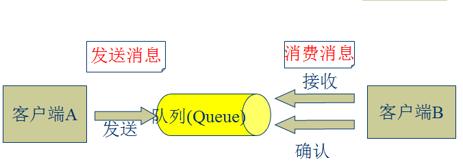
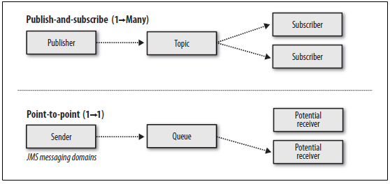
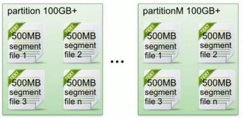
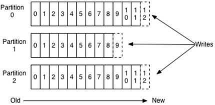
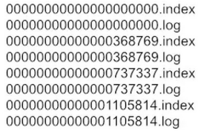
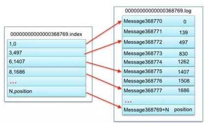
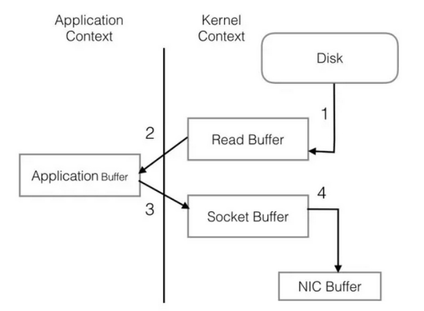
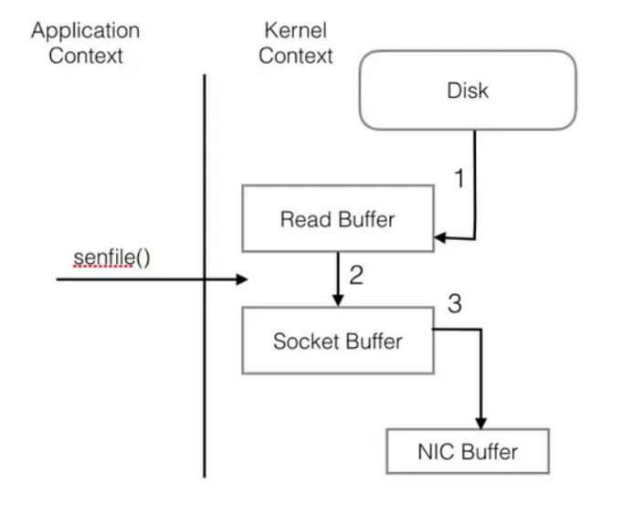
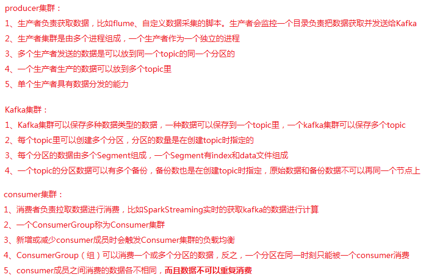
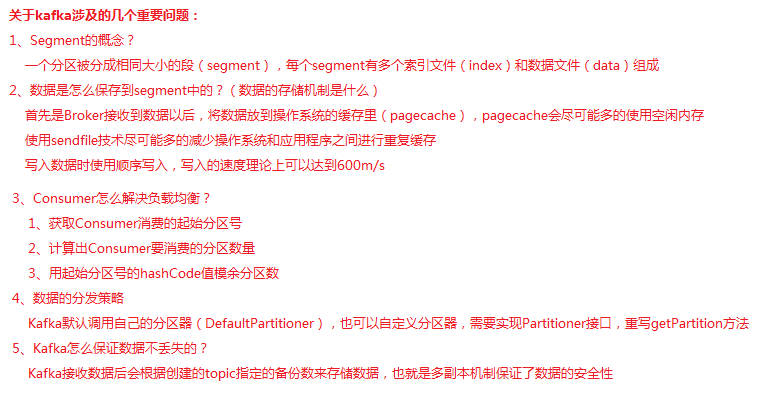

## Kafka

### 3.27.1 kafka基本概念

Apache Kafka是一个开源**消息**系统，由Scala写成。是由Apache软件基金会开发的一个开源消息系统项目。

 Kafka最初是由LinkedIn开发，并于2011年初开源。2012年10月从Apache Incubator毕业。该项目的目标是为处理实时数据提供一个统一、高吞吐量、低等待的平台。

Kafka是一个分布式消息队列：生产者、消费者的功能。它提供了类似于JMS的特性，但是在设计实现上完全不同，此外它并不是JMS规范的实现。

Kafka对消息保存时根据Topic进行归类，发送消息者称为Producer,消息接受者称为Consumer,此外kafka集群有多个kafka实例组成，每个实例(server)称为broker。

无论是kafka集群，还是producer和consumer都依赖于**zookeeper**集群保存一些meta信息，来保证系统可用性

### 3.27.2 kafka的发展历史

kafka的诞生，是为了解决linkedin的数据管道问题，期初linkedin采用了ActiveMQ来进行数据交换，大约是在2010年前后，那时的ActiveMQ还远远无法满足linkedin对数据传递系统的要求，经常由于各种缺陷而导致消息阻塞或者服务无法正常访问，为了能够解决这个问题，linkedin决定研发自己的消息传递系统，当时linkedin的首席架构师jay kreps便开始组织团队进行消息传递系统的研发；

2010年底，开源到github，初始版本为0.7.0；
2011年7月因为备受关注，被纳入apache孵化器项目；
2012年10月，kafka从apache孵化器项目毕业，成为apache顶级项目；

2014年，jay kreps,neha narkhede,jun rao离开linkedin,成立confluent,此后linkedin和confluent成为kafka的核心贡献组织，致力于将kafka推广应用。

### 3.27.3 kafka的应用背景

日志收集：一个公司可以用Kafka可以收集各种服务的log，通过kafka以统一接口服务的方式开放给各种consumer，例如hadoop、Hbase、Solr等。

 消息系统：解耦和生产者和消费者、缓存消息等。

用户活动跟踪：Kafka经常被用来记录web用户或者app用户的各种活动，如浏览网页、搜索、点击等活动，这些活动信息被各个服务器发布到kafka的topic中，然后订阅者通过订阅这些topic来做实时的监控分析，或者装载到hadoop、数据仓库中做离线分析和挖掘。

运营指标：Kafka也经常用来记录运营监控数据。包括收集各种分布式应用的数据，生产各种操作的集中反馈，比如报警和报告。

流式处理：比如spark streaming和storm。

### 3.27.4 JMS规范介绍

**JMS概念**

JMS：是Java提供的一套技术规范。

JMS用途：用来异构系统集成通信，缓解系统瓶颈，提高系统的伸缩性增强系统用户体验，使得系统模块化和组件化变得可行并更加灵活。

实现方式：生产消费者模式（生产者、服务器、消费者）



**JMS消息传输模型**

```
点对点模式（一对一，消费者主动拉取数据，消息收到后消息清除）
点对点模型通常是一个基于拉取或者轮询的消息传送模型，这种模型从队列中请求信息，而不是将消息推送到客户端。这个模型的特点是发送到队列的消息被一个且只有一个接收者接收处理，即使有多个消息监听者也是如此。

发布/订阅模式（一对多，数据生产后，推送给所有订阅者）
发布订阅模型则是一个基于推送的消息传送模型。发布订阅模型可以有多种不同的订阅者，临时订阅者只在主动监听主题时才接收消息，而持久订阅者则监听主题的所有消息，即当前订阅者不可用，处于离线状态。
```



**JMS核心组件**

```
Destination：消息发送的目的地，也就是前面说的Queue和Topic。
Message ：从字面上就可以看出是被发送的消息。
Producer： 消息的生产者，要发送一个消息，必须通过这个生产者来发送。
MessageConsumer： 与生产者相对应，这是消息的消费者或接收者，通过它来接收一个消息。
```

```
StreamMessage：Java 数据流消息，用标准流操作来顺序的填充和读取。
MapMessage：一个Map类型的消息，名称为 string 类型，而值为 Java 的基本类型。
TextMessage：普通字符串消息，包含一个String。
ObjectMessage：对象消息，包含一个可序列化的Java对象
BytesMessage：二进制数组消息，包含一个byte[]。
XMLMessage:  一个XML类型的消息。
最常用的是TextMessage和ObjectMessage。
```

### 3.27.5 kafka的组件介绍（重要）

Producer：消息生产者，就是向kafka broker发消息的客户端。

Consumer：消息消费者，向kafka broker取消息的客户端

Topic ：我们可以理解为一个队列，消息根据Topic进行归类。

Consumer Group （CG）：这是kafka用来实现一个topic消息的广播（发给所有的consumer）和单播（发给任意一个consumer）的手段。一个topic可以对应多个CG。topic的消息会复制（不是真的复制，是概念上的）到所有的CG，但每个partion只会把消息发给该CG中的一个consumer。如果需要实现广播，只要每个consumer有一个独立的CG就可以了。用CG还可以将consumer进行自由的分组而不需要多次发送消息到不同的topic。

Broker ：一台kafka服务器就是一个broker。一个集群由多个broker组成。一个broker可以容纳多个topic。

### 3.27.6 kafka集群部署（重要）

**1、下载安装包**

http://kafka.apache.org/downloads

或者在linux中使用wget命令下载安装包

```shell
wget http://mirrors.hust.edu.cn/apache/kafka/1.1.0/kafka_2.11-1.1.0.tgz
```

**2、解压安装包**

```shell
tar -zxvf/export/software/kafka_2.11-1.1.0.tgz -C /export/servers/
ln -s kafka_2.11-1.1.0 kafka # 软链接
```

**3、修改配置文件**

进入配置文件目录

```shell
cd /export/servers/kafka/config
```

需要配置的文件有3个，具体配置信息在第5天目录中

```
producer.properties
server.properties
consumer.properties
```

**4、分发安装包**

```shell
scp -r/export/servers/kafka_2.11-1.1.0 kafka02:/export/servers
```

然后分别在各机器上创建软链接

```shell
cd /export/servers/
ln -s kafka_2.11-1.1.0 kafka
```

**5、再次修改各节点配置文件**

依次修改每个节点的server.properties中的broker.id

**6、启动集群**

依次在每个节点启动

```shell
nohup bin/kafka-server-start.sh config/server.properties &
```

### 3.27.7 kafka的常用操作命令

查看当前服务器中的所有topic

```shell
bin/kafka-topics.sh --list --zookeeper node01:2181
```

创建topic

```shell
bin/kafka-topics.sh --create --zookeeper node01:2181 --replication-factor 1 --partitions 1 --topic test
```

删除topic

```shell
bin/kafka-topics.sh --delete --zookeeper node01:2181 --topic test
```

需要server.properties中设置delete.topic.enable=true否则只是标记删除或者直接重启。
通过shell命令发送消息

```shell
bin/kafka-console-producer.sh --broker-list node01:9092 --topic test1
```

通过shell消费消息

```shell
bin/kafka-console-consumer.sh --zookeeper node01:2181 --from-beginning --topic test1
```

查看消费位置

```shell
bin/kafka-run-class.sh kafka.tools.ConsumerOffsetChecker --zookeeper node01:2181 --group testGroup
```

查看某个Topic的详情

```shell
bin/kafka-topics.sh --topic test --describe --zookeeper node01:2181
```

对分区数进行修改

```shell
bin/kafka-topics.sh --zookeeper  node01 --alter --partitions 15 --topic utopic
```

### 3.27.8 kafka文件存储机制（重要）

分析过程分为以下4个步骤：

1. topic中partition存储分布
2. partiton中文件存储方式
3. partiton中segment文件存储结构
4. 在partition中如何通过offset查找message

通过上述4过程详细分析，我们就可以清楚认识到kafka文件存储机制的奥秘。

### 3.27.9 topic中partition的存储分布

假设实验环境中Kafka集群只有一个broker，xxx/message-folder为数据文件存储根目录，在Kafka broker中server.properties文件配置(参数log.dirs=xxx/message-folder)，例如创建2个topic名称分别为report_push、launch_info, partitions数量都为partitions=4 存储路径和目录规则为： xxx/message-folder

```shell
          |--report_push-0
              |--report_push-1
              |--report_push-2
              |--report_push-3
              |--launch_info-0
              |--launch_info-1
              |--launch_info-2
              |--launch_info-3
```

在Kafka文件存储中，同一个topic下有多个不同partition，每个partition为一个目录，partiton命名规则为topic名称+有序序号，第一个partiton序号从0开始，序号最大值为partitions数量减1。 

### 3.27.10 partiton中文件存储方式（重要）

在Kafka文件存储中，同一个topic下有多个不同partition，每个partition为一个分区，partiton命名规则为topic名称+有序序号，第一个partiton序号从0开始，序号最大值为partitions数量减1。

每个partion(分区)相当于一个巨型文件被平均分配到多个大小相等segment(段)数据文件中。**但每个段segment file消息数量不一定相等**，这种特性方便old segment file快速被删除。默认保留7天的数据。

 

每个partiton只需要支持顺序读写就行了，segment文件生命周期由服务端配置参数决定。（什么时候创建，什么时候删除）

 

**数据有序的讨论？**

​	一个partition的数据是否是有序的？	间隔性有序，不连续

​	针对一个topic里面的数据，只能做到partition内部有序，不能做到全局有序。

​	特别加入消费者的场景后，如何保证消费者消费的数据全局有序的？伪命题。

只有一种情况下才能保证全局有序？就是只有一个partition。

### 3.27.11 kafka分区中的Segment（重要）

Segment file组成：由2大部分组成，分别为index file和data file，此2个文件一一对应，成对出现，后缀".index"和“.log”分别表示为segment索引文件、数据文件。

 

Segment文件命名规则：partion全局的第一个segment从0开始，后续每个segment文件名为上一个segment文件最后一条消息的offset值。数值最大为64位long大小，19位数字字符长度，没有数字用0填充。

索引文件存储大量元数据，数据文件存储大量消息，索引文件中元数据指向对应数据文件中message的物理偏移地址。

 

3，497：当前log文件中的第几条信息，存放在磁盘上的那个地方

 

上述图中索引文件存储大量元数据，数据文件存储大量消息，索引文件中元数据指向对应数据文件中message的物理偏移地址。

其中以索引文件中元数据3,497为例，依次在数据文件中表示第3个message(在全局partiton表示第368772个message)、以及该消息的物理偏移地址为497。

 

segment data file由许多message组成， 物理结构如下：

| **关键字**          | **解释说明**                                                 |
| ------------------- | ------------------------------------------------------------ |
| 8 byte offset       | 在parition(分区)内的每条消息都有一个有序的id号，这个id号被称为偏移(offset),它可以唯一确定每条消息在parition(分区)内的位置。即offset表示partiion的第多少message |
| 4 byte message size | message大小                                                  |
| 4 byte CRC32        | 用crc32校验message                                           |
| 1 byte “magic"      | 表示本次发布Kafka服务程序协议版本号                          |
| 1 byte “attributes" | 表示为独立版本、或标识压缩类型、或编码类型。                 |
| 4 byte key length   | 表示key的长度,当key为-1时，K byte key字段不填                |
| K byte key          | 可选                                                         |
| value bytes payload | 表示实际消息数据。                                           |

### 3.27.12 kafka怎样查找消息

读取offset=368776的message，需要通过下面2个步骤查找。

​	

**1、查找segment file**

00000000000000000000.index表示最开始的文件，起始偏移量(offset)为1

00000000000000368769.index的消息量起始偏移量为368770 = 368769 + 1

00000000000000737337.index的起始偏移量为737338=737337 + 1

其他后续文件依次类推。

以起始偏移量命名并排序这些文件，只要根据offset **二分查找**文件列表，就可以快速定位到具体文件。当offset=368776时定位到00000000000000368769.index和对应log文件。

**2、通过segment file查找message**

当offset=368776时，依次定位到00000000000000368769.index的元数据物理位置和00000000000000368769.log的物理偏移地址

然后再通过00000000000000368769.log顺序查找直到offset=368776为止。

### 3.27.13 kafka是怎样做到消息快速存储的（重要）

不同于Redis和MemcacheQ等内存消息队列，Kafka的设计是把所有的Message都要写入速度低容量大的硬盘，以此来换取更强的存储能力。实际上，Kafka使用硬盘并没有带来过多的性能损失，“规规矩矩”的抄了一条“近道”。

首先，说“规规矩矩”是因为Kafka在磁盘上只做Sequence I/O，由于消息系统读写的特殊性，这并不存在什么问题。关于磁盘I/O的性能，引用一组Kafka官方给出的测试数据(Raid-5，7200rpm)：

Sequence I/O: 600MB/s

Random I/O: 100KB/s

所以通过只做Sequence I/O的限制，规避了磁盘访问速度低下对性能可能造成的影响。

接下来我们再聊一聊Kafka是如何“抄近道的”。

首先，Kafka重度依赖底层操作系统提供的PageCache功能。当上层有写操作时，操作系统只是将数据写入PageCache，同时标记Page属性为Dirty。

**当读操作发生时，先从PageCache中查找，如果发生缺页才进行磁盘调度，最终返回需要的数据**。实际上PageCache是把尽可能多的空闲内存都当做了磁盘缓存来使用。同时如果有其他进程申请内存，回收PageCache的代价又很小，所以现代的OS都支持PageCache。

使用PageCache功能同时可以避免在JVM内部缓存数据，JVM为我们提供了强大的GC能力，同时也引入了一些问题不适用与Kafka的设计。

如果在Heap内管理缓存，JVM的GC线程会频繁扫描Heap空间，带来不必要的开销。如果Heap过大，执行一次Full GC对系统的可用性来说将是极大的挑战。

所有在在JVM内的对象都不免带有一个Object Overhead(千万不可小视)，内存的有效空间利用率会因此降低。

所有的In-Process Cache在OS中都有一份同样的PageCache。所以通过将缓存只放在PageCache，可以至少让可用缓存空间翻倍。

如果Kafka重启，所有的In-Process Cache都会失效，而OS管理的PageCache依然可以继续使用。

PageCache还只是第一步，Kafka为了进一步的优化性能还采用了Sendfile技术。在解释Sendfile之前，首先介绍一下传统的网络I/O操作流程，大体上分为以下4步。

OS 从硬盘把数据读到内核区的PageCache。

用户进程把数据从内核区Copy到用户区。

然后用户进程再把数据写入到Socket，数据流入内核区的Socket Buffer上。

OS 再把数据从Buffer中Copy到网卡的Buffer上，这样完成一次发送。

 

 

整个过程共经历两次Context Switch，四次System Call。同一份数据在内核Buffer与用户Buffer之间重复拷贝，效率低下。其中2、3两步没有必要，完全可以直接在内核区完成数据拷贝。这也正是Sendfile所解决的问题，经过Sendfile优化后，整个I/O过程就变成了下面这个样子。

 

 

通过以上的介绍不难看出，Kafka的设计初衷是尽一切努力在内存中完成数据交换，无论是对外作为一整个消息系统，或是内部同底层操作系统的交互。如果Producer和Consumer之间生产和消费进度上配合得当，完全可以实现数据交换零I/O。这也就是我为什么说Kafka使用“硬盘”并没有带来过多性能损失的原因。下面是我在生产环境中采到的一些指标。

(20 Brokers, 75 Partitions per Broker, 110k msg/s)

此时的集群只有写，没有读操作。10M/s左右的Send的流量是Partition之间进行Replicate而产生的。从recv和writ的速率比较可以看出，写盘是使用Asynchronous+Batch的方式，底层OS可能还会进行磁盘写顺序优化。而在有Read Request进来的时候分为两种情况，第一种是内存中完成数据交换。

Send流量从平均10M/s增加到了到平均60M/s，而磁盘Read只有不超过50KB/s。PageCache降低磁盘I/O效果非常明显。

接下来是读一些收到了一段时间，已经从内存中被换出刷写到磁盘上的老数据。

其他指标还是老样子，而磁盘Read已经飚高到40+MB/s。此时全部的数据都已经是走硬盘了(对硬盘的顺序读取OS层会进行Prefill PageCache的优化)。依然没有任何性能问题。

### 3.27.14 如何消费已经消费过的数据（重要）

consumer是底层采用的是一个阻塞队列，只要一有producer生产数据，那consumer就会将数据消费。当然这里会产生一个很严重的问题，如果你重启一消费者程序，那你连一条数据都抓不到，但是log文件中明明可以看到所有数据都好好的存在。换句话说，一旦你消费过这些数据，那你就无法再次用同一个groupid消费同一组数据了。

原因：消费者消费了数据并不从队列中移除，只是记录了offset偏移量。

同一个consumergroup的所有consumer合起来消费一个topic，并且他们每次消费的时候都会保存一个offset参数在zookeeper的root上。如果此时某个consumer挂了或者新增一个consumer进程，将会触发kafka的负载均衡，暂时性的重启所有consumer，重新分配哪个consumer去消费哪个partition，然后再继续通过保存在zookeeper上的offset参数继续读取数据。注意:offset保存的是consumer 组消费的消息偏移。 

要消费同一组数据，可以采取如下措施：1)采用不同的group。2)通过一些配置，就可以将线上产生的数据同步到镜像中去，然后再由特定的集群区处理大批量的数据。3）手动更改offset。

### 3.27.15 kafka分区和消费者的关系（重要）

消费者以组的名义订阅主题，主题有多个分区，消费者组中有多个消费者实例，那么消费者实例和分区之前的对应关系是怎样的呢？

换句话说，就是组中的每一个消费者负责那些分区，这个分配关系是如何确定的呢？


同一时刻，一条消息只能被组中的一个消费者实例消费

消费者组订阅这个主题，意味着主题下的所有分区都会被组中的消费者消费到，如果按照从属关系来说的话就是，主题下的每个分区只从属于组中的一个消费者，不可能出现组中的两个消费者负责同一个分区。

那么，问题来了。如果分区数大于或者等于组中的消费者实例数，那自然没有什么问题，无非一个消费者会负责多个分区，（当然，最理想的情况是二者数量相等，这样就相当于一个消费者负责一个分区）；但是，如果消费者实例的数量大于分区数，那么按照默认的策略（之所以强调默认策略是因为你也可以自定义策略），有一些消费者是多余的，一直接不到消息而处于空闲状态。

假设多个消费者负责同一个分区，那么会有什么问题呢？

我们知道，Kafka它在设计的时候就是要保证分区下消息的顺序，也就是说消息在一个分区中的顺序是怎样的，那么消费者在消费的时候看到的就是什么样的顺序，那么要做到这一点就首先要保证消息是由消费者主动拉取的（pull），其次还要保证一个分区只能由一个消费者负责。倘若，两个消费者负责同一个分区，那么就意味着两个消费者同时读取分区的消息，由于消费者自己可以控制读取消息的offset，就有可能C1才读到2，而C1读到1，C1还没处理完，C2已经读到3了，则会造成很多浪费，因为这就相当于多线程读取同一个消息，会造成消息处理的重复，且不能保证消息的顺序，这就跟主动推送（push）无异。

### 3.27.16 kafka的topic数据如何同步副本（重要）


kafka的复制是针对分区的。比如上图中有四个broker,一个topic,2个分区，复制因子是3。当producer发送一个消息的时候，它会选择一个分区，比如`topic1-part1`分区，将消息发送给这个分区的leader， broker2、broker3会拉取这个消息，一旦消息被拉取过来，slave会发送ack给master，这时候master才commit这个log。

这个过程中producer有两个选择：一是等所有的副本都拉取成功producer才收到写入成功的response,二是等leader写入成功就得到成功的response。第一个中可以确保在异常情况下不丢消息，但是latency就下来了。后一种latency提高很多，但是一旦有异常情况，slave还没有来得及拉取到最新的消息leader就挂了，这种情况下就有可能丢消息了。

一个Broker既可能是一个分区的leader,也可能是另一个分区的slave，如上图所示。

kafka实际是保证在**足够多**的slave写入成功的情况下就认为消息写入成功，而不是全部写入成功。这是因为有可能一些节点网络不好，或者机器有问题hang住了，如果leader一直等着，那么所有后续的消息都堆积起来了， 所以kafka认为只要足够多的副本写入就可以了。那么，怎么才认为是**足够多**呢？

Kafka引入了 **ISR**的概念。ISR是`in-sync replicas`的简写。ISR的副本保持和leader的同步，当然leader本身也在ISR中。初始状态所有的副本都处于ISR中，当一个消息发送给leader的时候，leader会等待ISR中所有的副本告诉它已经接收了这个消息，如果一个副本失败了，那么它会被移除ISR。下一条消息来的时候，leader就会将消息发送给当前的ISR中节点了。

同时，leader还维护这HW(high watermark),这是一个分区的最后一条消息的offset。HW会持续的将HW发送给slave，broker可以将它写入到磁盘中以便将来恢复。

当一个失败的副本重启的时候，它首先恢复磁盘中记录的HW，然后将它的消息truncate到HW这个offset。这是因为HW之后的消息不保证已经commit。这时它变成了一个slave， 从HW开始从Leader中同步数据，一旦追上leader，它就可以再加入到ISR中。

kafka使用Zookeeper实现leader选举。如果leader失败，controller会从ISR选出一个新的leader。leader 选举的时候可能会有数据丢失，但是committed的消息保证不会丢失。

### 3.27.17 如何设置生存周期

## Kafka 日志消息保存时间总结

Kafka 日志实际上是以日志的方式默认保存在/kafka-logs文件夹中的。虽然默认有7天清除的机制，但是在数据量大，而磁盘容量不足的情况下，经常出现无法写入的情况。下面是相关参数的调整：

**日志刷新策略**

Kafka的日志实际上开始是在缓存中的，然后根据策略定期一批一批写入到日志文件中去，以提高吞吐率。

| 属性名                          | 含义                                                         | 默认值              |
| ------------------------------- | ------------------------------------------------------------ | ------------------- |
| log.flush.interval.messages     | 消息达到多少条时将数据写入到日志文件                         | 9223372036854775807 |
| log.flush.interval.ms           | 一条消息在内存时长当达到该时间时，强制执行一次flush，不设置的话，等同log.flush.scheduler.interval.ms | null                |
| log.flush.scheduler.interval.ms | 周期性检查，是否需要将信息flush                              | 9223372036854775807 |

**日志保存清理策略**

| 属性名                          | 含义                                             | 默认值    |
| ------------------------------- | ------------------------------------------------ | --------- |
| log.cleanup.policy              | 日志清理保存的策略只有delete和compact两种        | delete    |
| log.retention.hours             | 日志保存的时间，可以选择hours,minutes和ms        | 168(7day) |
| log.retention.bytes             | 删除前日志文件允许保存的最大值                   | -1        |
| log.segment.delete.delay.ms     | 日志文件被真正删除前的保留时间                   | 60000     |
| log.retention.check.interval.ms | 周期性检查是否有日志符合删除的条件（新版本使用） | 300000    |

这里特别说明一下，日志的真正清除时间。当删除的条件满足以后，日志将被“删除”，但是这里的删除其实只是将该日志进行了“delete”标注，文件只是无法被索引到了而已。但是文件本身，仍然是存在的，只有当过了log.segment.delete.delay.ms 这个时间以后，文件才会被真正的从文件系统中删除。

### 3.27.18 zookeeper如何管理kafka（重要）

**1，配置管理**

Topic的配置之所以能动态更新就是基于zookeeper做了一个动态全局配置管理。

**2，负载均衡**

基于zookeeper的消费者，实现了该特性，动态的感知分区变动，将负载使用既定策略分到消费者身上。

**3，命名服务**

Broker将advertised.port和advertised.host.name，这两个配置发布到zookeeper上的zookeeper的节点上/brokers/ids/BrokerId(broker.id),这个是供生产者，消费者，其它Broker跟其建立连接用的。

**4，分布式通知**

比如分区增加，topic变动，Broker上线下线等均是基于zookeeper来实现的分布式通知。

**5，集群管理和master选举**

我们可以在通过命令行，对kafka集群上的topic partition分布，进行迁移管理，也可以对partition leader选举进行干预。

Master选举，要说有也是违反常规，常规的master选举，是基于临时顺序节点来实现的，序列号最小的作为master。而kafka的Controller的选举是基于临时节点来实现的，临时节点创建成功的成为Controller，更像一个独占锁服务。

**6，分布式锁**

独占锁，用于Controller的选举。

### 3.27.19 kafka常见问题（重要）






### 3.27.20 代码模拟生产者消费者案例练习（重要）

Producer API

```scala
/**
  * 实现一个Producer来不断的生产数据
  * 1、能够发送数据到Kafka集群指定topic
  * 2、实现自定义分区器
  */
object KafkaProducerTest {
  def main(args: Array[String]): Unit = {

    // 定义topic，把数据传到该topic
    val topic = "KafkaSimple"

    // 创建一个配置文件信息类
    val props: Properties = new Properties()
    // 数据在序列化时的编码类型
    props.put("serializer.class", "kafka.serializer.StringEncoder")
    // kafka集群列表
    props.put("metadata.broker.list", "node01:9092,node02:9092,node03:9092")
    // 设置发送数据后是否需要服务端的反馈：0，1，-1
    props.put("request.required.acks", "1")
    // 调用分区器
    props.put("partitioner.class", "com.qf.gp1701.sparktest.day12.CustomPartitioner")
//    props.put("partitioner.class", "kafka.producer.DefaultPartitioner")

    val config = new ProducerConfig(props)

    // 创建一个生产者实例
    val producer: Producer[String, String] = new Producer(config)

    // 模拟生产一些数据
    for (i <- 1 to 10000){
      val msg = s"$i: Producer send data"
      producer.send(new KeyedMessage[String, String](image/topic, msg))
    }

  }
}
```

自定义分区器

```scala
class CustomPartitioner(props: VerifiableProperties) extends Partitioner{
  override def partition(key: Any, numPartitions: Int): Int = {
    key.hashCode() % numPartitions
  }
}
```

Consumer API

```scala
class KafkaConsumerTest(val consumer: String, val stream: KafkaStream[Array[Byte], Array[Byte]]) extends Runnable{
  override def run() = {
    val it: ConsumerIterator[Array[Byte], Array[Byte]] = stream.iterator()
    while(it.hasNext()){
      val data: MessageAndMetadata[Array[Byte], Array[Byte]] = it.next()
      val topic: String = data.topic
      val partition: Int = data.partition
      val offset: Long = data.offset
      val msg: String = new String(data.message())
      println(s"Consumer: $consumer, Topic: $topic, Partition: $partition, Offset: $offset, msg: $msg")
    }
  }
}
object KafkaConsumerTest{
  def main(args: Array[String]): Unit = {
    // 定义用来读取数据的topic
    val topic = "KafkaSimple"

    // 用来存储多个topic
    val topics = new mutable.HashMap[String, Int](image/)
    topics.put(topic, 2)

    // 配置文件信息
    val props = new Properties()
    // ConsumerGroup id
    props.put("group.id", "group4")
    // 指定zookeeper的地址列表, 注意：value里不要有空格
    props.put("zookeeper.connect", "node01:2181,node02:2181,node03:2181")
    // 如果zookeeper没有offset值或者offset值超出范围，需要指定一个初始的offset
    props.put("auto.offset.reset", "smallest")

    // 把配置信息封装到ConsumerConfig对象里
    val config = new ConsumerConfig(props)

    // 创建Consumer实例，如果没有数据，会一直线程等待
    val consumer: ConsumerConnector = Consumer.create(config)

    // 根据所传的topics来获取数据,得到一个stream流
    val streams: collection.Map[String, List[KafkaStream[Array[Byte], Array[Byte]]]] =
      consumer.createMessageStreams(topics)

    // 获取指定topic的数据
    val stream: Option[List[KafkaStream[Array[Byte], Array[Byte]]]] = streams.get(topic)

    // 创建一个固定大小的线程池
    val pool: ExecutorService = Executors.newFixedThreadPool(3)

    for (i <- 0 until stream.size){
      pool.execute(new KafkaConsumerTest(s"Consumer: $i", stream.get(i)))
    }

  }
}
```

