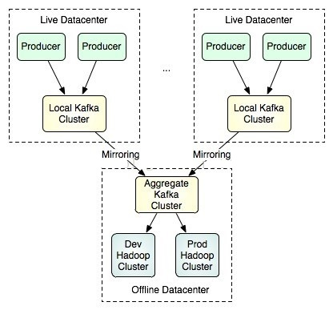

##### kafka的主要组件有哪些？

1) Kafka维护的消息流称为topic。 
2) 发布消息者称为 producer。 
3) 订阅并消费消息的称为 consumers。 
4) Kafka运行在多server的集群之上，每个server称为broker。 

一个Topic可以认为是一类消息，Kafka集群将每个topic将被分成多个partition(区)。

每一个partition都是一个有序的、不可变的消息序列，它在存储层面是以append log文件形式存在的。任何发布到此partition的消息都会被直接追加到log文件的尾部。每条消息在文件中的位置称为offset(偏移量)，offset为一个long型数字，它是唯一标记一条消息。

Kafka集群保留了所有以发布消息，即使消息被消费，消息仍然会被保留一段时间。例如，如果log被设置为保留两天，那么在一条消息被消费之后的两天内仍然有效，之后它将会被丢弃以释放磁盘空间。Kafuka的性能相对于数据量来说是恒定的，所以保留大量的数据并不是问题。

每个consumer(消费者)的基础元数据只有一个，那就是offset，它表示消息在log文件中的位置，它由consumer所控制，通常情况下，offset将会”线性”的向前驱动，也就是说消息将依次顺序被消费。而事实上，consumer可以通过设置offset来消费任意位置的消息。例如，consume可以重offset来重新处理消息。

这些特性意味着Kafkaconsume非常轻量级，它可以随意切入和离开，而不会对集群里其他的consumer造成太大的影响。比如，你可以使用tail命令工具来查看任意topic的内容，而不会影响消息是否被其他consumer所消费。


##### 分区的作用？

kafka topic 分区的原因主要是为了并发访问，增大吞吐量。

每一个topic均被分成多个互不重复的partition，其中每个partition均被放在一个或多个broker服务器上，这样就提供了容错。


##### segment的大小可以设置吗？

```
# 日志文件中每个segment的大小，默认为1G
log.segment.bytes=1073741824
```


##### kafka的文件存储机制？

同一个topic下有多个不同的partition，每个partition为一个目录，partition命名的规则是topic的名称加上一个序号，序号从0开始。
每一个partition目录下的文件被平均切割成大小相等（默认一个文件是500m，可以手动去设置）的数据文件，
每一个数据文件都被称为一个段（segment file），但每个段消息数量不一定相等，这种特性能够使得老的segment可以被快速清除。
默认保留7天的数据。
每个partition下都会有默认每500m一个的segment段。
另外每个partition只需要支持顺序读写就可以了，partition中的每一个segment段的生命周期是由我们在配置文件中指定的一个参数决定的。
比如它在默认情况下，每满500m就会创建新的segment段（segment file），每满7天就会清理之前的数据。
首先00000000000000000000.log文件是最早产生的文件，该文件达到500m之后又产生了新的文件，新的数据会往这个新的文件里面写，这个文件达到500m之后，数据就会再往下一个文件里面写，
也就是说它只会往文件的末尾追加数据，这就是顺序写的过程，生产者只会对每一个partition做数据的追加（写）的操作。


##### 如何消费已经被消费过的数据？

consumer是底层采用的是一个阻塞队列，只要一有producer生产数据，那consumer就会将数据消费。当然这里会产生一个很严重的问题，如果你重启一消费者程序，那你连一条数据都抓不到，但是log文件中明明可以看到所有数据都好好的存在。换句话说，一旦你消费过这些数据，那你就无法再次用同一个groupid消费同一组数据了。原因：消费者消费了数据并不从队列中移除，只是记录了offset偏移量。同一个consumergroup的所有consumer合起来消费一个topic，并且他们每次消费的时候都会保存一个offset参数在zookeeper的root上。如果此时某个consumer挂了或者新增一个consumer进程，将会触发kafka的负载均衡，暂时性的重启所有consumer，重新分配哪个consumer去消费哪个partition，然后再继续通过保存在zookeeper上的offset参数继续读取数据。注意:offset保存的是consumer  组消费的消息偏移。 要消费同一组数据，

解决方式：

1.采用不同的group。

2.通过一些配置，就可以将线上产生的数据同步到镜像中去，然后再由特定的集群区处理大批量的数据。




##### partition和consumer的数量关系？

1. 如果consumer比partition多，是浪费，因为kafka的设计是在一个partition上是不允许并发的，所以consumer数不要大于partition数 。
2. 如果consumer比partition少，一个consumer会对应于多个partitions，这里主要合理分配consumer数和partition数，否则会导致partition里面的数据被取的不均匀 。最好partiton数目是consumer数目的整数倍，所以partition数目很重要，比如取24，就很容易设定consumer数目 。
3. 如果consumer从多个partition读到数据，不保证数据间的顺序性，kafka只保证在一个partition上数据是有序的，但多个partition，根据你读的顺序会有不同 
4. 增减consumer，broker，partition会导致rebalance，所以rebalance后consumer对应的partition会发生变化 


##### kafka如何分配副本？

Producer在发布消息到某个Partition时，先通过ZooKeeper找到该Partition的Leader，然后无论该Topic的Replication Factor为多少（也即该Partition有多少个Replica），Producer只将该消息发送到该Partition的Leader。Leader会将该消息写入其本地Log。每个Follower都从Leader pull数据。这种方式上，Follower存储的数据顺序与Leader保持一致。


##### zookeeper如何管理kafka

1. Producer端使用zookeeper用来"发现"broker列表，以及和Topic下每个partition leader建立socket连接并发送消息。
2. Broker端使用zookeeper用来注册broker信息，以及监测partition leader存活性.
3. Consumer端使用zookeeper用来注册consumer信息，其中包括consumer消费的partition列表等，同时也用来发现broker列表，并和partition leader建立socket连接，并获取消息


##### kafka能否自动创建topics

设置Server.properties配置文件中的一个参数

```shell
 # 是否自动创建topic 
 # 如果broker中没有topic的信息,当producer/consumer操作topic时,是否自动创建. 
 # 如果为false,则只能通过API或者command创建topic 
 auto.create.topics.enable=true
```


