### 3.26.1 SparkSQL介绍

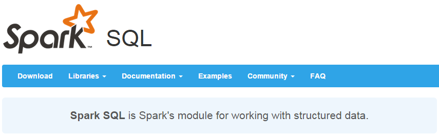

Spark SQL是Spark用来处理结构化数据的一个模块，它提供了一个编程抽象叫做DataFrame并且作为分布式SQL查询引擎的作用。

我们已经学习了Hive，它是将Hive SQL转换成MapReduce然后提交到集群上执行，大大简化了编写MapReduce的程序的复杂性，由于MapReduce这种计算模型执行效率比较慢。所以Spark SQL的应运而生，它是将Spark SQL转换成RDD，然后提交到集群执行，执行效率非常快！

Hive的应用其实就是应对不会写Java的开发人员但是有会写SQL的数据库而言提供的是MR的一种简化

SparkSQL其实也就是对之前所学习的SparkCore中RDD的一种简化,用SQL的语言可以对RDD编程进行开发

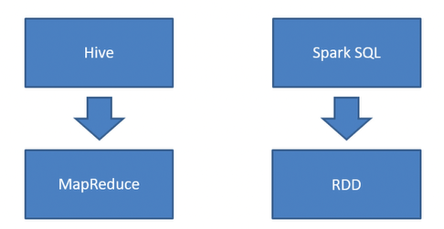

ps:Spark是由处理上限的10PB但是超过这个范围还是要使用hive来进行处理的hive应该是在100PB级别

1.易整合

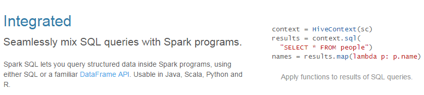

2.统一的数据访问方式

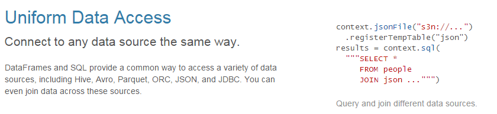

3.兼容Hive

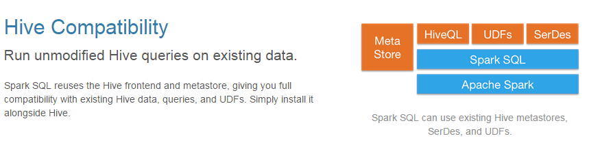

4.标准的数据连接

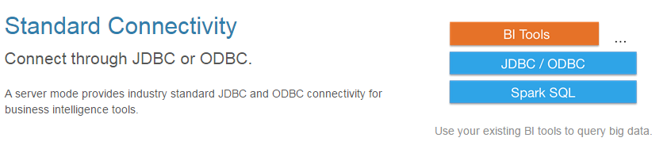

### 3.26.2 SparkSQL的操作方式

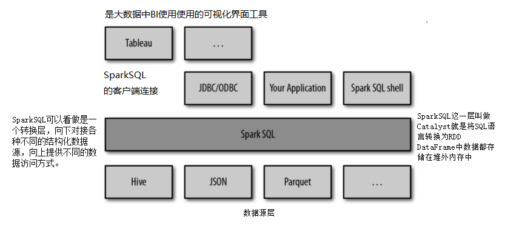

### 3.26.3 SparkSQL的数据抽象

对于SparkCore而言对数据的进行操作需要先转换成RDD,对RDD可以使用各种算子进行处理,最终对数据进行统一的操作,所以我们将RDD看做是对数据的封装(抽象)

对于SparkSQL而言对数据进行操作的也需要进行转换,这里提供了两个新的抽象,分别是DataFrame和DataSet

#### RDD vs DataFrames vs DataSet

首先从版本的产生上来看
RDD (Spark1.0) —> Dataframe(Spark1.3) —> Dataset(Spark1.6)

##### RDD

RDD是一个懒执行的不可变的可以支持Functional(函数式编程)的并行数据集合。

RDD的最大好处就是简单，API的人性化程度很高。

RDD的劣势是性能限制，它是一个JVM驻内存对象，这也就决定了存在GC的限制和数据增加时Java序列化成本的升高。

##### DataFrame

简单来说DataFrame是RDD+Schema的集合

什么是Schema? 

之前我们学习过MySQL数据库,在数据库中schema是数据库的组织和结构模式中包含了schema对象，可以是**表**(table)、**列**(column)、**数据类型**(data type)、**视图**(view)、**存储过程**(stored procedures)、**关系**(relationships)、**主键**(primary key)、**外键(**foreign key)等,Sechema代表的就是一张表

与RDD类似，DataFrame也是一个分布式数据容器。然而DataFrame更像传统数据库的二维表格，除了数据以外，还记录数据的结构信息，即schema。同时，与Hive类似，DataFrame也支持嵌套数据类型（struct、array和map）。从API易用性的角度上看，DataFrame API提供的是一套高层的关系操作，比函数式的RDD API要更加友好，门槛更低。由于与R和Pandas的DataFrame类似，Spark DataFrame很好地继承了传统单机数据分析的开发体验。

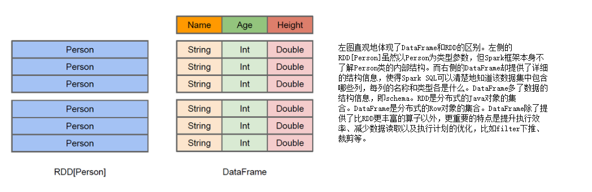

DataFrame是为数据提供了Schema的视图。可以把它当做数据库中的一张表来对待

DataFrame也是懒执行的。

性能上比RDD要高，主要有两方面原因： 

###### 定制化内存管理

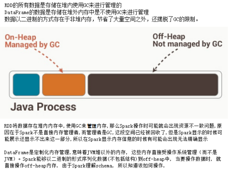

##### 优化的执行计划

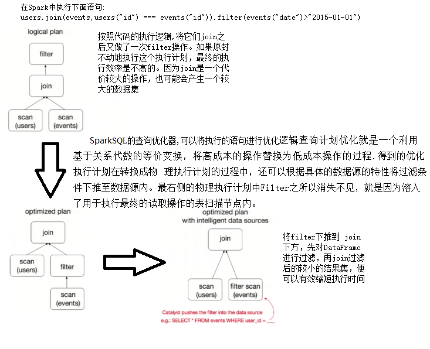

Dataframe的劣势在于在编译期缺少类型安全检查，导致运行时出错.

ps:DataFrame只是知道字段，但是不知道字段的类型，所以在执行这些操作的时候是没办法在编译的时候检查是否类型失败的，比如你可以对一个String进行减法操作，在执行的时候才报错，而DataSet不仅仅知道字段，而且知道字段类型，所以有更严格的错误检查

##### Dataset

是Dataframe API的一个扩展，是Spark最新的数据抽象

用户友好的API风格，既具有类型安全检查也具有Dataframe的查询优化特性。

Dataset支持编解码器，当需要访问非堆上的数据时可以避免反序列化整个对象，提高了效率。

样例类被用来在Dataset中定义数据的结构信息，样例类中每个属性的名称直接映射到DataSet中的字段名称。

Dataframe是Dataset的特列，DataFrame=Dataset[Row] ，所以可以通过as方法将Dataframe转换为Dataset。Row是一个类型，跟Car、Person这些的类型一样，所有的表结构信息我们都用Row来表示。

DataSet是强类型的。比如可以有Dataset[Car]，Dataset[Person].

ps:DataSet[Row]这个类似于我们学习的泛型Row就是泛型类型

#### 三者的共性

1、RDD、DataFrame、Dataset全都是spark平台下的分布式弹性数据集，为处理超大型数据提供便利

2、三者都有惰性机制，在进行创建、转换，如map方法时，不会立即执行，只有在遇到Action如foreach时，三者才会开始遍历运算，极端情况下，如果代码里面有创建、转换，但是后面没有在Action中使用对应的结果，在执行时会被直接跳过.

3、三者都会根据spark的内存情况自动缓存运算，这样即使数据量很大，也不用担心会内存溢出

4、三者都有partition的概念

5、三者有许多共同的函数，如filter，排序等

6、在对DataFrame和Dataset进行操作许多操作都需要这个包进行支持

7、DataFrame和Dataset均可使用模式匹配获取各个字段的值和类型

#### 三者的区别

##### RDD

1、RDD一般和spark mlib同时使用

2、RDD不支持sparksql操作

##### DataFrame

1、与RDD和Dataset不同，DataFrame每一行的类型固定为Row，只有通过解析才能获取各个字段的值，每一列的值没法直接访问。

2、DataFrame与Dataset一般不与spark mlib同时使用

3、DataFrame与Dataset均支持sparksql的操作，比如select，groupby之类，还能注册临时表/视窗，进行sql语句操作

4、DataFrame与Dataset支持一些特别方便的保存方式，比如保存成csv，可以带上表头，这样每一列的字段名一目了然

利用这样的保存方式，可以方便的获得字段名和列的对应，而且分隔符（delimiter）可以自由指定。

##### Dataset

Dataset和DataFrame拥有完全相同的成员函数，区别只是每一行的数据类型不同。

DataFrame也可以叫Dataset[Row],每一行的类型是Row，不解析，每一行究竟有哪些字段，各个字段又是什么类型都无从得知，只能用上面提到的getAS方法或者共性中的第七条提到的模式匹配拿出特定字段

而Dataset中，每一行是什么类型是不一定的，在自定义了case class之后可以很自由的获得每一行的信息

Dataset在需要访问列中的某个字段时是非常方便的，然而，如果要写一些适配性很强的函数时，如果使用Dataset，行的类型又不确定，可能是各种case class，无法实现适配，这时候用DataFrame即Dataset[Row]就能比较好的解决问题

## SparkSQL应用操作（重要）

在老的版本中，SparkSQL提供两种SQL查询起始点，一个叫SQLContext，用于Spark自己提供的SQL查询，一个叫HiveContext，用于连接Hive的查询，SparkSession是Spark最新的SQL查询起始点，实质上是SQLContext和HiveContext的组合，所以在SQLContext和HiveContext上可用的API在SparkSession上同样是可以使用的。SparkSession内部封装了sparkContext，所以计算实际上是由sparkContext完成的。

#### 3.26.4 Spark-shell基本操作

ps:数据使用的是Spark中所提供的样例数据

```java
spark.read.json("/opt/software/spark-2.2.0-bin-hadoop2.7/examples/src/main/resources/people.json")
df.show()
df.filter($"age" > 21).show()
df.createOrReplaceTempView("persons")
spark.sql("select* from persons").show()
spark.sql("select * from persons where age > 21").show()
```

#### 3.26.5 IDEA编写SparkSQL

##### 在maven的pom.xml配置文件中添加配置

```xml
<dependency>
    <groupId>org.apache.spark</groupId>
    <artifactId>spark-sql_2.11</artifactId>
    <version>${spark.version}</version>
</dependency>
```

##### SparkSession的三种创建方式

```scala
import org.apache.spark.{SparkConf, SparkContext}
import org.apache.spark.sql.{DataFrame, SparkSession}
/**
  * SparkSession三种创建方式
  */
object SparkSQLDemo {
  def main(args: Array[String]): Unit = {
    /**
      * 创建SparkSession方式1
      * builder用于创建一个SparkSession。
      * appName设置App的名字
      * master设置运行模式(集群模式不用设置)
      * getOrCreate 进行创建
      */
    val sparks1 = SparkSession.builder().appName("SparkSQLDemo").master("local").getOrCreate()
    /**
      * 创建SparkSession方式2
      * 先通过SparkConf创建配置对象
      * SetAppName设置应用的名字
      * SetMaster设置运行模式(集群模式不用设置)
      * 在通过SparkSession创建对象
      * 通过config传入conf配置对象来创建SparkSession
      * getOrCreate 进行创建
      */
    val conf = new SparkConf().setAppName("SparkSQLDemo").setMaster("local")
    val sparks2 = SparkSession.builder().config(conf).getOrCreate()
    /**
      * 创建SparkSession方式3(操作hive)
      * uilder用于创建一个SparkSession。
      * appName设置App的名字
      * master设置运行模式(集群模式不用设置)
      * enableHiveSupport 开启hive操作
      * getOrCreate 进行创建
      */
    val sparkh = SparkSession.builder().appName("SparkSQLDemo"). master("local").enableHiveSupport().getOrCreate()
    
    //关闭
    sparks1.stop()
    sparks2.stop()
    sparkh.stop()
  }
}

```

#### 3.26.6 数据转换

##### 1.1RDD转换为DataFrame

###### 	1.1.1直接手动确定

```scala
import org.apache.spark.{SparkConf, SparkContext}
import org.apache.spark.sql.{DataFrame, SparkSession}

import org.apache.spark.rdd.RDD
/**
  * RDD--->DataFrame 直接手动确定
  */
object SparkSQLDemo {
  def main(args: Array[String]): Unit = {
    //创建SparkConf()并设置App名称
    val conf = new SparkConf().setAppName("SparkSQLDemo").setMaster("local")
    //SQLContext要依赖SparkContext
    val sc = new SparkContext(conf)
    //从指定的地址创建RDD
    val lineRDD = sc.textFile("dir/people.txt").map(_.split(","))
    //这里是将数据转换为元组,数据量少可以使用这种方式
    val tuple: RDD[(String, Int)] = lineRDD.map(x => (x(0),x(1).trim().toInt))
    val spark = SparkSession.builder().config(conf).getOrCreate()
    //如果需要RDD于DataFrame之间操作,那么需要引用 import spark.implicits._ [spark不是包名,是SparkSession对象]
    import spark.implicits._
    val frame: DataFrame = tuple.toDF("name","age")
    frame.show()
    sc.stop();
    spark.stop();
  }
}
```

###### 	1.1.2通过反射获取Scheam

```scala
import org.apache.spark.{SparkConf, SparkContext}
import org.apache.spark.sql.{DataFrame, SparkSession}
/**
  * RDD--->DataFrame 通过反射推断Schema
  */
object SparkSQLDemo {
  def main(args: Array[String]): Unit = {
    //创建SparkConf()并设置App名称
    val conf = new SparkConf().setAppName("SparkSQLDemo").setMaster("local")
    //SQLContext要依赖SparkContext
    val sc = new SparkContext(conf)
    //从指定的地址创建RDD
    val lineRDD = sc.textFile("dir/people.txt").map(_.split(","))
    //除了这个方式之外我们还可以是用样例类的形式来做复杂的转换操作
    val tuple = lineRDD.map(x => People(x(0),x(1).trim().toInt));
    val spark = SparkSession.builder().config(conf).getOrCreate()
    import spark.implicits._
    //此时不需要使用指定列名会根据样例类中定义的属性来确定类名
    val frame: DataFrame = tuple.toDF
    frame.show()
    sc.stop()
  }
}
case class People(name:String,age:Int)
```

###### 	1.1.3通过StructType直接指定Schema

```scala
import org.apache.spark.sql.types.{IntegerType, StringType, StructField, StructType}
import org.apache.spark.{SparkConf, SparkContext}
import org.apache.spark.sql.{DataFrame, Row, SparkSession}
/**
  * RDD--->DataFrame 通过StructType直接指定Schema
  */
object SparkSQLDemo {
  def main(args: Array[String]): Unit = {
    //创建SparkConf()并设置App名称
    val conf = new SparkConf().setAppName("SparkSQLDemo").setMaster("local")
    //创建SparkContext对象
    val sc = new SparkContext(conf)
    //创建SparkSession对象
    val spark = SparkSession.builder().config(conf).getOrCreate()
    //从指定的地址创建RDD
    val lineRDD = sc.textFile("dir/people.txt").map(_.split(","))
    //通过StructType直接指定每个字段的schema
    val schema = StructType(
      List(
        StructField("name", StringType, true),
        StructField("age", IntegerType, true)
      )
    )
    //将RDD映射到rowRDD
    val rowRDD = lineRDD.map(p => Row(p(0), p(1).trim.toInt))
    //将schema信息应用到rowRDD上
    val peopleDataFrame = spark.createDataFrame(rowRDD, schema)
    val frame: DataFrame = peopleDataFrame.toDF
    frame.show()
    sc.stop()
  }
}
```

##### 1.2.DataFrame转换成RDD

```scala
无论是通过那这种方式获取的DataFrame都可以使用一个方法转换
val frameToRDD: RDD[Row] = frame.rdd
frameToRDD.foreach(x => println(x.getString(0)+","+x.getInt(1)))
```

##### 2.1RDD转换为DataSet

###### 	2.1.1通过反射获取Scheam(样例类模式)

```scala
import org.apache.spark.rdd.RDD
import org.apache.spark.sql.types.{IntegerType, StringType, StructField, StructType}
import org.apache.spark.{SparkConf, SparkContext}
import org.apache.spark.sql.{DataFrame, Dataset, Row, SparkSession}
/**
  * RDD--->DataSet 通过反射获取Scheam
  */
object SparkSQLDemo {
  def main(args: Array[String]): Unit = {
    //创建SparkConf()并设置App名称
    val conf = new SparkConf().setAppName("SparkSQLDemo").setMaster("local")
    //创建SparkContext对象
    val sc = new SparkContext(conf)
    //创建SparkSession对象
    val spark = SparkSession.builder().config(conf).getOrCreate()
    val value: RDD[String] = sc.textFile("dir/people.txt")
    import spark.implicits._
    val dataSet: Dataset[People] = value.map {
      x =>
        val para = x.split(",");
        People(para(0), para(1).trim().toInt);
    }.toDS()
    dataSet.show()
    sc.stop()
  }
}
case class People(name:String,age:Int)

```

##### 2.2DataSet转化到RDD

```scala
//调用rdd方法
val dataSetTORDD:RDD[People] = dataSet.rdd
dataSetTORDD.foreach(x => println(x.name+","+x.age));
```

##### 3.1DataSet转换DataFrame

```scala
//调用toDF方法,直接服用case class中定义的属性
val frame: DataFrame = dataSet.toDF()
frame.show()
```

##### 3.2DataFrame转换DataSet

```scala
 val value: Dataset[People] = frame.as[People]
 case class People(name:String,age:Int)
```

#### 总结:

SparkSQL支持两种类型分别为DataSet和DataFrame,这两种类型都支持从RDD转换为DataSet或DataFrame

##### RDD转DataFrame有三种方法是

1.直接转换即使用元组的模式存储再转换

2.使用样例类的模式匹配Scheam再转换(反射的方式)

3.StructType直接指定Schema再转换

##### RDD转DataSet

使用样例类的模式匹配Scheam再转换

ps:其余读取文件的方式可以直接获取对应的DataFrame

##### DataSet和DataFrame之间的互相转换

###### DataSet转换DataFrame

调用toDF方法,直接用case class中定义的属性

###### DataFrame转换DataSet

调用as[对应样例类类名]

###### DataSet和DataFrame转换为RDD

DataSet对象或DataFrame对象调用rdd方法就可以转换为rdd

#### 数据操作方法

###### DSL语言风格

```scala
import org.apache.spark.sql.{DataFrame, SparkSession}
import org.apache.spark.{SparkConf, SparkContext}

object SparkSQL {
  def main(args:Array[String]):Unit = {
  //创建SparkConf()并设置App名称
    val conf = new SparkConf().setAppName("SparkSQLDemo").setMaster("local")
    val spark = SparkSession.builder().config(conf).getOrCreate()
    val df: DataFrame = spark.read.json("dir/people.json")
    //DSL风格语法:
    df.show()
    import spark.implicits._
    // 打印Schema信息
    df.printSchema()
    df.select("name").show()
    df.select($"name", $"age" + 1).show()
    df.filter($"age" > 21).show()
    df.groupBy("age").count().show()
    spark.stop()
  }
}
```

实现一个小案例：

```scala
/**
  * 需求：统计部门的所有大于20岁的不同性别的平均薪资和平均年龄
  * 条件和思路：
  * 1、统计出年龄在20岁以上的员工
  * 2、根据部门名称和员工性别进行分组
  * 3、开始统计每个部门分性别的平均薪资和平均年龄
  */
object DepAvgSalaryAndAge {
  def main(args: Array[String]): Unit = {
    val spark = SparkSession
      .builder()
      .appName("DepAvgSalaryAndAge")
      .master("local[2]")
      .getOrCreate()

    import spark.implicits._
    import org.apache.spark.sql.functions._

    val employee = spark.read.json("c://employee.json")
    val department = spark.read.json("c://department.json")

    // 进行统计
    employee
      .filter("age > 20")
      .join(department, $"depId" === $"id")
      .groupBy(department("name"), employee("gender"))
      .agg(avg(employee("salary")), avg(employee("age")))
      .show()

    spark.stop()
  }
}
```

 

###### SQL语言风格

```scala
import org.apache.spark.sql.{DataFrame, SparkSession}
import org.apache.spark.{SparkConf, SparkContext}

object SparkSQL {
  def main(args:Array[String]):Unit = {
  //创建SparkConf()并设置App名称
    val conf = new SparkConf().setAppName("SparkSQLDemo").setMaster("local")
    val spark = SparkSession.builder().config(conf).getOrCreate()
    val df: DataFrame = spark.read.json("dir/people.json")
    //SQL风格语法:
    //临时表是Session范围内的，Session退出后，表就失效了
    //一个SparkSession结束后,表自动删除
    df.createOrReplaceTempView("people")
    val sqlDF = spark.sql("SELECT * FROM people")
    sqlDF.show()
    //如果想应用范围内有效，可以使用全局表。注意使用全局表时需要全路径访问，如：global_temp.people
    //应用级别内可以访问,一个SparkContext结束后,表自动删除 一个SparkContext可以多次创建SparkSession
    //使用的比较少
    df.createGlobalTempView("people")
   //创建名后需要必须添加global_temp才可以
    spark.sql("SELECT * FROM global_temp.people").show()
    spark.newSession().sql("SELECT * FROM global_temp.people").show()
    spark.stop()
  }
}
```

ps:需要打包上传集群,可以在集群中使用这个jar包

在安装spark的目录下进入到bin目录执行spark-submit

例如 :/opt/software/spark-2.2.0-bin-hadoop2.7/bin/spark-submit \

--class 需要执行类的类全限定名(从包开始到类名结束) \

--master 指定主节点 \

上传jar所在的位置 \

数据输入路径 \

数据输出路径     --> 没有可以不写

## SparkSQL自定义函数（重要）

##### UDF函数 

用户自定义函数

```scala
import org.apache.spark.sql.{DataFrame, SparkSession}
import org.apache.spark.{SparkConf}
// 需求：实现字符串拼接
object SparkSQL {
  def main(args:Array[String]):Unit = {
  //创建SparkConf()并设置App名称
    val conf = new SparkConf().setAppName("SparkSQLDemo").setMaster("local")
    val spark = SparkSession.builder().config(conf).getOrCreate()
    val df: DataFrame = spark.read.json("dir/people.json")
    //注册函数,在整个应用中可以使用
    val addName = spark.udf.register("addName", (x: String) => "Name:" + x)
    df.createOrReplaceTempView("people")
    spark.sql("Select addName(name), age from people").show()
    spark.stop()
  }
}
```

##### UDAF函数

用户自定义聚合函数

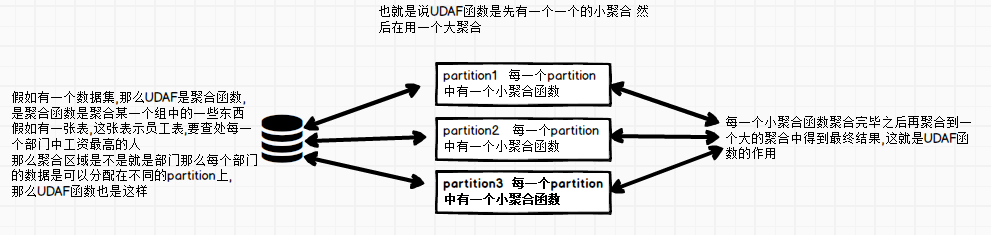

###### 1.UDAF函数支持DataFrame(弱类型)

通过继承UserDefinedAggregateFunction来实现用户自定义聚合函数。下面展示一个求平均工资的自定义聚合函数。

ps:弱类型指的是在编译阶段是无法确定数据类型的,而是在运行阶段才能创建类型

```scala
import org.apache.spark.sql.expressions.MutableAggregationBuffer
import org.apache.spark.sql.expressions.UserDefinedAggregateFunction
import org.apache.spark.sql.types._
import org.apache.spark.sql.Row
import org.apache.spark.sql.SparkSession
//自定义UDAF函数
class MyAverage extends UserDefinedAggregateFunction {
  // 输入数据
  def inputSchema: StructType = StructType(List(StructField("Salary",DoubleType,true)))
  // 每一个分区中的 共享变量 存储记录的值
  def bufferSchema: StructType = {
    //                     工资的总和                      工资的总数
    StructType(StructField("sum", DoubleType):: StructField("count", DoubleType)  :: Nil)
  }
  // 返回值的数据类型表示UDAF函数的输出类型
  def dataType: DataType = DoubleType

  //如果有相同的输入,那么是否UDAF函数有相同的输出,有true 否则false
  //UDAF函数中如果输入的数据掺杂着时间,不同时间得到的结果可能是不一样的所以这个值可以设置为false
  //若不掺杂时间,这个值可以输入为true
  def deterministic: Boolean = true

  // 初始化对Buffer中的属性初始化即初始化分区中每一个共享变量
  def initialize(buffer: MutableAggregationBuffer): Unit = {
    // 存工资的总额
    buffer(0) = 0.0//取得就是sum
    // 存工资的个数
    buffer(1) = 0.0//取得就是count
  }
  // 相同Execute间的数据合并,合并小聚合中的数据即每一个分区中的每一条数据聚合的时候需要调用的方法
  /*
   第一个参数buffer还是共享变量
   第二个参数是一行数据即读取到的数据是以一行来看待的
   */
  def update(buffer: MutableAggregationBuffer, input: Row): Unit = {
    if (!input.isNullAt(0)) {
      //获取这一行中的工资,然后将工资添加到该方法中
      buffer(0) = buffer.getDouble(0) + input.getDouble(0)
      //将工资的个数进行加1操作最终是为了计算所有的工资的个数
     buffer(1) = buffer.getDouble(1) + 1
    }
  }
  // 不同Execute间的数据合并,合并大数据中的数即将每一个区分的输出合并形成最后的数据
  def merge(buffer1: MutableAggregationBuffer, buffer2: Row): Unit = {
    //合并总的工资
    buffer1(0) = buffer1.getDouble(0) + buffer2.getDouble(0)
    //合并总的工资个数
    buffer1(1) = buffer1.getDouble(1) + buffer2.getDouble(1)
  }
  // 计算最终结果
  def evaluate(buffer: Row): Double = buffer.getDouble(0) / buffer.getDouble(1)
}
// 需求：统计员工平均薪资
object MyAverage{
  def main(args: Array[String]): Unit = {
    val spark = SparkSession.builder().appName("MyAverage").master("local[*]").getOrCreate()
    // 注册函数
    spark.udf.register("myAverage",new MyAverage)

    val df = spark.read.json("dir/employees.json")
    df.createOrReplaceTempView("employees")
    df.show()
    //虽然没有使用groupby那么会将整个数据作为一个组
    val result = spark.sql("SELECT myAverage(salary) as average_salary FROM employees")
    result.show()
  }
}
```

###### 2.UDAF函数支持DataSet(强类型)

通过继承Aggregator来实现强类型自定义聚合函数，同样是求平均工资

ps:在编译阶段就确定了数据类型

```scala
import org.apache.spark.sql.expressions.{Aggregator}
import org.apache.spark.sql.Encoder
import org.apache.spark.sql.Encoders
import org.apache.spark.sql.SparkSession
//自定义UDAF函数
// 既然是强类型，可能有case类
case class Employee(name: String, salary: Double)
case class Average(var sum: Double, var count: Double)
//依次配置输入,共享变量,输出的类型,需要使用到case class
class MyAverage extends Aggregator[Employee, Average, Double] {
  // 初始化方法 初始化每一个分区中的 共享变量即定义一个数据结构，保存工资总数和工资总个数，初始都为0
  def zero: Average = Average(0.0, 0.0)
  //每一个分区中的每一条数据聚合的时候需要调用该方法
  def reduce(buffer: Average, employee: Employee): Average = {
    buffer.sum += employee.salary
    buffer.count += 1
    buffer
  }
  //将每一个分区的输出 合并 形成最后的数据
  def merge(b1: Average, b2: Average): Average = {
    b1.sum += b2.sum
    b1.count += b2.count
    b1
  }
  // 给出计算结果
  def finish(reduction: Average): Double = reduction.sum / reduction.count
  // 设定中间值类型的编码器，要转换成case类
  // Encoders.product是进行scala元组和case类转换的编码器
  def bufferEncoder: Encoder[Average] = Encoders.product
  // 设定最终输出值的编码器
  def outputEncoder: Encoder[Double] = Encoders.scalaDouble
}

object MyAverage{
  def main(args: Array[String]): Unit = {
    val spark = SparkSession.builder().appName("MyAverage").master("local[*]").getOrCreate()
    import spark.implicits._
    val ds = spark.read.json("dir/employees.json").as[Employee]
    ds.show()
    val averageSalary = new MyAverage().toColumn.name("average_salary")
    val result = ds.select(averageSalary)
    result.show()
  }
}
```

##### 开窗函数

```scala
说明:
rank（）跳跃排序，有两个第二名时后边跟着的是第四名
dense_rank() 连续排序，有两个第二名时仍然跟着第三名
over（）开窗函数：
       在使用聚合函数后，会将多行变成一行，而开窗函数是将一行变成多行；
       并且在使用聚合函数后，如果要显示其他的列必须将列加入到group by中，
       而使用开窗函数后，可以不使用group by，直接将所有信息显示出来。
        开窗函数适用于在每一行的最后一列添加聚合函数的结果。
常用开窗函数：
   1.为每条数据显示聚合信息.(聚合函数() over())
   2.为每条数据提供分组的聚合函数结果(聚合函数() over(partition by 字段) as 别名) 
         --按照字段分组，分组后进行计算
   3.与排名函数一起使用(row number() over(order by 字段) as 别名)
常用分析函数：（最常用的应该是1.2.3 的排序）
   1、row_number() over(partition by ... order by ...)
   2、rank() over(partition by ... order by ...)
   3、dense_rank() over(partition by ... order by ...)
   4、count() over(partition by ... order by ...)
   5、max() over(partition by ... order by ...)
   6、min() over(partition by ... order by ...)
   7、sum() over(partition by ... order by ...)
   8、avg() over(partition by ... order by ...)
   9、first_value() over(partition by ... order by ...)
   10、last_value() over(partition by ... order by ...)
   11、lag() over(partition by ... order by ...)
   12、lead() over(partition by ... order by ...)
lag 和lead 获取的结果集中，按一定排序所排列的当前行的上下相邻若干offset的某个行的某个列(不用结果集的自关联）；
lag ，lead 分别是向前，向后；
lag 和lead 有三个参数，第一个参数是列名，第二个参数是偏移的offset，第三个参数是超出记录窗口时的默认值
import org.apache.spark.sql.SparkSession

//开窗窗函数
object MyAverage  {

  def main(args: Array[String]): Unit = {
    val spark = SparkSession.builder().appName("MyAverage").master("local[*]").getOrCreate()
    import spark.implicits._
    val df = spark.read.json("dir/Score.json")
    df.createOrReplaceTempView("score")
    df.show()
      
    println("/**************  求每个班最高成绩学生的信息（groupBY）  ***************/")
    //先写的 进行查询  这样可以进行班级分组并得到分数
    spark.sql("select class, max(score) max from score group by class").show()
    /*这句话select class, max(score) max from score group by class
      相当于key是class  然后执行了group by  求了一个max(score) 得到一个RDD然后和原有RDD执行了一个Join
      直白一些(class相当于key,score相当于value) 然后执行groupbyKey  --> 生成了(class,max) 这个RDD
      然后将(class,max)转了一下 --> (class_max,1)后面的数无所谓
      然就相当于将数据中也做了一个(class_max,score)  -->和之前的RDD -->进行join --> 在进行map
    */
    spark.sql("select a.name, b.class, b.max from score a, " +
      "(select class, max(score) max from score group by class) as b " +
      "where a.score = b.max").show()
      
      /***************求每个班级的成绩并降序排序*******************/
      //添加一个函数可以对表中动态添加一列即 以对表中的分数添加排序 
      //这里的over就是开窗函数 , row_number是分析函数(排名函数)
    spark.sql("select name,class,score,row_number() over(partition by class order by score desc) rank from score").show()
      
    println("//***************  求每个班最高成绩学生的信息  ***************/")
        println("    /*******  计算结果的表  *******")
    spark.sql("select * from " +
      "( select name,class,score,rank() over(partition by class order by score desc) rank from score) " + "as t " +  "where t.rank=1").show()
  }
}
```

## 集成Hive

Apache Hive是Hadoop上的SQL引擎，Spark SQL编译时可以包含Hive支持，也可以不包含。包含Hive支持的Spark SQL可以支持Hive表访问、UDF(用户自定义函数)以及 Hive 查询语言(HiveQL/HQL)等。需要强调的 一点是，如果要在Spark SQL中包含Hive的库，并不需要事先安装Hive。

ps:一般来说，最好还是在编译Spark SQL时引入Hive支持，这样就可以使用这些特性了

#### 1.使用内置hive

ps:版本为1.2.1

```
ps:需要注意内置hive是非常容易出现问题的
1.先启动集群/opt/software/spark-2.2.0-bin-hadoop2.7/sbin/start-all.sh
2.进入到spark-shell模式/opt/software/spark-2.2.0-bin-hadoop2.7/bin/spark-shell --master spark://hadoop01:7077
3.在spark-shell下操作hive
spark.sql("show tables").show 查询所有hive的表
spark.sql("CREATE TABLE IF NOT EXISTS src (key INT,value STRING)") 创建表
spark.sql("LOAD DATA LOCAL INPATH '/opt/software/spark-2.2.0-bin-hadoop2.7/examples/src/main/resources/kv1.txt' INTO TABLE src")  添加数据
spark.sql("SELECT * FROM src").show 查询表中数据
会出现一个问题FileNotFoundException 没有找到文件
通过在主节点和从节点查询可以发现,主节点存在spark-warehouse目录 目录中是存在数据的
但是在从节点中没有这个文件夹,所以此时将文件夹分发到从节点
scp -r ./spark-warehouse/ root@hadoop02:$PWD 
再次执行查询
ps:这样表面看查询是没什么问题了,但是实际问题在于是讲master节点上的数据分发到从节点上的,那么不可能说每次操作有了数据都执行拷贝操作,所以此时就需要使用HDFS来进行存储数据了
所以先将所有从节点上的spark-warehouse删除掉
删除后将主节点上的spark-warehouse和metastor_db删除掉
然后在启动集群的时候添加一个命令
 --conf spark.sql.warehouse.dir=hdfs://hadoop01:8020/spark_warehouse
 此方法只做一次启动即可 后续再启动集群的时候就无需添加这个命了 因为记录在metastore_db中了
 ps:spark-sql中可以直接使用SQL语句操作
```

#### 2.集成外部hive（重要）

```
1.将Hive中的hive-site.xml软连接到Spark安装目录下的conf目录下。[主节点有即可]
ln -s /opt/software/apache-hive-1.2.1-bin/conf/hive-site.xml /opt/software/spark-2.2.0-bin-hadoop2.7/conf/hive-site.xml 
2.打开spark shell，注意带上访问Hive元数据库的JDBC客户端
  将mysql驱动jar包拷贝到spark的bin目录下
./spark-shell --master spark://hadoop01:7077 --jars mysql-connector-java-5.1.36.jar

ps:做完外部hive链接需要注意,因为hive-site.xml文件是在Spark的conf目录下,若直接启动spark-shell无论是单机版还是集群版都会出现报错 Error creating transactional connection factory 原因在于,启动时会加载hive-site.xml文件,所以必须添加jar路径, 为了以后使用建议删除软连接,需要的时候在做外部hive的连接
删除软连接方式:
rm -rf 软连接方式
```

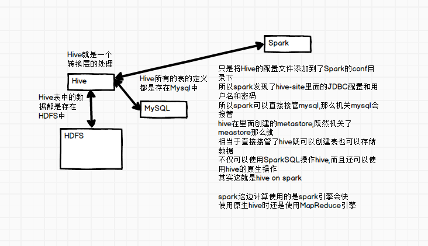

总结:

若要把Spark SQL连接到一个部署好的Hive上，你必须把hive-site.xml复制到 Spark的配置文件目录中($SPARK_HOME/conf)。即使没有部署好Hive，Spark SQL也可以运行。 需要注意的是，如果你没有部署好Hive，Spark SQL会在当前的工作目录中创建出自己的Hive 元数据仓库，叫作 metastore_db。此外，如果你尝试使用 HiveQL 中的 CREATE TABLE (并非 CREATE EXTERNAL TABLE)语句来创建表，这些表会被放在你默认的文件系统中的 /user/hive/warehouse 目录中(如果你的 classpath 中有配好的 hdfs-site.xml，默认的文件系统就是 HDFS，否则就是本地文件系统)。

#### 3.通过代码操作（重要）

ps:需要有Hadoop本地环境 

```scala
import org.apache.spark.sql.{Row, SparkSession}
object HiveCode {
  def main(args: Array[String]): Unit = {
    val spark = SparkSession
      .builder()
      .appName("HiveCode")
      .config("spark.sql.warehouse.dir", "D:\\spark-warehouse")
      .master("local[*]")
      .enableHiveSupport()
      .getOrCreate()
    import spark.implicits._
    import spark.sql
   // sql("CREATE TABLE IF NOT EXISTS src_1 (key INT, value STRING)")
    sql("LOAD DATA LOCAL INPATH  'dir/kv1.txt' INTO TABLE src_1")
    sql("SELECT * FROM src_1").show()
    sql("SELECT COUNT(*) FROM src_1").show()
    val sqlDF = sql("SELECT key, value FROM src_1 WHERE key < 10 ORDER BY key")
    sqlDF.as("mixing").show()
    val recordsDF = spark.createDataFrame((1 to 100).map(i => Record(i, s"val_$i")))
    recordsDF.createOrReplaceTempView("records")
    sql("SELECT * FROM records r JOIN src_1 s ON r.key = s.key").show()
  }
}
case class Record(key: Int, value: String)
```

ps:本地若出现"Error while instantiating 'org.apache.spark.sql.hive.HiveSessionStateBuilder和权限异常问题 

在cmd命令下进入到D:/hadoop2.7.1/bin目录下执行命令即可

winutils.exe chmod 777 /tmp/hive

#### 连接服务器hive

ps:需要添加hive-site.xml hdfs-site.xml core-site.xml

这里出现了一个异常 Could not find the uri with key [dfs.encryption.key.provider.uri] to create a KeyProvider !!  这个异常并没有找到解决问题的办法,结果自己能执行了!!!!! 谁能解决麻烦备注说明!

我的Hadoop集群是高可用所以我在windows下配置了C:\Windows\System32\drivers\etc路径下的

hosts文件 只要应对我的 mycluster  (这一个不配置应该是可以的)

192.168.223.111 mycluster
192.168.223.112 mycluster

```scala
import java.io.File

import org.apache.spark.sql.{Row, SparkSession}

object HiveCode {
  def main(args: Array[String]): Unit = {
    val spark = SparkSession
      .builder()
      .appName("HiveCode")
      .config("spark.sql.warehouse.dir", "hdfs://hadoop01:8020/spark_warehouse")
      .master("spark://hadoop01:7077")
      .enableHiveSupport()
      .getOrCreate()
    import spark.implicits._
    import spark.sql
    //sql("CREATE TABLE IF NOT EXISTS src_1 (key INT, value STRING)")
   // sql("LOAD DATA LOCAL INPATH 'dir/kv1.txt' INTO TABLE src_1")
    sql("SELECT * FROM src_1").show()
  sql("SELECT COUNT(*) FROM src_1").show()
   val sqlDF = sql("SELECT key, value FROM src_1 WHERE key < 10 ORDER BY key")
   sqlDF.as("mixing").show()
    val recordsDF = spark.createDataFrame((1 to 100).map(i => Record(i, s"val_$i")))
    recordsDF.createOrReplaceTempView("records")
    sql("SELECT * FROM records r JOIN src_1 s ON r.key = s.key").show()
  }
}
case class Record(key: Int, value: String)
```


## SparkSQL的输入和输出

#### SparkSQL的输入

写法一:

SparkSession对象.read.json("路径") 

SparkSession对象.read.jdbc("路径") 

SparkSession对象.read.csv("路径")

SparkSession对象.read. parquet("路径") Parquet格式经常在Hadoop生态圈中被使用，它也支持Spark SQL的全部数据型

SparkSession对象.read.orc("路径")

SparkSession对象.read.table("路径") 

SparkSession对象.read.text("路径")

SparkSession对象.read. textFile("路径")

写法二:

SparkSession对象.read.format("json").load("路径")

ps:若不执行format默认是parquet格式

#### SparkSQL的输出

写法一:

DataFrame或DataSet对象.write.json("路径")

DataFrame或DataSet对象.write.jdbc("路径") 

DataFrame或DataSet对象.write.csv("路径")

DataFrame或DataSet对象.write.parquet("路径") 

DataFrame或DataSet对象.write.orc("路径")

DataFrame或DataSet对象.write.table("路径") 

DataFrame或DataSet对象.write.text("路径")

写法二:

DataFrame或DataSet对象.write.fomat("jdbc").中间可能其他的参数.save()

ps:典型的是saveMode模式 即 mode方法

| **Scala/Java**                      | **Any Language** | **Meaning**          |
| ----------------------------------- | ---------------- | -------------------- |
| **SaveMode.ErrorIfExists(default)** | "error"(default) | 如果文件存在，则报错 |
| **SaveMode.Append**                 | "append"         | 追加                 |
| **SaveMode.Overwrite**              | "overwrite"      | 覆写                 |
| **SaveMode.Ignore**                 | "ignore"         | 数据存在，则忽略     |

若不执行format默认是parquet格式

#### JDBC操作（重要）

###### 从MySQL中将数据获取

pom.xml文件中配置JDBC连接驱动

```xml
        <dependency>
            <groupId>mysql</groupId>
            <artifactId>mysql-connector-java</artifactId>
            <version>5.1.38</version>
        </dependency>
```

```scala
import java.util.Properties
import org.apache.spark.SparkConf
import org.apache.spark.sql.SparkSession

object SparkSQLAndMySQL {
  def main(args: Array[String]): Unit = {
     val spark = SparkSession.builder().appName("SparkSQLAndMySQL").master("local").getOrCreate()
     //读取方式一
    val connectionProperties = new Properties()
    connectionProperties.put("user", "root")
    connectionProperties.put("password", "123456")
    val jdbcDF = spark.read.jdbc("jdbc:mysql://localhost:3306/db1", "t_student",connectionProperties)
    jdbcDF.show();

    //方式二
    val jdbcDF2 = spark.read.format("jdbc")
.option("url","jdbc:mysql://localhost:3306/db1").option("dbtable","t_student").option("user","root").option("password","123456").load()
    jdbcDF2.show()

    spark.stop()
  }
}
```

###### 将数据输出到MySQL中

```scala
import java.util.Properties
import org.apache.spark.SparkConf
import org.apache.spark.sql.{DataFrame, SaveMode, SparkSession}

object SparkSQLAndMySQL {
  def main(args: Array[String]): Unit = {
     val spark = SparkSession.builder()
      .appName("SparkSQLAndMySQL").master("local")
      .getOrCreate()
    //读取数据
     val frame: DataFrame = spark.read.json("dir/employees.json")
    //输出方法一
    val connectionProperties = new Properties()
    connectionProperties.put("user", "root")
    connectionProperties.put("password", "123456")
    //表可以不存在,通过读取的数据可以直接生成表
    frame.write.jdbc("jdbc:mysql://localhost:3306/db1","employees",connectionProperties)

    //输出方式二
    frame.write.format("jdbc")
      .option("url", "jdbc:mysql://localhost:3306/db1")
      .option("dbtable", "employees1")
      .option("user", "root")
      .option("password", "123456")
      .save()
   //输出方式三 执行创建表的列名和数据类型 数据类型不能大写
    frame.write
      .option("createTableColumnTypes", "name varchar(200),salary int")
      .jdbc("jdbc:mysql://localhost:3306/db1", "employees2", connectionProperties)
    spark.stop()
  }
}
```


