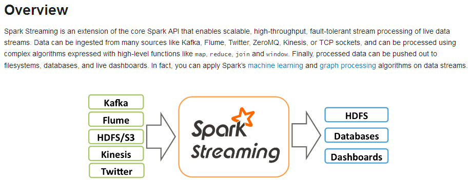
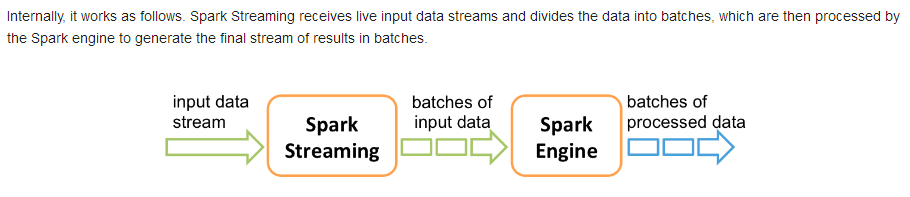
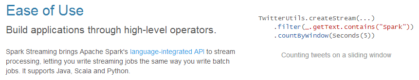
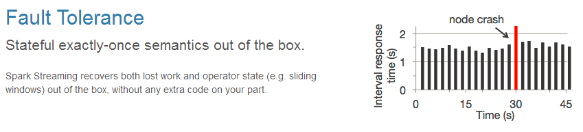
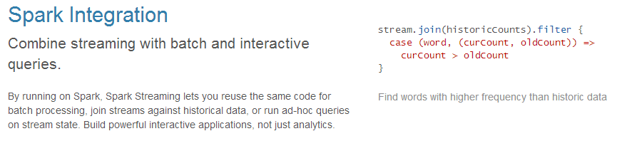
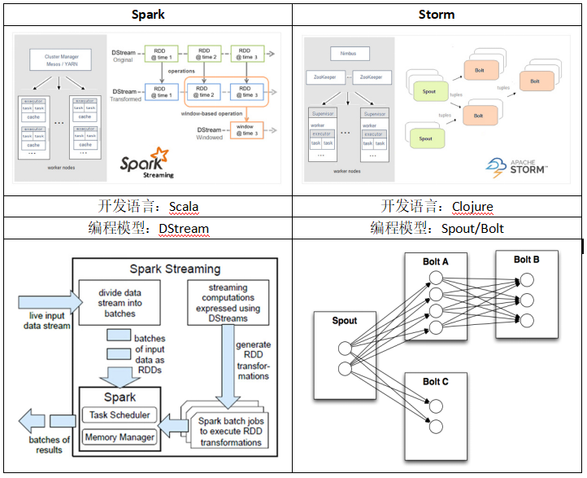
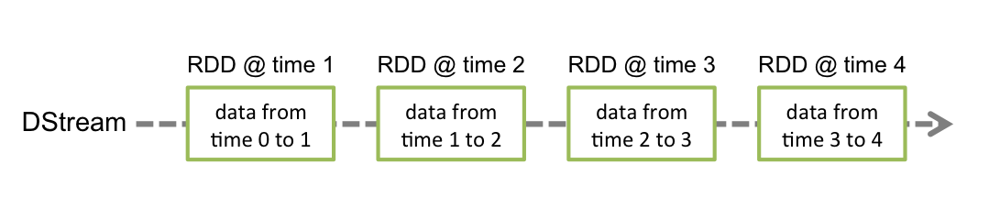
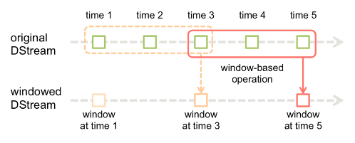
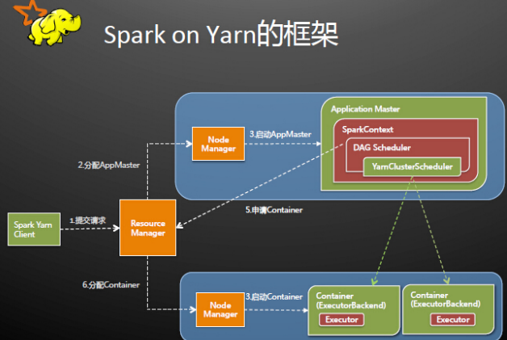
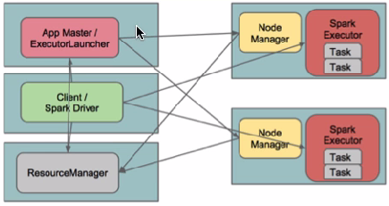

#### 第一节 SparkStreaming概述 

#####3.28.1 Spark Streaming概述

Spark Streaming类似于Apache Storm，用于流式数据的处理。根据其官方文档介绍，Spark Streaming有高吞吐量和容错能力强等特点。Spark Streaming支持的数据输入源很多，例如：Kafka、Flume、Twitter、ZeroMQ和简单的TCP套接字等等。数据输入后可以用Spark的高度抽象原语如：map、reduce、join、window等进行运算。而结果也能保存在很多地方，如HDFS，数据库等。另外Spark Streaming也能和MLlib（机器学习）以及Graphx完美融合。





#####3.28.2 Spark Streaming的原理介绍

易用



容错



易整合到Spark体系



##### 3.28.3 Spark Streaming与Storm对比



##### 第二节 DStream 

##### 3.28.4 DStream的概念

Discretized Stream是Spark Streaming的基础抽象，代表持续性的数据流和经过各种Spark原语操作后的结果数据流。在内部实现上，DStream是一系列连续的RDD来表示。每个RDD含有一段时间间隔内的数据，如下图：



#### 3.28.5 DStream原语类型介绍（重要）

DStream上的原语与RDD的类似，分为Transformations（转换）和Output Operations（输出）两种，此外转换操作中还有一些比较特殊的原语，如：updateStateByKey()、transform()以及各种Window相关的原语。

###### 3.28.6 DStream的Transformation（转换）

| **Transformation**               | **Meaning**                                                  |
| -------------------------------- | ------------------------------------------------------------ |
| map(func)                        | Return a new DStream by passing each  element of the source DStream through a function func. |
| flatMap(func)                    | Similar to map, but each input item can  be mapped to 0 or more output items. |
| filter(func)                     | Return a new DStream by selecting only  the records of the source DStream on which func returns true. |
| repartition(numPartitions)       | Changes the level of parallelism in this  DStream by creating more or fewer partitions. |
| union(otherStream)               | Return a new DStream that contains the  union of the elements in the source DStream and otherDStream. |
| count()                          | Return a new DStream of single-element  RDDs by counting the number of elements in each RDD of the source DStream. |
| reduce(func)                     | Return a new DStream of single-element  RDDs by aggregating the elements in each RDD of the source DStream using a  function func (which takes two arguments and returns one). The function  should be associative so that it can be computed in parallel. |
| countByValue()                   | When called on a DStream of elements of  type K, return a new DStream of (K, Long) pairs where the value of each key  is its frequency in each RDD of the source DStream. |
| reduceByKey(func, [numTasks])    | When called on a DStream of (K, V) pairs,  return a new DStream of (K, V) pairs where the values for each key are  aggregated using the given reduce function. Note: By default, this uses  Spark's default number of parallel tasks (2 for local mode, and in cluster  mode the number is determined by the config property  spark.default.parallelism) to do the grouping. You can pass an optional  numTasks argument to set a different number of tasks. |
| join(otherStream, [numTasks])    | When called on two DStreams of (K, V) and  (K, W) pairs, return a new DStream of (K, (V, W)) pairs with all pairs of  elements for each key. |
| cogroup(otherStream, [numTasks]) | When called on a DStream of (K, V) and  (K, W) pairs, return a new DStream of (K, Seq[V], Seq[W]) tuples. |
| transform(func)                  | Return a new DStream by applying a  RDD-to-RDD function to every RDD of the source DStream. This can be used to  do arbitrary RDD operations on the DStream. |
| updateStateByKey(func)           | Return a new "state" DStream  where the state for each key is updated by applying the given function on the  previous state of the key and the new values for the key. This can be used to  maintain arbitrary state data for each key. |

**特殊的Transformations**

**1、UpdateStateByKeyOperation**

UpdateStateByKey原语用于记录历史记录，上文中Word Count示例中就用到了该特性。若不用UpdateStateByKey来更新状态，那么每次数据进来后分析完成后，结果输出后将不再保存

**2、TransformOperation**

Transform原语允许DStream上执行任意的RDD-to-RDD函数。通过该函数可以方便的扩展Spark API。此外，MLlib（机器学习）以及Graphx也是通过本函数来进行结合的。

**3、WindowOperations**

Window Operations有点类似于Storm中的State，可以设置窗口的大小和滑动窗口的间隔来动态的获取当前Steaming的允许状态。



###### 3.28.7 DStream的Output（输出）

Output Operations可以将DStream的数据输出到外部的数据库或文件系统，当某个Output Operations原语被调用时（与RDD的Action相同），streaming程序才会开始真正的计算过程。

| Output  Operation                   | Meaning                                                      |
| ----------------------------------- | ------------------------------------------------------------ |
| print()                             | Prints the first ten elements of every  batch of data in a DStream on the driver node running the streaming  application. This is useful for development and debugging. |
| saveAsTextFiles(prefix, [suffix])   | Save this DStream's contents as text  files. The file name at each batch interval is generated based on prefix and  suffix: "prefix-TIME_IN_MS[.suffix]". |
| saveAsObjectFiles(prefix, [suffix]) | Save this DStream's contents as  SequenceFiles of serialized Java objects. The file name at each batch  interval is generated based on prefix and suffix:  "prefix-TIME_IN_MS[.suffix]". |
| saveAsHadoopFiles(prefix, [suffix]) | Save this DStream's contents as Hadoop  files. The file name at each batch interval is generated based on prefix and  suffix: "prefix-TIME_IN_MS[.suffix]". |
| foreachRDD(func)                    | The most generic output operator that  applies a function, func, to each RDD generated from the stream. This  function should push the data in each RDD to an external system, such as  saving the RDD to files, or writing it over the network to a database. Note  that the function func is executed in the driver process running the  streaming application, and will usually have RDD actions in it that will  force the computation of the streaming RDDs. |


#### 第三节 案例实战（重要） 

##### 3.28.13 用Spark Streaming实现单词计数

```scala
object SparkStreamingWC {
  def main(args: Array[String]): Unit = {

    val conf = new SparkConf().setAppName("SparkStreamingWC").setMaster("local[2]")
    val sc = new SparkContext(conf)
    // 创建SparkStreaming的上下文对象
    val ssc: StreamingContext = new StreamingContext(sc, Seconds(5))

    // 从NetCat服务里获取数据
    val dStream: ReceiverInputDStream[String] = ssc.socketTextStream("node01", 8888)

    // 调用DStream里的api进行计算
    val res: DStream[(String, Int)] = dStream.flatMap(_.split(" ")).map((_, 1)).reduceByKey(_+_)

    res.print()

    // 提交任务到集群
    ssc.start()

    // 线程等待，等待处理任务
    ssc.awaitTermination()

  }
}

```

##### 3.28.14 用Spark Streaming实现按批次累加功能

```scala
/**
  * 实现按批次累加功能，需要调用updateStateByKey
  * 其中需要自定义一个函数，该函数是对历史结果数据和当前批次数据的操作过程
  * 该函数中第一个参数代表每个单词
  * 第二个参数代表当前批次单词出现的次数：Seq(1,1,1,1)
  * 第三个参数代表之前批次累加的结果，可能有值，也可能没有值，所以在获取的时候要用getOrElse方法
  */
object SparkStreamingACCWC {
  def main(args: Array[String]): Unit = {

    val conf = new SparkConf().setAppName("SparkStreamingACCWC").setMaster("local[2]")
    val ssc = new StreamingContext(conf, Milliseconds(5000))

    // 设置检查点目录
//    ssc.checkpoint("hdfs://node01:9000/cp-20180306-1")
    ssc.checkpoint("c://cp-20180306-1")

    // 获取数据
    val dStream = ssc.socketTextStream("node01", 8888)
    val tup: DStream[(String, Int)] = dStream.flatMap(_.split(" ")).map((_, 1))
    val res: DStream[(String, Int)] =
      tup.updateStateByKey(func, new HashPartitioner(ssc.sparkContext.defaultParallelism), true)

    res.print()
      
    ssc.start()
    ssc.awaitTermination()
  }

  val func = (it: Iterator[(String, Seq[Int], Option[Int])]) => {
    it.map(x => {
      (x._1, x._2.sum + x._3.getOrElse(0))
    })
  }
}
```

##### 3.28.17 Spark Streaming结合Kafka案例实现

```scala
import java.lang

import org.apache.kafka.clients.consumer.ConsumerRecord
import org.apache.kafka.common.serialization.StringDeserializer
import org.apache.spark.streaming.dstream.{DStream, InputDStream}
import org.apache.spark.streaming.kafka010._
import org.apache.spark.streaming.{Seconds, StreamingContext}
import org.apache.spark.{HashPartitioner, SparkConf, TaskContext}

/**
  * 消费kafka数据
  */
object ReadBySureOffsetTest {
  def main(args: Array[String]) {
    val checkpointDir = "d://cp-20190715-2"
    val ssc = StreamingContext.getOrCreate(checkpointDir,
      () => {
        createContext()
      })
    ssc.start()
    ssc.awaitTermination()
  }

  // 创建上下文并计算，返回计算后的上下文
  def createContext(): StreamingContext = {
    // 创建上下文
    val sparkConf = new SparkConf()
      .setAppName("loadkafkadatatest").setMaster("local[2]")
    val ssc = new StreamingContext(sparkConf, Seconds(5))
      // 需要checkpoint
    ssc.checkpoint("d://cp-20190716-4")

    val kafkaParams = Map[String, Object](
      "bootstrap.servers" -> "node01:9092,node02:9092,node03:9092",
      // kafka的key和value的解码方式
      "key.deserializer" -> classOf[StringDeserializer],
      "value.deserializer" -> classOf[StringDeserializer],
      "group.id" -> "ts02",
      // 消费位置
      "auto.offset.reset" -> "latest",
      // 如果value合法，自动提交offset
      "enable.auto.commit" -> (true: lang.Boolean)
    )
    val topics = Array("test1")

    val messages: InputDStream[ConsumerRecord[String, String]] =
      KafkaUtils.createDirectStream[String, String](
      ssc,
      LocationStrategies.PreferConsistent,
      ConsumerStrategies.Subscribe[String, String](topics, kafkaParams)
    )

    /**
      * 数据操作
      */
    // 查看数据信息
//    messages.foreachRDD(rdd => {
//      //获取offset集合
//      val offsetsList = rdd.asInstanceOf[HasOffsetRanges].offsetRanges
//      rdd.foreachPartition(lines => {
//        lines.foreach(line => {
//          val o: OffsetRange = offsetsList(TaskContext.get.partitionId)
//          println(line)
//        })
//      })
//    })

//    // 对数据进行单词计数
//    // 因为DStream里的key是offset值，把DStream里的value数据取出来
    val lines: DStream[String] = messages.map(_.value())
    val tup = lines.flatMap(_.split(" ")).map((_, 1))
    val res: DStream[(String, Int)] = tup.updateStateByKey(
      func, new HashPartitioner(ssc.sparkContext.defaultParallelism), true)
    res.print()

    ssc
  }

  val func = (it: Iterator[(String, Seq[Int], Option[Int])]) => {
    it.map {
      case (x, y, z) => {
        (x, y.sum + z.getOrElse(0))
      }
    }
  }

}
```

##### 3.28.16 窗口操作案例实现

```scala
object WindowOperationWC {
  def main(args: Array[String]): Unit = {
    LoggerLevels.setStreamingLogLevels()

    val conf = new SparkConf().setAppName("WindowOperationWC").setMaster("local[2]")
    val ssc = new StreamingContext(conf, Seconds(5))

    ssc.checkpoint("c://cp-20180306-3")

    val dStream = ssc.socketTextStream("node01", 8888)

    val tup = dStream.flatMap(_.split(" ")).map((_, 1))

    // 调用窗口操作来计算数据的聚合。批次间隔是5秒，设置窗口长度是10，滑动间隔是10秒
    val res: DStream[(String, Int)] =
      tup.reduceByKeyAndWindow((x: Int, y: Int) => (x + y), Seconds(10), Seconds(10))

    res.print()

    ssc.start()
    ssc.awaitTermination()
  }
}
```

#### 第四节 Spark On Yarn

简单来说就是将Spark任务运行在Yarn资源调度框架上，而不是运行在Standalone模式下

##### 4.1、官方文档说明

http://spark.apache.org/docs/latest/running-on-yarn.html

##### 4.2、配置安装

1、安装Hadoop：需要安装HDFS模块和YARN模块，HDFS必须安装，Spark运行时要把jar包存放到HDFS上。

2、安装Spark：解压Spark安装程序到一台服务器上，修改spark-env.sh配置文件，Spark程序将作为Yarn的客户端用于提交任务。

```shell
export JAVA_HOME=/usr/local/jdk1.8.0_80
export HADOOP_CONF_DIR=/usr/local/hadoop-2.7.3/etc/hadoop
```

3、启动HDFS和Yarn

##### 4.3、运行模式（cluster模式和client模式）

###### 4.3.1、cluster模式

```shell
./bin/spark-submit \
--class org.apache.spark.examples.SparkPi \
--master yarn \
--deploy-mode cluster \
--driver-memory 1g \
--executor-memory 1g \
--executor-cores 2 \
--queue default \
examples/jars/spark-examples_2.11-2.2.0.jar \
100
```

```shell
./bin/spark-submit \
--class com.qf.spark.day1.WordCount \
--master yarn \
--deploy-mode cluster \
--driver-memory 1g \
--executor-memory 1g \
--executor-cores 2 \
--queue default \
/home/bigdata/sparkwordcount.jar \
hdfs://node01:9000/wc \
hdfs://node01:9000/out-yarn-1
```

###### 4.3.2、client模式

```shell
./bin/spark-submit \
--class org.apache.spark.examples.SparkPi \
--master yarn \
--deploy-mode client \
--driver-memory 1g \
--executor-memory 1g \
--executor-cores 2 \
--queue default \
lib/spark-examples*.jar \
10
```

spark-shell必须使用client模式

```shell
./bin/spark-shell \
--master yarn \
--deploy-mode client
```

###### 4.4.3、两种模式的区别

```
cluster模式：Driver程序在YARN中运行，应用的运行结果不能在客户端显示，所以最好运行那些将结果最终保存在外部存储介质（如HDFS、Redis、Mysql）而非stdout输出的应用程序，客户端的终端显示的仅是作为YARN的job的简单运行状况。

client模式：Driver运行在Client上，应用程序运行结果会在客户端显示，所有适合运行结果有输出的应用程序（如spark-shell）
```

###### 4.4.4、原理

**cluster模式：**          

Spark Driver首先作为一个ApplicationMaster在YARN集群中启动，客户端提交给ResourceManager的每一个job都会在集群的NodeManager节点上分配一个唯一的ApplicationMaster，由该ApplicationMaster管理全生命周期的应用。具体过程：

```
1、由client向ResourceManager提交请求，并上传jar到HDFS上
	这期间包括四个步骤：
    a).连接到RM
    b).从RM的ASM（ApplicationsManager）中获得metric、queue和resource等信息。
    c). upload app jar and spark-assembly jar
    d).设置运行环境和container上下文（launch-container.sh等脚本)
2、ResouceManager向NodeManager申请资源，创建SparkApplicationMaster（每个SparkContext都有一个ApplicationMaster）
3、NodeManager启动ApplicationMaster，并向ResourceManagerAsM注册
4、ApplicationMaster从HDFS中找到jar文件，启动SparkContext、DAGscheduler和YARN ClusterScheduler
5、ResourceManager向ResourceManagerAsM注册申请container资源
6、ResourceManager通知NodeManager分配Container，这时可以收到来自ASM关于container的报告。（每个container对应一个executor）
7、Spark ApplicationMaster直接和container（executor）进行交互，完成这个分布式任务。
```




**client模式：**

在client模式下，Driver运行在Client上，通过ApplicationMaster向RM获取资源。本地Driver负责与所有的executor container进行交互，并将最后的结果汇总。结束掉终端，相当于kill掉这个spark应用。一般来说，如果运行的结果仅仅返回到terminal上时需要配置这个。

客户端的Driver将应用提交给Yarn后，Yarn会先后启动ApplicationMaster和executor，另外ApplicationMaster和executor都是装载在container里运行，container默认的内存是1G，ApplicationMaster分配的内存是driver- memory，executor分配的内存是executor-memory。同时，因为Driver在客户端，所以程序的运行结果可以在客户端显示，Driver以进程名为SparkSubmit的形式存在。



#### 总结

```
1、SparkStreaming的知识点
2、Spark On Yarn提交任务的两种方式
```

#### 作业

```
1、用SparkStreaming实现按批次累加的功能
2、用SparkStreaming实现窗口操作
```

#### 面试题

```
1、窗口操作可以实现什么需求
2、为什么在用SparkStreaming的过程中要checkpoint
```


