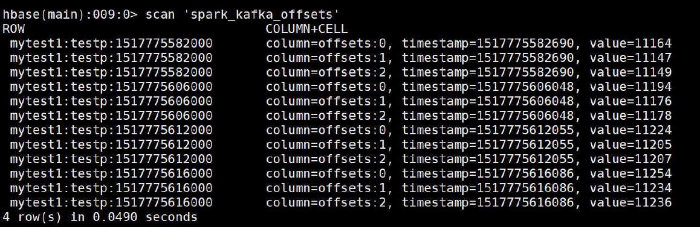

### Kafka-消费模型

#### High Level Consumer API--Receiver

不需要自己管理offset
默认实现最少一次消息传递语义（At least once）
comsumer数量 大于 partiton数量， 浪费。
comsumer数量 小于 partiton数量， 一个comsumer对应多个partiton
最好partiton数目是consumer数目的整数倍(最好一开始是一对一的方式)

#### Low Level Consumer API（Simple Consumer API）--Direct

需要自己手动管理offset
可以实现各种消息传递语义：最多一次、最少一次、一次仅一次

消费的kafka的topic中的分区数和对应的DStream的分区数是一一对应

 

### Kafka-消息组织

#### 磁盘顺序读写（sequential disk access ）

采用预读和批量大数据量写
寻道

#### 零字节拷贝（sendfile system call）

传统：

1. 数据从磁盘读取到内核空间的pagecache中

2. 应用程序从内核空间读取数据到用户空间缓冲区

3. 应用程序将数据从内核空间写到套接字缓冲区

4. 从套接字缓冲区复制到NIC缓冲区

   

#### SendFile：

数据从内核空间复制到套接字缓冲区
从套接字缓冲区复制到NIC缓冲区
数据都是在内核空间传递， 效率高。
减少了两次拷贝


### Kafka-消息检索原理

index文件的序号就是message在日志文件中的相对偏移量

OffsetIndex是稀疏索引，也就是说不会存储所有的消息的相对offset和position


 


 


 


 

以这个partition目录下面，00000000001560140916为例
定位offset 为1560140921的message

1. 定位到具体的segment日志文件
  由于log日志文件的文件名是这个文件中第一条消息的offset-1.
  因此可以根据offset定位到这个消息所在日志文件：00000000001560140916.log
2. 计算查找的offset在日志文件的相对偏移量
  segment文件中第一条消息的offset = 1560140917
  计算message相对偏移量：需要定位的offset - segment文件中第一条消息的offset + 1 = 1560140921 -
  1560140917 + 1 = 5
  查找index索引文件， 可以定位到该消息在日志文件中的偏移字节为456.
  综上， 直接读取文件夹00000000001560140916.log中偏移456字节的数据即可。
  1560140922 -1560140917 + 1 = 6
  如果查找的offset在日志文件的相对偏移量在index索引文件不存在， 可根据其在index索引文件最接近的上限
  偏移量， 往下顺序查找

### Spark Streaming + Kafka整合

#### Receiver-based Approach

Kafka的topic分区和Spark Streaming中生成的RDD分区没有关系。 在KafkaUtils.createStream中增加
分区数量只会增加单个receiver的线程数， 不会增加Spark的并行度
可以创建多个的Kafka的输入DStream， 使用不同的group和topic， 使用多个receiver并行接收数据。
如果启用了HDFS等有容错的存储系统， 并且启用了写入日志，则接收到的数据已经被复制到日志中。
因此，输入流的存储级别设置StorageLevel.MEMORY_AND_DISK_SER（即使用
KafkaUtils.createStream（...，StorageLevel.MEMORY_AND_DISK_SER））的存储级别。

 

首先模拟一个生产者

```scala
import java.util.HashMap
import org.apache.kafka.clients.producer.{KafkaProducer, ProducerConfig, ProducerRecord}
import scala.util.Random

// Produces some random words between 1 and 100.
object KafkaWordCountProducer {
  def main(args: Array[String]) {
    // metadataBrokerList：kafka列表，topic：topic名称，
    // messagesPerSec：每秒的消息数，wordsPerMessage：每秒的单词数量
    if (args.length < 2) {
      System.err.println("Usage: KafkaWordCountProducer <metadataBrokerList> <topic>")
      // 退出程序
      // system.exit(0):正常退出，相当于shell的kill
      // system.exit(1):非正常退出，相当于shell的kill -9
      System.exit(1)
    }
    // args: node01:9092,node02:9092,node03:9092 kefkawc
    val Array(brokers, topic) = args
    // Zookeeper connection properties
    val props = new HashMap[String, Object]()
    props.put(ProducerConfig.BOOTSTRAP_SERVERS_CONFIG, brokers)
    props.put(ProducerConfig.VALUE_SERIALIZER_CLASS_CONFIG,
      "org.apache.kafka.common.serialization.StringSerializer")
    props.put(ProducerConfig.KEY_SERIALIZER_CLASS_CONFIG,
      "org.apache.kafka.common.serialization.StringSerializer")

    val producer = new KafkaProducer[String, String](props)

    val arr = Array(
      "hello tom",
      "hello jerry",
      "hello kitty",
      "hello suke"
    )
    val r = new Random();
    // Send some messages
    while (true) {
      val message = arr(r.nextInt(arr.length))
      producer.send(new ProducerRecord[String, String]("kafkawc", message))
      Thread.sleep(1000)
    }
  }

}
```

 再模拟一个消费者--Receiver

``` scala
/**
  * 通过receive方式读取kafka数据
  */
object ReceiveKafkaWordCount {
  def main(args: Array[String]) {
    // zkQuorum：zk列表，group：group id，topics：可以放多个topic并且以“,”号分隔，numThreads：消费的线程数
    if (args.length < 4) {
      System.err.println("Usage: KafkaWordCount <zkQuorum> <group> <topics> <numThreads>")
      System.exit(1)
    }
    // args: node01:2181,node02:2181,node03:2181 group01 kafkawc 2
    val Array(zkQuorum, group, topics, numThreads) = args
    val sparkConf = new SparkConf().setAppName("KafkaWordCount").setMaster("local[2]")
    val ssc = new StreamingContext(sparkConf, Seconds(2))
    ssc.checkpoint("checkpoint")

    val topicMap = topics.split(",").map((_, numThreads.toInt)).toMap
    val lines = KafkaUtils.createStream(ssc, zkQuorum, group, topicMap).map(_._2)
    val words = lines.flatMap(_.split(" "))
    val wordCounts = words.map(x => (x, 1L))
      .reduceByKeyAndWindow(_ + _, _ - _, Minutes(10), Seconds(2), 2)
    wordCounts.print()

    ssc.start()
    ssc.awaitTermination()
  }
}
```

 

#### Direct Approach (No Receivers)

简化的并行性：不需要创建多个输入Kafka流并将其合并。 使用directStream，Spark Streaming将创建
与使用Kafka分区一样多的RDD分区，这些分区将全部从Kafka并行读取数据。 所以在Kafka和RDD分
区之间有一对一的映射关系。
效率：在第一种方法中实现零数据丢失需要将数据存储在预写日志中，这会进一步复制数据。 这实际
上是效率低下的，因为数据被有效地复制了两次 - 一次是Kafka，另一次是由预先写入日志（Write
Ahead Log）复制。 这个第二种方法消除了这个问题，因为没有接收器，因此不需要预先写入日志。
只要Kafka数据保留时间足够长。
正好一次（Exactly-once）的语义：第一种方法使用Kafka的高级API来在Zookeeper中存储消耗的偏移
量。传统上这是从Kafka消费数据的方式。虽然这种方法（结合预写日志）可以确保零数据丢失
（即至少一次语义），但是在某些失败情况下，有一些记录可能会消费两次。发生这种情况是因为
Spark Streaming可靠接收到的数据与Zookeeper跟踪的偏移之间的不一致。因此，在第二种方法中，
我们可以不使用Zookeeper的简单Kafka API。在其检查点内，Spark Streaming跟踪偏移量。这消除了
Spark Streaming和Zookeeper / Kafka之间的不一致，因此Spark Streaming每次记录都会在发生故障的
情况下有效地收到一次。为了实现输出结果的一次语义，将数据保存到外部数据存储区的输出操作必须
是幂等的，或者是保存结果和偏移量的原子事务。

 

模拟一个消费者--Direct

``` scala
/**
  * Consumes messages from one or more topics in Kafka and does wordcount.
  * Usage: DirectKafkaWordCount <brokers> <topics>
  *   <brokers> is a list of one or more Kafka brokers
  *   <topics> is a list of one or more kafka topics to consume from
  *
  * Example:
  *    $ bin/run-example streaming.DirectKafkaWordCount broker1-host:port,broker2-host:port \
  *    topic1,topic2
  */
object DirectKafkaWordCount {
  def main(args: Array[String]) {
    if (args.length < 2) {
      System.err.println(s"""
                            |Usage: DirectKafkaWordCount <brokers> <topics>
                            |  <brokers> is a list of one or more Kafka brokers
                            |  <topics> is a list of one or more kafka topics to consume from
                            |
        """.stripMargin)
      System.exit(1)
    }
    
    val Array(brokers, topics) = args

    // Create context with 2 second batch interval
    val sparkConf = new SparkConf().setAppName("DirectKafkaWordCount").setMaster("local[2]")
    val ssc = new StreamingContext(sparkConf, Seconds(2))

    // Create direct kafka stream with brokers and topics
    val topicsSet = topics.split(",").toSet
    val kafkaParams = Map[String, String]("metadata.broker.list" -> brokers)
    val messages = KafkaUtils.createDirectStream[String, String, StringDecoder, StringDecoder](
      ssc, kafkaParams, topicsSet)

    // Get the lines, split them into words, count the words and print
    val lines = messages.map(_._2)
    val words = lines.flatMap(_.split(" "))
    val wordCounts = words.map(x => (x, 1L)).reduceByKey(_ + _)
    wordCounts.print()

    // Start the computation
    ssc.start()
    ssc.awaitTermination()
  }
}
```

 

### Kafka Offset 管理

#### 使用外部存储保存offset

Checkpoints
HBase
ZooKeeper
Kafka
...


#### 不保存offset

### Kafka Offset 管理--Checkpoint

1. 启用Spark Streaming的checkpoint是存储偏移量最简单的方法。
2. 流式checkpoint专门用于保存应用程序的状态， 比如保存在HDFS上，
  在故障时能恢复。
3. Spark Streaming的checkpoint无法跨越应用程序进行恢复。
4. Spark 升级也将导致无法恢复。
5. 在关键生产应用， 不建议使用spark检查点的管理offset方式。

```scala
/**
  * 用checkpoint记录offset
  * 优点：实现过程简单
  * 缺点：如果streaming的业务更改，或别的作业也需要获取该offset，是获取不到的
  */
import kafka.serializer.StringDecoder
import org.apache.spark.SparkConf
import org.apache.spark.streaming.kafka.KafkaUtils
import org.apache.spark.streaming.{Duration, Seconds, StreamingContext}

object StreamingWithCheckpoint {
  def main(args: Array[String]) {
    //val Array(brokers, topics) = args
    val processingInterval = 2
    val brokers = "node01:9092,node02:9092,node03:9092"
    val topics = "mytest1"
    // Create context with 2 second batch interval
    val sparkConf = new SparkConf().setAppName("ConsumerWithCheckPoint").setMaster("local[2]")
    // Create direct kafka stream with brokers and topics
    val topicsSet = topics.split(",").toSet
    val kafkaParams = Map[String, String]("metadata.broker.list" -> brokers, "auto.offset.reset" -> "smallest")
    val checkpointPath = "hdfs://node01:9000/spark_checkpoint1"

    def functionToCreateContext(): StreamingContext = {
      val ssc = new StreamingContext(sparkConf, Seconds(processingInterval))
      val messages = KafkaUtils.createDirectStream[String, String, StringDecoder, StringDecoder](ssc, kafkaParams, topicsSet)

      ssc.checkpoint(checkpointPath)
      messages.checkpoint(Duration(8 * processingInterval.toInt * 1000))
      messages.foreachRDD(rdd => {
        if (!rdd.isEmpty()) {
          println("################################" + rdd.count())
        }

      })
      ssc
    }

    // 如果没有checkpoint信息，则新建一个StreamingContext
    // 如果有checkpoint信息，则从checkpoint中记录的信息恢复StreamingContext
    // createOnError参数：如果在读取检查点数据时出错，是否创建新的流上下文。
    // 默认情况下，将在错误上引发异常。
    val context = StreamingContext.getOrCreate(checkpointPath, functionToCreateContext _)
    context.start()
    context.awaitTermination()
  }
}
// 以上案例测试过程：
// 模拟消费者向mytest1插入10条数据，
// 强制停止streaming，
// 再插入20条数据并启动streaming查看读取的条数为20条
```

 

### Kafka Offset 管理--Zookeeper(常用)

```
1. 路径：
   val zkPath = s"${kakfaOffsetRootPath}/${groupName}/${o.topic}/${o.partition}"
2. 如果Zookeeper中未保存offset,根据kafkaParam的配置使用最新或者最旧的offset
3. 如果 zookeeper中有保存offset,我们会利用这个offset作为kafkaStream的起始位置
```

```scala
import kafka.common.TopicAndPartition
import kafka.message.MessageAndMetadata
import kafka.serializer.StringDecoder
import org.apache.curator.framework.CuratorFrameworkFactory
import org.apache.curator.retry.ExponentialBackoffRetry
import org.apache.spark.SparkConf
import org.apache.spark.streaming.dstream.InputDStream
import org.apache.spark.streaming.kafka.{HasOffsetRanges, KafkaUtils, OffsetRange}
import org.apache.spark.streaming.{Seconds, StreamingContext}

import scala.collection.JavaConversions._

object KafkaZKManager  extends Serializable{
  /**
    * 创建rookeeper客户端
    */
  val client = {
    val client = CuratorFrameworkFactory
      .builder
      .connectString("node01:2181/kafka0.9") // zk中kafka的路径
      .retryPolicy(new ExponentialBackoffRetry(1000, 3)) // 重试指定的次数, 且每一次重试之间停顿的时间逐渐增加
      .namespace("mykafka") // 命名空间:mykafka
      .build()
    client.start()
    client
  }

  val kafkaOffsetRootPath = "/consumers/offsets"

  /**
    * 确保zookeeper中的路径是存在的
    * @param path
    */
  def ensureZKPathExists(path: String): Unit = {
    if (client.checkExists().forPath(path) == null) {
      client.create().creatingParentsIfNeeded().forPath(path)
    }
  }
  // 保存offset
  def storeOffsets(offsetsRanges:Array[OffsetRange], groupName:String) = {
    for (o <- offsetsRanges) {
      val zkPath = s"${kafkaOffsetRootPath}/${groupName}/${o.topic}/${o.partition}"
      ensureZKPathExists(zkPath)
      // 保存offset到zk
      client.setData().forPath(zkPath, o.untilOffset.toString.getBytes())
    }
  }

  /**
    * 用于获取offset
    * @param topic
    * @param groupName
    * @return
    */
  def getFromOffsets(topic : String,groupName : String): (Map[TopicAndPartition, Long], Int) = {
    // 如果 zookeeper中有保存offset,我们会利用这个offset作为kafkaStream 的起始位置
    var fromOffsets: Map[TopicAndPartition, Long] = Map()
    val zkTopicPath = s"${kafkaOffsetRootPath}/${groupName}/${topic}"
    // 确保zookeeper中的路径是否存在
    ensureZKPathExists(zkTopicPath)
 	// 获取topic中，各分区对应的offset
    val offsets: mutable.Buffer[(TopicAndPartition, Long)] = for {
      // 获取分区
      p <- client.getChildren.forPath(zkTopicPath)
    } yield {
      //遍历路径下面的partition中的offset
      val data = client.getData.forPath(s"$zkTopicPath/$p")
      //将data变成Long类型
      val offset = java.lang.Long.valueOf(new String(data)).toLong
      println("offset:" + offset)
      (TopicAndPartition(topic, Integer.parseInt(p)), offset)
    }

    if(offsets.isEmpty) {
      (offsets.toMap,0)
    }else{
      (offsets.toMap,1)
    }
  }

  def main(args: Array[String]): Unit = {
    val processingInterval = 2
    val brokers = "node01:9092,node02:9092,node03:9092"
    val topic = "mytest1"
    val sparkConf = new SparkConf().setAppName("KafkaZKManager").setMaster("local[2]")
    // Create direct kafka stream with brokers and topics
    val topicsSet = topic.split(",").toSet
    val kafkaParams = Map[String, String]("metadata.broker.list" -> brokers,
      "auto.offset.reset" -> "smallest")

    val ssc = new StreamingContext(sparkConf, Seconds(processingInterval))

    // 读取kafka数据
    val messages = createMyDirectKafkaStream(ssc, kafkaParams, topic, "group01")

    messages.foreachRDD((rdd,btime) => {
      if(!rdd.isEmpty()){
        println("==========================:" + rdd.count() )
        println("==========================btime:" + btime )
      }
      // 消费到数据后，将offset保存到zk
      storeOffsets(rdd.asInstanceOf[HasOffsetRanges].offsetRanges, "group01")
    })

    ssc.start()
    ssc.awaitTermination()
   }

  def createMyDirectKafkaStream(ssc: StreamingContext, kafkaParams: Map[String, String], topic: String, groupName: String): InputDStream[(String, String)] = {
    // 获取offset
    val (fromOffsets, flag) = getFromOffsets( topic, groupName)
    var kafkaStream : InputDStream[(String, String)] = null
    if (flag == 1) {
      // 这个会将kafka的消息进行transform,最终kafak的数据都会变成(topic_name, message)这样的tuple
      val messageHandler = (mmd : MessageAndMetadata[String, String]) => (mmd.topic, mmd.message())
      println("fromOffsets:" + fromOffsets)
      kafkaStream = KafkaUtils.createDirectStream[String, String, StringDecoder, StringDecoder, (String, String)](ssc, kafkaParams, fromOffsets, messageHandler)
    } else {
      // 如果未保存,根据kafkaParam的配置使用最新或者最旧的offset
      kafkaStream = KafkaUtils.createDirectStream[String, String, StringDecoder, StringDecoder](ssc, kafkaParams, topic.split(",").toSet)
    }
    kafkaStream
  }

}
```

启动zk命令：

```shell
zkCli.sh  -timeout 5000  -r  -server  master:2181
```


### Kafka Offset 管理--Hbase

1. 基于Hbase的通用设计， 使用同一张表保存可以跨越多个spark streaming程序的topic的offset
2. rowkey = topic名称 + groupid + streaming的batchtime.milliSeconds . 尽管
  batchtime.milliSeconds不是必须的， 但是它可以看到历史的批处理任务对offset的管理情况。
3. kafka的offset保存在下面的表中,列簇为offsets， 30天后自动过期
  Hbase表结构
  create 'spark_kafka_offsets', {NAME=>'offsets', TTL=>2592000}
  4.offset的获取场景
  场景1：Streaming作业首次启动。 通过zookeeper来查找给定topic中分区的数量，然后返回“0”
  作为所有topic分区的offset。
  场景2：长时间运行的Streaming作业已经停止，新的分区被添加到kafka的topic中。 通过
  zookeeper来查找给定topic中分区的数量， 对于所有旧的topic分区，将offset设置为HBase中的
  最新偏移量。 对于所有新的topic分区，它将返回“0”作为offset。
  场景3：长时间运行的Streaming作业已停止，topic分区没有任何更改。 在这种情况下，HBase
  中发现的最新偏移量作为每个topic分区的offset返回。

```scala
import kafka.common.TopicAndPartition
import kafka.message.MessageAndMetadata
import kafka.serializer.StringDecoder
import kafka.utils.ZkUtils
import org.apache.hadoop.hbase.client.{ConnectionFactory, Put, Scan}
import org.apache.hadoop.hbase.util.Bytes
import org.apache.hadoop.hbase.{HBaseConfiguration, TableName}
import org.apache.spark.SparkConf
import org.apache.spark.streaming.dstream.InputDStream
import org.apache.spark.streaming.kafka.{HasOffsetRanges, KafkaUtils, OffsetRange}
import org.apache.spark.streaming.{Seconds, StreamingContext}

object KafkaHbaseManager {
  // 保存offset到hbase
  def saveOffsets(TOPIC_NAME: String, GROUP_ID: String, offsetRanges: Array[OffsetRange],
                  hbaseTableName: String, batchTime: org.apache.spark.streaming.Time) = {
    val hbaseConf = HBaseConfiguration.create()
    val conn = ConnectionFactory.createConnection(hbaseConf)
    val table = conn.getTable(TableName.valueOf(hbaseTableName))
    val rowKey = TOPIC_NAME + ":" + GROUP_ID + ":" + String.valueOf(batchTime.milliseconds)
    val put = new Put(rowKey.getBytes())
    for (offset <- offsetRanges) {
      put.addColumn(Bytes.toBytes("offsets"), Bytes.toBytes(offset.partition.toString),
        Bytes.toBytes(offset.untilOffset.toString))
    }
    table.put(put)
    conn.close()
  }

  // 从zookeeper中获取topic的分区数
  def getNumberOfPartitionsForTopicFromZK(TOPIC_NAME: String, GROUP_ID: String,
                                          zkQuorum: String, zkRootDir: String, sessTimeout: Int, connTimeOut: Int): Int = {
    val zkUrl = zkQuorum + "/" + zkRootDir
    val zkClientAndConn = ZkUtils.createZkClientAndConnection(zkUrl, sessTimeout, connTimeOut)
    val zkUtils = new ZkUtils(zkClientAndConn._1, zkClientAndConn._2, false)
    // 获取分区数量
    val zkPartitions = zkUtils.getPartitionsForTopics(Seq(TOPIC_NAME)).get(TOPIC_NAME).toList.head.size
    println(zkPartitions)
    zkClientAndConn._1.close()
    zkClientAndConn._2.close()
    zkPartitions
  }

  // 获取hbase的offset
  def getLastestOffsets(TOPIC_NAME: String, GROUP_ID: String, hTableName: String,
                        zkQuorum: String, zkRootDir: String, sessTimeout: Int, connTimeOut: Int): Map[TopicAndPartition, Long] = {

    // 连接zk获取topic的partition数量
    val zKNumberOfPartitions = getNumberOfPartitionsForTopicFromZK(TOPIC_NAME, GROUP_ID, zkQuorum, zkRootDir, sessTimeout, connTimeOut)

    val hbaseConf = HBaseConfiguration.create()

    // 获取hbase中最后提交的offset
    val conn = ConnectionFactory.createConnection(hbaseConf)
    val table = conn.getTable(TableName.valueOf(hTableName))
    val startRow = TOPIC_NAME + ":" + GROUP_ID + ":" + String.valueOf(System.currentTimeMillis())
    val stopRow = TOPIC_NAME + ":" + GROUP_ID + ":" + 0
    val scan = new Scan()
    val scanner = table.getScanner(scan.setStartRow(startRow.getBytes).setStopRow(stopRow.getBytes).setReversed(true))
    val result = scanner.next()

    var hbaseNumberOfPartitions = 0 // 在hbase中获取的分区数量
    if (result != null) {
      // 将分区数量设置为hbase表的列数量
      hbaseNumberOfPartitions = result.listCells().size()
    }

    val fromOffsets = collection.mutable.Map[TopicAndPartition, Long]()
    if (hbaseNumberOfPartitions == 0) { // 如果没有保存过offset
      // 初始化kafka为开始
      for (partition <- 0 until zKNumberOfPartitions) {
        fromOffsets += ((TopicAndPartition(TOPIC_NAME, partition), 0))
      }

    } else if (zKNumberOfPartitions > hbaseNumberOfPartitions) { // 如果zk的partition数量大于hbase的partition数量，说明topic增加了分区，就需要对分区做单独处理
      // 处理新增加的分区添加到kafka的topic
      for (partition <- 0 until zKNumberOfPartitions) {
        val fromOffset = Bytes.toString(result.getValue(Bytes.toBytes("offsets"),
          Bytes.toBytes(partition.toString)))
        fromOffsets += ((TopicAndPartition(TOPIC_NAME, partition), fromOffset.toLong))
      }
      // 对新增加的分区将它的offset值设为0
      for (partition <- hbaseNumberOfPartitions until zKNumberOfPartitions) {
        fromOffsets += ((TopicAndPartition(TOPIC_NAME, partition), 0))
      }
    } else { // 如果既没有新增加的分区，也不是第一次运行
      // 获取上次运行的offset
      for (partition <- 0 until hbaseNumberOfPartitions) {
        val fromOffset = Bytes.toString(result.getValue(Bytes.toBytes("offsets"),
          Bytes.toBytes(partition.toString)))
        fromOffsets += ((TopicAndPartition(TOPIC_NAME, partition), fromOffset.toLong))
      }
    }

    scanner.close()
    conn.close()
    fromOffsets.toMap
  }

  def main(args: Array[String]): Unit = {
    val processingInterval = 2
    val brokers = "node01:9092,node02:9092,node03:9092"
    val topics = "mytest1"
    // Create context with 2 second batch interval
    val sparkConf = new SparkConf().setAppName("kafkahbase").setMaster("local[2]")
    // Create direct kafka stream with brokers and topics
    val topicsSet = topics.split(",").toSet
    val kafkaParams = Map[String, String]("metadata.broker.list" -> brokers,
      "auto.offset.reset" -> "smallest")

    val ssc = new StreamingContext(sparkConf, Seconds(processingInterval))
    val groupId = "testp"
    val hbaseTableName = "spark_kafka_offsets"

    // 获取kafkaStream
    //val kafkaStream = createMyDirectKafkaStream(ssc, kafkaParams, zkClient, topicsSet, "testp")
    val messageHandler = (mmd: MessageAndMetadata[String, String]) => (mmd.topic, mmd.message())
    // 获取offset
    val fromOffsets = getLastestOffsets("mytest1", groupId, hbaseTableName, "node01:2181,node02:2181,node03:2181", "kafka0.9", 30000, 30000)

    var kafkaStream: InputDStream[(String, String)] = null
    kafkaStream = KafkaUtils.createDirectStream[String, String, StringDecoder, StringDecoder, (String, String)](ssc, kafkaParams, fromOffsets, messageHandler)

    kafkaStream.foreachRDD((rdd, btime) => {
      if (!rdd.isEmpty()) {
        println("==========================:" + rdd.count())
        println("==========================btime:" + btime)
        saveOffsets(topics, groupId, rdd.asInstanceOf[HasOffsetRanges].offsetRanges, hbaseTableName, btime)
      }

    })

    ssc.start()
    ssc.awaitTermination()
  }
}
```



### Kafka Offset 管理--Kafka

stream.foreachRDD { rdd =>
val offsetRanges =
rdd.asInstanceOf[HasOffsetRanges].offsetRanges
// some time later, after outputs have completed
stream.asInstanceOf[CanCommitOffsets].commitAsync(off
setRanges)
}
http://spark.apache.org/docs/latest/streaming-kafka-0-10-integration.html#kafka-itself

### Kafka Offset 管理--HDFS等

1. 可以将offset保存在HDFS上
2. 与其他系统（Zookeeper、Hbase）相比， HDFS具有更高
  的延迟。 此外， 如果管理不当， 在HDFS上写入每个批次的
  offsetRanges可能会导致小文件问题

### Kafka Offset 管理--不保存offset

根据业务需要是否管理offset
对于一些streaming应用程序， 如实时活动监控， 只需要当前最新的数据， 这种情况不需要管理offset 。
在这种场景下， 如果使用老的kafka的api， 可以将参数auto.offset.reset设置为largest 或者smallest 。 

如果使用新的kafka的api, 可以将参数 auto.offset.reset设置为earliest 或者latest 。

 

### Spark Streaming消费数据反写Kafka

```
需求：
1、flume将socket流数据采集到kafka
2、streaming读取kafka的数据进行清洗
3、将清洗后的数据再次放到kafka
```


```shell
清洗后的结果数据为：
houseid|gathertime|srcip:srcport|destip:destport|url
```

```scala
import java.util
import java.util.Properties
import org.apache.kafka.clients.producer.{KafkaProducer, ProducerConfig, ProducerRecord}
import org.apache.kafka.common.serialization.StringSerializer
import org.apache.spark.broadcast.Broadcast
import org.apache.spark.{SparkConf, SparkContext}
import org.apache.spark.sql.hive.HiveContext
import org.apache.spark.streaming.kafka.HasOffsetRanges
import org.apache.spark.streaming.{Seconds, StreamingContext}
import scala.collection.JavaConversions._

/**
  * 将kafka中的数据消费后写入到kafka， 按照batch的方式。
  * 使用广播变量 将kafka创建生产者广播到每个executor上面
  */
object Kafka2KafkaPerBatch {
  def main(args: Array[String]): Unit = {
    val sparkConf = new SparkConf().setAppName("test").setMaster("local[2]")
    val sc = new SparkContext(sparkConf)
    val sqlContext = new HiveContext(sc)

    val processingInterval = 2
    val brokers = "node01:9092,node02:9092,node03:9092"
    val topic = "mytest1"
    val topicsSet = topic.split(",").toSet
    val groupName = "group02"
    val kafkaParams = Map[String, String]("metadata.broker.list" -> brokers, "auto.offset.reset" -> "smallest")

    val ssc = new StreamingContext(sc, Seconds(processingInterval))

    val streaming = MyKafkaUtils.createMyDirectKafkaStream(
      ssc, kafkaParams, Set(topic), groupName)

    val sinkTopic = "mykafka"

    // Kafka的Producer不能序列化
    // Caused by: java.io.NotSerializableException: org.apache.kafka.clients.producer.KafkaProducer
    //    streaming.foreachRDD(rdd=>{
    //      if(!rdd.isEmpty()){
    //        val props = new util.HashMap[String, Object]()
    //        props.put(ProducerConfig.BOOTSTRAP_SERVERS_CONFIG, brokers)
    //        props.put(ProducerConfig.VALUE_SERIALIZER_CLASS_CONFIG,
    //          "org.apache.kafka.common.serialization.StringSerializer")
    //        props.put(ProducerConfig.KEY_SERIALIZER_CLASS_CONFIG,
    //          "org.apache.kafka.common.serialization.StringSerializer")
    //        val producer = new KafkaProducer[String,String](props)
    //
    //        rdd.map(x=>x._2).map(msg=>ParseUtils.parseMsg(msg)).foreach(msg=>{
    //
    //          val message=new ProducerRecord[String, String]( sinkTopic ,null,msg)
    //          producer.send(message)
    //        })
    //      }
    //    })


    // 数据可以写入到kafka， 但是性能差， 每条记录都需要创建producer
    // streaming.foreachRDD(rdd=>{
    //      if(!rdd.isEmpty()){
    //        rdd.map(x=>x._2).map(msg=>ParseUtils.parseMsg(msg)).filter(_.length!=1).foreach(msg=>{
    //
    //          val props = new util.HashMap[String, Object]()
    //          props.put(ProducerConfig.BOOTSTRAP_SERVERS_CONFIG, brokers)
    //          props.put(ProducerConfig.VALUE_SERIALIZER_CLASS_CONFIG,
    //            "org.apache.kafka.common.serialization.StringSerializer")
    //          props.put(ProducerConfig.KEY_SERIALIZER_CLASS_CONFIG,
    //            "org.apache.kafka.common.serialization.StringSerializer")
    //          val producer = new KafkaProducer[String,String](props)
    //          val message=new ProducerRecord[String, String]( sinkTopic ,null,msg)
    //          producer.send(message)
    //        })
    //      }
    //    })

    // 推荐：
    // 将KafkaProducer对象广播到所有的executor节点，
    // 这样就可以在每个executor节点将数据插入到kafka
//    val kafkaProducer: Broadcast[MyKafkaProducer[String, String]] = {
//      val kafkaProducerConfig = {
//        val p = new Properties()
//        p.setProperty("bootstrap.servers", brokers)
//        p.setProperty("key.serializer", classOf[StringSerializer].getName)
//        p.setProperty("value.serializer", classOf[StringSerializer].getName)
//        p
//      }
//      ssc.sparkContext.broadcast(MyKafkaProducer[String, String](kafkaProducerConfig))
//    }
//
//    streaming.foreachRDD(rdd => {
//      if (!rdd.isEmpty()) {
//        rdd.map(x => x._2).map(msg => ParseUtils.parseMsg(msg)).filter(_.length != 1).foreach(msg => {
//          kafkaProducer.value.send(sinkTopic, msg)
//        })
//        MyKafkaUtils.saveOffsets(rdd.asInstanceOf[HasOffsetRanges].offsetRanges, groupName)
//      }
//    })

    // 推荐：
    // 用partition的方式，一个rdd的partition对应一个KafkaProducer
    streaming.foreachRDD(rdd=>rdd.foreachPartition(
      // 该rdd的partition对应着kafka里topic的partition
      partition=>{
        val props = new util.HashMap[String, Object]()
        props.put(ProducerConfig.BOOTSTRAP_SERVERS_CONFIG, brokers)
        props.put(ProducerConfig.VALUE_SERIALIZER_CLASS_CONFIG,
          "org.apache.kafka.common.serialization.StringSerializer")
        props.put(ProducerConfig.KEY_SERIALIZER_CLASS_CONFIG,
          "org.apache.kafka.common.serialization.StringSerializer")
        // 创建的producer在partition里而不是在foreach里，这样减少了KafkaProducer对象的个数
        val producer = new KafkaProducer[String,String](props)

        partition.map(msg=>ParseUtils.parseMsg(msg._2)).filter(_.length!=1).foreach(msg=>{
          val message=new ProducerRecord[String, String](sinkTopic, null, msg)
          producer.send(message)
        })

        MyKafkaUtils.saveOffsets(rdd.asInstanceOf[HasOffsetRanges].offsetRanges, groupName)
      }
    ))

    ssc.start()
    ssc.awaitTermination()
  }

}
```

### 生产环境中存在问题分析

1. kafka的保存的offset过期问题（也称offset越界问题）

   ```
   原因：segment过期导致offset在实际数据的offset之前
   ```
   ```scala
   实现手动解决offset越界问题，需要把KafkaCluster类的内容拿过来，并且把包访问权限去掉
   具体实现查看MyKafkaCluster类
   ```

   ```scala
   import kafka.common.TopicAndPartition
   import kafka.message.MessageAndMetadata
   import kafka.serializer.StringDecoder
   import org.apache.curator.framework.CuratorFrameworkFactory
   import org.apache.curator.retry.ExponentialBackoffRetry
   import org.apache.spark.streaming.StreamingContext
   import org.apache.spark.streaming.dstream.InputDStream
   import org.apache.spark.streaming.kafka.{KafkaUtils, OffsetRange}
   import scala.collection.JavaConversions._
   /**
    * 用于操作offset的一些方法
    */
   object MyKafkaUtils {
     // 在zookeeper中, kafka的offset保存的根目录
     val kakfaOffsetRootPath = "/consumers/offsets"

     // 初始化Zookeeper客户端
     val zkClient = {
       val client = CuratorFrameworkFactory.builder.connectString("node01:2181,node02:2181,node03:2181").
         retryPolicy(new ExponentialBackoffRetry(1000, 3)).namespace("mykafka").build()

       client.start()
       client
     }

     /**
       * 判断zookeeper的路径是否存在, 如果不存在则创建
       * @param path  zookeeper的目录路径
       */
     def ensureZKPathExists(path: String): Unit = {
       if (zkClient.checkExists().forPath(path) == null) {
         zkClient.create().creatingParentsIfNeeded().forPath(path)
       }
     }

     /**
       * 存放offsets
       * @param offsetsRanges
       * @param groupName
       */
     def saveOffsets(offsetsRanges:Array[OffsetRange], groupName:String) = {
       for (o <- offsetsRanges) {
         val zkPath = s"${kakfaOffsetRootPath}/${groupName}/${o.topic}/${o.partition}"
         ensureZKPathExists(zkPath)
         zkClient.setData().forPath(zkPath,o.untilOffset.toString.getBytes())
       }
     }
   ```


     /**
       * 可以获取多个topic的offsets
       * topic元数据信息存放路径：${kakfaOffsetRootPath}/${groupName}/${topic}
       * @param topicSet
       * @param groupName
       * @param kafkaParam
       * @return
       */
     def getZKOffsets(topicSet:Set[String], groupName:String, kafkaParam: Map[String, String]) : Map[TopicAndPartition, Long] = {
       // 用于存储分区和对应的offset
       var offsets: Map[TopicAndPartition, Long] = Map()
    
       val offGroupPath = kakfaOffsetRootPath + "/" + groupName
       // 如果路径不存在，则offset没有保存，直接返回offsets
       if (zkClient.checkExists().forPath(offGroupPath) == null) {
         return offsets
       }
    
       offsets = getResetOffsets(kafkaParam, topicSet )
    
       // 把topic的所有分区的offset遍历出来并存储到offsets里
       for{
         topic<-zkClient.getChildren.forPath(offGroupPath)
         if (topicSet.contains(topic))
         partition <- zkClient.getChildren.forPath(offGroupPath + "/" + topic)
       }yield {
         val partionPath = offGroupPath + "/" + topic + "/" + partition
         val offset =  zkClient.getData.forPath(partionPath) // if (zkClient.checkExists().forPath(partionPath) != null) zkClient.getData.forPath(partionPath) else "-1"
         offsets += TopicAndPartition(topic, Integer.parseInt(partition)) -> java.lang.Long.valueOf(new String(offset)).toLong
       }
    
       offsets
     }
    
     /**
       * 获取消费者的offset
       * @param kafkaParam
       * @param topicSet
       * @param groupName
       * @return
       */
     def getConSumerOffsets(kafkaParam: Map[String, String], topicSet:Set[String], groupName:String) : Map[TopicAndPartition, Long] = {
       val brokers = kafkaParam("metadata.broker.list")
    
       val kafkaSmallestParams = Map[String, String]("metadata.broker.list" -> brokers, "auto.offset.reset" -> "smallest")
       val kafkaLargestParams = Map[String, String]("metadata.broker.list" -> brokers, "auto.offset.reset" -> "largest")
    
       var offsets: Map[TopicAndPartition, Long] = Map()
    
       val smallOffsets = getResetOffsets(kafkaSmallestParams, topicSet)
       val largestOffsets = getResetOffsets(kafkaLargestParams, topicSet)
    
       val consumerOffsets = getZKOffsets(topicSet, groupName, kafkaParam) // cOffset-从外部存储中读取的offset
    
       smallOffsets.foreach({
         case(tp, sOffset) => {
           val cOffset = if (!consumerOffsets.containsKey(tp)) 0 else  consumerOffsets(tp)
           val lOffset = largestOffsets(tp)
           if(sOffset > cOffset) {
             offsets += tp->sOffset
           } else if(cOffset > lOffset){
             offsets += tp->lOffset
           } else{
             offsets += tp->cOffset
           }
         }
       })
    
       offsets
     }
    
     /**
       * 获取smallest或者largest的offset
       * @param kafkaParam
       * @param topics     topic集合, 多个topic使用逗号分隔
       * @return
       */
     def getResetOffsets(kafkaParam: Map[String, String], topics: Set[String]): Map[TopicAndPartition, Long] = {
    
       val cluster = new MyKafkaCluster(kafkaParam)
       // 用于存储分区和offset，(key=topic和分区, value=分区对应的offset)
       var offsets: Map[TopicAndPartition, Long] = Map()
    
       // 最新或者最小offset  reset为smallest或largest
       val reset = kafkaParam.get("auto.offset.reset").map(x => x.toLowerCase())
       val topicAndPartitions: Set[TopicAndPartition] = cluster.getPartitions(topics).right.get
    
       if (reset == Some("smallest")) {
         val leaderOffsets = cluster.getEarliestLeaderOffsets(topicAndPartitions).right.get
         topicAndPartitions.foreach(tp => {
           offsets += tp -> leaderOffsets(tp).offset
         })
       } else if (reset == Some("largest")) {
         val leaderOffsets = cluster.getLatestLeaderOffsets(topicAndPartitions).right.get
         topicAndPartitions.foreach(tp => {
           offsets += tp -> leaderOffsets(tp).offset
         })
       }
       offsets
     }
    
     def createMyDirectKafkaStream (ssc: StreamingContext,kafkaParams: Map[String, String], topics: Set[String], groupName: String
                                   ): InputDStream[(String, String)] = {
    
       val fromOffsets = getConSumerOffsets(kafkaParams, topics, groupName)
       var kafkaStream : InputDStream[(String, String)] = null
    
       val messageHandler = (mmd : MessageAndMetadata[String, String]) => (mmd.topic, mmd.message())
       kafkaStream = KafkaUtils.createDirectStream[String, String, StringDecoder, StringDecoder, (String, String)](ssc, kafkaParams, fromOffsets, messageHandler)
    
       kafkaStream
     }
    
     def createNewDirectKafkaStream (ssc: StreamingContext,kafkaParams: Map[String, String], topics: Set[String], groupName: String
                                   ): InputDStream[(String, Int, Long, String)] = {
    
       val fromOffsets = getConSumerOffsets(kafkaParams, topics, groupName)
       var kafkaStream : InputDStream[(String, Int, Long, String)] = null
    
       val messageHandler = (mmd : MessageAndMetadata[String, String]) => (mmd.topic, mmd.partition, mmd.offset, mmd.message())
       kafkaStream = KafkaUtils.createDirectStream[String, String, StringDecoder, StringDecoder, (String, Int, Long, String)](ssc, kafkaParams, fromOffsets, messageHandler)
    
       kafkaStream
     }
    
     def createNewDirectKafkaStream1 (ssc: StreamingContext,kafkaParams: Map[String, String], topics: Set[String], groupName: String
                                   ): InputDStream[(String, Int, Long, String)] = {
    
       val fromOffsets = getConSumerOffsets(kafkaParams, topics, groupName)
       //println("fromOffsets==" + fromOffsets)
       var kafkaStream : InputDStream[(String, Int, Long, String)] = null
    
       val messageHandler = (mmd : MessageAndMetadata[String, String]) => (mmd.topic, mmd.partition, mmd.offset, mmd.message())
       kafkaStream = KafkaUtils.createDirectStream[String, String, StringDecoder, StringDecoder, (String, Int, Long, String)](ssc, kafkaParams, fromOffsets, messageHandler)
    
       kafkaStream
     }
    
     // 测试方法
     def main(args: Array[String]): Unit = {
       val brokers = "node01:9092,node02:9092,,node03:9092"
       val topic = "mykafka" //
       val topicsSet = topic.split(",").toSet
    
       // 获取topic中有效的最小offset
       val kafkaParamsSmallest = Map[String, String]("metadata.broker.list" -> brokers, "auto.offset.reset" -> "smallest")
       val smallestOffsets = getResetOffsets(kafkaParamsSmallest, topicsSet)
    
       // 获取topic中有效的最新offset
       val kafkaParamsLargest = Map[String, String]("metadata.broker.list" -> brokers, "auto.offset.reset" -> "largest")
       val largestOffsets = getResetOffsets(kafkaParamsLargest, topicsSet)
    
       // 打印
       println("========Smallest offsets=============:" + smallestOffsets)
       println("========Largest offsets=============:" + largestOffsets)
    
       //println(getZKOffsets(Set("dd,mytest1"), "abc"))
     }
   }
   ```
   /**
     * 验证kafka的offset越界
     */
   object KafkaOffsetApp {
     def main(args: Array[String]): Unit = {
       val sparkConf = new SparkConf().setAppName("test").setMaster("local[2]")

       val processingInterval = 2
       val brokers = "node01:9092,node02:9092,node03:9092"
       val topic = "mykafka"
       // Create direct kafka stream with brokers and topics
       val topicsSet = topic.split(",").toSet
       val kafkaParams = Map[String, String]("metadata.broker.list" -> brokers,  "auto.offset.reset" -> "smallest")

       val ssc = new StreamingContext(sparkConf, Seconds(processingInterval))

       val groupName =  "myspark"
       val messages = MyKafkaUtils.createMyDirectKafkaStream(
         ssc, kafkaParams, topicsSet, groupName)

       messages.foreachRDD((rdd,btime) => {
         if(!rdd.isEmpty()){
           rdd.map(x=>x._2).foreach(println)
           println("==========================:" + rdd.count() )
           println("==========================btime:" + btime )
         }
         MyKafkaUtils.saveOffsets(rdd.asInstanceOf[HasOffsetRanges].offsetRanges, groupName)
       })

       ssc.start()
       ssc.awaitTermination()
     }
   }
   ```

​    

2. 数据峰值期间如何限速


```scala
/**
  * 场景：Streaming宕机一段时间或数据峰值期间都会造成kafka数据积压，
  * 如果不对Streaming的批次间隔做限速处理，在批次数据中会拉取很多数据，这样会影响处理效率
  * 限速参数：spark.streaming.kafka.maxRatePerPartition  每秒每个分区获取的最多的记录数
  */
object KafkaRate {
  def main(args: Array[String]): Unit = {
    val sparkConf = new SparkConf()
      // 设置对每个kafka分区每秒读取100条数据
      // 比如，kafka的某个topic有3个partition，streaming的批次间隔为4秒
      // 这样每个batch处理的数据为：3*4*100=1200
      .set("spark.streaming.kafka.maxRatePerPartition", "5000")
      .setAppName("test").setMaster("local[2]")

    val processingInterval = 4
    val brokers = "node01:9092,node02:9092,node03:9092"
    val topic = "mykafka"
    // Create direct kafka stream with brokers and topics
    val topicsSet = topic.split(",").toSet
    val kafkaParams = Map[String, String]("metadata.broker.list" -> brokers,  "auto.offset.reset" -> "smallest")
    
    val ssc = new StreamingContext(sparkConf, Seconds(processingInterval))

    val groupName = "myspark"
    val messages = MyKafkaUtils.createMyDirectKafkaStream(
      ssc, kafkaParams, topicsSet, groupName)
    
    messages.foreachRDD((rdd,btime) => {
      if(!rdd.isEmpty()){
        println("==========================:" + rdd.count() )
        println("==========================btime:" + btime )
      }
      MyKafkaUtils.saveOffsets(rdd.asInstanceOf[HasOffsetRanges].offsetRanges, groupName)
    })

    ssc.start()
    ssc.awaitTermination()
  }
}
```


### Kafka的消息传递语义

消息传递语义有：至少一次语义（at-least-once）、最多一次语义（at-most-once）、一次仅一次语义（exactly-once）。其中at-least-once和at-most-once如下图：


#### exactly-once：

1. ##### 幂等写入（ idempotent writes）

  需要设置好唯一主键等，比如用redis、mysql
  再比如每次往一个目录覆盖写数据，这样主键不容易获取

  *注：在软件开发领域，幂等写入即为同样的请求被执行一次与连续执行多次的效果是一样的，服务器的状态也是一样的，实际上就是接口的可重复调用（包括时间和空间上两个维度）。*

  ```scala
  /**
    * 一次语义：幂等写入
    * 当获取到数据后，先写到mysql，再保存offset，
    * 如果在写到mysql数据后，在保存offset之前宕机，重启作业后也不会影响一次语义
    * 因为会在mysql重复更新
    */
  object KafkaOffsetIdempotent {
    def main(args: Array[String]): Unit = {
      val sparkConf = new SparkConf().setAppName("test").setMaster("local[2]")

      val processingInterval = 2
      val brokers = "node01:9092,node02:9092,node03:9092"
      val topic = "mytopic1"
      // Create direct kafka stream with brokers and topics
      val topicsSet = topic.split(",").toSet
      val kafkaParams = Map[String, String]("metadata.broker.list" -> brokers,  "auto.offset.reset" -> "smallest")

      /*
         1.创建测试的mysql数据库
         create database mytest;
         2.建表
         create table myorders(name varchar(100), orderid varchar(100) primary key);
         3.新建topic： mytopic1
           kafka-topics.sh --zookeeper node01:2181 --create --topic mytopic1 --partitions 3 --replication-factor 1
         4.往mytopic1发送数据，数据格式为 "name,orderid"  比如  abc,3
       */
      val ssc = new StreamingContext(sparkConf, Seconds(processingInterval))

      val groupName =  "group1"
      val messages = MyKafkaUtils.createMyDirectKafkaStream(
        ssc, kafkaParams, topicsSet, groupName)

      val jdbcUrl =  "jdbc:mysql://node03:3306/mytest"
      val jdbcUser = "root"
      val jdbcPassword = "root"

      messages.foreachRDD(rdd=>{
        val offsetRanges = rdd.asInstanceOf[HasOffsetRanges].offsetRanges

        rdd.map(x=>x._2).foreachPartition(partition =>{
          val conn = DriverManager.getConnection(jdbcUrl, jdbcUser, jdbcPassword)

          // upsert update insert
          partition.foreach(msg=>{
            val name = msg.split(",")(0)
            val orderid = msg.split(",")(1)
            // orderid为主键
            // 插入数据时，会找是否之前的数据有相同的orderid，如果有，就更新name，没有就插入
            // 这样就可以实现幂等写入
            val sql = s"insert into myorders(name, orderid) values ('$name', '$orderid') ON DUPLICATE KEY UPDATE name='${name}'"
            val pstmt = conn.prepareStatement(sql)
            pstmt.execute()
          })

          conn.close()
        })
        MyKafkaUtils.saveOffsets(offsetRanges, groupName)
      })

      ssc.start()
      ssc.awaitTermination()
    }
  }
  ```

  ​

2. ##### 事务控制

  保证数据和offset在同一个事务里面，比如用mysql
  这样需要事务存储的支持

  ```scala
  /**
    * 事务控制{
    *     保存数据
    *     保存offset
    * }
    *
    * 1. 创建测试的mysql数据库
         create database mytest;
      2. 新建topic： mytopic1
         kafka-topics.sh --zookeeper node01:2181 --create --topic mytopic1 --partitions 3 --replication-factor 1
      3. 建表
         --用于存储offset
         create table mytopic(topic varchar(200), partid int, offset bigint);
         --用于存储数据
         create table mydata(name varchar(200), id int);

         初始化表：
          insert into mytopic(topic, partid, offset) values('mytopic1',0,0);
          insert into mytopic(topic, partid, offset) values('mytopic1',1,0);
          insert into mytopic(topic, partid, offset) values('mytopic1',2,0);
      4. 往mytopic1发送数据， 数据格式为 "name,orderid"  比如  abc,3

      5. 在pom文件加入依赖
         <dependency>
            <groupId>org.scalikejdbc</groupId>
            <artifactId>scalikejdbc_2.10</artifactId>
            <version>2.2.1</version>
        </dependency>

    */
  object KafkaOffsetTransanction {
    def main(args: Array[String]): Unit = {
      val sparkConf = new SparkConf().setAppName("test").setMaster("local[2]")

      val processingInterval = 2
      val brokers = "node01:9092,node02:9092,node03:9092"
      val topic = "mytopic1"
      // Create direct kafka stream with brokers and topics
      val topicsSet = topic.split(",").toSet
      val kafkaParams = Map[String, String]("metadata.broker.list" -> brokers,  "auto.offset.reset" -> "smallest")

      val ssc = new StreamingContext(sparkConf, Seconds(processingInterval))

      val groupName =  "myspark"

      val driver = "com.mysql.jdbc.Driver"
      val jdbcUrl =  "jdbc:mysql://node03:3306/mytest"
      val jdbcUser = "root"
      val jdbcPassword = "root"

      // 设置jdbc
      Class.forName(driver)
      // 设置连接池
      ConnectionPool.singleton(jdbcUrl, jdbcUser, jdbcPassword)
      // 通过scalike获取mysql中的offset
      val fromOffsets = DB.readOnly { implicit session => sql"select topic, partid, offset from mytopic".
          map { r =>
            TopicAndPartition(r.string(1), r.int(2)) -> r.long(3)
          }.list.apply().toMap
      }

      val messageHandler = (mmd : MessageAndMetadata[String, String]) => (mmd.topic, mmd.message())
      val messages = KafkaUtils.createDirectStream[String, String, StringDecoder, StringDecoder, (String, String)](ssc, kafkaParams, fromOffsets, messageHandler)

      messages.foreachRDD(rdd=> {
        rdd.foreachPartition(partiton=>{
          // 获取到该RDD所有分区的offset
          val offsetRanges = rdd.asInstanceOf[HasOffsetRanges].offsetRanges
          // 获取到某个分区的offset
          val pOffsetRange = offsetRanges(TaskContext.get.partitionId)

          // localTx--开启scalike提供的事务机制
          DB.localTx { implicit session =>
            // 将数据存入mydata表
            partiton.foreach(msg=>{
              // 或者使用scalike的batch插入
              val name = msg._2.split(",")(0)
              val id =msg._2.split(",")(1)
              val dataResult = sql"""insert into  mydata(name,id) values (${name},${id})""".execute().apply()
            })
            // 更新offset到mytopic表
            val offsetResult =
              sql"""update mytopic set offset = ${pOffsetRange.untilOffset} where topic =
                    ${pOffsetRange.topic} and partid = ${pOffsetRange.partition}""".update.apply()

          }
        })
      })

      ssc.start()
      ssc.awaitTermination()
    }
  }
  ```


3. ##### 自己实现Exactly-once

  offset和数据绑定保存等


