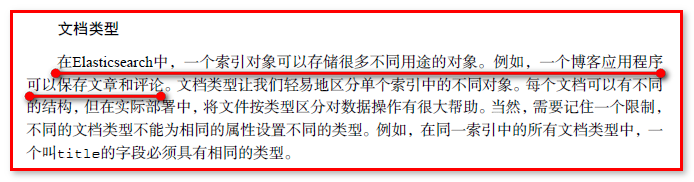
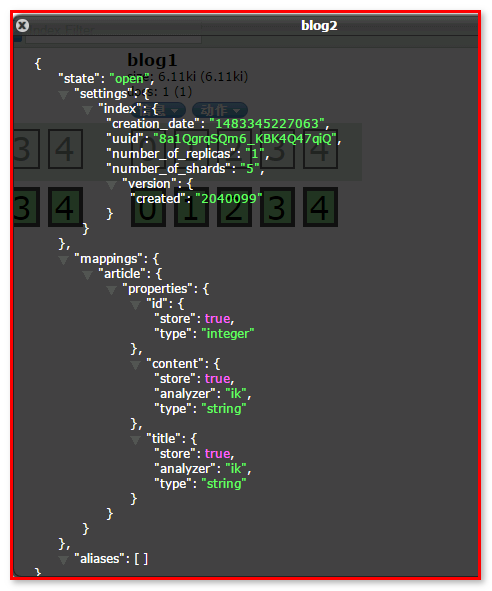
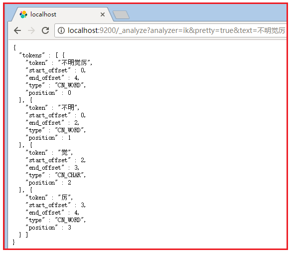

##					ElasticSearch


|    日期    | 修订版本 | 修改章节 | 修改描述 |  作者  |
| :--------: | :------: | :------: | :------: | :----: |
| 2019-05-24 |   V1.0   |          |          | 徐文波 |


#### 3.30.1 全文检索技术简介

什么是lucene？


​	Lucene是一套 “全文检索” 编程API ，基于Lucene对数据建立索引，进行查询。

​    很多框架对lucene进行了封装。

什么是ElasticSearch ?


​	现在企业开发中，更常用是的solr搜索服务器和ElasticSearch搜索服务器 

如果大家使用过 Apache Lucene 或 Apache Solr，就会知道它们的使用体验非常有趣。尤其在你需要扩展基于 Lucene 或 Solr 的解决方案时，你就会了解 [Elasticsearch](https://www.elastic.co/products/elasticsearch) 项目背后的动机。Elasticsearch（构建于 Lucene 之上）在一个容易管理的包中提供了高性能的全文搜索功能，支持开箱即用地集群化扩展。你可以通过标准的 REST API 或从特定于编程语言的客户端库与 Elasticsearch 进行交互。

此处将展示 Elasticsearch 的实际工作原理。首先了解命令行访问该 REST API 来了解它的基本信息。然后设置一个本地 Elasticsearch 服务器，并使用Java 应用程序与它交互。

#### 3.30.2 ES安装配置入门

​    对于 Java 示例，还需要安装IDEA(或是 [Eclipse](https://eclipse.org/downloads/) )和 [Apache Maven](https://maven.apache.org/download.cgi)。如果你的系统上还没有它们，请下载和安装它们。


官网： <https://www.elastic.co/cn/products/elasticsearch>


Window系统下载zip版本，linux系统下载tar版本


下载后的页面


​	bin 存放elasticSearch 运行命令 

​	config 存放配置文件

​	lib 存放elasticSearch运行依赖jar包 

​	modules 存放elasticSearch 模块

​	plugins 存放插件  

 **默认配置单机版安装：**

将安装包上传到Linux下，解压，在**普通用户**下运行elasticSearch/bin/elasticsearch 文件 

**注：**若是运行在root用户下，会抛出如下异常：


在普通用户下正常启动es后，访问 curl -XGET 'http://127.0.0.1:9200


安装elasticSearch成功


注意：

①可以将Elasticsearch注册到Linux的服务上，不用每次启动Elasticsearch

②若是以后台进程的方式启动ElasticSearch,可以在**普通用户**下运行elasticSearch/bin/elasticsearch -d 

(es服务启动需要花费时间，要稍等片刻才可以正常对外提供服务。)

 

**ES单机定制版安装：**

配置config/elasticsearch.yml

cluster.name: bigdata

node.name: hadoop

path.data: /home/janson/data/elastic

path.logs:  /home/janson/logs/elastic

network.host: JANSON01

http.cors.enabled: true

http.cors.allow-origin: "*"

 

启动：（daemon: 精灵进程，后台进程的方式启动）

$ELASTICSEARCH_HOME/bin/elasticsearch -d

 

注意：若是进程启动不了，查看日志文件/home/janson/logs/elastic/bigdata.log，报错：max file descriptors [4096] for elasticsearch process is too low, increase to at least [65536]，解决方案见：

解决方案：

max file descriptors [4096] for elasticsearch process is too low, increase to at least [65536]

1，切换到root用户 ( su -l root )

	ulimit -Hn  查看硬限制
	
	vim /etc/security/limits.conf 
	
	添加下面设置 hadoop是用户（nofile 是代表最大文件打开数，soft: 警告；hard:严格）
	
	tom soft nofile 65536 ~> janson: 新建的用户
	tom hard nofile 65536
	
	退出用户重新登录，使配置生效 ~> reboot 重启虚拟机
	
	重新 ulimit -Hn  查看硬限制 会发现数值有4096改成65535 ~>root用户切换到tom用户，才能察觉到配置信息起作用了。

————————————

2，vim /etc/security/limits.d/20-nproc.conf ~> 文件名以 -nproc.conf结尾

	找到如下内容：
	
	soft nproc 1024
	
	修改为
	
	soft nproc 2048

————————————

3，vi /etc/sysctl.conf   ~>在root用户下进行修改

	添加下面配置：
	
	vm.max_map_count=655360
	
	并执行命令：
	
	sysctl -p
效果：


#### 3.30.3 ES插件安装

ES本身服务相对比较少，其功能的强大之处就体现在插件的丰富性上。有非常多的ES插件用于ES的管理，性能的完善，下面就给大家介绍几款常用的插件。

 

→bigdesk：该工具的Git地址是：<https://github.com/lukas-vlcek/bigdesk> 

①BigDesk主要提供的是节点的实时状态监控，包括jvm的情况，linux的情况，    elasticsearch的情况，推荐大家使用。

②里面可以看到集群名称，节点列表。内存消耗情况，GC回收情况。可以自由的在各个节点之间进行切换，自动的添加或是移除一些旧的节点。同样可以更改refresh inerval刷新间隔，图标能够显示的数据量。

安装：

①解压下载的bigdesk插件，注意一定不要下载到elasticsearch的plugins目录下 ，可以与elasticsearch的安装目录一致。

②进入到bigdesk的_site目录，在Linux命令行启动：python -m SimpleHTTPServer

或者以后台进程的方式启动：nohup python -m SimpleHTTPServer > /dev/null 2>&1 &

③启动，访问(web)：<http://janson01:8000/#nodes>


→es head：


elasticsearch-head插件

​    elasticsearch-head是一个elasticsearch的集群管理工具，它是完全由[**HTML5**](http://lib.csdn.net/base/html5)编写的独立网页程序，你可以通过插件把它集成到es。或直接下载源码，在本地打开index.html运行它。该工具的[**Git**](http://lib.csdn.net/base/git)地址是： <https://github.com/Aconex/elasticsearch-head> 

在地址栏输入es服务器的ip地址和端口，点connect就可以连接到集群。下面是连接后的视图。这是主界面，在这里可以看到es集群的基本信息（如：节点情况，索引情况）

安装步骤：(注意：在root用户下安装)

①nodejs npm grunt安装

​	sudo yum install nodejs

​	sudo yum install npm

​	npm install -g grunt-cli

​	npm install -g grunt

​	npm install -g cnpm --registry=https://registry.npm.taobao.org  （或是：cnpm install   //执行后会生成node_modules文件夹）

 

②修改Gruntfile.js

​	在该文件中添加如下，务必注意不要漏了添加“，”号，这边的hostname:’*’，表示允许所有IP可以访问,此处也可以修改端口号

​	server: {

​				 options: {

​						hostname: '*',

​						port: 9100,

​						base: '.',

​						keepalive: true

​				}

​		}

③启动grunt server

④访问 [http://JANSON01:9100](http://localhost:9200/_plugin/head/)  


→es kibana：

kibana 本质上是elasticsearch web客户端，是一个分析和可视化elasticsearch平台，可通过kibana搜索、查看和与存储在elasticsearch的索引进行交互。

可以很方便的执行先进的数据分析和可视化多种格式的数据，如图表、表格、地图等。

下载地址：<http://www.elastic.co/downloads/kibana，>

这里下载的版本为kibana-6.5.3-linux-x86_64.tar.gz，需要特别注意的就是kibana和ES之间的版本匹配问题。

简单配置即可：

server.port: 5601

server.host: "master"

elasticsearch.url: "http://master:9200"

启动：$KIBANA_HOME/bin/kibana

后台启动： kibana]$ nohup bin/kibana >logs/kibana.log 2>&1 &

访问：<http://master:5601/>


#### 3.30.4 ES基本操作

推荐书籍 ： 

《Elasticsearch服务器开发（第2版）.pdf 》

《Elasticsearch权威指南（中文版）.pdf》


全文检索： 针对文本中每个词，创建词条建立索引，进行搜索。

倒排索引：

也常被称为反向索引、置入档案或反向档案，是一种索引方法，被用来存储在全文搜索下某个单词在一个文档或者一组文档中的存储位置的映射。它是文档检索系统中最常用的数据结构。通过倒排索引，可以根据单词快速获取包含这个单词的文档列表。倒排索引主要由两个部分组成：“单词词典”和“倒排文件”。 

倒排列表：

倒排列表用来记录有哪些文档包含了某个单词。一般在文档集合里会有很多文档包含某个单词，每个文档会记录文档编号（DocID），单词在这个文档中出现的次数（TF）及单词在文档中哪些位置出现过等信息，这样与一个文档相关的信息被称做倒排索引项（Posting），包含这个单词的一系列倒排索引项形成了列表结构，这就是某个单词对应的倒排列表。

ElasticSearch 操作服务器上的数据，通过 Rest API 操作数据


​    Elasticsearch可以作为一个独立的单个搜索服务器。不过，为了能够处理大型数据集，实现容错和高可用性，Elasticsearch可以运行在许多互相合作的服务器上。这些服务器称为集群（cluster），形成集群的每个服务器称为节点（node）。


​	如果操作Elasticsearch上数据，访问提供Rest API的URL地址，传递json数据给服务器


#### 3.30.5 Index的概念


#### 3.30.6 Document的概念


#### 3.30.7 Type的概念



#### 3.30.8 map映射的概念


​	索引对象（blob）： 存储数据的表结构 ，任何搜索数据，存放在索引对象上 。

​	映射（mapping）： 数据如何存放到索引对象上，需要有一个映射配置， 包括：数据类型、是否存储、是否分词 … 等。

​	文档（document）： 一条数据记录， 存在索引对象上 

​	文档类型（type）： 一个索引对象 存放多种类型数据，数据用文档类型进行标识  

【后续编程】：  

第一步：建立索引对象 

第二步：建立映射 

第三步：存储数据【文档】 

第四步：指定文档类型进行搜索数据【文档】

**Elasticsearch与Mysql对比**

Elasticsearch 集群可以包含多个索引（Index），每个索引可以包含多个类型（Type），每个类型可以包含多个文档（Document），每个文档可以包含多个字段（Field）。以下是 MySQL 和 Elasticsearch 的术语类比图，帮助理解：


es.create({index : 'blog'});

这样就创建了一个名为 blog的 Index。Type 不用单独创建，在创建 Mapping 时指定就可以。Mapping 用来定义 Document 中每个字段的类型，即所使用的 analyzer、是否索引等属性，非常关键等。创建 Mapping 的代码示例如下：

client.indices.putMapping({

​    index : 'blog',

​    type : 'article',

​    body : {

​        article: {

​            properties: {

​                id: {

​                    type: 'string',

​                    analyzer: 'ik',

​                    search_analyzer: 'ik',

​                },

​                title: {

​                    type: 'string',

​                    analyzer: 'ik',

​                    search_analyzer: 'ik',

​                },

​                content: {

​                    type: 'string',

​                    analyzer: 'ik',

​                    search_analyzer: 'ik',

​                }

​            }

​        }

​    }

});

#### 3.30.9 CURL操作REST命令

​    要理解本教程的所有示例，需要在你的系统上安装 Elasticsearch。下载针对你的平台的 [最新 Elastic Search 程序包](https://www.elastic.co/downloads/elasticsearch)。将该包解压到一个方便的位置。

在 Windows 上，运行elastic-search-dir/bin/elasticsearch.bat

#### 3.30.10 Windows安装CURL

第一步：工具下载：

　　在官网处下载工具包：<http://curl.haxx.se/download.html>


下载后：


为了方便运行，不出现中文路径。


第二步：安装

【使用方式一】：在curl.exe目录中使用

　　解压下载后的压缩文件，通过cmd命令进入到curl.exe所在的目录。

　　进入到该目录后，执行curl --help测试：


【使用方式二】：放置在system32中

　　解压下载好的文件，拷贝curl.exe文件到C:\Windows\System32

然后就可以在DOS窗口中任意位置，使用curl命令了。


【使用方式三】：配置环境变量（推荐）

　　在系统高级环境变量中，配置

　　CURL_HOME ----- "你的curl目录位置"

　　path ---- 末尾添加 “;%CURL_HOME%;”

　　这样与上面方式二的效果相同。


​    可以对 Elasticsearch 发出 CURL 请求，这样很容易从命令行 shell 体验该框架。

Elasticsearch 是无模式的，这意味着它可以接受你提供的任何命令，并处理它以供以后查询。Elasticsearch 中的所有内容都被存储为文档，所以你的第一个练习是存储一个包含博客的文档。首先创建一个索引，它是你的所有文档类型的容器 — 类似于 MySQL 等关系数据库中的数据库。然后，将一个文档插入该索引中，以便可以查询该文档的数据。

#### 3.30.11 创建索引

​    Elasticsearch 命令的一般格式是：REST VERBHOST:9200/index/doc-type— 其中 REST VERB 是 PUT、GET 或DELETE。（使用 curlL -X 动词前缀来明确指定 HTTP 方法。）

要创建一个索引，可在你的 shell 中运行以下命令：

curl -XPUT "http://JANSON01:9200/blog01/"


尽管 Elasticsearch 是无模式的，但它在幕后使用了 Lucene，后者使用了模式。不过 Elasticsearch 为你隐藏了这种复杂性。实际上，你可以将 Elasticsearch 文档类型简单地视为子索引或表名称。但是，如果你愿意，可以指定一个模式，所以你可以将它视为一种模式可选的数据存储。

【查看】


#### 3.30.12 RestApi：练习

**插入一个文档**
要在 /blog01 索引下创建一个类型，可插入一个文档。
要将包含 “Deck the Halls” 的文档插入索引中，可运行以下命令（将该命令和本教程的其他 CURL 命令都键入到一行中）：
curl -XPUT "http://JANSON01:9200/blog01/article/1" -d  "{"""id""": """1""", """title""": """Whatiselasticsearch"""}"


​    前面的命令使用 PUT 动词将一个文档添加到 /article文档类型，并为该文档分配 ID 为1。URL 路径显示为index/doctype/ID（索引/文档类型/ID）。

**查看文档**
要查看该文档，可使用简单的 GET 命令：
curl -XGET "http://JANSON01:9200/blog01/article/1"


Elasticsearch 使用你之前 PUT 进索引中的 JSON 内容作为响应

**更新文档**
如果你认识到title字段写错了，并想将它更改为 Whatislucene 怎么办？可运行以下命令来更新文档：
curl -XPUT "http://JANSON01:9200/blog01/article/1" -d "{"""id""": """1""", """title""": """Whatislucene"""}"


因为此命令使用了相同的唯一 ID为1，所以该文档会被更新。

**搜索文档**
是时候运行一次基本查询了，此查询比你运行来查找 “Get the Halls” 文档的简单 GET 要复杂一些。文档 URL 有一个内置的 _search 端点用于此用途。在标题中找到所有包含单词 lucene 的数据：
curl -XGET "http://JANSON01:9200/blog01/article/_search?q=title:'Whatislucene'"


q 参数表示一个查询。

**检查搜索返回对象**
    上图中给出了 Elasticsearch 从前面的查询返回的数据。
    在结果中，Elasticsearch 提供了多个 JSON 对象。第一个对象包含请求的元数据：看看该请求花了多少毫秒 (took) 和它是否超时 (timed_out)。_shards 字段需要考虑 Elasticsearch 是一个集群化服务的事实。甚至在这个单节点本地部署中，Elasticsearch 也在逻辑上被集群化为分片。在往后看可以观察到 hits 对象包含：
total 字段，它会告诉你获得了多少个结果
max_score，用于全文搜索
实际结果
实际结果包含 fields 属性，因为你将 fields 参数添加到了查询中。否则，结果中会包含 source，而且包含完整的匹配文档。_index、_type 和 _id 分别表示索引、文档类型、ID；_score 指的是全文搜索命中长度。这 4 个字段始终会在结果中返回。

**删除文档**
暂时不要删除该文档，知道如何删除它就行了：
curl -XDELETE "http://JANSON01:9200/blog01/article/1"


**删除索引**
暂时不要删除该文档，知道如何删除它就行了：
curl -XDELETE "http://JANSON01:9200/blog01"


#### 3.30.13 使用Java操作客户端

​    Elasticsearch 的 Java 客户端非常强大；它可以建立一个嵌入式实例并在必要时运行管理任务。

​    运行一个 Java 应用程序和 Elasticsearch 时，有两种操作模式可供使用。该应用程序可在 Elasticsearch 集群中扮演更加主动或更加被动的角色。在更加主动的情况下（称为 Node Client），应用程序实例将从集群接收请求，确定哪个节点应处理该请求，就像正常节点所做的一样。（应用程序甚至可以托管索引和处理请求。）另一种模式称为 Transport Client，它将所有请求都转发到另一个 Elasticsearch 节点，由后者来确定最终目标。

#### 3.30.14 新建文档（自动创建索引和映射）

1、需要新建 maven项目 

2、基于maven的pom 导入坐标依赖 
  <dependencies>
  	<dependency>
  		<groupId>org.elasticsearch</groupId>
  		<artifactId>elasticsearch</artifactId>
  		<version>6.5.3</version>
  	</dependency>
  	<dependency>
  		<groupId>junit</groupId>
  		<artifactId>junit</artifactId>
  		<version>4.12</version>
  	</dependency>
  </dependencies>
	ElasticSearch6.5.3 依赖 lucene7.5.0 版本 


当直接在ElasticSearch 建立文档对象时，如果索引不存在的，默认会自动创建，映射采用默认方式 
ElasticSearch 服务默认端口 9300 
Web 管理平台端口 9200 
获取 Transport Client调用
对于演示应用程序，（通过 App.java 中执行的初始化）选择 Transport Client，并保持 Elasticsearch 执行最低级别的处理：
这里注意：如果连接到一个 Elasticsearch 集群，构建器可以接受多个地址。（在本课程中，你只有一个 JANSON01 节点。）连接到端口 9300，而不是像之前在 REST API 的 CURL 中一样连接到 9200。Java 客户端将会使用这个特殊端口，使用端口 9200将不起作用。
使用org.elasticsearch.client.Client连接服务器。所以任何操作都需要用上，我们把它的创建放置到@Before中，操作最后别忘记执行client.close()方法关闭。

```java
   private Client client;
	/** 获取client */
	@Before
	public void getClient() throws Exception {
		client = TransportClient.builder().build()
				.addTransportAddress(new InetSocketTransportAddress(InetAddress.getByName("127.0.0.1"), 9300));
	}
```

3、建立文档， 自动创建索引 
方式一：拼装json的字符串。

```java
@Test
	public void createIndexNoMapping() {
		String json = "{" +
		        "\"id\":\"1\"," +
		        "\"title\":\"基于Lucene的搜索服务器\"," +
		        "\"content\":\"它提供了一个分布式多用户能力的全文搜索引擎，基于RESTful web接口\"" +
		    "}";
		IndexResponse indexResponse = this.client.prepareIndex("blog", "article", "1").setSource(json).execute().actionGet();
		// 结果获取
		String index = indexResponse.getIndex();
		String type = indexResponse.getType();
		String id = indexResponse.getId();
		long version = indexResponse.getVersion();
		boolean created = indexResponse.isCreated();
		System.out.println(index + " : " + type + ": " + id + ": " + version + ": " + created);
		// 关闭连接
		client.close();
	}
```

方式二：使用Map集合

```java
// ElasticSearch 测试程序 
public class ElasticSearchTest {

    /**创建索引、类型、文档*/
	@Test
	public void createIndexNoMapping1() {
		Map<String, Object> json = new HashMap<String, Object>();
		json.put("id", "2");
		json.put("title", "基于Lucene的搜索服务器");
		json.put("content", "它提供了一个分布式多用户能力的全文搜索引擎，基于RESTful web接口");
		IndexResponse indexResponse = this.client.prepareIndex("blog", "article", "2").setSource(json).execute().actionGet();
		// 结果获取
		String index = indexResponse.getIndex();
		String type = indexResponse.getType();
		String id = indexResponse.getId();
		long version = indexResponse.getVersion();
		boolean created = indexResponse.isCreated();
		System.out.println(index + " : " + type + ": " + id + ": " + version + ": " + created);
		// 关闭连接
		client.close();
	}
```

方式三：使用es的帮助类，创建json对象

```java
	@Test
	public void createIndexNoMapping2() throws Exception{
		// 使用es的帮助类，创建一个json方式的对象
		/**
		 * 描述json 数据
		 * {id:xxx, title:xxx, content:xxx}
		 */
		XContentBuilder sourceBuilder = XContentFactory.jsonBuilder()
			.startObject()
				.field("id", 3)
				.field("title", "ElasticSearch是一个基于Lucene的搜索服务器")
				.field("content",
						"它提供了一个分布式多用户能力的全文搜索引擎，基于RESTful web接口。Elasticsearch是用Java开发的，并作为Apache许可条款下的开放源码发布，是当前流行的企业级搜索引擎。设计用于云计算中，能够达到实时搜索，稳定，可靠，快速，安装使用方便。")
			.endObject();
		// 创建索引
		IndexResponse indexResponse = client.prepareIndex("blog", "article", "3").setSource(sourceBuilder).get();
		// 结果获取
		String index = indexResponse.getIndex();
		String type = indexResponse.getType();
		String id = indexResponse.getId();
		long version = indexResponse.getVersion();
		boolean created = indexResponse.isCreated();
		System.out.println(index + " : " + type + ": " + id + ": " + version + ": " + created);
        // 关闭连接
		client.close();
	}
}
```

没有映射创建，自动创建索引 和 映射

名称为blog


自动创建索引映射 

文档数据 （type 文档类型 ）


#### 3.30.15 搜索文档数据（单个索引）

使用GetResponse查询

```java
   /**
     * get API 获取指定文档信息
     */
    @Test
    public void testGetData() throws Exception {
    	Client client = TransportClient.builder().build()
				.addTransportAddress(new InetSocketTransportAddress(InetAddress.getByName("127.0.0.1"), 9300));
        GetResponse response = client.prepareGet("blog", "article", "1")
                .setOperationThreaded(false)    // 线程安全
                .get();
        System.out.println(response.getSourceAsString());
		// 关闭连接
		client.close();
}
```

#### 3.30.16 搜索文档数据（多个索引）

```java
/**
     * 测试multi get
     * 搜索
     * 从不同的index, type, 和id中获取
     */
    @Test
    public void testMultiGet() {
        MultiGetResponse multiGetResponse = client.prepareMultiGet()
        .add("blog", "article", "1")
        .add("blog", "article", "2", "3", "4")
        .add("blog", "article", "2")
        .get();
        
        for (MultiGetItemResponse itemResponse : multiGetResponse) {
            GetResponse response = itemResponse.getResponse();
            if (response.isExists()) {
                String sourceAsString = response.getSourceAsString();
                System.out.println(sourceAsString);
            }
        }
        client.close();
    }
```

#### 3.30.17 更新文档数据

【更新方式一】

```java
/**
	 * 测试更新 update API 使用 updateRequest 对象
	 */
	@Test
	public void testUpdate() throws Exception {
		UpdateRequest updateRequest = new UpdateRequest();
		updateRequest.index("blog");
		updateRequest.type("article");
		updateRequest.id("1");
		updateRequest.doc(XContentFactory.jsonBuilder().startObject()
				// 对没有的字段添加, 对已有的字段替换
				.field("title", "ElasticSearch是一个基于Lucene的搜索服务器")
				.field("content",
						"它提供了一个分布式多用户能力的全文搜索引擎，基于RESTful web接口。Elasticsearch是用Java开发的，并作为Apache许可条款下的开放源码发布，是当前流行的企业级搜索引擎。设计用于云计算中，能够达到实时搜索，稳定，可靠，快速，安装使用方便。")
				.field("createDate", "2018-10-11").endObject());
		UpdateResponse response = client.update(updateRequest).get();

		// 打印
		String index = response.getIndex();
		String type = response.getType();
		String id = response.getId();
		long version = response.getVersion();
		System.out.println(index + " : " + type + ": " + id + ": " + version);
		// 关闭连接
		client.close();
	}
```

【更新方式二】

```java
   /**
	 * 测试更新 update API 使用 updateRequest 对象
	 */
	@Test
	public void testUpdate2() throws Exception {
		// 使用updateRequest对象及documents进行更新
		UpdateResponse response = client
				.update(new UpdateRequest("blog", "article", "1").doc(XContentFactory.jsonBuilder().startObject()
						.field("title", "什么是Elasticsearch，ElasticSearch是一个基于Lucene的搜索服务器").endObject()))
				.get();
		// 打印
		String index = response.getIndex();
		String type = response.getType();
		String id = response.getId();
		long version = response.getVersion();
		System.out.println(index + " : " + type + ": " + id + ": " + version);
		// 关闭连接
		client.close();
	}
```

【更新方式三】

```java
/**
     * 测试upsert方法
     */
    @Test
    public void testUpsert() throws Exception {
        // 设置查询条件, 查找不到则添加
        IndexRequest indexRequest = new IndexRequest("blog", "article", "1")
            .source(XContentFactory.jsonBuilder()
                .startObject()
                .field("title", "搜索服务器")
				.field("content",
						"它提供了一个分布式多用户能力的全文搜索引擎，基于RESTful web接口。Elasticsearch是用Java开发的，并作为Apache许可条款下的开放源码发布，是当前流行的企业级搜索引擎。设计用于云计算中，能够达到实时搜索，稳定，可靠，快速，安装使用方便。")
                .endObject());
        // 设置更新, 查找到更新下面的设置
        UpdateRequest upsert = new UpdateRequest("blog", "article", "1")
            .doc(XContentFactory.jsonBuilder()
                    .startObject()
                        .field("user", "李四")
                    .endObject())
            .upsert(indexRequest);
        
        client.update(upsert).get();
        client.close();
    }
```

#### 3.30.18 删除文档数据

```java
    /**
     * 测试 delete
     */
    @Test
    public void testDelete() {
        DeleteResponse response = client.prepareDelete("blog", "article", "1")
                .get();
        String index = response.getIndex();
        String type = response.getType();
        String id = response.getId();
        long version = response.getVersion();
        System.out.println(index + " : " + type + ": " + id + ": " + version);
        client.close();
    }
```

#### 3.30.19 条件查询QueryBuilder

到目前为止，我们使用了REST API和简单查询以及GET请求来搜索数据。更改索引时，无论想执行的操作是更改映射还是文档索引化，都要用REST API向Elasticsearch发送JSON结构的数据。类似地，如果想发送的不是一个简单的查询，仍然把它封装为JSON结构并发送给Elasticsearch。这就是所谓的查询DSL。从更宏观的角度看，Elasticsearch支持两种类型的查询：基本查询和复合查询。

基本查询，如词条查询用于查询实际数据。

第二种查询为复合查询，如布尔查询，可以合并多个查询。

查询数据 主要依赖QueryBuilder对象 ，可以通过QueryBuilders获取各种查询 ：（基于lucene）

```perl
boolQuery() 布尔查询，可以用来组合多个查询条件 
fuzzyQuery() 模糊查询 
matchAllQuery() 查询所有数据 
regexpQuery() 正则表达式查询 
termQuery() 词条查询 
wildcardQuery() 通配符查询 
```

使用SearchResponse获取，支持各种查询：

```java
    /**
     * 搜索在elasticSearch中创建的文档对象
     */
	@Test
	public void testSearch() throws Exception {
		// 搜索数据
		// get()方法 === execute().actionGet()
		// SearchResponse searchResponse = client.prepareSearch("blob1")
		// .setTypes("article").setQuery(QueryBuilders.matchAllQuery()).get();
		/**
		 * 1、ElasticSearch提供QueryBuileders.queryStringQuery(搜索内容)
		 * 查询方法，对所有字段进行分词查询
		 */
//		SearchResponse searchResponse = client.prepareSearch("blog").setTypes("article")
//				.setQuery(QueryBuilders.queryStringQuery("全面"))
//				.get();
		/**
		 * 2、 只想查询content里包含全文 ，使用QueryBuilders.wildcardQuery模糊查询 *任意字符串 ?任意单个字符
		 */
//		SearchResponse searchResponse = client.prepareSearch("blog").setTypes("article")
//				.setQuery(QueryBuilders.wildcardQuery("content", "*全文*")).get();
		/** 3、 查询content词条为“搜索” 内容，使用TermQuery */
		SearchResponse searchResponse = client.prepareSearch("blog")
				.setTypes("article")
				.setQuery(QueryBuilders.termQuery("content", "全文")).get();
		SearchHits hits = searchResponse.getHits(); // 获取命中次数，查询结果有多少对象
		System.out.println("查询结果有：" + hits.getTotalHits() + "条");
		Iterator<SearchHit> iterator = hits.iterator();
		while (iterator.hasNext()) {
			SearchHit searchHit = iterator.next(); // 每个查询对象
			System.out.println(searchHit.getSourceAsString()); // 获取字符串格式打印
			System.out.println("id:" + searchHit.getSource().get("id"));
			System.out.println("title:" + searchHit.getSource().get("title"));
			System.out.println("content:" + searchHit.getSource().get("content"));
			for (Iterator<SearchHitField> ite = searchHit.iterator(); ite.hasNext();) {
				SearchHitField next = ite.next();
				System.out.println(next.getValues());
			}
		}
		// 关闭连接
		client.close();
	}
```

**各种查询对象Query的使用** 

ElasticSearch 支持所有Lucene查询，并对其进行简化封装 

```java
	WildcardQuery 通配符查询
    TermQuery 词条查询 
	FuzzyQuery 相似度查询（模糊查询）
	BooleanQuery 布尔查询 
```

1、ElasticSearch提供QueryBuileders.queryStringQuery(搜索内容) 查询方法，对所有字段进行分词查询 
SearchResponse searchResponse = client.prepareSearch("blog")
		 .setTypes("article")
		 .setQuery(QueryBuilders.queryStringQuery("全文")).get();
2、 只想查询content里包含全文 ，使用QueryBuilders.wildcardQuery通配符查询 *任意字符串 ?任意单个字符 
	SearchResponse searchResponse = client.prepareSearch("blog")
		 .setTypes("article")
		 .setQuery(QueryBuilders.wildcardQuery("content", "*全文*")).get();
	发现查询不到！！！！ ，涉及词条查询理解， 说明没有词条包含“全文”
3、 查询content词条为“搜索” 内容，使用QueryBuilders.termQuery进行词条查询 
		SearchResponse searchResponse = client.prepareSearch("blog")
		.setTypes("article")
		.setQuery(QueryBuilders.termQuery("content", "全文")).get();
	发现查询不到！！！，说明没有搜索“全文”这个词条 
这是为什么呢？
词条： 就是将文本内容存入搜索服务器，搜索服务器进行分词之后的内容。
例如：“ElasticSearch是一个基于Lucene的搜索服务器”
	分词（好的）： ElasticSearch、是、一个、基于、Lucene、搜索、服务、服务器 
	默认单字分词（差的）： ElasticSearch、 是、一、个、基、于、搜、索
    使用QueryBuileders.queryStringQuery(搜索内容)，搜索“全面” 也能够查询到，这是为什么呢？看图：


#### 3.30.20 queryStringQuery搜索内容查询

**解析查询字符串**
相比其他可用的查询，query_string查询支持全部的Apache Lucene查询语法
针对多字段的query_string查询

```java
SearchResponse searchResponse = client.prepareSearch("blog2").setTypes("article")
				 .setQuery(QueryBuilders.queryStringQuery("全面")).get();
		SearchHits hits = searchResponse.getHits(); // 获取命中次数，查询结果有多少对象
```

#### 3.30.21 wildcardQuery通配符查询

*匹配多个字符，?匹配1个字符

注意：避免* 开始, 会检索大量内容造成效率缓慢

```java
SearchResponse searchResponse = client.prepareSearch("blog2").setTypes("article")
				 .setQuery(QueryBuilders.wildcardQuery("content", "elas*c?")).get();
		SearchHits hits = searchResponse.getHits(); // 获取命中次数，查询结果有多少对象
```

#### 3.30.22 termQuery词条查询

词条查询是Elasticsearch中的一个简单查询。它仅匹配在给定字段中含有该词条的文档，而

且是确切的、未经分析的词条

termQuery("key", obj) 完全匹配

termsQuery("key", obj1, obj2..)   一次匹配多个值，只要有一个值是正确的，就可以查询出数据

```java
//		SearchResponse searchResponse = client.prepareSearch("blog2").setTypes("article")
//				 .setQuery(QueryBuilders.termQuery("content", "搜索")).get();
		SearchResponse searchResponse = client.prepareSearch("blog2").setTypes("article")
				 .setQuery(QueryBuilders.termsQuery("content", "搜索","全文")).get();
SearchHits hits = searchResponse.getHits(); // 获取命中次数，查询结果有多少对象
```

**字段匹配查询**
matchQuery("key", Obj) 单个匹配, field不支持通配符, 前缀具高级特性
     match查询把query参数中的值拿出来，加以分析，然后构建相应的查询。使用match查询时，Elasticsearch将对一个字段选择合适的分析器，所以可以确定，传给match查询的词条将被建立索引时相同的分析器处理。
multiMatchQuery("text", "field1", "field2"..);  匹配多个字段, field有通配符查询功能

```java
//		SearchResponse searchResponse = client.prepareSearch("blog2").setTypes("article")
//				 .setQuery(QueryBuilders.matchQuery("content", "搜索")).get();
		SearchResponse searchResponse = client.prepareSearch("blog2").setTypes("article")
				.setQuery(QueryBuilders.multiMatchQuery("搜索", "title","content")).get();
		SearchHits hits = searchResponse.getHits(); // 获取命中次数，查询结果有多少对象
```

**只查询ID（标识符查询）**
标识符查询是一个简单的查询，仅用提供的标识符来过滤返回的文档。此查询针对内部的
_uid字段运行，所以它不需要启用_id字段

```java
SearchResponse searchResponse = client.prepareSearch("blog2").setTypes("article")
				.setQuery(QueryBuilders.idsQuery().ids("1")).get();
		SearchHits hits = searchResponse.getHits(); // 获取命中次数，查询结果有多少对象
```

#### 3.30.23 boolQuery布尔查询

**用于复杂搜索逻辑的BoolQuery**

```java
 public SearchResponse getSimpleSearchResponse( int page, int pagesize){
 
         BoolQueryBuilder mustQuery = QueryBuilders.boolQuery();
         mustQuery.must(QueryBuilders.matchAllQuery()); // 添加第1条must的条件 此处为匹配所有文档
 
         mustQuery.must(QueryBuilders.matchPhraseQuery("title", "时间简史"));//添加第2条must的条件 title字段必须为【时间简史】
         // ↑ 放入筛选条件(termQuery为精确搜索，大小写敏感且不支持*) 实验发现matchPhraseQuery可对中文精确匹配term
 
         mustQuery.must(QueryBuilders.matchQuery("auther", "霍金")); // 添加第3条must的条件
 
         QueryBuilder queryBuilder = QueryBuilders.queryStringQuery("物理")//.escape(true)//escape 转义 设为true，避免搜索[]、结尾为!的关键词时异常 但无法搜索*
                 .defaultOperator(QueryStringQueryBuilder.Operator.AND);//不同关键词之间使用and关系
         mustQuery.must(queryBuilder);//添加第4条must的条件 关键词全文搜索筛选条件
 
         SearchRequestBuilder searchRequestBuilder = EsClient.getClient().prepareSearch("index name").setTypes("type name")
                 .setQuery(mustQuery)
                 .addHighlightedField("*")/*星号表示在所有字段都高亮*/.setHighlighterRequireFieldMatch(false)//配置高亮显示搜索结果
                 .setHighlighterPreTags("<高亮前缀标签>").setHighlighterPostTags("<高亮后缀标签>");//配置高亮显示搜索结果
 
                 searchRequestBuilder = searchRequestBuilder.addAggregation(AggregationBuilders.terms("agg1(聚类返回时根据此key获取聚类结果)")
                         .size(1000)/*返回1000条聚类结果*/.field("要在文档中聚类的字段，如果是嵌套的则用点连接父子字段，如【person.company.name】"));
 
         SearchResponse searchResponse = searchRequestBuilder.setFrom((page - 1) * pagesize)//分页起始位置（跳过开始的n个）
                 .setSize(pagesize)//本次返回的文档数量
                 .execute().actionGet();//执行搜索
 
         log.info("response="+searchResponse);
         return searchResponse;
     }
 }
```

#### 3.30.24 fuzzyQuery模糊查询

**相似度查询**
fuzzy查询是模糊查询中的第三种类型，它基于编辑距离算法来匹配文档

```java
SearchResponse searchResponse = client.prepareSearch("blog2").setTypes("article")
				.setQuery(QueryBuilders.fuzzyQuery("content", "elasticsearxx")).get();
		SearchHits hits = searchResponse.getHits(); // 获取命中次数，查询结果有多少对象
```

**范围查询**
范围查询使我们能够找到在某一字段值在某个范围里的文档，字段可以是数值型，也可以是
基于字符串的

```java
SearchResponse searchResponse = client.prepareSearch("blog2").setTypes("article")
				.setQuery(QueryBuilders.rangeQuery("content").from("我们").to("解决方案").includeLower(true).includeUpper(true)).get();
		SearchHits hits = searchResponse.getHits(); // 获取命中次数，查询结果有多少对象
```

includeLower(true)：包含上界
IncludeUpper(true)：包含下界

**跨度查询**
下面代码表示，从首字母开始，查询content字段=问题的数据，问题前面的词为300个，可以测试30看是否能查询出数据。

```java
SearchResponse searchResponse = client.prepareSearch("blog2").setTypes("article")
				.setQuery(QueryBuilders.spanFirstQuery(QueryBuilders.spanTermQuery("content", "问题"), 300)).get();
		SearchHits hits = searchResponse.getHits(); // 获取命中次数，查询结果有多少对象
```

**组合查询（复杂查询）**

```java
     must(QueryBuilders) : AND
     mustNot(QueryBuilders): NOT
     should(QueryBuilders):OR 
```

在定义json：放置到Elasticsearch的插件中
{
	"query": {
		"bool": {
			"must": {
				"term": {
					"title": "elasticsearch"
				}
			},
			"should": {
				"range": {
					"id": {
						"from": 1,
						"to": 2
					}
				}
			}
		}
	}
}

```java
SearchResponse searchResponse = client.prepareSearch("blog2").setTypes("article")
				.setQuery(QueryBuilders.boolQuery().must(QueryBuilders.termQuery("title", "搜索")).must(QueryBuilders.wildcardQuery("content", "elastic*ch"))).get();
		SearchHits hits = searchResponse.getHits(); // 获取命中次数，查询结果有多少对象
```

**排序查询**

```java
SearchResponse searchResponse = client.prepareSearch("blog2").setTypes("article")
				.setQuery(QueryBuilders.matchAllQuery())
				.addSort("id", SortOrder.DESC).get();
		SearchHits hits = searchResponse.getHits(); // 获取命中次数，查询结果有多少对象
```


#### 3.30.25 regexpQuery正则表达式查询

正则表达式查询

responsebuilder.setQuery(QueryBuilders.regexpQuery(field, regexp))

```java
/**
     * 高亮显示查询
     * 获取数据，
     *  查询apache，不仅在author拥有，也可以在url，在name中也可能拥有
     *  author or url   --->booleanQuery中的should操作
     *      如果是and的类型--->booleanQuery中的must操作
     *      如果是not的类型--->booleanQuery中的mustNot操作
     *  使用的match操作，其实就是使用要查询的keyword和对应字段进行完整匹配，是否相等，相等返回
     */
@Test
public void testSearch4() {
    SearchResponse response = client.prepareSearch(indics).setSearchType(SearchType.DEFAULT)
        //                .setQuery(QueryBuilders.multiMatchQuery("apache", "author", "url"))
        //                .setQuery(QueryBuilders.regexpQuery("url", ".*apache.*"))
        //                .setQuery(QueryBuilders.termQuery("author", "apache"))
        .setQuery(QueryBuilders.boolQuery()
                  .should(QueryBuilders.regexpQuery("url", ".*apache.*"))
                  .should(QueryBuilders.termQuery("author", "apache")))
        // 设置高亮显示--->设置相应的前置标签和后置标签
        .setHighlighterPreTags("<span color='blue' size='18px'>")
        .setHighlighterPostTags("</span>")
        // 哪个字段要求高亮显示
        .addHighlightedField("author")
        .addHighlightedField("url")
        .get();
    SearchHits searchHits = response.getHits();
    float maxScore = searchHits.getMaxScore();  // 查询结果中的最大文档得分
    System.out.println("maxScore: " + maxScore);
    long totalHits = searchHits.getTotalHits(); // 查询结果记录条数
    System.out.println("totalHits: " + totalHits);
    SearchHit[] hits = searchHits.getHits();    // 查询结果
    System.out.println("当前返回结果记录条数：" + hits.length);
    for(SearchHit hit : hits) {
        System.out.println("========================================================");
        Map<String, HighlightField> highlightFields = hit.getHighlightFields();
        for(Map.Entry<String , HighlightField> me : highlightFields.entrySet()) {
            System.out.println("--------------------------------------");
            String key = me.getKey();
            HighlightField highlightField = me.getValue();
            String name = highlightField.getName();
            System.out.println("key: " + key + ", name: " + name);
            Text[] texts = highlightField.fragments();
            String value = "";
            for(Text text : texts) {
                // System.out.println("text: " + text.toString());
                value += text.toString();
            }
            System.out.println("value: " + value);
        }
    }
}
```

#### 3.30.26 matchAllQuery查询所有数据

**查询所有**

matchAllQuery()匹配所有文件

match_all查询是Elasticsearch中最简单的查询之一。它使我们能够匹配索引中的所有文件。

```java
SearchResponse searchResponse = client.prepareSearch("blog2")
			 .setTypes("article").setQuery(QueryBuilders.matchAllQuery())
			 .get();
		
		SearchHits hits = searchResponse.getHits(); // 获取命中次数，查询结果有多少对象
```

#### 3.30.27 IK分词器集成ES

ElasticSearch 默认采用分词器， 单个字分词 ，效果很差 

搜索【IK Analyzer 3.0】

http://www.oschina.net/news/2660


下载 <https://github.com/medcl/elasticsearch-analysis-ik/tree/2.x>

1、 下载开源项目 


2、 打包ik分词器	

mvn clean 清空 


mvn package 打包 


生成：

这里不用执行，需要联网下载，而且很慢，我们使用现成的即可。


3、 在%es%/plugins目录里新建analysis-ik目录，将elasticsearch-analysis-ik-1.10.4解压，

将解压后除了config的所有文件拷贝到 %es%/plugins/analysis-ik下


4、 在%es%/config目录里新建analysis-ik目录，将elasticsearch-analysis-ik-1.10.4的config目录的所有配置文件复制到 %es%/config/analysis-ik 下


​	在linux的es集群下安装ik：

​	bin/plugin install <file:///export/software/elasticsearch-analysis-ik-1.10.4.zip>

​	注意：每个节点都需要安装

​	此时的每个节点都需要配置一份自己的扩展字典吗？不用！

我们可以给它配置远程扩展字典：


既然是远程词典，那么就要是一个可访问的链接，可以是一个页面，也可以是一个txt的文档，但要保证输出的内容是 utf-8 的格式，hotWords.php 的内容：

```shell
$s = <<<'EOF'
蓝瘦
千锋互联
不明觉厉
EOF;
header('Last-Modified: '.gmdate('D, d M Y H:i:s', time()).' GMT', true, 200);
header('ETag: "5816f349-19"');
echo $s;
```

ik 接收两个返回的头部属性 Last-Modified 和 ETag，只要其中一个有变化，就会触发更新，ik 会每分钟获取一次 

重启 Elasticsearch

注意：如果设置的链接是一个页面，需要部署服务器，关于部署服务器可以是Apache或Tomcat等。

5、 配置elasticsearch.yml 

在%es%/config下

index.analysis.analyzer.ik.type: "ik"

放置到最后

名称命名为。后续用到分词器的时候，使用ik这个名词。

6、 重启es 


发现ik分词器被加载 

 

7、 访问

[http://JANSON01:9200/_analyze?analyzer=ik&pretty=true&text=我是中国人](http://localhost:9200/_analyze?analyzer=ik&pretty=true&text=我是中国人) 


其中，

“我”是一个词，

“是”是停用词，

“中国人”可以分为“中国人”、“中国”、“国人”。

【出现异常】：


别导错包：


#### 3.30.28 ES常用编程操作

在ElasticSearch没有索引情况下，插入文档，默认创建索引和索引映射 （但是无法使用ik分词器）

要想使用IK分词器，需要重新创建索引。

#### 3.30.29 索引相关操作

创建索引

```java
        // 创建索引
		client.admin().indices().prepareCreate("blog2").get();
```


默认创建好索引，mappings为空 

**删除索引**

```java
		// 删除索引
		client.admin().indices().prepareDelete("blog2").get();
```

【代码】

```java
@Test
	// 索引/删除操作
	public void createIndex() throws IOException {
		// 创建索引
		//client.admin().indices().prepareCreate("blog2").get();

		// 删除索引
		client.admin().indices().prepareDelete("blog2").get();

		// 关闭连接
		client.close();
	}
```

#### 3.30.30 映射相关操作


**创建映射**

```java
PutMappingRequest mapping = Requests.putMappingRequest("blog2").type("article").source(builder);
client.admin().indices().putMapping(mapping).get();
```

【代码】

```java
   @Test
	// 映射操作
	public void createMapping() throws Exception {
		// 创建索引
		// client.admin().indices().prepareCreate("blog03").execute().actionGet();
		// 添加映射
		/**
		 * 格式： "mappings" : { "article" : { "dynamic" : "false", "properties" :
		 * { "id" : { "type" : "string" }, "content" : { "type" : "string" },
		 * "author" : { "type" : "string" } } } }
		 */
		XContentBuilder builder = XContentFactory.jsonBuilder()
				.startObject()
					.startObject("article")
						.startObject("properties")
							.startObject("id").field("type", "integer").field("store", "yes").endObject()
							.startObject("title").field("type", 
"string").field("store", "yes").field("analyzer", "ik").endObject()
							.startObject("content").field("type", "string").field("store", "yes").field("analyzer", "ik").endObject()
						.endObject()
					.endObject()
				.endObject();

		PutMappingRequest mapping = Requests.putMappingRequest("blog2").type("article").source(builder);
		client.admin().indices().putMapping(mapping).get();

		// 关闭连接
		client.close();
	}
```

查看：http://JANSON01:9200/_plugin/head/



#### 3.30.31 文档相关操作

**建立文档数据（XContentBuilder）**

1、 回顾：直接在XContentBuilder中构建json数据，建立文档 。

```java
        // 描述json 数据
		/*
		 * {id:xxx, title:xxx, content:xxx}
		 */
		XContentBuilder builder = XContentFactory.jsonBuilder()
				.startObject()
				.field("id", 1)
				.field("title", "ElasticSearch是一个基于Lucene的搜索服务器")
				.field("content",
						"它提供了一个分布式多用户能力的全文搜索引擎，基于RESTful web接口。Elasticsearch是用Java开发的，并作为Apache许可条款下的开放源码发布，是当前流行的企业级搜索引擎。设计用于云计算中，能够达到实时搜索，稳定，可靠，快速，安装使用方便。")
				.endObject();
		// 建立文档对象
		/**
		 * 参数一blog1：表示索引对象
		 * 参数二article：类型
		 * 参数三1：建立id
		 */
		client.prepareIndex("blog2", "article", "1").setSource(builder).get();
```

**建立文档数据（Jackson）**

对一个已经存在对象，转换为json ，建立文档 

创建包，com.qf.elasticsearch.domain

```java
public class Article {

	private Integer id;
	private String title;
	private String content;
}
```


​	问题：如何将Article对象，转换为json数据 ---- Jackson 转换开发包 

Jackson 是一个 Java 用来处理 JSON 格式数据的类库，性能非常好。

​    Jackson可以轻松的将Java对象转换成json对象和xml文档，同样也可以将json、xml转换成Java对象。Jackson库于2012.10.8号发布了最新的2.1版。
​    Jackson源码目前托管于GitHub，地址：https://github.com/FasterXML/

​    Jackson 2.x介绍

​    Jackson 2.x版提供了三个JAR包供下载：
\1. Core库：streaming parser/generator，即流式的解析器和生成器。
下载：

http://repo1.maven.org/maven2/com/fasterxml/jackson/core/jackson-core/2.1.0/jackson-core-2.1.0.jar
\2. Databind库：ObjectMapper, Json Tree Model，即对象映射器，JSON树模型。
下载：
http://repo1.maven.org/maven2/com/fasterxml/jackson/core/jackson-databind/2.1.0/jackson-databind-2.1.0.jar
\3. Annotations库：databinding annotations，即带注释的数据绑定包。
下载：
http://repo1.maven.org/maven2/com/fasterxml/jackson/core/jackson-annotations/2.1.0/jackson-annotations-2.1.0.jar

从Jackson 2.0起，
核心组件包括：jackson-annotations、jackson-core、jackson-databind。
数据格式模块包括：Smile、CSV、XML、YAML。

 

引入jackson 

1.x 版本

```xml
      <dependency>
          <groupId>org.codehaus.jackson</groupId>
          <artifactId>jackson-core-asl</artifactId>
          <version>1.9.13</version>
      </dependency>
      <dependency>
          <groupId>org.codehaus.jackson</groupId>
          <artifactId>jackson-mapper-asl</artifactId>
          <version>1.9.13</version>
      </dependency>       
```

2.x 版本

```xml
<dependency>
		<groupId>com.fasterxml.jackson.core</groupId>
		<artifactId>jackson-core</artifactId>
		<version>2.8.1</version>
	</dependency>
	<dependency>
		<groupId>com.fasterxml.jackson.core</groupId>
		<artifactId>jackson-databind</artifactId>
		<version>2.8.1</version>
	</dependency>
	<dependency>
		<groupId>com.fasterxml.jackson.core</groupId>
		<artifactId>jackson-annotations</artifactId>
		<version>2.8.1</version>
	</dependency>
```

**【建立文档代码】：**

```java
@Test
	// 文档相关操作
	public void demo6() throws IOException, InterruptedException,
			ExecutionException {
		// 创建连接搜索服务器对象
		Client client = TransportClient
				.builder()
				.build()
				.addTransportAddress(
						new InetSocketTransportAddress(InetAddress
								.getByName("127.0.0.1"), 9300));
		// 描述json 数据
		/*
		 * {id:xxx, title:xxx, content:xxx}
		 */
		Article article = new Article();
		article.setId(2);
		article.setTitle("搜索工作其实很快乐");
		article.setContent("我们希望我们的搜索解决方案要快，我们希望有一个零配置和一个完全免费的搜索模式，我们希望能够简单地使用JSON通过HTTP的索引数据，我们希望我们的搜索服务器始终可用，我们希望能够一台开始并扩展到数百，我们要实时搜索，我们要简单的多租户，我们希望建立一个云的解决方案。Elasticsearch旨在解决所有这些问题和更多的问题。");

		ObjectMapper objectMapper = new ObjectMapper();

		// 建立文档
		client.prepareIndex("blog2", "article", article.getId().toString())
	.setSource(objectMapper.writeValueAsString(article)).get();
		// 关闭连接
		client.close();
	}
```

测试完成搜索：

**【修改文档代码】** 

方式一： 使用prepareUpdate、prepareIndex都可以

```java
		client.prepareUpdate("blog2", "article", article.getId().toString())
		 .setDoc(objectMapper.writeValueAsString(article)).get();
```

方式二： 直接使用update

```java
		client.update(new UpdateRequest("blog2", "article", article.getId().toString())
		.doc(objectMapper.writeValueAsString(article))).get();
```

 **删除文档** 

方式一： prepareDelete 

```java
client.prepareDelete("blog2", "article", 
article.getId().toString()).get();
```

方式二： 直接使用delete

```java
client.delete(new DeleteRequest("blog2", "article", 
article.getId().toString())).get();
```

【http://JANSON01:9200/_plugin/head：查询结果】：


**【搜索代码】**

```java
@Test
	// 搜索在elasticSearch中创建文档对象
	public void testSearchQuery() throws IOException {
		// 创建连接搜索服务器对象
		Client client = TransportClient.builder().build()
				.addTransportAddress(new InetSocketTransportAddress(InetAddress.getByName("127.0.0.1"), 9300));
		// 搜索数据
		// get() === execute().actionGet()
//		 SearchResponse searchResponse = client.prepareSearch("blog2")
//		 .setTypes("article").setQuery(QueryBuilders.matchAllQuery())
//		 .get();
		/**
		 * 1、ElasticSearch提供QueryBuileders.queryStringQuery(搜索内容)
		 * 查询方法，对所有字段进行分词查询
		 */
//		 SearchResponse searchResponse = client.prepareSearch("blog2")
//		 .setTypes("article")
//		 .setQuery(QueryBuilders.queryStringQuery("全面")).get();
		/**
		 * 2、 只想查询content里包含全文 ，使用QueryBuilders.wildcardQuery模糊查询 *任意字符串 ?任意单个字符
		 */
//		 SearchResponse searchResponse = client.prepareSearch("blog2")
//		 .setTypes("article")
//		 .setQuery(QueryBuilders.wildcardQuery("content", "*搜索*")).get();
		// /**3、 查询content词条为“搜索” 内容，使用TermQuery */
		SearchResponse searchResponse = client.prepareSearch("blog2").setTypes("article")
				.setQuery(QueryBuilders.termQuery("content", "搜索")).get();
		SearchHits hits = searchResponse.getHits(); // 获取命中次数，查询结果有多少对象
		System.out.println("查询结果有：" + hits.getTotalHits() + "条");
		Iterator<SearchHit> iterator = hits.iterator();
		while (iterator.hasNext()) {
			SearchHit searchHit = iterator.next(); // 每个查询对象
			System.out.println(searchHit.getSourceAsString()); // 获取字符串格式打印
			System.out.println("id:" + searchHit.getSource().get("id"));
			System.out.println("title:" + searchHit.getSource().get("title"));
			System.out.println("content:" + searchHit.getSource().get("content"));
		}
		// 关闭连接
		client.close();
	}
```

#### 3.30.32 IK分词器自定义词库

如果修改文档，content字段添加“不明觉厉”

```java
Article article = new Article();
		article.setId(2);
		article.setTitle("搜索工作其实很快乐");
		article.setContent(
				"不明觉厉希望能够简单地使用JSON通过HTTP的索引数据，我们希望我们的搜索服务器始终可用，我们希望能够一台开始并扩展到数百，我们要实时搜索，我们要简单的多租户，我们希望建立一个云的解决方案。Elasticsearch旨在解决所有这些问题和更多的问题。");

		ObjectMapper objectMapper = new ObjectMapper();
		System.out.println(objectMapper.writeValueAsString(article));

		// 修改文档
		client.prepareUpdate("blog2", "article", article.getId().toString())
		 .setDoc(objectMapper.writeValueAsString(article)).get();

```

使用词条查询进行搜索

```java
SearchResponse searchResponse = client.prepareSearch("blog2").setTypes("article")
				.setQuery(QueryBuilders.termQuery("content", "不明觉厉")).get();
		SearchHits hits = searchResponse.getHits(); // 获取命中次数，查询结果有多少对象
		System.out.println("查询结果有：" + hits.getTotalHits() + "条");
```

发现没有搜索到数据，其实“不明觉厉”使用IK中文分词器的时候，进行单字分词了。


如何自定义词库呢？


修改IKAnalyzer.cfg.xml


打开custom文件夹，mydict.dic，编辑文件


重新启动es。



重新修改文档，再次搜索，可以查询到结果。

#### 3.30.33查询文档分页操作

1、 批量向数据表 插入100条记录 。

```java
   @Test
	// 批量查询100条记录
	public void createDocument100() throws Exception {
		// 创建连接搜索服务器对象
		Client client = TransportClient
				.builder()
				.build()
				.addTransportAddress(
						new InetSocketTransportAddress(InetAddress
								.getByName("127.0.0.1"), 9300));

		ObjectMapper objectMapper = new ObjectMapper();

		for (int i = 1; i <= 100; i++) {
			// 描述json 数据
			Article article = new Article();
			article.setId(i);
			article.setTitle(i + "搜索工作其实很快乐");
			article.setContent(i
					+ "我们希望我们的搜索解决方案要快，我们希望有一个零配置和一个完全免费的搜索模式，我们希望能够简单地使用JSON通过HTTP的索引数据，我们希望我们的搜索服务器始终可用，我们希望能够一台开始并扩展到数百，我们要实时搜索，我们要简单的多租户，我们希望建立一个云的解决方案。Elasticsearch旨在解决所有这些问题和更多的问题。");
			// 建立文档
			client.prepareIndex("blog2", "article", article.getId().toString())
					.setSource(objectMapper.writeValueAsString(article)).get();
		}
		// 关闭连接
		client.close();
	}
```

2、分页查询 
    查询所有的方法
	searchRequestBuilder 的 setFrom【从0开始】 和 setSize【查询多少条记录】方法实现

```java
@Test
	// 分页搜索
	public void testPage() throws Exception {
		// 创建连接搜索服务器对象
		Client client = TransportClient
				.builder()
				.build()
				.addTransportAddress(
						new InetSocketTransportAddress(InetAddress
								.getByName("127.0.0.1"), 9300));
		// 搜索数据
		// get() === execute().actionGet()
		SearchRequestBuilder searchRequestBuilder = client.prepareSearch("blog2").setTypes("article")
				.setQuery(QueryBuilders.matchAllQuery());//默认每页10条记录

		// 查询第2页数据，每页20条
        //setFrom()：从第几条开始检索，默认是0。
        //setSize():每页最多显示的记录数。
		searchRequestBuilder.setFrom(20).setSize(20);

		SearchResponse searchResponse = searchRequestBuilder.get();
		printSearchResponse(searchResponse);
		// 关闭连接
		client.close();
	}
```

**查询结果高亮显示**
在百度搜索elasticsearch，可以是文字高亮。


我们能够找到在某一字段值在某个范围里的文档，字段可以是数值型，也可以是

基于字符串的

查看页面源码分析


【代码】

```java
@Test
	// 高亮查询结果 处理 搜索
	public void testHighLight() throws IOException {
		// 创建连接搜索服务器对象
		Client client = TransportClient
				.builder()
				.build()
				.addTransportAddress(
						new InetSocketTransportAddress(InetAddress
								.getByName("127.0.0.1"), 9300));

		ObjectMapper objectMapper = new ObjectMapper();

		// 搜索数据
		SearchRequestBuilder searchRequestBuilder = client
				.prepareSearch("blog2").setTypes("article")
				.setQuery(QueryBuilders.termQuery("content", "搜索"));
```

1、 配置应用高亮 

```java
		// 高亮定义
		searchRequestBuilder.addHighlightedField("content"); // 对content字段进行高亮
		searchRequestBuilder.setHighlighterPreTags("<em>"); // 前置元素
		searchRequestBuilder.setHighlighterPostTags("</em>");// 后置元素
		// 设置摘要大小
		searchRequestBuilder.setHighlighterFragmentSize(10);

		SearchResponse searchResponse = searchRequestBuilder.get();

		SearchHits hits = searchResponse.getHits(); // 获取命中次数，查询结果有多少对象
		System.out.println("查询结果有：" + hits.getTotalHits() + "条");
		Iterator<SearchHit> iterator = hits.iterator();
		while (iterator.hasNext()) {
			SearchHit searchHit = iterator.next(); // 每个查询对象
```

2、 对结果的高亮片段做拼接处理，替换原有内容

```java
			// 将高亮处理后内容，替换原有内容 （原有内容，可能会出现显示不全 ）
			Map<String, HighlightField> highlightFields = searchHit.getHighlightFields();
			HighlightField contentField = highlightFields.get("content");

			// 获取到原有内容中 每个高亮显示 集中位置 fragment 就是高亮片段
			Text[] fragments = contentField.fragments();
			String content = "";
			for (Text text : fragments) {
				content += text;
			}
			// 将查询结果转换为对象
			Article article = objectMapper.readValue(
					searchHit.getSourceAsString(), Article.class);

			// 用高亮后内容，替换原有内容
			// 如果值等于空，说明没有高亮的结果
			if(content!=null && !"".equals(content)){
				// 用高亮后内容，替换原有内容
				article.setContent(content);				
			}

			System.out.println(article);
		}

		// 关闭连接
		client.close();
	}
```

最后，我们已经快速掌握了如何从命令行和在 Java 应用程序中使用 Elasticsearch。现在已经熟悉了索引、查询、高亮显示和多字段搜索等功能。那么还有一些功能值得我们关注。

#### 3.30.34得分（加权）

随着应用程序的增长，提高搜索质量的需求也进一步增大。我们把它叫做搜索体验。我们需要知道什么对用户更重要，关注用户如何使用搜索功能。这导致不同的结论，例如，有些文档比其他的更重要，或特定查询需强调一个字段而弱化其他字段。这就是可以用到加权的地方。

**在Query和Field中可以设置加权**

创建3条数据，通过加权影响我们的数据结果和得分

#### 3.30.35在Query的查询中定义加权

【创建数据】

1：Article中添加一个属性

```java
public class Article {

	private Integer id;
	private String title;
	private String content;
	private String comment;
}
```

2：重新创建索引和映射，创建文档

```java
/**创建 索引*/
	@Test
	public void testCreateIndex_boost() throws Exception{
		// 创建索引
		client.admin().indices().prepareCreate("blog1").get();
		//关闭
		client.close();
	}
	
	/**
	 * 创建映射
	 */
	@Test
	public void testCreateIndexMapping_boost() throws Exception{
		//构建json的数据格式，创建映射
		XContentBuilder mappingBuilder = XContentFactory.jsonBuilder()
				.startObject()
					.startObject("article")
						.startObject("properties")
							.startObject("id")
								.field("type","integer").field("store", "yes")
							.endObject()
							.startObject("title")
								.field("type","string").field("store", "yes").field("analyzer","ik")
							.endObject()
							.startObject("content")
								.field("type","string").field("store", "yes").field("analyzer","ik")
							.endObject()
							.startObject("comment")
								.field("type","string").field("store", "yes").field("analyzer","ik")
							.endObject()
						.endObject()
					.endObject()
				.endObject();
		PutMappingRequest request = Requests.putMappingRequest("blog1")
				.type("article")
				.source(mappingBuilder);
		client.admin().indices().putMapping(request).get();
		//关闭
		client.close();
	}
	
	
	/**创建文档*/
	@Test
	public void createDocument_boost() throws Exception{
		
		Article article = new Article();
//		article.setId(1);
//		article.setTitle("搜索引擎服务器"); // 有搜索
//		article.setContent("基于restful的数据风格"); // 无搜索
//		article.setComment("我们学习Elasticsearch搜索引擎服务器");// 有搜索
		
		article.setId(2);
		article.setTitle("什么是Elasticsearch"); // 
		article.setContent("Elasticsearch搜索引擎服务器"); // 有搜索
		article.setComment("Elasticsearch封装了lucene");// 无搜索
		
		ObjectMapper objectMapper = new ObjectMapper();
		String source = objectMapper.writeValueAsString(article);
		System.out.println("source:"+source);
		
		IndexResponse indexResponse = client.prepareIndex("blog1", "article", article.getId().toString()).setSource(source).get();
		// 获取响应的信息
		System.out.println("索引名称："+indexResponse.getIndex());
		System.out.println("文档类型："+indexResponse.getType());
		System.out.println("ID："+indexResponse.getId());
		System.out.println("版本："+indexResponse.getVersion());
		System.out.println("是否创建成功："+indexResponse.isCreated());
		client.close();
	}
```

【测试】

```java
@Test
	public void testQueryString_boost() throws Exception{
		SearchResponse searchResponse = client.prepareSearch("blog1").setTypes("article")
				.setQuery(QueryBuilders.queryStringQuery("搜索").field("content^10").field("title^5").field("comment"))
				.get();
		SearchHits hits = searchResponse.getHits();//获取数据的结果集对象，获取命中次数
		// 显示数据
		this.searchValue(hits);
		//关闭
		client.close();
	}

	@Test
	public void testBoolQuery_boost() throws Exception{
		SearchResponse searchResponse = client.prepareSearch("blog1").setTypes("article")
	.setQuery(QueryBuilders.boolQuery().should(QueryBuilders.termQuery("title", "搜索").boost(5f))
						.should(QueryBuilders.termQuery("content", "搜索").boost(10f)))
				.get();
		SearchHits hits = searchResponse.getHits();//获取数据的结果集对象，获取命中次数
		// 显示数据
		this.searchValue(hits);
		//关闭
		client.close();
	}
```

【显示结果】

```java
// 显示查询的结果数据
	private void searchValue(SearchHits hits) {
		System.out.println("查询的结果数量有"+hits.getTotalHits()+"条");
		System.out.println("结果中最高分："+hits.getMaxScore());
		// 遍历每条数据
		Iterator<SearchHit> iterator = hits.iterator();
		while(iterator.hasNext()){
			SearchHit searchHit = iterator.next();
			System.out.println("所有的数据JSON的数据格式："+searchHit.getSourceAsString());
			System.out.println("每条得分："+searchHit.getScore());
			// 获取每个字段的数据
			System.out.println("id:"+searchHit.getSource().get("id"));
			System.out.println("title:"+searchHit.getSource().get("title"));
			System.out.println("content:"+searchHit.getSource().get("content"));
			System.out.println("**********************************************");
			for(Iterator<SearchHitField> ite = searchHit.iterator();ite.hasNext();){
				SearchHitField next = ite.next();
				System.out.println(next.getValues());
			}
		}
	}
```

#### 3.30.36 在Field字段的映射中定义加权


可以在映射中添加：


等同于：


#### 3.30.37 过滤器

我们已经介绍了如何使用不同的条件和查询来构建查询并搜索数据。我们还熟知了评分，它告诉我们在给定的查询中，哪些文档更重要以及查询文本如何影响排序。然而，有时我们可能要在不影响最后分数的情况下，选择索引中的某个子集，这就要使用过滤器。

如果可以，应该尽可能使用过滤器。过滤器不影响评分，而得分计算让搜索变得复杂，而且需要CPU资源。另一方面，过滤是一种相对简单的操作。由于过滤应用在整个索引的内容上，过滤的结果独立于找到的文档，也独立于文档之间的关系。过滤器很容易被缓存，从而进一步提高过滤查询的整体性能。

#### 3.30.38 范围过滤器

```java
/**范围过滤器*/
	@Test
	public void testRangeQuery() throws Exception{
		SearchResponse searchResponse = client.prepareSearch("blog").setTypes("article")
				.setPostFilter(QueryBuilders.rangeQuery("id").from(1).to(2))
				.get();
		SearchHits hits = searchResponse.getHits();//获取数据的结果集对象，获取命中次数
		// 显示数据
		this.searchValue(hits);
		//关闭
		client.close();
	}
```

#### 3.30.39 布尔过滤器

 

```java
	/**bool过滤器*/
	@Test
	public void testFilter() throws Exception{
		SearchResponse searchResponse = client.prepareSearch("blog").setTypes("article")
				.setPostFilter(QueryBuilders.boolQuery().must(QueryBuilders.termQuery("title", "搜索"))
						.must(QueryBuilders.termQuery("content", "搜索")))
				.get();
		SearchHits hits = searchResponse.getHits();//获取数据的结果集对象，获取命中次数
		// 显示数据
		this.searchValue(hits);
		//关闭
		client.close();
	}
```

添加缓存：

​    过滤器的缓存

关于过滤器最后要提到的是缓存。缓存加速了使用过滤器的查询，代价是第一次执行过滤器时的内存成本和查询时间。因此，缓存的最佳选择是那些可以重复使用的过滤器，例如，经常会使用并包括参数值的那些。


在范围过滤器中添加缓存

```java
/**范围过滤器*/
	@Test
	public void testRangeQuery() throws Exception{
		SearchResponse searchResponse = client.prepareSearch("blog").setTypes("article")
				.setPostFilter(QueryBuilders.rangeQuery("id").from(1).to(2))
.setRequestCache(true)//放置到缓存
				.get();

		SearchHits hits = searchResponse.getHits();//获取数据的结果集对象，获取命中次数
		// 显示数据
		this.searchValue(hit‘’‘’；s);
		//关闭
		client.close();
	}
```

