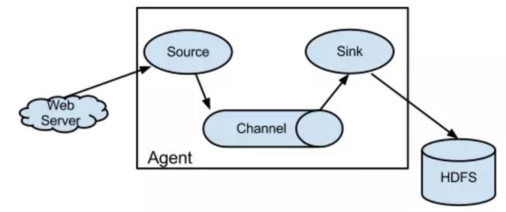
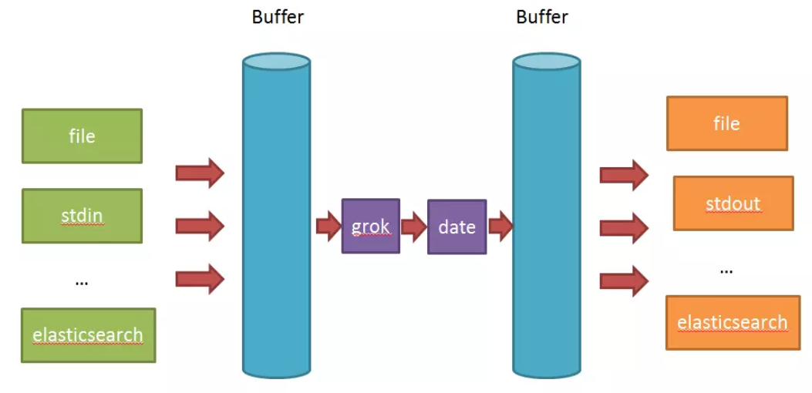
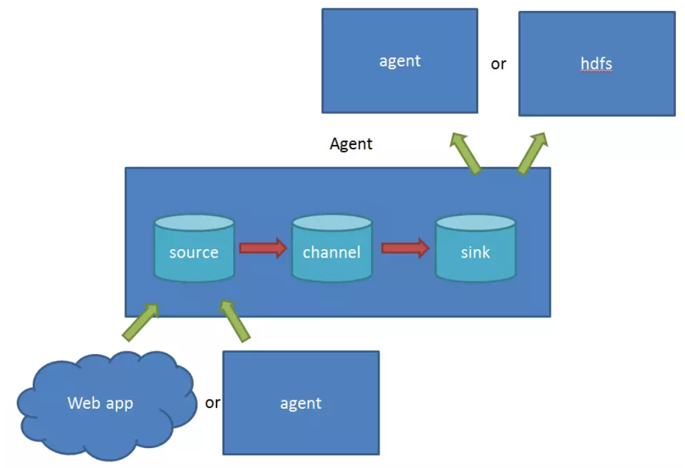
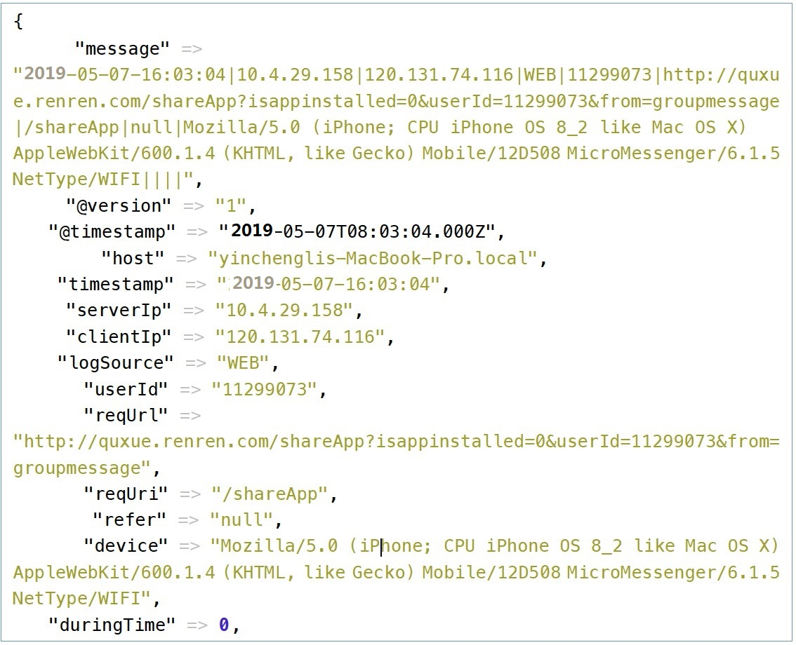
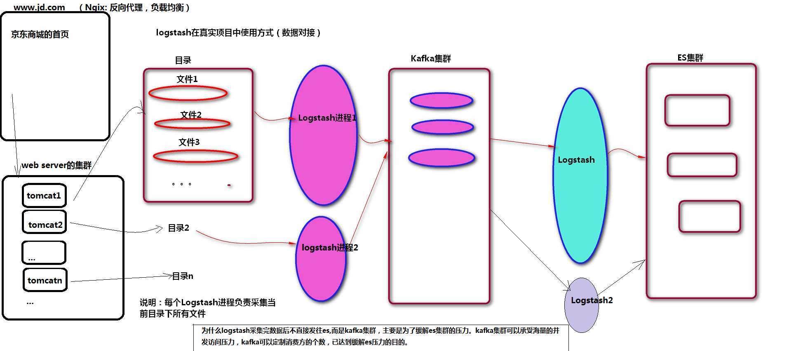

##					Logstash


|    日期    | 修订版本 | 修改章节 | 修改描述 |  作者  |
| :--------: | :------: | :------: | :------: | :----: |
| 2019-05-24 |   V1.0   |          |          | Janson |


#### 3.31.1 Logstash介绍

Logstash(ELK技术栈中的一员，用于数据的采集，使用ruby来开发)

Logstash是一个具有实时管道功能的开源数据收集引擎，Logstash可以动态地将来自不同数据源的数据统一起来，并将数据规范化为你选择的目的地，清理和大众化你的所有数据，用于各种高级下游分析和可视化用例。

虽然Logstash最初推动了日志收集方面的创新，但是它的功能远远超出了这个用例，任何类型的事件都可以通过大量的输入、过滤器和输出插件来丰富和转换，使用许多原生编解码可以进一步简化摄取过程。Logstash通过利用大量和多种数据来提高你的洞察力。

#### 3.31.2 Input组件介绍

input   ~>对接数据源的 ，与Flume框架中agent中的source功能类似

**标准输入 stdin{}**

```ruby
input{
    stdin{
        add_field => {"key" => "value"} #向事件添加一个字段
        codec => "plain" #默认是line, 可通过这个参数设置编码方式
        tags => ["std"] #添加标记
        type => "std" #添加类型
        id => 1 #添加一个唯一的ID, 如果没有指定ID, 那么将生成一个ID
        enable_metric => true #是否开启记录日志, 默认true
    }
}

# stdin官方参考: https://www.elastic.co/guide/en/logstash/current/plugins-inputs-stdin.html
```

**文件输入 file{}**

```ruby
input{
    file{
        path => ["/var/log/nginx/access.log", "/var/log/nginx/error.log"] #处理的文件的路径, 可以定义多个路径
        exclude => "*.zip" #匹配排除
        sincedb_path => "/data/" #sincedb数据文件的路径, 默认<path.data>/plugins/inputs/file
        codec => "plain" #默认是plain,可通过这个参数设置编码方式
        tags => ["nginx"] #添加标记
        type => "nginx" #添加类型
        discover_interval => 2 #每隔多久去查一次文件, 默认15s
        stat_interval => 1 #每隔多久去查一次文件是否被修改过, 默认1s
        start_position => "beginning" #从什么位置开始读取文件数据, beginning和end, 默认是结束位置end
    }
}

# file官方参考: https://www.elastic.co/guide/en/logstash/current/plugins-inputs-file.html
```

**TCP/UDP输入 tcp/udp{}**

```ruby
input{
    tcp{
       port => 8888 #端口
       mode => "server" #操作模式, server:监听客户端连接, client:连接到服务器
       host => "0.0.0.0" #当mode为server, 指定监听地址, 当mode为client, 指定连接地址, 默认0.0.0.0
       ssl_enable => false #是否启用SSL, 默认false
       ssl_cert => "" #SSL证书路径
       ssl_extra_chain_certs => [] #将额外的X509证书添加到证书链中
       ssl_key => "" #SSL密钥路径
       ssl_key_passphrase => "nil" #SSL密钥密码, 默认nil
       ssl_verify => true #核实与CA的SSL连接的另一端的身份
       tcp_keep_alive => false #TCP是否保持alives
    }
}
input{
    udp{
       buffer_size => 65536 #从网络读取的最大数据包大小, 默认65536
       host => 0.0.0.0 #监听地址
       port => 8888 #端口
       queue_size => 2000 #在内存中保存未处理的UDP数据包的数量, 默认2000
       workers => 2 #处理信息包的数量, 默认2
    }
}

# tcp官方参考: https://www.elastic.co/guide/en/logstash/current/plugins-inputs-tcp.html
# udp官方参考: https://www.elastic.co/guide/en/logstash/current/plugins-inputs-udp.html
```

**syslog输入 syslog{}**

```ruby
input{
    syslog{
       host => 0.0.0.0 #监听地址, 默认0.0.0.0
       port => "8888" #端口
    }
}

# syslog官方参考: https://www.elastic.co/guide/en/logstash/current/plugins-inputs-syslog.html
```

#### 3.31.3 Filter组件介绍

filter  ~> 对数据进行清洗，过滤的，  与Flume框架中intercepter类似，属于source组件，不属于一个单独的组件

**Filter的使用**

filter的处理，目前我们的需求是需要对字符串进行key-value的提取

1、使用了mutate中的split，能通过分割符对分本处理。
2、通过grok使用正则对字符串进行截取处理。
3、使用kv 提取所有的key-value

```ruby
input {
     file{
         path => "/XXX/syslog.txt"
         start_position => beginning
         codec => multiline{
             patterns_dir => ["/XX/logstash-1.5.3/patterns"]
             pattern => "^%{MESSAGE}"
             negate => true
             what => "previous"
         }
     }
}
filter{
    mutate{
     split => ["message","|"]
        add_field =>   {
            "tmp" => "%{[message][0]}"
        }
        add_field =>   {
            "DeviceProduct" => "%{[message][2]}"
        }
        add_field =>   {
            "DeviceVersion" => "%{[message][3]}"
        }
        add_field =>   {
            "Signature ID" => "%{[message][4]}"
        }
        add_field =>   {
            "Name" => "%{[message][5]}"
        }
    }
 
    mutate{
     split => ["tmp",":"]
        add_field =>   {
            "tmp1" => "%{[tmp][1]}"
        }
        add_field =>   {
            "Version" => "%{[tmp][2]}"
        }
        remove_field => [ "tmp" ]
    }
 
    grok{
       patterns_dir => ["/XXX/logstash-1.5.3/patterns"]
       match => {"tmp1" => "%{TYPE:type}"}
       remove_field => [ "tmp1"]
    }
 
    kv{
       include_keys => ["eventId", "msg", "end", "mrt", "modelConfidence", "severity", "relevance","assetCriticality","priority","art","rt","cs1","cs2","cs3","locality","cs2Label","cs3Label","cs4Label","flexString1Label","ahost","agt","av","atz","aid","at","dvc","deviceZoneID","deviceZoneURI","dtz","eventAnnotationStageUpdateTime","eventAnnotationModificationTime","eventAnnotationAuditTrail","eventAnnotationVersion","eventAnnotationFlags","eventAnnotationEndTime","eventAnnotationManagerReceiptTime","_cefVer","ad.arcSightEventPath"]
    }
    mutate{
     split => ["ad.arcSightEventPath",","]
        add_field =>   {
            "arcSightEventPath" => "%{[ad.arcSightEventPath][0]}"
        }
        remove_field => [ "ad.arcSightEventPath" ]
        remove_field => [ "message" ]
    }
 
}
output{
    kafka{
        topic_id => "rawlog"
        batch_num_messages => 20
        broker_list => "10.3.162.193:39192,10.3.162.194:39192,10.3.162.195:39192"
        codec => "json"
    }
    stdout{
       codec => rubydebug
    }
}
```

#### 3.31.4 Output组件介绍

output ~> 定制数据处理之后的目的地， 与Flume框架中agent中的sink功能类似

**输出到file**

```ruby
配置conf:

input{

       file{

              path => "/usr/local/logstash-5.6.1/bin/spark-test-log.log"

              type => "sparkfile"

              start_position => "beginning"

       }

}

filter{

       grok{

              patterns_dir => '/usr/local/logstash-5.6.1/patterns/selfpattern'

              match => ["message", "%{DATE:date} %{SKYTIME:time} %{LOGLEVEL:loglevel} %{WORD:word}"]

       }

}

output{

       file{

              path => "/tmp/%{+YYYY.MM.dd}-%{host}-file.txt"

       }

}
```


#### 3.31.5 Logstash与Flume比较

Logstash                                 Flume (三个组件组织成agent)
___________________________________________________________________________________________________
input                                        source                                       
output                                      sink
各个组件之间的buffer			  channel (数据缓存的媒介，是：内存，文件)
filter (过滤采集后的数据 )      source中的拦截器

**Flume初体验**

Flume的配置比较繁琐，source，channel，sink的关系在配置文件里面交织在一起，没有Logstash那么简单明了。



Flume与Logstash相比，有如下特点：

Logstash比较偏重于字段的预处理；而Flume偏重数据的传输；

Logstash有几十个插件，配置灵活；FLume则是强调用户的自定义开发（source和sink的种类也有一二十个，相对而言，channel就比较少）。

Logstash的input和filter还有output之间都存在buffer，进行缓冲；Flume直接使用channel做持久化（可以理解为没有filter，但是可以配置interceptor）

 

而Logstash中：

①input负责数据的输入（产生或者说是搜集，以及解码decode）；

②Filter负责对采集的日志进行分析，提取字段（一般都是提取关键的字段，存储到elasticsearch中进行检索分析）；

③output负责把数据输出到指定的存储位置（如果是采集agent，则一般是发送到消息队列中，如kafka,redis,mq；如果是分析汇总端，则一般是发送到elasticsearch中）；

④在Logstash比较看重input,filter,output之间的协同工作，因此多个输入会把数据汇总到input和filter之间的buffer中。filter则会从buffer中读取数据，进行过滤解析，然后存储在filter于output之间的Buffer中。当buffer满足一定的条件时，会触发output的刷新。



在Flume中：

①source 负责与Input同样的角色，负责数据的产生或搜集（一般是对接一些RPC的程序或者是其他的flume节点的sink）

②channel 负责数据的存储持久化（一般都是memory或者file两种）

③sink 负责数据的转发（用于转发给下一个flume的source或者最终的存储点——如HDFS）



Flume比较看重数据的传输，因此几乎没有数据的解析预处理。仅仅是数据的产生，封装成event然后传输。传输的时候flume比logstash多考虑了一些可靠性。因为数据会持久化在channel中（一般有两种可以选择，memoryChannel就是存在内存中,另一个就是FileChannel存储在文件种），数据只有存储在下一个存储位置（可能是最终的存储位置，如HDFS；也可能是下一个Flume节点的channel），数据才会从当前的channel中删除。这个过程是通过事务来控制的，这样就保证了数据的可靠性。不过flume的持久化也是有容量限制的，比如内存如果超过一定的量，也一样会爆掉。

#### 3.31.6 Logstash的安装

①下载安装包
	https://www.elastic.co/guide/en/logstash/current/index.html
	首先下载logstash，上传到服务器 

	logstash是用JRuby语言开发的，所以要安装JDK 

②解压：
  tar -zxvf logstash-6.5.3.tar.gz -C 指定的目录

③修改logstash核心的执行文件
	在bin目录下，有一个可执行的文件logstash,需要添加参数：（可以先不用设置，报错的话再设置）
	LS_JAVA_OPTS="-server -Xms256m -Xmx512m  -XX:PermSize=128m -XX:MaxPermSize=256m"

④验证安装是否成功：
   a)  bin/logstash -e 'input { stdin {} } output { stdout{} }'  ~> 启动需要等一会儿 
		Are you ready?
		{
			  "@version" => "1",
			   "message" => "Are you ready?",
				  "host" => "JANSON01",
			"@timestamp" => 2019-03-29T07:54:36.874Z
		}
		最近有些郁闷...
		{
			  "@version" => "1",
			   "message" => "最近有些郁闷...",
				  "host" => "JANSON01",
			"@timestamp" => 2019-03-29T07:54:56.093Z
		}
		

	说明：高版本的logstash，日志输出的格式（若是stdout），默认格式就是rubydebug。
			   旧版本的logstash,输出的格式形如： JANSON01  2018-12-26T07:09:04.336Z are you ok

   b)启动后，通过jps命令，可以查看到名为Logstash的进程名

#### 3.31.7 Logstash运行

**案例1：**使用logstash收集控制台上的录入，并使用rubydebug日志输出格式，输出到控制台上。
	./logstash -e 'input { stdin {} } output { stdout{codec => rubydebug} }'

**案例2：**使用logstash收集控制台上的录入，将结果输出到控制台上；且输出到Elastisearch索引库中（es单机版）。
		./logstash -e 'input { stdin {} } output { elasticsearch {hosts => ["JANSON01:9200"]} stdout{} }'

		注意：
		  ①索引库的名字？默认：logstash-年.月.日
		  ②默认的type的名字是：doc
**案例3：**使用logstash收集控制台上的录入，将结果输出到控制台上；且输出到Elastisearch索引库中
	（es集群版，可以提高logstash输出数据的健壮性，不容易丢失。相当于：开启了重试机制）。
	./logstash -e 'input { stdin {} } output { elasticsearch {hosts=>["JANSON02:9200", "JANSON03:9200"]} stdout{} }'

	注意： 
	  ①若是搭建了es集群，向集群中的某台es服务器写入数据，也会自动从该服务器同步到别集群中别的es服务器上。
	  ②若是搭建了真实的es集群，建议向集群中多个节点写入（本质上也是向一台可用的es服务器中写入，该es服务器宕机了，才会选择其他es服务器）。
**案例4：**使用logstash收集控制台上的录入，将结果输出到控制台上；且输出到kafka消息队列中。
	./logstash -e 'input { stdin {} } output { kafka { topic_id => "test" bootstrap_servers => "JANSON01:9092,JANSON02:9092,JANSON03:9092"} stdout{codec => rubydebug} }'

	注意： 
		 ①前提： 
			a)开启zookeeper集群 
			   zkServer.sh start
			b)开启kafka集群
			 kafka-server-start.sh -daemon /opt/kafka/config/server.properties
			c）手动创建主题
				  i)查询kafka集群中所有的主题
						[root@JANSON03 ~]# kafka-topics.sh  --list --zookeeper JANSON01:2181,JANSON02:2181,JANSON03:2181
						Hbase
						Spark
						__consumer_offsets
						bbs
						gamelogs
						gamelogs-rt
						hadoop
						hive
						spark
						test
						
				 ii) 运行的效果：
						[root@JANSON03 ~]# kafka-console-consumer.sh  --topic test2 --zookeeper JANSON01:2181 --from-beginning
						Using the ConsoleConsumer with old consumer is deprecated and will be removed in a future major release. Consider using the new consumer by passing [bootstrap-server] instead of [zookeeper].
						2019-03-29T08:40:16.312Z JANSON01 要采集数据到kafka集群中了哦
						2019-03-29T08:42:50.852Z JANSON01 Kafka, Are you ok?
			 
			 ②若目的地是kafka，需要指定主题名 
				 a)主题若是存在，直接使用 
				 b)若不存在，会自动创建，但是，只有一个分区，一个副本
				 c) 从数据安全性的角度考虑，建议手动新建主题，设置多个副本
				 
			  ③bootstrap_servers参数用于指定kafka集群的配置信息。
			 
			  ④elk技术栈中，只有elasticsearch进程需要在普通用户下启动，别的进程可以在普通用户下启动，也可以是root用户
#### 3.31.8 Logstash配置讲解

1. **定义数据源**
      写一个配置文件，可命名为logstash.conf，输入以下内容：
      
      ```ruby
      input {
              file {
                      path => "/data/web/logstash/logFile/*/*"
                      start_position => "beginning" #从文件开始处读写
              }
      #       stdin {}  #可以从标准输入读数据
      }
      ```
      
      ​     定义的数据源，支持从文件、stdin、kafka、twitter等来源，甚至可以自己写一个input plugin。如果像上面那样用通配符写file，如果有新日志文件拷进来，它会自动去扫描。
      
      **2、数据的格式**
      根据打日志的格式，用正则表达式进行匹配
      
      ```ruby
      filter {
      
        #定义数据的格式
        grok {
          match => { "message" => "%{DATA:timestamp}\|%{IP:serverIp}\|%{IP:clientIp}\|%{DATA:logSource}\|%{DATA:userId}\|%{DATA:reqUrl}\|%{DATA:reqUri}\|%{DATA:refer}\|%{DATA:device}\|%{DATA:textDuring}\|%{DATA:duringTime:int}\|\|"}
        }
      
      }
      ```
      
      由于打日志的格式是这样的：
      
      ```
      2019-05-07-16:03:04|10.4.29.158|120.131.74.116|WEB|11299073|http://quxue.renren.com/shareApp?isappinstalled=0&userId=11299073&from=groupmessage|/shareApp|null|Mozilla/5.0 (iPhone; CPU iPhone OS 8_2 like Mac OS X) AppleWebKit/600.1.4 (KHTML, like Gecko) Mobile/12D508 MicroMessenger/6.1.5 NetType/WIFI|duringTime|98||
      ```
      
      以|符号隔开，第一个是访问时间，timestamp，作为logstash的时间戳，接下来的依次为：服务端IP，客户端的IP，机器类型(WEB/APP/ADMIN)，用户的ID(没有用0表示)，请求的完整网址，请求的控制器路径，reference，设备的信息，duringTime，请求所花的时间。
      
      ​     如上面代码，依次定义字段，用一个正则表达式进行匹配，DATA是[logstash定义好的正则](https://github.com/elastic/logstash/blob/v1.4.2/patterns/grok-patterns)，其实就是(.*?)，并且定义字段名。
      
      ​     我们将访问时间作为logstash的时间戳，有了这个，我们就可以以时间为区分，查看分析某段时间的请求是怎样的，如果没有匹配到这个时间的话，logstash将以当前时间作为该条记录的时间戳。需要再filter里面定义时间戳的格式，即打日志用的格式：
      
      ```ruby
      filter {
      
        #定义数据的格式
        grok {#同上... }
      
        #定义时间戳的格式
        date {
          match => [ "timestamp", "yyyy-MM-dd-HH:mm:ss" ]
          locale => "cn"
        }
      
      }
      ```
      
      在上面的字段里面需要跟logstash指出哪个是客户端IP，logstash会自动去抓取该IP的相关位置信息：
      
      ```ruby
      filter {
      
        #定义数据的格式
        grok {#同上}
      
        #定义时间戳的格式
        date {#同上}
      
        #定义客户端的IP是哪个字段（上面定义的数据格式）
        geoip {
          source => "clientIp"
        }
      }
      
      ```
      
      同样地还有客户端的UA，由于UA的格式比较多，logstash也会自动去分析，提取操作系统等相关信息
      
      ```ruby
      #定义客户端设备是哪一个字段
        useragent {
          source => "device"
          target => "userDevice"
        }
      ```
      
      哪些字段是整型的，也需要告诉logstash，为了后面分析时可进行排序，使用的数据里面只有一个时间
      
      ```ruby
        #需要进行转换的字段，这里是将访问的时间转成int，再传给Elasticsearch
        mutate {
          convert => ["duringTime", "integer"]
        }
      ```
      
      **3, 输出配置**
      最后就是输出的配置，将过滤扣的数据输出到elasticsearch
      
      ```ruby
      output {
        #将输出保存到elasticsearch，如果没有匹配到时间就不保存，因为日志里的网址参数有些带有换行
        if [timestamp] =~ /^\d{4}-\d{2}-\d{2}/ {
              elasticsearch { host => localhost }
        }
      
         #输出到stdout
      #  stdout { codec => rubydebug }
      
         #定义访问数据的用户名和密码
      #  user => webService
      #  password => 1q2w3e4r
      }
      ```
      
      ​      我们将上述配置，保存到logstash.conf，然后运行logstash
      
      ​      在logstash启动完成之后，输入上面的那条访问记录，logstash将输出过滤后的数据：
      
      

#### 3.31.9 Logstash结合Kafka、ES数据对接



```ruby
案例5：使用logstash收集指定文件中的数据，将结果输出到控制台上；且输出到kafka消息队列中。
	核心配置文件：logstash2kafka.properties 
		input {
		 file {
			# 将path参数对应的值：可以是具体的文件，也可以是目录(若是目录，需要指定目录下的文件，或者以通配符的形式指定)
			path => "/home/root/data/access_log" 
			#  每间隔5秒钟从文件中采集一次数据
			discover_interval => 5
			#  默认是end，以追加的形式在文件中添加新数据，只会采集新增的数据；若源文件中数据条数没有发生变化，即使数据内容发生了变更，也感知不到，不会触发采集操作
			# 若指定beginning，每次都从头开始采集数据。若源文件中数据发生了变化（内容或是条数），都会感知到，都会触发采集操作
			start_position => "beginning"
		 }
		}


		output {
			kafka {
			  topic_id => "accesslogs"
			  # 用于定制输出的格式，如：对消息格式化，指定字符集等等
			  codec => plain { 
				format => "%{message}"
				charset => "UTF-8"
			  }
			  bootstrap_servers => "JANSON01:9092,JANSON02:9092,JANSON03:9092"
			}
			
			stdout{}
		}

	注意：
		0，前提：
		  创建主题： 
				[root@JANSON03 ~]# kafka-topics.sh --create  --topic accesslogs --zookeeper JANSON01:2181 --partitions 3 --replication-factor 3
				Created topic "accesslogs".
				
				[root@JANSON02 soft]# kafka-topics.sh --list --zookeeper JANSON01:2181
				Hbase
				Spark
				__consumer_offsets
				accesslogs
				bbs
				gamelogs
				gamelogs-rt
				hadoop
				hive
				spark
				test
				test2
	
		①在真实项目中，logstash三大组件通过配置文件进行组装。不是直接通过-e参数书写在其后。
		./logstash -f  配置文件名
		以后台进程的方式启动：
		nohup ./logstash -f  配置文件名 > /dev/null 2>&1 &
	
		 ②需要将指定目录下所有子目录中的所有文件都采集到（后缀是.log）
		  path => "/home/mike/data/*/*.log" 
```

 

```ruby
案例6：真实项目中logstash进行数据对接的过程
步骤： 
	1，使用logstash对指定目录下的日志信息进行采集，采集到之后，直接输出到kafka消息队列中。
		 原因：若目录下的文件是海量的，将数据采集后，直接发送给es的话，es因为承载不了压力可能会宕机。
					通用的解决方案是：
					先将日志信息采集到kafka消息队列中，然后，再使用logstash从kafka消息队列中读取出消息，发送给es
		
	2, 使用logstash从kafka消息队列中采集数据，发送给es.
	

实施：
	步骤1：游戏日志目录中所有子目录下所有的file使用logstash采集到kafka消息队列 (dir2kafka.properties)
		input {
		  file {
			codec => plain { charset => "GB2312" } 
			path => "/home/mike/data/basedir/*/*.txt"
			discover_interval => 5
			start_position => "beginning"
		  }
		}

		output {
			kafka {
			  topic_id => "gamelogs"
			  codec => plain {
				format => "%{message}"
				charset => "GB2312"
			  }
			  bootstrap_servers => "JANSON01:9092,JANSON02:9092,JANSON03:9092"
			}
		}
		   
	步骤2：使用logstash从kafka消息队列中采集数据，输出到es集群中 (kafka2es.properties)

	earliest 
	当各分区下有已提交的offset时，从提交的offset开始消费；无提交的offset时，从头开始消费 
	latest 
	当各分区下有已提交的offset时，从提交的offset开始消费；无提交的offset时，消费新产生的该分区下的数据 
	none 
	topic各分区都存在已提交的offset时，从offset后开始消费；只要有一个分区不存在已提交的offset，则抛出异常
	__

	input {
	  kafka {
		client_id => "logstash-1-1"
		type => "accesslogs"
		codec => "plain"
		auto_offset_reset => "earliest"
		group_id => "elas1"
		topics  => "accesslogs"  -- 旧版本的logstash需要使用参数：topic_id
		bootstrap_servers => "JANSON01:9092,JANSON02:9092,JANSON03:9092" -- 旧版本的logstash需要使用参数：zk_connect=>"JANSON01:2181,xx"
	  }

	  kafka {
		client_id => "logstash-1-2"
		type => "gamelogs"
		auto_offset_reset => "earliest"
		codec => "plain"
		group_id => "elas2"
		topics => "gamelogs"
		bootstrap_servers => "JANSON01:9092,JANSON02:9092,JANSON03:9092"
	  }
	}

	filter {
	  if [type] == "accesslogs" {
		json {
		  source => "message"
		  remove_field => [ "message" ]
		  target => "access"
		}
	  }

	  if [type] == "gamelogs" {
		mutate {
		  split => { "message" => "	" }
		  add_field => {
			"event_type" => "%{message[3]}"
			"current_map" => "%{message[4]}"
			"current_X" => "%{message[5]}"
			"current_y" => "%{message[6]}"
			"user" => "%{message[7]}"
			"item" => "%{message[8]}"
			"item_id" => "%{message[9]}"
			"current_time" => "%{message[12]}"
		 }
		 remove_field => [ "message" ]
	   }
	  }
	}

	output {

	  if [type] == "accesslogs" {
		elasticsearch {
		  index => "accesslogs"
		  codec => "json"
		  hosts => ["JANSON01:9200", "JANSON02:9200", "JANSON03:9200"]
		} 
	  }

	  if [type] == "gamelogs" {
		elasticsearch {
		  index => "gamelogs"
		  codec => plain {
			charset => "UTF-16BE"
		  }
		  hosts => ["JANSON01:9200", "JANSON02:9200", "JANSON03:9200"]
		} 
	  }
	}


以后台进程的方式启动： 
注意点： 
	1， 以后台的方式启动Logstash进程：
		 [mike@JANSON01 logstash]$ nohup ./bin/logstash -f config/dir2kafka.properties > /dev/null 2>&1 &
		 [mike@JANSON01 logstash]$ nohup ./bin/logstash -f  config/kafka2es.properties > /dev/null 2>&1 &
	 
	 2， LogStash 错误：Logstash could not be started because there is already another instance usin...
							 
			[mike@JANSON01 data]$ ls -alh
			total 4.0K
			drwxr-xr-x  5 mike mike  84 Mar 21 19:31 .
			drwxrwxr-x 13 mike mike 267 Mar 21 16:32 ..
			drwxrwxr-x  2 mike mike   6 Mar 21 16:32 dead_letter_queue
			-rw-rw-r--  1 mike mike   0 Mar 21 19:31 .lock
			drwxrwxr-x  3 mike mike  20 Mar 21 17:45 plugins
			drwxrwxr-x  2 mike mike   6 Mar 21 16:32 queue
			-rw-rw-r--  1 mike mike  36 Mar 21 16:32 uuid
			
			删除隐藏的文件：rm  .lock
			
	3，  logstash消费Kafka消息，报错：javax.management.InstanceAlreadyExistsException: kafka.consumer:type=app-info,id=logstash-0
		   当input里面有多个kafka输入源时，client_id => "logstash-1-1"，必须添加且需要不同
		   如： 
				  kafka {
					client_id => "logstash-1-2"
					type => "gamelogs"
					auto_offset_reset => "earliest"
					codec => "plain"
					group_id => "elas2"
					topics => "gamelogs"
					bootstrap_servers => "JANSON01:9092,JANSON02:9092,JANSON03:9092"
				  }
				  
	 4， 将游戏日志文件中的数据变化一下，就可以被logstash感知到，进而采集数据。
```

