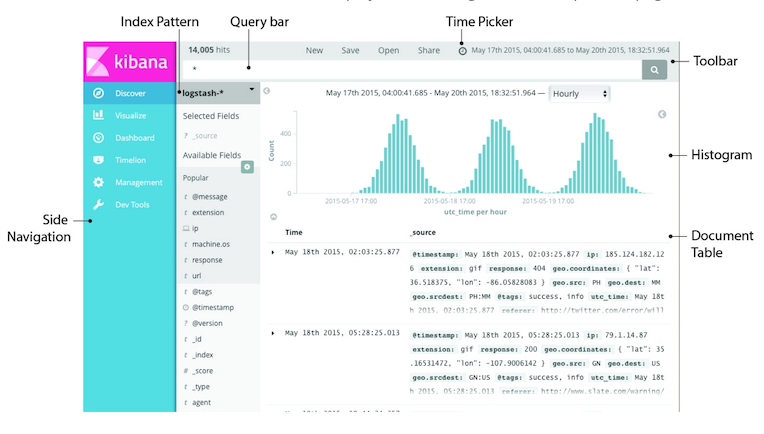

##					Kibana


|    日期    | 修订版本 | 修改章节 | 修改描述 |  作者  |
| :--------: | :------: | :------: | :------: | :----: |
| 2019-05-24 |   V1.0   |          |          | Janson |


#### 3.32.1 Kibana介绍

ES之Kibana

下面就Kibana对ES的查询监控作介绍，就是常提到的大数据日志处理组件ELK里的K。

　　什么是Kibana?现引用园友的一段对此的介绍，个人觉得比较全。

　　Kibana是一个针对Elasticsearch的开源分析及可视化平台，用来搜索、查看交互存储在Elasticsearch索引中的数据。使用Kibana，可以通过各种图表进行高级数据分析及展示。

　　Kibana让海量数据更容易理解。它操作简单，基于浏览器的用户界面可以快速创建仪表板（dashboard）实时显示Elasticsearch查询动态。

　　设置Kibana非常简单。无需编码或者额外的基础架构，几分钟内就可以完成Kibana安装并启动Elasticsearch索引监测。

#### 3.32.2 Kibana环境准备

　　下载解压安装包，一定要装与ES相同的版本

　　下载地址：<https://www.elastic.co/downloads/kibana>

#### 3.32.3 Kibana安装

配置（修改config/kibana.yml）：
	server.port: 5601  ~> 端口号：具有联网功能的应用程序的唯一标识。  
	server.host: "JANSON01"
	elasticsearch.url: "http://JANSON01:9200"
	# elasticsearch.username: "jack"
	# elasticsearch.password: "123"
	
启动kibana:
   bin/kibana
	
	后台启动： kibana]$ nohup bin/kibana >logs/kibana.log 2>&1 &

访问：
	http://JANSON01:5601
	
常见的报表工具：
	折线图
	饼形图
	柱状图
	...

使用：
   使用kibana制作一张饼状图，查询出bank索引库中的type之account中所有员工在不同薪资范围内的占比情况。
	步骤：
		 ①选中management选项卡,对所要分析的索引库创建模板pattern 
		 ②选中visualize选项卡,选中图形模板【柱状图，饼状图，折线图...】,创建图表
		 ③将结果保存起来		   

说明： 
	 kibana 本质上是elasticsearch web客户端，是一个分析和可视化elasticsearch平台，可通过kibana搜索、查看和与存储在elasticsearch的索引进行交互。
	可以很方便的执行各种数据分析和可视化的操作，如图表、表格、地图等。
	下载地址：http://www.elastic.co/downloads/kibana，这里下载的版本为kibana-6.5.3-linux-x64.tar.gz，需要特别注意的就是kibana和ES之间的版本匹配问题。

#### 3.32.4 Kibana演示

打开http://JANSON01:5601/status


　　想要在Kibana中监控ES则需要安装 X-pack插件，现介绍 X-pack插件。

　　X-pack监控组件使您可以通过Kibana轻松地监控ElasticSearch。您可以实时查看集群的健康和性能，以及分析过去的集群、索引和节点度量。此外，您可以监视Kibana本身性能。当你安装X-pack在群集上，监控代理运行在每个节点上收集和指数指标从Elasticsearch。安装在X-pack在Kibana上，您可以查看通过一套专门的仪表板监控数据


X-pack的安装
安装X-pack的时候分别在ElasticSearch根目录和Kibana根目录下操作。以下参考网友的安装方法。

Elasticsearch下载X-Pack
　　在Es的根目录（每个节点），运行 bin/elasticsearch-plugin进行安装。

先进入elasticsearch安装的目录，然后键入下命令：

bin/elasticsearch-plugin install x-pack


　　安装过程中跳出选项现在y即可。

　　如果你在Elasticsearch已禁用自动索引的创建，在elasticsearch.yml配置action.auto_create_index允许X-pack创造以下指标：

```
action.auto_create_index: .security,.monitoring*,.watches,.triggered_watches,.watcher-history*
```

运行Elasticsearch。
bin/elasticsearch
Kibana下载X-Pack
　　在Kibana根目录运行 bin/kibana-plugin 进行安装。

　　先进入kibana的安装目录，然后键入以下命令：

bin/kibana-plugin install x-pack


　　安装过程会比较久，耐心等待。

运行Kibana。
bin/kibana
验证X-Pack
　　在浏览器上输入： http://JANSON01:5601/ ，可以打开Kibana，此时需要输入用户名和密码登录，默认分别是 elastic 和 changeme。

若在线安装不了，则可选择下载后离线安装。

手动安装的方法
　　先下载对应的版本，本机装的是x-pack-5.2.2.zip 有128M 有点大，慢慢下，下载好后放在usr/local文件夹下，先进入elasticsearch安装文件夹再　　
bin/elasticsearch-plugin install file:////usr/local/x-pack-5.2.2.zip
　　kibana中安装是一样

bin/kibana-plugin install file:////usr/local/x-pack-5.2.2.zip
**Kibana+X-Pack介绍使用**
　　下面参考园友对X-Pack的介绍 ElasticSearch 5学习(2)——Kibana+X-Pack介绍使用（全）
　　下面是目前Kibana 5最新版本的界面。相比较Kibana 4除了界面的风格变化，最主要是功能栏上添加了Timeline、Management和Dev Tools选项。


#### 3.32.5 "Discovery" 菜单界面

　　从发现页可以交互地探索ES的数据。可以访问与所选索引模式相匹配的每一个索引中的每一个文档。您可以提交搜索查询、筛选搜索结果和查看文档数据。还可以看到匹配搜索查询和获取字段值统计的文档的数量。如果一个时间字段被配置为所选择的索引模式，则文档的分布随着时间的推移显示在页面顶部的直方图中。



#### 3.32.6 "Visualize 菜单界面

　　可视化能使你创造你的Elasticsearch指标数据的可视化。然后你可以建立仪表板显示相关的可视化。Kibana的可视化是基于Elasticsearch查询。通过一系列的Elasticsearch聚合提取和处理您的数据，您可以创建图表显示你需要知道的关于趋势，峰值和骤降。您可以从搜索保存的搜索中创建可视化或从一个新的搜索查询开始。


#### 3.32.7 "Dashboard" 菜单界面

　　一个仪表板显示Kibana保存的一系列可视化。你可以根据需要安排和调整可视化，并保存仪表盘，可以被加载和共享。


**Monitoring**
　　从图中可以发现，默认Kibana是没有该选项的。其实，Monitoring是由X-Pack集成提供的。

　　该X-pack监控组件使您可以通过Kibana轻松地监控ElasticSearch。您可以实时查看集群的健康和性能，以及分析过去的集群、索引和节点度量。此外，您可以监视Kibana本身性能。当你安装X-pack在群集上，监控代理运行在每个节点上收集和指数指标从Elasticsearch。安装在X-pack在Kibana上，您可以查看通过一套专门的仪表板监控数据。


**Graph**
　　X-Pack图的能力使你发现一个Elasticsearch索引项是如何相关联的。你可以探索索引条款之间的连接，看看哪些连接是最有意义的。从欺诈检测到推荐引擎，对各种应用中这都是有用的，例如，图的探索可以帮助你发现网站上黑客的目标的漏洞，所以你可以硬化你的网站。或者，您可以为您的电子商务客户提供基于图表的个性化推荐。X-pack提供简单，但功能强大的图形开发API，和Kibana交互式图形可视化工具。使用X-pack图有工作与开销与现有Elasticsearch指标你不需要任何额外的数据存储的特征。


#### 3.32.8 Timelion的可视化

　　Timelion是一个时间序列数据的可视化，可以结合在一个单一的可视化完全独立的数据源。它是由一个简单的表达式语言驱动的，你用来检索时间序列数据，进行计算，找出复杂的问题的答案，并可视化的结果。

　　这个功能由一系列的功能函数组成，同样的查询的结果，也可以通过Dashboard显示查看。


**Management**
　　管理中的应用是在你执行你的运行时配置kibana，包括初始设置和指标进行配置模式，高级设置，调整自己的行为和Kibana，各种“对象”，你可以查看保存在整个Kibana的内容如发现页，可视化和仪表板。
　　这部分是pluginable，除此之外，X-pack可以给Kibana增加额外的管理能力。

　　你可以使用X-pack安全控制哪些用户可以访问Elasticsearch数据通过Kibana。当你安装X-pack，Kibana用户登录。他们需要有kibana_user作用以及获得的指标，他们将在Kibana的工作。如果用户加载Kibana仪表板，访问数据的一个索引，他们未被授权查看，他们得到一个错误，表明指数不存在。X-pack安全目前并不提供一种方法来控制哪些用户可以负荷的仪表板。


#### 3.32.9 "Dev Tools" 菜单界面

 　　原先的交互式控制台Sense，使用户方便的通过浏览器直接与Elasticsearch进行交互。从Kibana 5开始改名并直接内建在Kibana，就是Dev Tools选项。


