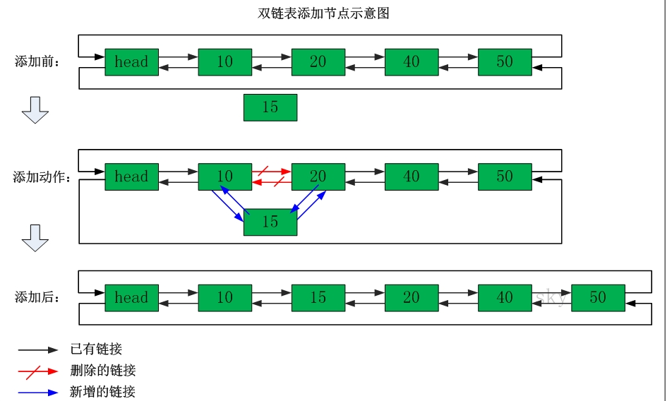

### Redis详解

#### 回顾：

#### 今天任务

```
1、Redis介绍
2、Redis安装
3、Redis客户端
4、Redis数据类型
5、Redis持久化
6、Redis主从复制
7、Redis集群
8、Redis集群的连接
9、Redis集群的jedis连接
```

#### 教学目标

```
1、深入理解Redis的应用场景及概念
2、熟练掌握Redis的数据类型
3、熟练掌握Redis持久化
4、熟悉Redis集群搭建
5、熟练掌握Redis集群的Jedis连接
```

#### 第一节：Redis介绍

##### 3.29.1  什么是NoSql

​	为了解决高并发、高可扩展、高可用、大数据存储问题而产生的数据库解决方案，就是NoSql数据库。					NoSQL，泛指非关系型的数据库，NoSQL即Not-Only SQL，它可以作为关系型数据库的良好补充。但是它不能替代关系型数据库，而且它是存储在内存中，所以它的访问速度很快。

##### 3.29.2 Nosql的数据库分类

- **键值(Key-Value)存储数据库**


相关产品： Tokyo Cabinet/Tyrant、**Redis**、Voldemort、Berkeley DB

典型应用：内容缓存，主要用于处理大量数据的高访问负载。

数据模型：一系列键值对

优势：快速查询

劣势：存储的数据缺少结构化

- **列存储数据库**


相关产品：Cassandra, **HBase**, Riak

典型应用：分布式的文件系统

数据模型：以列簇式存储，将同一列数据存在文件系统中

优势：查找速度快，可扩展性强，更容易进行分布式扩展

劣势：功能相对局限

- **文档型数据库**


相关产品：CouchDB、MongoDB

典型应用：Web应用（与Key-Value类似，Value是结构化的）

数据模型：一系列键值对

优势：数据结构要求不严格

劣势：查询性能不高，而且缺乏统一的查询语法

- **图形(Graph)数据库**


相关数据库：Neo4J、InfoGrid、Infinite Graph

典型应用：社交网络

数据模型：图结构

优势：利用图结构相关算法。

劣势：需要对整个图做计算才能得出结果，不容易做分布式的集群方案。

##### 3.29.3 Redis介绍

Redis是用C语言开发的一个开源的高性能键值对（key-value）数据库。它通过提供多种键值数据类型来适应不同场景下的存储需求，目前为止Redis支持的键值数据类型如下：

- **字符串类型**

- **散列类型**

- **列表类型**

- **集合类型**（有序集合类型）


##### 3.29.4 Redis发展简史

​	2008年，意大利的一家创业公司Merzia推出了一款基于MySQL的网站实时统计系统LLOOGG，然而没过多久该公司的创始人 Salvatore Sanfilippo便对MySQL的性能感到失望，于是他决定亲自为LLOOGG量身定做一个数据库，并于2009年开发完成，这个数据库就是Redis。不过Salvatore Sanfilippo并不满足只将Redis用于LLOOGG这一款产品，而是希望更多的人使用它，于是在同一年Salvatore Sanfilippo将Redis开源发布，并开始和Redis的另一名主要的代码贡献者Pieter Noordhuis一起继续着Redis的开发，直到今天。

​         SalvatoreSanfilippo自己也没有想到，短短的几年时间，Redis就拥有了庞大的用户群体。Hacker News在2012年发布了一份数据库的使用情况调查，结果显示有近12%的公司在使用Redis。国内如新浪微博、街旁网、知乎网，国外如GitHub、Stack Overflow、Flickr等都是Redis的用户。

​         VMware公司从2010年开始赞助Redis的开发，Salvatore Sanfilippo和Pieter Noordhuis也分别在3月和5月加入VMware，全职开发Redis。

##### 3.29.5 Redis应用场景

- 缓存（数据查询、短连接、新闻内容、商品内容等等）。（**最多使用**）

- 分布式集群架构中的session分离。

- 聊天室的在线好友列表。

- 任务队列。（秒杀、抢购、12306等等）

- 应用排行榜。

- 网站访问统计。

- 数据过期处理（可以精确到毫秒）


##### 3.29.5.1 Redis的特性

- redis数据访问速度快（数据在内存中）

- redis有数据持久化机制（持久化机制有两种：1、定期将内存数据dump到磁盘；2、aof(append only file)持久化机制——用记日志的方式记录每一条数据更新操作，一旦出现灾难事件，可以通过日志重放来恢复整个数据库）

- redis支持集群模式（容量可以线性扩展）

- redis相比其他缓存工具（ehcach/memcached），有一个鲜明的优势：支持丰富的数据结构


#### 第二节 Redis安装（重要）

##### 3.29.6 下载Redis

官网地址：<http://redis.io/>

下载地址：http://download.redis.io/releases/redis-3.0.0.tar.gz

##### 3.29.7 Redis安装环境

Redis安装一般会在Linux系统下进行安装，又因为redis是使用c语言开发，所以需要c语言环境。

- Linux：centOS

- VMware:10

- C语言环境：


##### 3.29.8 Redis安装

第一步：在VMware中安装CentOS系统（Linux）。

第二步：在Linux系统中安装c语言环境

```shell 
 [root@redis01~]# yum install gcc-c++
```

第三步：将redis的源码包上传到Linux系统。


第四步：解压源码包


第五步：进入redis-3.3.3包，然后执行make命令，编译redis的源码

``` shell
[root@redis01 redis-3.0.0]# make
```

第六步：安装

```shell
[root@redis01redis-3.0.0]# make install PREFIX=/usr/local/redis
```

##### 3.29.9 Redis启动

###### 3.29.9.1 前端启动

前端启动，如果客户端关掉或者执行ctrl+c命令。则整个redis服务也停掉。

前端启动，即在客户端中执行以下命令：

```shell
[root@redis01 bin]# ./redis-server
```


关闭：ctrl+c

###### 3.29.9.2 后端启动

第一步：执行cp命令将redis解压缩包中的redis.conf文件拷贝到bin目录下


第二步：修改redis.conf文件：


第三步：启动redis服务


关闭：正常关闭


 非正常关闭


#### 第三节 Redis客户端（重要）

##### 3.29.10 Redis自带的客户端


./redis-cli –h redis数据库的ip  -p  端口号

默认可以执行  ./redis-cli   此时使用默认的ip为129.0.0.1  默认的端口为 6379

##### 3.29.11 Redis桌面管理工具

第一步：安装redis桌面管理工具

第二步：创建连接


界面如下：


Redis默认有16个库，这个数字可以修改。

切换库使用如下命令：


###### 3.29.11.1 访问超时 

打开防火墙

```shell
[root@redis01 ~]# vi /etc/sysconfig/iptables

# Firewall configuration written bysystem-config-firewall

# Manual customization of this file is notrecommended.

*filter

:INPUT ACCEPT [0:0]

:FORWARD ACCEPT [0:0]

:OUTPUT ACCEPT [0:0]

-A INPUT -m state --stateESTABLISHED,RELATED -j ACCEPT

-A INPUT -p icmp -j ACCEPT

-A INPUT -i lo -j ACCEPT

-A INPUT -m state --state NEW -m tcp -p tcp--dport 22 -j ACCEPT

-A INPUT -m state --state NEW -m tcp -p tcp --dport 6379 -jACCEPT

 

-A INPUT -j REJECT --reject-withicmp-host-prohibited

-A FORWARD -j REJECT --reject-with icmp-host-prohibited

COMMIT           

"/etc/sysconfig/iptables" 15L,544C 已写入                                                            
[root@redis01 ~]# service iptables restart

iptables：清除防火墙规则：                                 [确定]

iptables：将链设置为政策 ACCEPT：filter                    [确定]

iptables：正在卸载模块：                                   [确定]

iptables：应用防火墙规则：                                 [确定]

[root@redis01 ~]#

```

##### 3.29.12 Java客户端

##### 3.29.13 Jedis介绍

​	Redis不仅是使用命令来操作，现在基本上主流的语言都有客户端支持，比如java、C、C#、C++、php、Node.js、Go等。

​         在官方网站里列一些Java的客户端，有Jedis、Redisson、Jredis、JDBC-Redis、等其中官方推荐使用Jedis和Redisson。 在企业中用的最多的就是Jedis，下面我们就重点学习下Jedis。 

Jedis同样也是托管在github上，地址：https://github.com/xetorthio/jedis

##### 3.29.14 环境准备及工程搭建

Jedis依赖：


##### 3.29.15 单机连接Redis


##### 3.29.16 连接池连接Redis


#### 第四节   Redis数据类型（重要）

##### 3.29.17 Redis数据类型

String类型

Hash类型

List类型

Set类型

SortedSet类型

##### 3.29.18 String类型

```shell
Set
129.0.0.1:6379> set str1 angelababy
OK

Get
129.0.0.1:6379> get str1
" angelababy"

Del
129.0.0.1:6379> del str1
(integer) 1

自增
必须value为数字类型
129.0.0.1:6379> set s1 1
OK
129.0.0.1:6379> incr s1
(integer) 2
129.0.0.1:6379> incr s1
(integer) 3
129.0.0.1:6379> incr s1
(integer) 4
129.0.0.1:6379> incr s1
(integer) 5

自减
129.0.0.1:6379> decr s1
(integer) 4
129.0.0.1:6379> decr s1
(integer) 3
129.0.0.1:6379> decr s1
(integer) 2
129.0.0.1:6379> decr s1

自增自减指定数值
129.0.0.1:6379> incrby s1 3
(integer) 4
129.0.0.1:6379> decrby s1 3
(integer) 1

设置或者获取多个key/value
129.0.0.1:6379> mset s1 v1 s2 v2 
OK
129.0.0.1:6379> mget s1 s2
1) "v1"
2) "v2"
```

##### 3.29.19 Hash类型

###### 3.29.19.1 使用String的问题

​	假设有User对象以JSON序列化的形式存储到Redis中，User对象有id，username、password、age、name等属性，存储的过程如下：

保存、更新：

User对象 à json(string)à redis 

如果在业务上只是更新age属性，其他的属性并不做更新我应该怎么做呢？如果仍然采用上边的方法在传输、处理时会造成资源浪费，下边讲的hash可以很好的解决这个问题。

###### 3.29.19.2 Redis Hash介绍

​	hash叫散列类型，它提供了字段和字段值的映射。字段值只能是字符串类型，不支持散列类型、集合类型等其它类型。如下：


###### 3.29.19.2 命令

- hset

  在redis中，命令是不区分大小写，但是key区分大小写

  ```shell
  129.0.0.1:6379> hset m1 k1 v1
  (integer) 1
  129.0.0.1:6379> HSET m1 k1 v1
  (integer) 0
  ```

- hget

  ```shell
  129.0.0.1:6379> hget m1 k1
  "v1"
  129.0.0.1:6379> hget m1 
  (error) ERR wrong number of arguments for 'hget' command
  129.0.0.1:6379>
  ```

- hdel

  ```shell
  129.0.0.1:6379> hdel m1
  (error) ERR wrong number of arguments for 'hdel' command
  129.0.0.1:6379> hdel m1 k1
  (integer) 1
  ```

- 批量操作

  ```shell
  129.0.0.1:6379> hmset m1 k1 v1 k2 v2
  OK
  129.0.0.1:6379> hmget m1 k1 k2
  1) "v1"
  2) "v2"
  129.0.0.1:6379> hmget m1 k1 k2 k3
  1) "v1"
  2) "v2"
  3) (nil)
  ```

- 增加数值

  ```shell
  129.0.0.1:6379> hincrby key field num
  (error) ERR wrong number of arguments for 'hincrby' command
  129.0.0.1:6379> hincrby m2 k1 2
  (integer) 3
  ```

###### 3.29.19.3 其他命令（自学）

- 判断字段是否存在

  *HEXISTS key field*

  ```shell
  129.0.0.1:6379> hexists user age		查看user中是否有age字段
  (integer) 1
  129.0.0.1:6379> hexists user name	查看user中是否有name字段
  (integer) 0
  ```

  *HSETNX key field value*

  当**字段**不存在时赋值，类似HSET，区别在于如果字段已经存在，该命令不执行任何操作。

  ```shell
  129.0.0.1:6379> hsetnx user age 30	如果user中没有age字段则设置age值为30，否则不做任何操作
  (integer) 0
  ```

- 只获取字段名或字段值

  *HKEYS key*

  *HVALS key*

  ```shell
  129.0.0.1:6379> hmset user age 20 name lisi 
  OK
  129.0.0.1:6379> hkeys user
  1) "age"
  2) "name"
  129.0.0.1:6379> hvals user
  1) "20"
  2) "lisi"
  ```

- 获取字段数量

  *HLEN key*

  ```shell
  129.0.0.1:6379> hlen user
  (integer) 2
  ```

  ###### 3.29.19.4 应用

  商品id、商品名称、商品描述、商品库存、商品好评

  定义商品信息的key：

  商品1001的信息在 redis中的key为：items:1001

  存储商品信息

  ```shell
  192.168.101.3:7003> HMSET items:1001 id 3 name apple price 999.9
  OK
  ```

  获取商品信息

  ```shell
  192.168.101.3:7003> HGET items:1001 id
  "3"
  192.168.101.3:7003> HGETALL items:1001
  1) "id"
  2) "3"
  3) "name"
  4) "apple"
  5) "price"
  6) "999.9"
  ```

##### 3.29.20 List类型

List是有序可重复的集合

###### 3.29.20.1 ArrayList与LinkedList的区别

​	ArrayList使用数组方式存储数据，所以根据索引查询数据速度快，而新增或者删除元素时需要设计到位移操作，所以比较慢。

​         LinkedList使用双向链接方式存储数据，每个元素都记录前后元素的指针，所以插入、删除数据时只是更改前后元素的指针指向即可，速度非常快，然后通过下标查询元素时需要从头开始索引，所以比较慢，但是如果查询前几个元素或后几个元素速度比较快。




总结

arrayList在进行增删改时很麻烦

linkedList则无该问题，redis的list类型存储时采用linkedlist

redis存储list类型可以实现队列和堆栈，队列是先进先出，而堆栈是先进后出。

###### 3.29.20.2 命令

- 从左边存值（堆栈）

  ```shell
  129.0.0.1:6379> lpush list1 1 2 3 4 5 6
  (integer) 6
  ```

- 从右边存值（队列）

  ```shell
  129.0.0.1:6379> rpush list1 a b c d
  (integer) 10
  ```

- 查看List值

  ```shell
  129.0.0.1:6379> lrange list1 0 3
  1) "6"
  2) "5"
  3) "4"
  4) "3"
  ```

  如果查看全部，使用以下命令：

  ```shell
  129.0.0.1:6379> lrange list1 0 -1
   1) "6"
   2) "5"
   3) "4"
   4) "3"
   5) "2"
   6) "1"
   7) "a"
   8) "b"
   9) "c"
  10) "d"
  ```

- 从两端弹出值

  ```shell
  129.0.0.1:6379> lpush list1 1 2 3 4 5 6
  (integer) 6
  129.0.0.1:6379> lrange list1 0 -1
  1) "6"
  2) "5"
  3) "4"
  4) "3"
  5) "2"
  6) "1"
  129.0.0.1:6379> lpop list1 
  "6"
  129.0.0.1:6379> lrange list1 0 -1
  1) "5"
  2) "4"
  3) "3"
  4) "2"
  5) "1"
  129.0.0.1:6379> rpop list1
  "1"
  129.0.0.1:6379> lrange list1 0 -1
  1) "5"
  2) "4"
  3) "3"
  4) "2"
  ```

- 获取列表的长度

  ```shell
  129.0.0.1:6379> llen list1
  (integer) 4
  ```

###### 3.29.20.3 其他命令（自学）

- 删除列表中指定的值

  *LREM key count value*

  LREM命令会删除列表中前count个值为value的元素，返回实际删除的元素个数。根据count值的不同，该命令的执行方式会有所不同：

  当count>0时， LREM会从列表左边开始删除。 

  当count<0时， LREM会从列表后边开始删除。 

  当count=0时，LREM删除所有值为value的元素。

- 获得/设置指定索引的元素值

  LINDEX key index

  LSET key index value

  ```shell
  129.0.0.1:6379> lindex l:list 2
  "1"
  129.0.0.1:6379> lset l:list 2 2
  OK
  129.0.0.1:6379> lrange l:list 0 -1
  1) "6"
  2) "5"
  3) "2"
  4) "2"
  ```

- 只保留列表指定片段，指定范围和LRANGE一致

  *LTRIM key start stop*

  ```shell
  129.0.0.1:6379> lrange l:list 0 -1
  1) "6"
  2) "5"
  3) "0"
  4) "2"
  129.0.0.1:6379> ltrim l:list 0 2
  OK
  129.0.0.1:6379> lrange l:list 0 -1
  1) "6"
  2) "5"
  3) "0"
  ```

- 向列表中插入元素

  *LINSERT key BEFORE|AFTER pivot value*

  该命令首先会在列表中从左到右查找值为pivot的元素，然后根据第二个参数是BEFORE还是AFTER来决定将value插入到该元素的前面还是后面。

  ```shell
  129.0.0.1:6379> lrange list 0 -1
  1) "3"
  2) "2"
  3) "1"
  129.0.0.1:6379> linsert list after 3 4
  (integer) 4
  129.0.0.1:6379> lrange list 0 -1
  1) "3"
  2) "4"
  3) "2"
  4) "1"
  ```

- 将元素从一个列表转移到另一个列表中

  *RPOPLPUSH source destination*

  ```shell
  129.0.0.1:6379> rpoplpush list newlist 
  "1"
  129.0.0.1:6379> lrange newlist 0 -1
  1) "1"
  129.0.0.1:6379> lrange list 0 -1
  1) "3"
  2) "4"
  3) "2"
  ```

##### 3.29.21 Set类型

Set类型的数据是有序且不可重复。

###### 3.29.21.1 命令

- 添加元素

  ```shell 
  129.0.0.1:6379> sadd set1 1 2 3 3 4 5 5
  (integer) 5
  ```

- 删除元素

  ```shell
  129.0.0.1:6379> sadd set1 1 2 3 3 4 5 5
  (integer) 5
  129.0.0.1:6379> srem set1 3
  (integer) 1
  129.0.0.1:6379> smembers set1
  1) "1"
  2) "2"
  3) "4"
  4) "5"
  ```

- 查看元素

  ```shell
  129.0.0.1:6379> smembers set1
  1) "1"
  2) "2"
  3) "4"
  4) "5"
  ```

- 判断元素是否存在

  ```shell
  129.0.0.1:6379> sismember set1 6
  (integer) 0
  ```

###### 3.29.21.2 运算命令

- 差集运算

  ```shell
  129.0.0.1:6379> sadd set3 2 3 4
  (integer) 3
  129.0.0.1:6379> sadd set4 1 2 3
  (integer) 3
  129.0.0.1:6379> sdiff set4 set3
  1) "1"
  129.0.0.1:6379> sdiff set3 set4
  1) "4"
  ```

- 交集运算

  ```shell
  129.0.0.1:6379> sinter set3 set4
  1) "2"
  2) "3"
  ```

- 并集运算

  ```shell
  129.0.0.1:6379> sunion set3 set4
  1) "1"
  2) "2"
  3) "3"
  4) "4"
  ```

###### 3.29.21.3 其他命令（自学）

- 获得集合中元素的个数

  *SCARD key*

  ```shell
  129.0.0.1:6379> smembers setA 
  1) "1"
  2) "2"
  3) "3"
  129.0.0.1:6379> scard setA 
  (integer) 3
  ```

- 从集合中弹出一个元素

  *SPOP key*

  ```shell
  129.0.0.1:6379> spop setA 
  "1“
  ```

  注意：由于集合是无序的，所有SPOP命令会从集合中随机选择一个元素弹出

##### 3.29.22 SortedSet类型zset

Zset在设置时，会给设置一个分数，通过分数，可以进行排序。

###### 3.29.22.1 命令

- 添加元素

  ```shell
  129.0.0.1:6379> zadd zset1 1 haha 2 hehe 0 heihei
  (integer) 3
  ```

- 删除元素

  ```shell
  129.0.0.1:6379> zrem zset1 haha
  (integer) 1
  ```

- 获得排名在某个范围的元素列表

  ```shell
  129.0.0.1:6379> zrange zset1 0 3
  1) "heihei"
  2) "hehe"
  129.0.0.1:6379> zrevrange zset1 0 3
  1) "hehe"
  2) "heihei"
  129.0.0.1:6379> zrevrange zset1 0 3 withscores
  1) "hehe"
  2) "2"
  3) "heihei"
  4) "0"
  ```

###### 3.29.22.2 其他命令（自学）

- 获得指定分数范围的元素

  `ZRANGEBYSCORE key min max [WITHSCORES]`
  `[LIMIT offset count]`

  ```shell
  129.0.0.1:6379> ZRANGEBYSCORE scoreboard 90 97 WITHSCORES
  1) "wangwu"
  2) "94"
  3) "lisi"
  4) "97"
  129.0.0.1:6379> ZRANGEBYSCORE scoreboard 70 100 limit 1 2
  1) "wangwu"
  2) "lisi"
  ```

- 增加某个元素的分数，返回值是更改后的分数。

  `ZINCRBY key increment member`

  ```shell
  129.0.0.1:6379> ZINCRBY scoreboard  4 lisi 
  "101“
  ```

- 获得集合中元素的数量

  *ZCARD key*

  ```shell
  129.0.0.1:6379> ZCARD scoreboard
  (integer) 3
  ```

- 获得指定分数范围内的元素个数

  *ZCOUNT key min max*

  ```shell
  129.0.0.1:6379> ZCOUNT scoreboard 80 90
  (integer) 1
  ```

- 按照排名范围删除元素

  *ZREMRANGEBYRANK key start stop*

  ```shell
  129.0.0.1:6379> ZREMRANGEBYRANK scoreboard 0 1
  (integer) 2 
  129.0.0.1:6379> ZRANGE scoreboard 0 -1
  1) "lisi"
  ```

- 按照分数范围删除元素

  *ZREMRANGEBYSCORE key min max*

  ```shell
  129.0.0.1:6379> zadd scoreboard 84 zhangsan	
  (integer) 1
  129.0.0.1:6379> ZREMRANGEBYSCORE scoreboard 80 100
  (integer) 1
  ```

- 获取元素的排名

  从小到大

  *ZRANK key member*

  ```shell
  129.0.0.1:6379> ZRANK scoreboard lisi 
  (integer) 0
  ```

  从大到小

  *ZREVRANK key member*

  ```shell
  129.0.0.1:6379> ZREVRANK scoreboard zhangsan 
  (integer) 1
  ```

###### 3.29.22.3 应用：商品销售排行榜

根据商品销售量对商品进行排行显示，定义sorted set集合，商品销售量为元素的分数。

定义商品销售排行榜key：items:sellsort

写入商品销售量：

商品编号1001的销量是9，商品编号1002的销量是10

``` shell
192.168.101.3:7007> ZADD items:sellsort9 1001 10 1002
```

商品编号1001的销量加1

```shell
192.168.101.3:7001> ZINCRBYitems:sellsort 1 1001
```

商品销量前10名：

```shell
192.168.101.3:7001> ZRANGEitems:sellsort 0 9 withscores
```

#### 第五节   Keys 命令

##### 3.29.23  Keys 命令

- Keys * 查看所有的key

##### 3.29.24 设置Key的生存时间

Redis在实际使用过程中更多的用作缓存，然而缓存的数据一般都是需要设置生存时间的，即：到期后数据销毁。

*EXPIRE key seconds*                     *设置key**的生存时间（单位：秒）key**在多少秒后会自动删除*

*TTL key*                                         *查看key**剩余的生存时间*

*PERSIST key*                                  *清除生存时间* 

*PEXPIRE key milliseconds*          *生存时间设置单位为：毫秒* 

*例子：*

```shell
设置test的值为1
192.168.101.3:7002> set test 1                
OK

获取test的值
192.168.101.3:7002> get test                   
"1"

设置test的生存时间为5秒
192.168.101.3:7002> EXPIRE test 5         
(integer) 1

查看test的生成时间,还有1秒删除
192.168.101.3:7002> TTL test                   
(integer) 1

192.168.101.3:7002> TTL test
(integer) -2

获取test的值，已经删除
192.168.101.3:7002> get test                   
(nil)
```

##### 3.29.24.1 其他命令（自学）

- keys

  返回满足给定pattern 的所有key

  ```shell
  redis 129.0.0.1:6379> keys mylist*
  1) "mylist"
  2) "mylist5"
  3) "mylist6"
  4) "mylist7"
  5) "mylist8"
  ```

- exists

  确认一个key 是否存在

  ```shell
  redis 129.0.0.1:6379> exists HongWan
  (integer) 0
  redis 129.0.0.1:6379> exists age
  (integer) 1
  ```

  从结果来看数据库中不存在HongWan 这个key，但是age 这个key 是存在的

- del

  删除一个key

  ```shell
  redis 129.0.0.1:6379> del age
  (integer) 1
  redis 129.0.0.1:6379> exists age
  (integer) 0
  ```

- rename

  重命名key

  ```shell
  redis 129.0.0.1:6379[1]> keys *
  1) "age"
  redis 129.0.0.1:6379[1]> rename age age_new
  OK
  redis 129.0.0.1:6379[1]> keys *
  1) "age_new"
  ```

  age 成功的被我们改名为age_new 了

- type

  返回值的类型

  ```shell
  redis 129.0.0.1:6379> type addr
  string
  redis 129.0.0.1:6379> type myzset2
  zset
  redis 129.0.0.1:6379> type mylist
  list
  ```

  这个方法可以非常简单的判断出值的类型

#### 第六节 3.29.25  Redis持久化

##### 3.29.26 rdb方式

​	RDB方式的持久化是通过快照（snapshotting）完成的，当符合一定条件时Redis会自动将内存中的数据进行快照并持久化到硬盘。

​         RDB是Redis默认采用的持久化方式，在redis.conf配置文件中默认有此下配置：

**save 900 1**

**save 300 10**

**save 60 10000**

​	save开头的一行就是持久化配置，可以配置多个条件（每行配置一个条件），每个条件之间是“或”的关系，“save 900 1”表示15分钟（900秒钟）内[至少](image/)1个键被更改则进行快照，“save 300 10”表示5分钟（300秒）内至少10个键被更改则进行快照。


​	Redis启动后会读取RDB快照文件，将数据从硬盘载入到内存。根据数据量大小与结构和服务器性能不同，这个时间也不同。通常将记录一千万个字符串类型键、大小为1GB的快照文件载入到内存中需要花费20～30秒钟。

​	问题总结：

​	通过RDB方式实现持久化，一旦Redis异常退出，就会丢失最后一次快照以后更改的所有数据。这就需要开发者根据具体的应用场合，通过组合设置自动快照条件的方式来将可能发生的数据损失控制在能够接受的范围。如果数据很重要以至于无法承受任何损失，则可以考虑使用AOF方式进行持久化。

##### 3.29.29 AOF方式

aof是默认不开启的，需要手动设置。


如果rdb方式和aof方式同时使用的话，那么默认从aof文件中加载数据。


#### 第七节 3.29.28 Redis主从复制（重要）

为了高可用，引入Redis的主从复制的概念。

##### 3.29.29 准备工作

完成主从复制，最少需要两台服务器，讲学方便，在一台服务器中演示即可。

但是一台服务器中需要启动两个Redis

第一步：复制一个Redis 

```shell
[root@redis01 redis0707]# cp bin/ bin2 –r
```

第二步：修改端口

将bin2目录下的redis.conf文件中的端口修改为6380


##### 3.29.30 主机配置

无需配置

##### 3.29.30.1 从机配置

##### 3.29.31 主从启动及操作


从机是只读的。

##### 3.29.32 Redis的事务功能

了解（自学）

#### 第八节  Redis集群

##### 3.29.33  Redis集群

##### 3.29.34 Redis-Cluster架构图


1、  集群通信是通过“ping-pong”机制进行通信；

2、  客户端不需要将所有的节点都连接上，只需要连接其中一个节点即可。

3、  集群中存储数据是存储到一个个的槽中，集群中槽的个数是固定的：16384，槽的编号是【0-16383】。在集群中存储数据时，会根据key进行计算，计算出一个结果，然后将这个结果和16384取余，余数就是这个key将要存储的槽的编号。

注意：槽的编号之间不能断开。

槽的计算会将数据保存的很平均，不会产生一个槽满一个槽空的情况。

##### 3.29.35  Redis-Cluster投票：容错


什么时候整个集群不可用(cluster_state:fail)? 

​    a:如果集群任意master挂掉,且当前master没有slave.集群进入fail状态,也可以理解成集群的slot映射[0-16383]不完整时进入fail状态..

b:如果集群超过半数以上master挂掉，无论是否有slave集群进入fail状态.

##### 3.29.36  集群搭建

由于集群的脚本是用ruby语言编写的，所以需要准备ruby的环境

###### 3.29.36.1 Ruby环境准备

需要ruby环境。搭建集群的脚本是ruby实现的。

redis集群管理工具redis-trib.rb依赖ruby环境，首先需要安装ruby环境：

安装ruby

```shell
yum install -y ruby
yum install -y rubygems
```

安装ruby和redis的接口程序

拷贝redis-3.0.0.gem至/u!查看源码文件](image/F:\文档\Redis详解\查看源码文件.png)sr/local下

执行：

```shell
gem install /usr/local/redis-3.0.0.gem
```


###### 3.29.36.2 机器准备

集群环境最少要三台机器（master），每个主机都需要配置一个从机。即总共需要6台机器。

6台机器的端口号如下：

7001

7002

7003

7004

7005

7006

第一步：拷贝出6个目录

```shell
[root@redis01 redis-cluster]# cp redis01/redis02 -r

[root@redis01 redis-cluster]# cp redis01/redis03 -r

[root@redis01 redis-cluster]# cp redis01/redis04 -r

[root@redis01 redis-cluster]# cp redis01/redis05 -r

[root@redis01 redis-cluster]# cp redis01/redis06 -r

[root@redis01 redis-cluster]# ll

drwxr-xr-x. 2 root root 4096 10月 25 00:28redis01

drwxr-xr-x. 2 root root 4096 10月 25 00:29redis02

drwxr-xr-x. 2 root root 4096 10月 25 00:29redis03

drwxr-xr-x. 2 root root 4096 10月 25 00:29redis04

drwxr-xr-x. 2 root root 4096 10月 25 00:29redis05

drwxr-xr-x. 2 root root 4096 10月 25 00:29redis06
```

第二步：修改端口


第三步：修改配置，配置允许集群的配置

将cluster-enable 的值改为yes


第四步：启动6台redis

```shell
[root@redis01 redis-cluster]# vi start-all.sh
  1 cd redis01
  2 ./redis-server redis.conf
  3 cd ..
  4 cd redis02
  5 ./redis-server redis.conf
  6 cd ..
  7 cd redis03
  8 ./redis-server redis.conf
  9 cd ..
 10 cd redis04
 11 ./redis-server redis.conf
 12 cd ..
 13 cd redis05
 14 ./redis-server redis.conf
 15 cd ..
 16 cd redis06
 17 ./redis-server redis.conf
"start-all.sh" [新] 35L, 290C 已写入                                                                   
[root@redis01 redis-cluster]# ll
drwxr-xr-x. 2 root root 4096 10月 25 00:33 redis01
drwxr-xr-x. 2 root root 4096 10月 25 00:35 redis02
drwxr-xr-x. 2 root root 4096 10月 25 00:34 redis03
drwxr-xr-x. 2 root root 4096 10月 25 00:34 redis04
drwxr-xr-x. 2 root root 4096 10月 25 00:34 redis05
drwxr-xr-x. 2 root root 4096 10月 25 00:34 redis06
-rw-r--r--. 1 root root  290 10月 25 00:37 start-all.sh
[root@redis01 redis-cluster]# ./start-all.sh
-bash: ./start-all.sh: 权限不够
[root@redis01 redis-cluster]# chmod 777 start-all.sh 
[root@redis01 redis-cluster]# ll
drwxr-xr-x. 2 root root 4096 10月 25 00:33 redis01
drwxr-xr-x. 2 root root 4096 10月 25 00:35 redis02
drwxr-xr-x. 2 root root 4096 10月 25 00:34 redis03
drwxr-xr-x. 2 root root 4096 10月 25 00:34 redis04
drwxr-xr-x. 2 root root 4096 10月 25 00:34 redis05
drwxr-xr-x. 2 root root 4096 10月 25 00:34 redis06
-rwxrwxrwx. 1 root root  290 10月 25 00:37 start-all.sh
[root@redis01 redis-cluster]# ./start-all.sh
```

看到以下信息，则说明启动成功


第五步：集群

将redis-trib.rb文件复制到redis0707目录下


执行命令

```shell
[root@redis01 redis0707]# ./redis-trib.rb create --replicas 1 129.0.0.1:7001 129.0.0.1:7002 129.0.0.1:7003 129.0.0.1:7004 129.0.0.1:7005  129.0.0.1:7006
>>> Creating cluster
Connecting to node 129.0.0.1:7001: OK
Connecting to node 129.0.0.1:7002: OK
Connecting to node 129.0.0.1:7003: OK
Connecting to node 129.0.0.1:7004: OK
Connecting to node 129.0.0.1:7005: OK
Connecting to node 129.0.0.1:7006: OK
>>> Performing hash slots allocation on 6 nodes...
Using 3 masters:
129.0.0.1:7001
129.0.0.1:7002
129.0.0.1:7003
Adding replica 129.0.0.1:7004 to 129.0.0.1:7001
Adding replica 129.0.0.1:7005 to 129.0.0.1:7002
Adding replica 129.0.0.1:7006 to 129.0.0.1:7003
M: e2669f9cef230acfe90f01e207a0d410a6dbb489 129.0.0.1:7001
   slots:0-5460 (5461 slots) master
M: f8cf8ced81e5a111181d13ee8206dd39b3f46db4 129.0.0.1:7002
   slots:5461-10922 (5462 slots) master
M: c4e8a6615f4e8b2ba408207ac9a16de9af848420 129.0.0.1:7003
   slots:10923-16383 (5461 slots) master
S: 95a979b999f9cb7071763370f0c2a295abeabca9 129.0.0.1:7004
   replicates e2669f9cef230acfe90f01e207a0d410a6dbb489
S: 2e40daf6cc502ca175115f92393ebc258818efe8 129.0.0.1:7005
   replicates f8cf8ced81e5a111181d13ee8206dd39b3f46db4
S: d92e6a23ffadc2aa0f8d8b34ddc61f4c0ae29412 129.0.0.1:7006
   replicates c4e8a6615f4e8b2ba408207ac9a16de9af848420
Can I set the above configuration? (type 'yes' to accept): yes
>>> Nodes configuration updated
>>> Assign a different config epoch to each node
>>> Sending CLUSTER MEET messages to join the cluster
Waiting for the cluster to join......
>>> Performing Cluster Check (using node 129.0.0.1:7001)
M: e2669f9cef230acfe90f01e207a0d410a6dbb489 129.0.0.1:7001
   slots:0-5460 (5461 slots) master
M: f8cf8ced81e5a111181d13ee8206dd39b3f46db4 129.0.0.1:7002
   slots:5461-10922 (5462 slots) master
M: c4e8a6615f4e8b2ba408207ac9a16de9af848420 129.0.0.1:7003
   slots:10923-16383 (5461 slots) master
M: 95a979b999f9cb7071763370f0c2a295abeabca9 129.0.0.1:7004
   slots: (0 slots) master
   replicates e2669f9cef230acfe90f01e207a0d410a6dbb489
M: 2e40daf6cc502ca175115f92393ebc258818efe8 129.0.0.1:7005
   slots: (0 slots) master
   replicates f8cf8ced81e5a111181d13ee8206dd39b3f46db4
M: d92e6a23ffadc2aa0f8d8b34ddc61f4c0ae29412 129.0.0.1:7006
   slots: (0 slots) master
   replicates c4e8a6615f4e8b2ba408207ac9a16de9af848420
[OK] All nodes agree about slots configuration.
>>> Check for open slots...
>>> Check slots coverage...
[OK] All 16384 slots covered.
```

##### 3.29.37 连接集群

```shell
[root@redis01 bin]# ./redis-cli -p 7001 -c
129.0.0.1:7001> set s1 111
-> Redirected to slot [15224] located at 129.0.0.1:7003
OK
129.0.0.1:7003> get s1
"111"
129.0.0.1:7003> set s2 222
-> Redirected to slot [2843] located at 129.0.0.1:7001
OK
```

查看集群信息


##### 3.29.38 节点扩展

##### 3.29.38 添加主节点

集群创建成功后可以向集群中添加节点，下面是添加一个master主节点

**添加7007结点，参考集群结点规划章节添加一个7007目录作为新节点。**

执行下边命令：

```shell
./redis-trib.rb add-node  192.168.101.3:7007 192.168.101.3:7001
```


查看集群结点发现7007已添加到集群中：


###### 3.29.38.1 hash槽重新分配

添加完主节点需要对主节点进行hash槽分配这样该主节才可以存储数据。

redis集群有16384个槽，集群中的每个结点分配自已槽，通过查看集群结点可以看到槽占用情况。


给刚添加的7007结点分配槽：

第一步：连接上集群

```shell
./redis-trib.rb reshard 192.168.101.3:7001
```

第二步：输入要分配的槽数量


输入 500表示要分配500个槽

第三步：输入接收槽的结点id


这里准备给7007分配槽，通过cluster nodes查看7007结点id为15b809eadae88955e36bcdbb8144f61bbbaf38fb

输入：

15b809eadae88955e36bcdbb8144f61bbbaf38fb

第四步：输入源结点id

这里输入all

第五步：输入yes开始移动槽到目标节点id


##### 3.29.39添加从节点

集群创建成功后可以向集群中添加节点，下面是添加一个slave从节点。

**添加7008从结点，将7008作为7007的从结点。**

```shell
./redis-trib.rb add-node --slave --master-id 主节点id 添加节点的ip和端口 集群中已存在节点ip和端口
```

执行如下命令：

```shell
./redis-trib.rb add-node --slave --master-id cad9f7413ec6842c971dbcc2c48b4ca959eb5db4  192.168.101.3:7008 192.168.101.3:7001
```

cad9f7413ec6842c971dbcc2c48b4ca959eb5db4  是7007结点的id，可通过cluster nodes查看。


注意：如果原来该结点在集群中的配置信息已经生成cluster-config-file指定的配置文件中（如果cluster-config-file没有指定则默认为nodes.conf），这时可能会报错：

[ERR]Node XXXXXX is not empty. Either the node already knows other nodes (check withCLUSTER NODES) or contains some key in database 0

解决方法是删除生成的配置文件nodes.conf，删除后再执行**./redis-trib.rb add-node**指令

查看集群中的结点，刚添加的7008为7007的从节点：


##### 3.29.40 删除节点

```shell
./redis-trib.rb del-node 129.0.0.1:70054b45eb75c8b428fbd77ab979b85080146a9bc017
```

删除已经占有hash槽的结点会失败，报错如下：

[ERR] Node 129.0.0.1:7005 is not empty!Reshard data away and try again.

需要将该结点占用的hash槽分配出去（参考hash槽重新分配章节）。

#### 第九节 Jedis连接集群

##### 3.29.41  Jedis连接集群

```java
public static void main(String[] args) {
    //节点设置
    HashSet<HostAndPort> nodes = new HashSet<>();
    nodes.add(new HostAndPort("node01", 7001));
    nodes.add(new HostAndPort("node02", 7002));
    nodes.add(new HostAndPort("node03", 7003));
    nodes.add(new HostAndPort("node04", 7004));
    nodes.add(new HostAndPort("node05", 7005));
    nodes.add(new HostAndPort("node06", 7006));
    //创建JedisCluster实例
    JedisCluster cluster = new JedisCluster(nodes);
    cluster.set("ruhua", "rightgirl");
    String s = cluster.get("ruhua");
    System.out.println(s);

    cluster.close();
}
```

